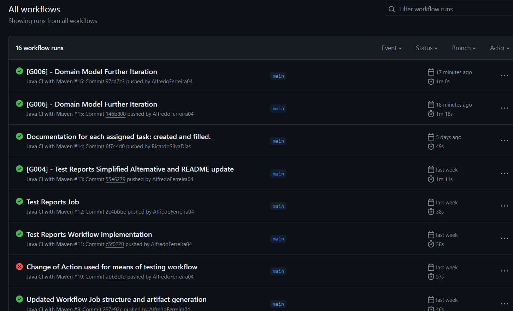

# US_G004 Read Me

 This document serves to highlight the design decisions taken by the group when assembling the workflows used for continuous integration in the project

# Context

 "G004 - As Project Manager, I want the team to setup a continuous integration server"
 "GitHub Actions/Workflows should be used"

## System Requirements

 The workflow must build the project with maven.
 
The workflow must run the JUnit and maven tests of the project.
 
The workflow must export an artifact of the project's content.

## Analysis - Goals of the Workflow
 The goal of the workflow developed is to set up a continuous integration enviroment for this semestre's project in which code quality and project requirements are kept up to standarts at all times. <br />
The Worklow will perform 3 main jobs, which include the building, archiving and testing of the project these jobs will ensure that an artifact of the project that abides by all rules set by  the team in testing and design procedures.

# Workflow Jobs

## Build
 This Job is composed of 4 steps.
 - Checkout code: This step fetches the project code from the repository.<br />
 - Set up JDK 17: Configures the Java Development Kit (JDK) version 17 for the environment.<br />
 - Build with Maven: Executes the Maven command to clean the project and package it into an artifact.<br />
 - Check Dependencies: Runs a Maven command to analyze project dependencies.


## Test
 This Job is composed of 3 steps.

   - Checkout Code: Similar to the "Build" job, this step fetches the project code.
   - Run Tests: Executes Maven to run unit tests on the project.
   - JUnit Test Reports Simplified: Generates simplified JUnit test reports using Maven.


## Archive
 This Job is composed of 4 steps
 - Checkout code: Fetches the project code.
 - Set up JDK 17: Similar to the "Build" and "Test" jobs, configures JDK 17.
 - Build with Maven: Builds the project again to ensure consistency.
 - Upload Artifact: Uses the GitHub Actions upload-artifact action to package and store the project artifact in a predefined directory.


# Design
```yaml
name: Java CI with Maven

on:
  push:
    branches:
      - main
  # Uncomment the line below to enable manual triggering of the workflow
  # workflow_dispatch:

jobs:
  build:
    runs-on: ubuntu-latest
    steps:
      - name: Checkout code
        uses: actions/checkout@v4.1.1
        with:
          ref: 'main'
          fetch-depth: 0

      - name: Set up JDK 17
        uses: actions/setup-java@v4.2.1
        with:
          java-version: '17'
          distribution: 'temurin'
          cache: maven

      - name: Build with Maven
        run: mvn clean package --batch-mode --update-snapshots package

      - name: Check Dependencies
        run: mvn dependency:analyze


  test:
    runs-on: ubuntu-latest
    steps:
      - name: Checkout Code
        uses: actions/checkout@v4
      - name: Run Tests
        run: mvn --batch-mode --update-snapshots verify
      - name: JUnit Test Reports Simplified
        run: mvn --batch-mode -Dmaven.test.failure.ignore=true test


  archive:
    runs-on: ubuntu-latest
    steps:
      - uses: actions/checkout@v4
      - uses: actions/setup-java@v4
        with:
          java-version: '17'
          distribution: 'temurin'
      - run: mvn --batch-mode --update-snapshots verify
      - uses: actions/upload-artifact@v4
        with:
          name: my-jar-artifact
          path: out/artifacts/sem4pi_23_24_2dg1_jar/sem4pi-23-24-2dg1.jar

```


## Testing


