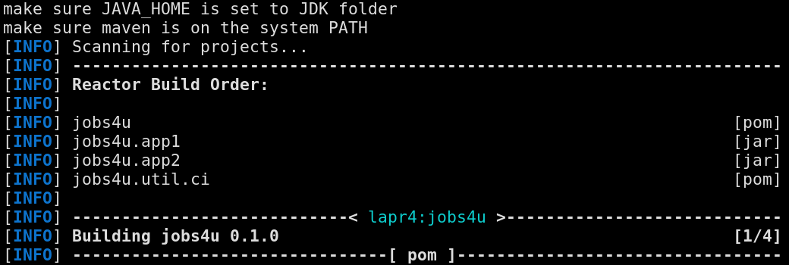
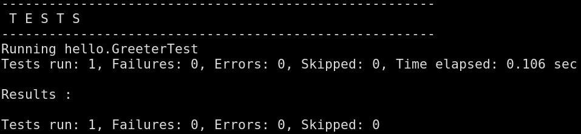
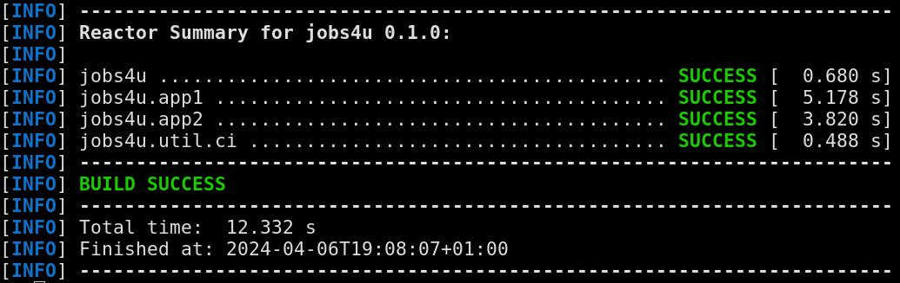
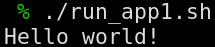

# US G005 - As Project Manager, I want the team to add to the project the necessary scripts, so that build/executions/deployments/... can be executed effortlessly.

## Context

This is the first time the task was assigned, as such it was developed durint this sprint.
The intent of this user story is to help facilitate the building and deployment of the project application.

## Requirements

US G005 - As Project Manager, I want the team to add to the project the necessary scripts, so that build/executions/deployments/... can be executed effortlessly.

**Acceptance Criteria:**

- G005.1. All major tasks and applications mut be represented.
- G005.2. The scripts must work according to the languages and technology used in the project.

**Dependencies/References:**

No dependencies or references stated.

## Analysis

In order to complete this task the team relied on the sample scripts provided in the EAPLI base framework, reworking them to work in the context of this project, alongside study of how to execute and run maven and java through the command line.

## Implementation

*[build-all.sh](../../../build-all.sh)*
> #!/usr/bin/env bash
> echo "make sure JAVA_HOME is set to JDK folder"
> echo "make sure maven is on the system PATH"
> mvn "$@" package dependency:copy-dependencies surefire-report:report -Daggregate=true checkstyle:checkstyle-aggregate 

In this script, maven builds the project, copying its dependencies, generating test reports, and checking the Java code for coding standards.

*[run_app1.sh](../../../run_app1.sh)*
> #!/usr/bin/env bash
> export BASE_CP=jobs4u.app1/target/classes/:jobs4u.app1/target/jobs4u.app1-0.1.0.jar:jobs4u.app1/target/dependency/*;
> java -cp $BASE_CP hello.HelloWorld

In this script the HelloWorld program is run using the command line, specifying its class path, and which class package contains it.

## Demonstration

 

 

 
