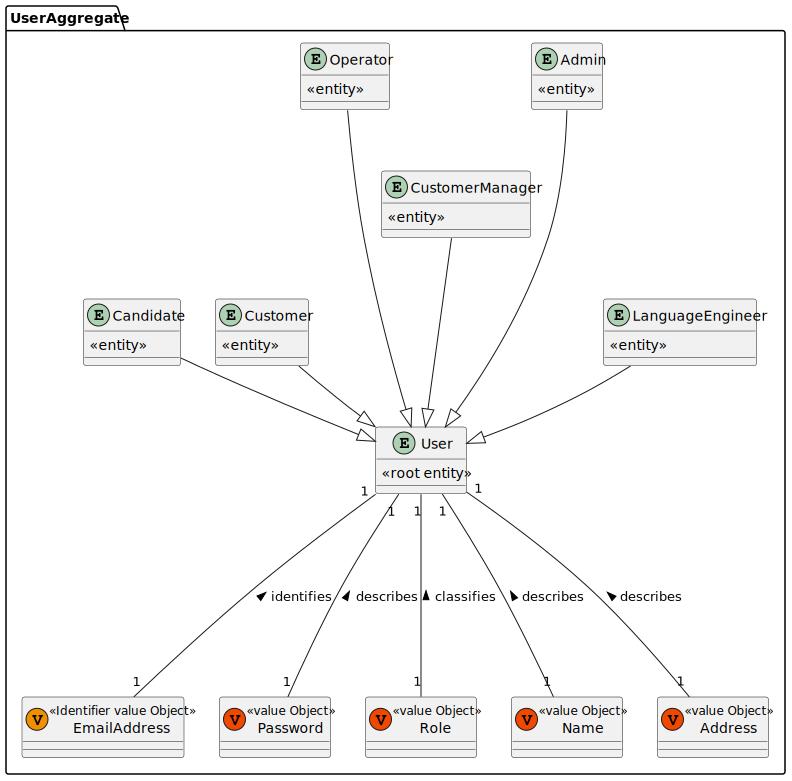
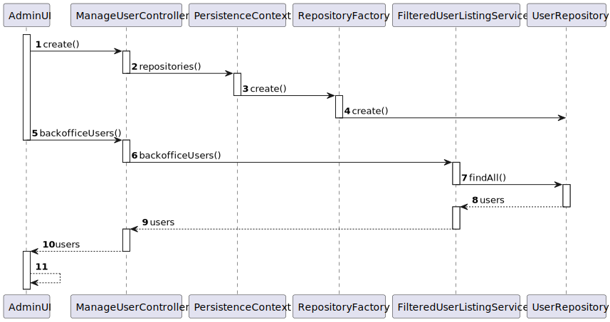
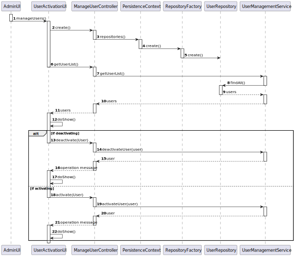
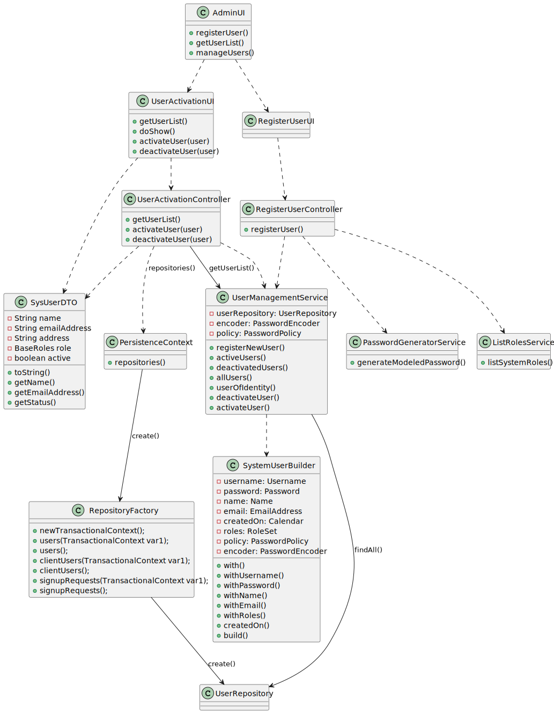
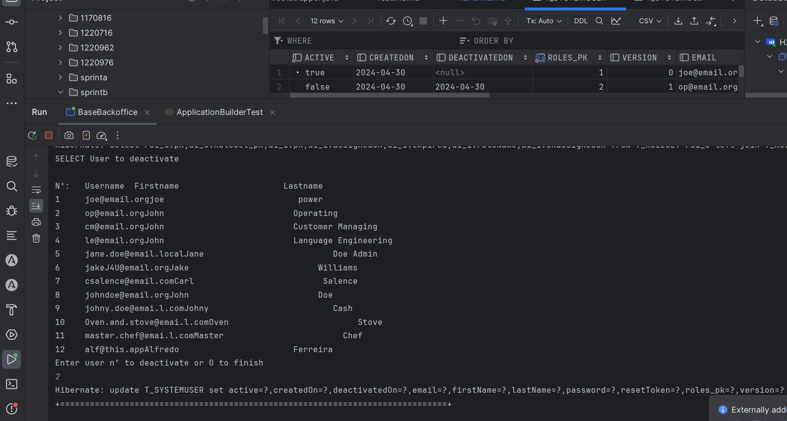

# US 1000 - As Administrator, I want to be able to register, disable/enable, and list users of the backoffice.

## 1. Context

The client intends for the team to provide the admin/s of the platform with the ability to register and manage users of the system by virtue of UI functions of registering, enabling/disabling and listing of users.

## 2. Requirements

"**US 1000** As Administrator, I want to be able to register, disable/enable, and list users of the backoffice."
- Creation of 3 fully functional interfaces, each of which will fulfill one of the requirements of the User Story:
  - Register a User
  - Disable/Enable a User
  - List of all the users of the system in the database with all their information including whether they are disabled or not.

**Acceptance Criteria:**

- **G1000.1.** A user can be disabled and re-enabled multiple times.

- **G1000.2.** A User that is disabled loses the ability to log in to the app, but their information persists in the database.

- **G1000.3.** A user that is created is by default enabled/active.

- **G1000.4.** A password created manually or generated automatically must be at least 8 characters long, contain atleast 1 upper and lower case letter, 1 digit and 1 non alphanumeric symbol.

**Dependencies/References:**

- Dependency to the EAPLI framework for authorization of the created User.
- Dependency to the persistence modules for querying the database and inserting new users into tables.

## 3. Analysis
The team has arrived to the following conclusions:

- An admin should have the possibility of alternating between all aspects of this functionality via a localized interface.
- When registering the user, the admin should be able to choose between a manually assigned or an automatically generated password.
- Facilitate the admin in the process of configuring and creating the User of the system, so they can be registered.


#### Relevant DM Excerpt



## 4. Design

As this User Story is composed of 3 distinct functionalities, 3 different SDs will be presented one for each functionality.


### 4.1. Realization

#### To List Users



| Interaction ID |  Which Class is Responsible for...   |           Answer           | Justification (With Patterns)  |
|:--------------:|:------------------------------------:|:--------------------------:|:------------------------------:|
|       1        |     instantiating the controller     |          AdminUI           |        Pure Fabrication        |
|       2        |  instantiating persistence context   |    ManageUserController    |        PureFabrication         |
|       3        | instantiating the repository factory |     PersistenceContext     |            Factory             |
|       4        |  instantiating the user repository   |     RepositoryFactory      |            Factory             |
|       5        |         requesting user list         |          AdminUI           |     MVC, Pure Fabrication      |
|       6        |  requesting user list from service   |    ManageUserController    | MVC, Service, Pure Fabrication |
|       7        |   requesting the user list from db   | FilteredUserListingService |        Pure Fabrication        |
|       8        |          knowing the users           |       UserRepository       |           Repository           |
|       9        |                  -                   |             -              |               -                |
|       10       |                  -                   |             -              |               -                |
|       11       |       displaying the user list       |          AdminUI           |              MVC               |


#### To Register a User


| Interaction ID |         Which Class is Responsible for...         |          Answer          | Justification (With Patterns) |
|:--------------:|:-------------------------------------------------:|:------------------------:|:-----------------------------:|
|       2        |           instantiating the controller            |      RegisterUserUI      |       Pure Fabrication        |
|       3        |         instantiating persistence context         |  RegisterUserController  |        PureFabrication        |
|       4        |       instantiating the repository factory        |    PersistenceContext    |            Factory            |
|       5        |         instantiating the user repository         |    RepositoryFactory     |            Factory            |
|       6        |                   request roles                   |      RegisterUserUI      |     MVC, Pure Fabrication     |
|       7        |                   get the roles                   |  RegisterUseController   |     MVC, Pure Fabrication     |
|       8        |                  know the roles                   |     ListRolesService     |       ListRolesService        |
|       9        |                         -                         |            -             |               -               |
|     10/17      | presenting information and request/validate input |      RegisterUserUI      |              MVC              |
|     11/18      |          requesting registration of user          |      RegisterUserUI      |              MVC              |
|       12       |                requesting password                |  RegisterUserController  |              MVC              |
|       13       |       generating and validate the password        | PasswordGeneratorService |            Service            |
|     14/19      |                 creating the user                 |    SystemUserBuilder     |            Builder            |


#### To Activate/Deactivate a User




| Interaction ID |     Which Class is Responsible for...      |         Answer         | Justification (With Patterns) |
|:--------------:|:------------------------------------------:|:----------------------:|:-----------------------------:|
|       2        |        instantiating the controller        |     RegisterUserUI     |       Pure Fabrication        |
|       3        |     instantiating persistence context      | RegisterUserController |        PureFabrication        |
|       4        |    instantiating the repository factory    |   PersistenceContext   |            Factory            |
|       5        |     instantiating the user repository      |   RepositoryFactory    |            Factory            |
|       6        | requesting activated/deactivated user list |    UserActivationUI    |              MVC              |
|       7        |        requesting for the user list        |  ManageUserController  |              MVC              |
|       8        |         getting the list of users          | UserManagementService  |            Service            |
|       9        |     knowing the users of the database      |     UserRepository     |          Repository           |
|     13/18      |   requesting for activation/deactivation   |    UserActivationUI    |              MVC              |
|     14/19      |      activating/deactivating the user      | UserManagementService  |            Service            |
|     15/20      |       returing the operation status        | UserManagementService  |            Service            |


### 4.2. Class Diagram




### 4.3. Applied Patterns

 - Aggregate
 - Entity
 - Value Object
 - Service
 - MVC
 - Layered Architecture
 - DTO

### 4.4. Tests

**Test 1:** Tests if generator generates with all categories.
```
    @Test
    public void testValidLengthWithAllCategories() {
        PasswordGenerator passwordGenerator = new PasswordGenerator.PasswordGeneratorBuilder()
                .useDigits(true)
                .useLower(true)
                .useUpper(true)
                .usePunctuation(true)
                .build();

        String password = passwordGenerator.generate(10);
        assertEquals(10, password.length());
        assertTrue(password.matches("[a-zA-Z0-9!\"#$%&'()*+,-./:;<=>?@\\[\\\\\\]^_`{|}~]+"));

    }
````
**Test 2:** Tests if generator generates only lowercase.
```    
    @Test
    public void testValidLengthWithOnlyLowercaseCharacters() {
        PasswordGenerator passwordGenerator = new PasswordGenerator.PasswordGeneratorBuilder()
                .useLower(true)
                .build();
        String password = passwordGenerator.generate(8);
        assertEquals(8, password.length());
        assertTrue(password.matches("[a-z]+"));
    }
````    
**Test 3:** Tests if generator generates only uppercase.
```
    @Test
    public void testValidLengthWithOnlyUppercaseCharacters() {
        PasswordGenerator passwordGenerator = new PasswordGenerator.PasswordGeneratorBuilder()
                .useUpper(true)
                .build();
        String password = passwordGenerator.generate(6);
        assertEquals(6, password.length());
        assertTrue(password.matches("[A-Z]+"));
    }
````    
**Test 4:** Tests if generator generates only digits.
```
    @Test
    public void testValidLengthWithOnlyDigits() {
        PasswordGenerator passwordGenerator = new PasswordGenerator.PasswordGeneratorBuilder()
                .useDigits(true)
                .build();
        String password = passwordGenerator.generate(12);
        assertEquals(12, password.length());
        assertTrue(password.matches("[0-9]+"));
    }
````    
**Test 5:** Tests if generator generates empty password.
```    
    @Test
    public void testInvalidLengthZero() {
        PasswordGenerator passwordGenerator = new PasswordGenerator.PasswordGeneratorBuilder()
                .usePunctuation(true)
                .build();
        String password = passwordGenerator.generate(0);
        assertEquals("", password);
    }
````
**Test 6:** Tests if generator does not generate negative length.
```  
    @Test
    public void testInvalidLengthNegative() {
        PasswordGenerator passwordGenerator = new PasswordGenerator.PasswordGeneratorBuilder()
                .useDigits(true)
                .useLower(true)
                .useUpper(true)
                .usePunctuation(true)
                .build();
        String password = passwordGenerator.generate(-5);
        assertEquals("", password);
    }
````

## 5. Implementation

### Code
The following classes contain the implementation of the US:

**ManageUserController**
```
public class ManageUserController {

    private final AuthorizationService authz = AuthzRegistry.authorizationService();
    private final UserManagementService userSvc = AuthzRegistry.userService();

    public Iterable<SystemUser> activeUsers() {
        authz.ensureAuthenticatedUserHasAnyOf(BaseRoles.POWER_USER, BaseRoles.ADMIN);

        return userSvc.activeUsers();
    }

    public Iterable<SystemUser> inactiveUsers() {
        authz.ensureAuthenticatedUserHasAnyOf(BaseRoles.POWER_USER, BaseRoles.ADMIN);

        return userSvc.deactivatedUsers();
    }

    public SystemUser deactivateUser(final SystemUser user) {
        authz.ensureAuthenticatedUserHasAnyOf(BaseRoles.POWER_USER, BaseRoles.ADMIN);

        return userSvc.deactivateUser(user);
    }

    public SystemUser activateUser(final SystemUser user) {
        authz.ensureAuthenticatedUserHasAnyOf(BaseRoles.POWER_USER, BaseRoles.ADMIN);

        return userSvc.activateUser(user);
    }
}
````
**PersistenceContext**
```
public final class PersistenceContext {
    private static final Logger LOGGER = LoggerFactory.getLogger(PersistenceContext.class);

    private static RepositoryFactory theFactory;

    private PersistenceContext() {
        // ensure utility
    }

    public static RepositoryFactory repositories() {
        if (theFactory == null) {
            final String factoryClassName = Application.settings().getRepositoryFactory();
            try {
                theFactory = (RepositoryFactory) Class.forName(factoryClassName).getDeclaredConstructor().newInstance();
            } catch (NoSuchMethodException | SecurityException | InstantiationException | IllegalAccessException
                    | IllegalArgumentException | InvocationTargetException | ClassNotFoundException ex) {
                LOGGER.error("Unable to dynamically load the Repository Factory", ex);
                throw new IllegalStateException(
                        "Unable to dynamically load the Repository Factory: " + factoryClassName, ex);
            }
        }
        return theFactory;
    }
}
````
**RepositoryFactory**
```
public interface RepositoryFactory {

    TransactionalContext newTransactionalContext();

    UserRepository users(TransactionalContext autoTx);

    UserRepository users();
}
````
**UserRepository**
```
public interface UserRepository extends DomainRepository<Username, SystemUser> {
    Iterable<SystemUser> findByActive(boolean active);
}
````
**FilteredUserListingService**
```
public class FilteredUserListingService {
    private final AuthorizationService authz = AuthzRegistry.authorizationService();
    private final UserManagementService userSvc = AuthzRegistry.userService();


    public Iterable<SystemUser> allBackofficeUsers() {
        Iterable<SystemUser> ITERATOR = userSvc.allUsers();
        List<SystemUser> usersBackOffice = new ArrayList<>();
        for(SystemUser c : ITERATOR){
            if(! (c.roleTypes().contains(BaseRoles.CUSTOMER) || c.roleTypes().contains(BaseRoles.CANDIDATE))){
                usersBackOffice.add(c);
            }
        }
        return usersBackOffice;
    }
}
````

Some other code related to the functioning of the US is contained in the eapli framework and out of scope of the local project.

### Commits:

- [US1000] - Documentation
- [US1000] - TESTS
- [US1000] - US1000 IMPLEMENTATION
- [US1000] - SD FIX
- [US1000] - TDD Implementation of Service for Password Generation
- [US1000] - Closes #23 - Documentation clean up

## 6. Integration/Demonstration

This user story was largely already implemented in the framework, the only functionalities added by hand were the automatic generation of the password and the service responsible for listing backoffice users, there were of course efforts done to stick to design principles/patterns when developing the new functionalities

#### User Registration


#### User Deactivation



## 7. Observations

Field "Username" in SystemUser was filled with contents of the email duo to recommendation by the Client/PM