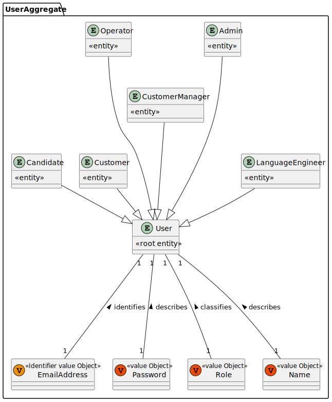
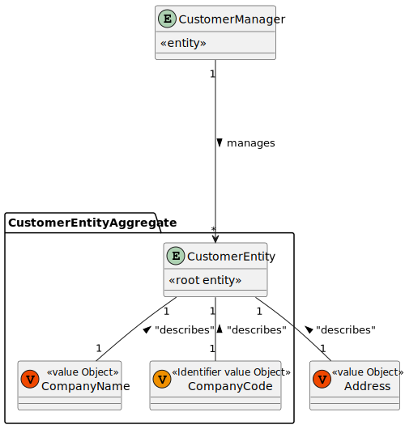
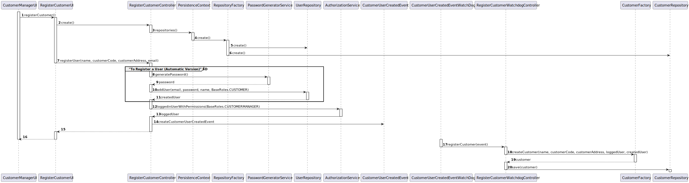
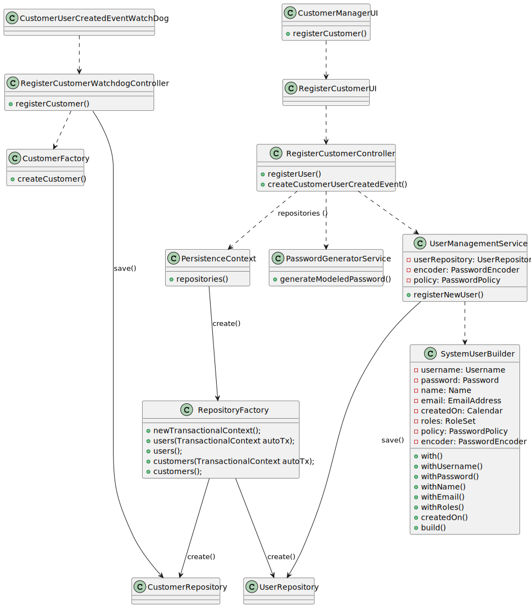
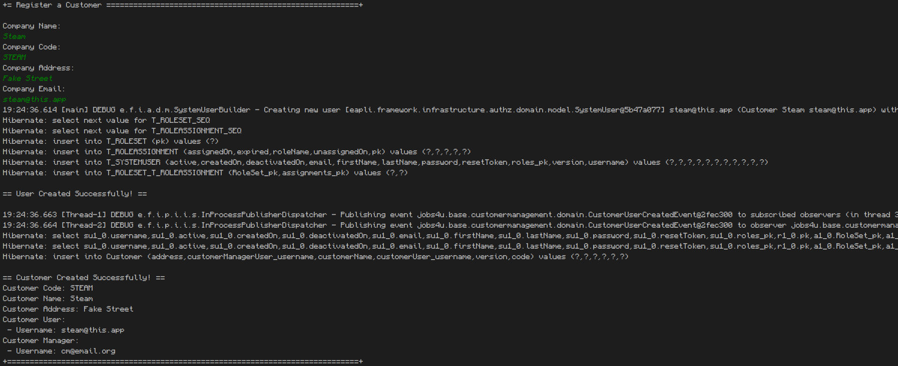

# US 1001 - As Customer Manager, I want to register a customer and that the system automatically creates a user for that customer.

## 1. Context

This is the first time this tasked is assigned. It is a complement to the registration US (1000) and it is a functionality for the User with the Customer Manager role.

It will require the creation of a Customer Manger User Interface, since this is the first task with the Customer Manager as the actor.

## 2. Requirements

"**US 1001** As Customer Manager, I want to register a customer and that the system automatically creates a user for that customer."

- Creation of a specific User Interface that can only be accessed by Users with the role of Customer Manager.
- Design a specific interface to create a customer entity and store it in the system database (for now, local).
- Take advantage of the methods and objects of the **registation interface** implemented in the *US 1000*, to create a User automatically with the information provided by the Customer Manager.

**Acceptance Criteria:**

- US 1001.1. The password can be manually defined or randomly generated. 
- ***From US1000:*** US 1000.4. A password created manually or generated automatically must be at least 8 characters long, contain atleast 1 upper and lower case letter, 1 digit and 1 non-alphanumeric symbol.
- US 1001.2 A user should be automatically created after a customer is inserted into the database.
- US 1001.3 The created customers should be automatically assigned to the Customer Manager.
- US 1001.4 The customer code has a limit of 10 characters and has to be inputted manually.

**Dependencies/References:**

- "Alternatively this can be achieved by a bootstrap process."

## 3. Analysis

The team has arrived to the following conclusions:
- Each created customer will be connected to the customer manager who created them, so it should be possible for the manager to list all the customers assigned to them.
  - There should be a dedicated UI for listing the customers assigned to the customer manager, enabling the possibility of implementing future functionalities, like searching for a specific customer and deleting already created customers.
  - In the future, it can be implemented a possibility to see the users created from the customer registration through the application, as a way to remember the given password for those users. This will always be possible to do in the database.
- Since the *user creation* should be automatic, the password will always be automatically generated, preventing the Customer Manager to interact with the that functionality.

### Relevant DM Excerpts

**User Aggregate:** User creation



**Customer Entity:** CustomerManager interactions with CustomerEntity and CustomerEntity values.



## 4. Design

Since this User Story is composed of 2 distinct functionalities, being one of them a functionality already implemented in US1000, it's SD will have a small modified version of the repeated one, to follow the requirements specific for this US, without repeating the documentation already written.

### 4.1. Realization

#### To Register a Customer



| Interaction ID |       Which Class is Responsible for...       |               Answer               | Justification (With Patterns) |
|:--------------:|:---------------------------------------------:|:----------------------------------:|:-----------------------------:|
|       2        |         instantiating the controller          |         RegisterCustomerUI         |       Pure Fabrication        |
|       3        |       instantiating persistence context       |     RegisterCustomerController     |       Pure Fabrication        |
|       4        |     instantiating the repository factory      |         PersistenceContext         |            Factory            |
|       5        |       instantiating the user repository       |         RepositoryFactory          |            Factory            |
|       6        |     instantiating the customer repository     |         RepositoryFactory          |            Factory            |
|       7        | requesting information for user registration  |         RegisterCustomerUI         |              MVC              |
|       8        |        requesting a generated password        |     RegisterCustomerController     |              MVC              |
|       9        |    generating and validating the password     |     PasswordGeneratorPassword      |            Service            |
|       10       |      requesting the creation of the user      |     RegisterCustomerController     |              MVC              |
|       11       |               creating the user               |         SystemUserBuilder          |            Builder            |
|       12       |          requesting the logged user           |     RegisterCustomerController     |     Pure Fabrication, MVC     |
|       13       |            getting the logged user            |        AuthorizationService        |            Service            |
|       14       |           creating an special event           |     RegisterCustomerController     |       Pure Fabrication        |
|       15       |          returning the created user           |     RegisterCustomerController     |              MVC              |
|       16       |                       -                       |                 -                  |               -               |
|       17       |  requesting the registration of the customer  |  CustomerUserCreatedEventWatchDog  |     Pure Fabrication, MVC     |
|       18       |    requesting the creation of the customer    | RegisterCustomerWatchdogController |     Pure Fabrication, MVC     |
|       19       |             creating the customer             |          CustomerFactory           |            Factory            |
|       20       | saving the created customer in the repository | RegisterCustomerWatchdogController |       Pure Fabrication        |


[//]: # (Possible Extra functionality if time allows it:)
[//]: # (#### To List all the Customers)
[//]: # ()
[//]: # (![SD List all the Customers]&#40;US_1001-SD-list-customers.svg&#41;)
[//]: # ()
[//]: # (| Interaction ID | Which Class is Responsible for... | Answer | Justification &#40;With Patterns&#41; |)
[//]: # (|----------------|-----------------------------------|--------|-------------------------------|)
[//]: # (|                |                                   |        |                               |)
[//]: # (|                |                                   |        |                               |)
[//]: # (|                |                                   |        |                               |)
[//]: # (|                |                                   |        |                               |)
[//]: # (|                |                                   |        |                               |)
[//]: # (|                |                                   |        |                               |)
[//]: # (|                |                                   |        |                               |)
[//]: # (|                |                                   |        |                               |)
[//]: # (|                |                                   |        |                               |)


### 4.2. Class Diagram



### 4.3. Applied Patterns

- Aggregate
- Entity
- Value Object
- Service
- MVC
- Layered Architecture

### 4.4. Tests

**Test 1:** Verifies if the created password is within the defined parameters.

**Refers to Acceptance Criteria:** A password created manually or generated automatically must be at least 8 characters long, contain atleast 1 upper and lower case letter, 1 digit and 1 non-alphanumeric symbol.

```
@Test
    public void testValidLengthWithAllCategories() {
        PasswordGenerator passwordGenerator = new PasswordGenerator.PasswordGeneratorBuilder()
                .useDigits(true)
                .useLower(true)
                .useUpper(true)
                .usePunctuation(true)
                .build();

        String password = passwordGenerator.generate(10);
        
        assertEquals(10, password.length());
        assertTrue(password.matches("[a-zA-Z0-9!\"#$%&'()*+,-./:;<=>?@\\[\\\\\\]^_`{|}~]+"));

    }
````

**Test 2:** Verifies if the customerCode filtration is working correctly [Successful Test].
```
@Test
    void customerCodeFilteringSuccessful(){
        String code = "TEST";
        CustomerCode customerCode = new CustomerCode(code);

        assertEquals(code, customerCode.toString());
    }
````

**Test 3:** Verifies if the customerCode filtration is working correctly [Unsuccessful Test Lowercase - Allows to check custom error message].
```
@Test
    void customerCodeFilteringUnsuccessful_Lowercase(){
        String code = "test";

        IllegalArgumentException exception = assertThrows(IllegalArgumentException.class, () -> {
            CustomerCode customerCode = new CustomerCode(code);;
        });

        System.out.println("=== Error message: ===\n" + exception.getMessage());
    }
````

**Test 4:** Verifies if the customerCode filtration is working correctly [Unsuccessful Test Limit - Allows to check custom error message].
```
@Test
    void customerCodeFilteringUnsuccessful_Limit(){
        String code = "123456789DEZ";

        IllegalArgumentException exception = assertThrows(IllegalArgumentException.class, () -> {
            CustomerCode customerCode = new CustomerCode(code);;
        });

        System.out.println("=== Error message: ===\n" + exception.getMessage());
    }
````

**Test 5:** Verifies if the customerCode filtration is working correctly [Unsuccessful Test Limit - Allows to check custom error message].
```
@Test
    void customerCodeFilteringUnsuccessful_Limit(){
        String code = "123456789DEZ";

        IllegalArgumentException exception = assertThrows(IllegalArgumentException.class, () -> {
            CustomerCode customerCode = new CustomerCode(code);;
        });

        System.out.println("=== Error message: ===\n" + exception.getMessage());
    }
````


**Test 6:** Verifies if the customerName filtration is working correctly [Successful Test].
```
@Test
    void customerNameFilteringSuccessful(){
        String name = "Test";
        CustomerName customerName = new CustomerName(name);

        assertEquals(name, customerName.toString());
    }
````

**Test 7:** Verifies if the customerName filtration is working correctly [Unsuccessful Test Capital - Allows to check custom error message].
```
@Test
    void customerNameFilteringUnsuccessful_CapitalLetters(){
        String name = "test";

        IllegalArgumentException exception = assertThrows(IllegalArgumentException.class, () -> {
            CustomerName customerName = new CustomerName(name);;
        });

        System.out.println("=== Error message: ===\n" + exception.getMessage());
    }
````

**Test 8:** Verifies if the customerName filtration is working correctly [Unsuccessful Test Numbers - Allows to check custom error message].
```
@Test
    void customerNameFilteringUnsuccessful_Numbers(){
        String name = "Test123";

        IllegalArgumentException exception = assertThrows(IllegalArgumentException.class, () -> {
            CustomerName customerName = new CustomerName(name);;
        });

        System.out.println("=== Error message: ===\n" + exception.getMessage());
    }
````

**Test 9:** Verifies if the address filtration is working correctly [Successful Test].
```
@Test
    void addressFilteringSuccessful(){
        String address = "Test";
        Address customerAddress = new Address(address);

        assertEquals(address, customerAddress.toString());
    }
````

**Test 10:** Verifies if the address filtration is working correctly [Unsuccessful Test Empty - Allows to check custom error message].
```
@Test
    void addressFilteringUnsuccessful_Empty(){
        String address = "";

        IllegalArgumentException exception = assertThrows(IllegalArgumentException.class, () -> {
            Address customerAddress = new Address(address);;
        });

        System.out.println("=== Error message: ===\n" + exception.getMessage());
    }
````


## 5. Implementation

### Code Implementation Examples:
Simplified versions of the code (not with all the code implemented).

**RegisterCustomerUI:**
```
public class RegisterCustomerUI extends AbstractUI {

    private final RegisterCustomerController ctrl = new RegisterCustomerController();

    protected boolean doShow() {
        final String name = Console.readLine("Company Name:");
        final String customerCode = Console.readLine("Company Code:");
        final String customerAddress = Console.readLine("Company Address:");
        final String email = Console.readLine("Company Email:");

        try {
            SystemUser createdUser = this.ctrl.registerUser(name, customerCode, customerAddress, email);
            System.out.println("\n== User Created Successfully! ==\n");
        } catch (Exception e) {
            System.out.printf("An unexpected error has occurred.");
        }

        try {
            TimeUnit.SECONDS.sleep(1);
        } catch (InterruptedException e) {
            throw new RuntimeException(e);
        }
        return false;
    }
}
````

**RegisterCustomerController:**
```
public class RegisterCustomerController {

    public SystemUser registerUser(String name, String companyCode, String companyAddress, String email){
        SystemUser createdUser = userSvc.registerNewUser(email, generatePassword(), "Customer", name, email, defineRole());
        createCustomerUserCreatedEvent(name, companyCode, companyAddress, getLoggedUser(), createdUser);
        return createdUser;
    }

    private void createCustomerUserCreatedEvent(String name, String code, String address, SystemUser manager, SystemUser createdUser){
        final DomainEvent event = new CustomerUserCreatedEvent(name, code, address, manager, createdUser);
        dispatcher.publish(event);
    }
}
````

**CustomerUserCreatedEventWatchDog:**
```
public class CustomerUserCreatedEventWatchDog implements EventHandler {

    private RegisterCustomerService service = new RegisterCustomerService();

    @Override
    public void onEvent(final DomainEvent domainevent) {
        assert domainevent instanceof CustomerUserCreatedEvent;

        final CustomerUserCreatedEvent event = (CustomerUserCreatedEvent) domainevent;

        final RegisterCustomerWatchdogController controller = new RegisterCustomerWatchdogController();
        Customer customerCreated = controller.registerCustomer(event);

        service.addCustomer(customerCreated);

        System.out.println("\n== Customer Created Successfully! ==\n" + customerCreated);

    }
}
````

**RegisterCustomerWatchdogController:**
```
public class RegisterCustomerWatchdogController {

    private CustomerFactory factory = new CustomerFactory();

    public Customer registerCustomer(CustomerUserCreatedEvent event){
        Customer customerCreated = factory.createCustomer(event.getName(), event.getCode(), event.getAddress(), event.getCustomerManager(), event.getCustomerUser());

        return customerCreated;
    }
}
````

**CustomerFactory:**
```
public class CustomerFactory {

    public Customer createCustomer(String name, String code, String address, SystemUser customerManager, SystemUser customerUser){
        CustomerName customerName = new CustomerName(name);
        CustomerCode customerCode = new CustomerCode(code);
        Address customerAddress = new Address(address);

        return new Customer(customerCode, customerName, customerAddress, customerManager, customerUser);
    }
}
````

### Main Commits:
> **28/04/2024 23:30 [US1001]** Implementation done and tested:
> - Created several Domain Objects (Customer, CustomerCode, CustomerName)
> - Created one UI and 2 controllers (RegisterCustomerUI, RegisterCustomerController, RegisterCustomerWatchdogController)
> - Created one event and one watchdog ( CustomerUserCreatedEvent, CustomerUserCreatedEventWatchDog)
>- Created repositories and updated the factories ( CustomerRepository, JpaCustomersRepository, InMemoryCustomerRepository, JpaRepositoryFactory)
> - Updated Global Files to accomadate the changes made ( persistence.xml, MainMenu, BaseBootstrap, BaseBackoffice)
> - Small changes in some files.

> **29/04/2024 20:00 [US1001]** UI Improvement and small bug fixes for the functionalities.

## 6. Integration/Demonstration

- This functionality required the creation of a specified MainMenu for a specific role - CustomerManager. It was required to implement the role and the accessibility to it.

- This functionality required the creation of an event, a watchdog and its respective controller to handle the "automatic" creation portion. This way, the main controller ("RegisterCustomerController") doesn't access 2 different aggregates.
  - To ensure that no controller is in contact with 2 different aggregates, it was necessary to swap the automatic creation of the user, to be the automatic creation of the customer. This was done because of the team decision to store the linking attribute in the new Entity (in this case, Customer), meaning that - to create a Customer, you need to store the CustomerUser in it. So the CustomerUser should be created first.
    - Functionally, it works the same, the user won't know what is automatically implemented or not, since the inputs are only related to the customer attributes. 
    - In terms of code, the user is created first and the customer's information are sent through the event for the watchdog to create the customer.

- This implementation allows other classes to use the "Customer" and its respective "CustomerUser" as a means to link them (ie: JobOffers).



## 7. Observations

For the creation of this task, although it was only tasked to one member, it had the involvement of every member of the team when it came to technical decisions:
- Since it was one of the first USs that dealt with class creation and connection between classes, the foundation for those constraints were settled while discussing this US.
- Many of these decisions are written in the [Team Planning Decisions](../team-planning-decisions.md) and there it's possible to read the explanation for each of them.
- Many possible ways to tackle the global issues were explored, but the ones written in this document were the ones the team agreed to be the best ones. We also asked for the teacher's opinion and acted accordingly. 