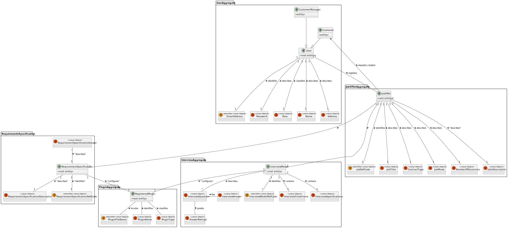
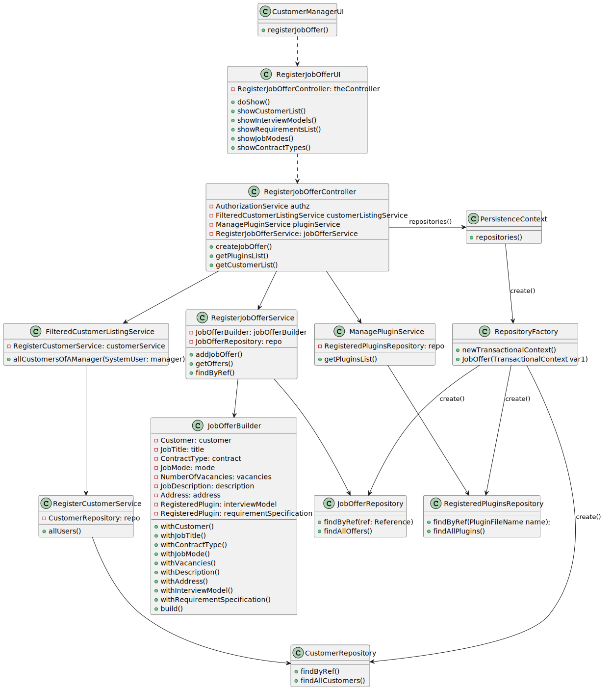
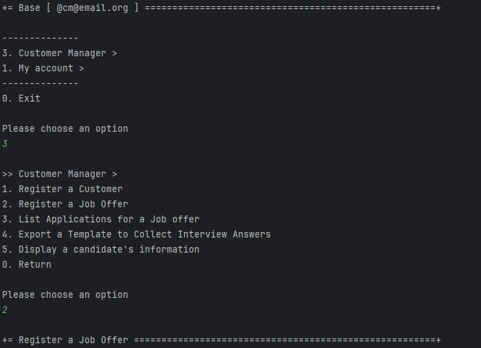
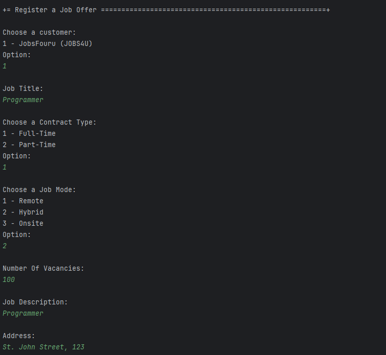
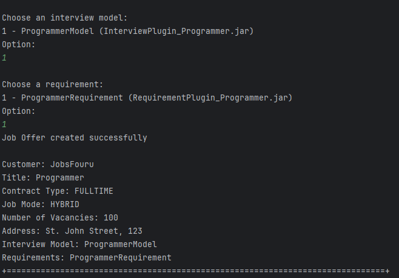

# US 1002 - As Customer Manager, I want to register a job offer.

## 1. Context

Customer Managers have the permission to register job offers for candidates to apply to. This task is assigned for the first time during Sprint B and is to be completed during the sprint. 

## 2. Requirements

"**US 1002 -** As Customer Manager, I want to register a job offer."

**Acceptance Criteria:**

- **US 1002.1** When creating a job offer, the Customer Manager must select which requirement specifications are adequate for said job offer.
- **US 1002.2** A job offer must have the work method and the contract type. 
- **US 1002.3** When creating a job offer, the Customer Manager must choose the customer to which that job entails.
- **US 1002.4** Data inserted by the Customer Manager, must be valid.
- **US 1002.5** The job offer's reference must be auto generated.

**Dependencies/References:**

- No dependencies found

## 3. Analysis

The team has arrived to the following conclusions:
- Creation of a User Interface, accessed by Users with the role of Customer Manager, to allow the registration of job offers.
- If there arent customers to make a Job Offer the UI will terminate.
- The Customer Manager will see a list of customers related to himself so he can pick one to be associated to the job offer. 
- The Customer Manager will input the data for the job offer.
- Both the Contract Type and the Interview Model will be ENUMs 
- The Customer Manager will have a choice to insert or not plugins into the Job Offer.
- The Customer Manager will see two lists of plugins, one for interview models and one for requirements, and will be able to pick one out of both them

### Relevant DM Excerpt



## 4. Design

Since the User Story only has one distinct functionality, only one SD will be presented.

### 4.1. Realization

**To Create Job Offers**


| Interaction ID |       Which Class is Responsible for...       |                         Answer                         | Justification (With Patterns)  |
|:--------------:|:---------------------------------------------:|:------------------------------------------------------:|:------------------------------:|
|       2        |         instantiating the controller          |                   RegisterJobOfferUI                   |        Pure Fabrication        |
|       3        |       instantiating persistence context       |               RegisterJobOfferController               |        Pure Fabrication        |
|       4        |     instantiating the repository factory      |                   PersistenceContext                   |            Factory             |
|     5/6/7      |        instantiating the repositories         |                   RepositoryFactory                    |            Factory             |
|      8/14      |          requesting for information           |                   RegisterJobOfferUI                   |              MVC               |
|      9/15      |      requesting information from service      |               RegisterJobOfferController               | MVC, Service, Pure Fabrication |
|       10       |        requesting information from db         |                   ListPluginService                    |          MVC, Service          |
|       11       |          knowing its own information          |               RegisteredPluginRepository               |        MVC, Repository         |
|       16       |      requesting information from service      |              FilteredCustomListingService              | MVC, Service, Pure Fabrication |
|       17       |        requesting information from db         |                RegisterCustomerService                 |          MVC, Service          |
|       18       |          knowing its own information          |                   CustomerRepository                   |        MVC, Repository         |
|       12       |                       -                       |                           -                            |               -                |
|       13       |                       -                       |                           -                            |               -                |
|       19       |                       -                       |                           -                            |               -                |
|       20       |                       -                       |                           -                            |               -                |
|       21       |                       -                       |                           -                            |               -                |
|       22       |            showing the information            |                   RegisterJobOfferUI                   |     MVC, Pure Fabrication      |
|       23       |       requesting creation of job offer        |                   RegisterJobOfferUI                   |     MVC, Pure Fabrication      |
|       24       | requesting creation of job offer from service |               RegisterJobOfferController               | MVC, Service, Pure Fabrication |
|       25       |            creating the job offer             |                    JobOfferBuilder                     |            Builder             |
|       26       |                       -                       |                           -                            |               -                |
|       27       |             saving the job offer              |                   JobOfferRepository                   |            Creator             |
|       28       |                       -                       |                           -                            |               -                |
|       29       |                       -                       |                           -                            |               -                |
|       30       |                       -                       |                           -                            |               -                |

### 4.2. Class Diagram



### 4.3. Applied Patterns

- Aggregate
- Entity
- Value Object
- Service
- MVC
- Layered Architecture
- DTO

### 4.4. Tests

**Test 1: Verifies if the job offer is successfully built.**

```
    @Test
    void jobBuilderTest(){
        final CustomerFactory customerFactory = new CustomerFactory();
        final JobOfferBuilder jobOfferBuilder = new JobOfferBuilder();

        SystemUserBuilder userBuilder = UserBuilderHelper.builder();
        userBuilder.withUsername("jobs4u@jobs4u.org").withPassword("jobs4U$$$").withName("Jobs", "FourU")
                .withEmail("jobs4u@jobs4u.org").withRoles(BaseRoles.CUSTOMER);


        SystemUser builderUser = userBuilder.build();
        Customer customer = customerFactory.createCustomer("JobsFouru", "JOBS4U",
            "Jobs4u avenue, 123", builderUser, builderUser);

        jobOfferBuilder.withCustomer(customer)
                .withJobTitle("Lifeguard")
                .withContractType(ContractType.PARTTIME)
                .withJobMode(JobMode.ONSITE)
                .withVacancies(3)
                .withDescription("Come save lives 4 us")
                .withAddress("Jobs4u beach, 123");

        JobOffer job = jobOfferBuilder.build();
        assertNotNull(job);
    }
```

**Test 2: Verifies if the job ref code is null, to be generated in DB.**
     
```
    @Test
    void jobReferenceIsNull(){
        final CustomerFactory customerFactory = new CustomerFactory();
        final JobOfferBuilder jobOfferBuilder = new JobOfferBuilder();

        SystemUserBuilder userBuilder = UserBuilderHelper.builder();
        userBuilder.withUsername("jobs4u@jobs4u.org").withPassword("jobs4U$$$").withName("Jobs", "FourU")
                .withEmail("jobs4u@jobs4u.org").withRoles(BaseRoles.CUSTOMER);


        SystemUser builderUser = userBuilder.build();
        Customer customer = customerFactory.createCustomer("JobsFouru", "JOBS4U",
                "Jobs4u avenue, 123", builderUser, builderUser);

        jobOfferBuilder.withCustomer(customer)
                .withJobTitle("Lifeguard")
                .withContractType(ContractType.PARTTIME)
                .withJobMode(JobMode.ONSITE)
                .withVacancies(3)
                .withDescription("Come save lives 4 us")
                .withAddress("Jobs4u beach, 123");

        JobOffer job = jobOfferBuilder.build();
        assertEquals(job.identity().toString(), "null");
    }
```

**Test 3: Verifies if number of vacancies can't be negative numbers.**

```
    @Test
    void vacancyQuantityTest(){
        try{
            NumberOfVacancies num = new NumberOfVacancies(-2);
            assertTrue(false);
        }catch(Exception e){
            assertTrue(true);
        }
    }
```

## 5. Implementation

### Relevant Implementation

**RegisterJobOfferUI**

```
    public class RegisterJobOfferUI extends AbstractUI {

    private final RegisterJobOfferController theController = new RegisterJobOfferController();

    @Override
    protected boolean doShow() {
        List<RegisteredPlugin> pluginList = theController.getPluginList();
        Integer vacancies = 0;
        System.out.println("Choose a customer:\n");
        final Customer customer = showCustomerList();
        final String title = Console.readLine("Job Title:");
        final String type = Console.readLine("Contract Type:");
        final String mode = Console.readLine("Job Mode:");
        do {
            vacancies = Console.readInteger("Number Of Vacancies:");
            if(vacancies <= 0) System.out.println("Vacancies should be a positive number.");
        }while(vacancies <= 0);
        final String description = Console.readLine("Job Description:");
        final String address = Console.readLine("Address:");

        System.out.println("Choose an interview model: ");
        RegisteredPlugin interviewModel = showInterviewModels(pluginList);
        System.out.println("Choose a requirement: ");
        RegisteredPlugin requirements = showRequirementsList(pluginList);

        try {
            this.theController.createJobOffer(customer, title, type, mode, vacancies, description, address, interviewModel, requirements);
        } catch (Exception e) {
            System.out.printf("An unexpected error has occurred.");
        }

        return false;
    }

    public Customer showCustomerList(){
        Iterable<Customer> customers = theController.getCustomerList();
        List<Customer> customerList = new ArrayList<>();
        Integer option = 0;
        boolean validOption = false;
        for (Customer customer : customers) {
            System.out.println(customerList.size() + 1 + " - " + customer.customerName() + " (" + customer.customerCode() + ")");
            customerList.add(customer);
        }

        do{
            option = Console.readInteger("Option:");
            if((option-1) >= customerList.size()) System.out.println("Invalid option");
            else validOption = true;
        }while(!validOption);

        return customerList.get(option - 1);

    }

    public RegisteredPlugin showInterviewModels(List<RegisteredPlugin> pluginList){
        int option = 1;
        boolean validOption = false;
        List<RegisteredPlugin> interviewModels = new ArrayList<>();
        for (RegisteredPlugin plugin : pluginList) {
            if(plugin.pluginType().equals(PluginType.INTERVIEW)){
                System.out.println(option++ + " - " + plugin.pluginName() + "(" + plugin.fileName() + ")");
                interviewModels.add(plugin);
            }
        }

        do{
            option = Console.readInteger("Option:");
            if((option - 1) >= interviewModels.size()) System.out.println("Invalid option");
            else validOption = true;
        }while(!validOption);

        return interviewModels.get(option - 1);
    }

    public RegisteredPlugin showRequirementsList(List<RegisteredPlugin> pluginList){
        int option = 1;
        boolean validOption = false;
        List<RegisteredPlugin> requirements = new ArrayList<>();
        for (RegisteredPlugin plugin : pluginList) {
            if(plugin.pluginType().equals(PluginType.JOBREQUIREMENTS)){
                System.out.println(option++ + " - " + plugin.pluginName() + "(" + plugin.fileName() + ")");
                requirements.add(plugin);
            }
        }

        do{
            option = Console.readInteger("Option:");
            if((option - 1) >= requirements.size()) System.out.println("Invalid option");
            else validOption = true;
        }while(!validOption);

        return requirements.get(option - 1);
    }


    @Override
    public String headline() {
        return "Register a Job Offer";
    }
}
```
**RegisterJobOfferController**
```
public class RegisterJobOfferController {

    private final AuthorizationService authz = AuthzRegistry.authorizationService();
    private final FilteredCustomerListingService customerListingService = new FilteredCustomerListingService();
    private final ManagePluginService pluginService = new ManagePluginService();
    private final RegisterJobOfferService jobOfferService = new RegisterJobOfferService();

    public void createJobOffer(Customer customer, String titleVar, String typeVar, String modeVar, Integer vacanciesVar,
                          String descriptionVar, String addressVar, RegisteredPlugin interviewModel, RegisteredPlugin requirementSpecification){
        jobOfferService.addJobOffer(customer, titleVar, typeVar, modeVar, vacanciesVar,
                descriptionVar, addressVar, interviewModel, requirementSpecification);

    }


    public List<RegisteredPlugin> getPluginList() {
        List<RegisteredPlugin> pluginList = new ArrayList<>();
        for(RegisteredPlugin plugin : pluginService.allPlugins()){
            pluginList.add(plugin);
        }
        return pluginList;
    }

    public Iterable<Customer> getCustomerList(){
        return customerListingService.allCustomersOfAManager(authz.loggedinUserWithPermissions(BaseRoles.CUSTOMER_MANAGER).get());
    }
}
```
**RegisterJobOfferService**
```
public class RegisterJobOfferService {
    private final JobOfferRepository repo = PersistenceContext.repositories().jobOffers();
    private final JobOfferBuilder jobOfferBuilder = new JobOfferBuilder();

    public JobOffer addJobOffer(Customer customer, String titleVar, ContractType typeVar, JobMode modeVar, Integer vacanciesVar,
                                String descriptionVar, String addressVar, RegisteredPlugin interviewVar, RegisteredPlugin requirementVar) {

        jobOfferBuilder.withCustomer(customer)
                .withJobTitle(titleVar)
                .withContractType(typeVar)
                .withJobMode(modeVar)
                .withVacancies(vacanciesVar)
                .withDescription(descriptionVar)
                .withAddress(addressVar)
                .withInterviewModel(interviewVar)
                .withRequirementSpecification(requirementVar);

        JobOffer job = jobOfferBuilder.build();

        if(job == null){ return null; }

        return repo.save(job);
    }

    public JobOffer addJobOffer(Customer customer, String titleVar, ContractType typeVar, JobMode modeVar, Integer vacanciesVar,
                                String descriptionVar, String addressVar) {

        jobOfferBuilder.withCustomer(customer)
                .withJobTitle(titleVar)
                .withContractType(typeVar)
                .withJobMode(modeVar)
                .withVacancies(vacanciesVar)
                .withDescription(descriptionVar)
                .withAddress(addressVar);

        JobOffer job = jobOfferBuilder.build();

        if(job == null){ return null; }

        return repo.save(job);
    }

    public Iterable<JobOffer> getOffers(){
        return repo.findAllOffers();
    }

    public Optional<JobOffer> findByRef(JobRefCode joffer){
        return repo.findByRef(joffer);
    }
}
```
**JobOfferBuilder**
```
public class JobOfferBuilder implements DomainFactory<JobOffer> {

    private Customer customer;
    private JobTitle title;

    private ContractType contract;

    private JobMode mode;

    private NumberOfVacancies vacancies;

    private JobDescription description;

    private Address address;

    private RegisteredPlugin interviewModel;

    private RegisteredPlugin requirementSpecification;

    public JobOfferBuilder withCustomer(final Customer customer) {
        this.customer = customer;
        return this;
    }

    public JobOfferBuilder withJobTitle(final String title) {
        this.title = new JobTitle(title);
        return this;
    }

    public JobOfferBuilder withContractType(final String contract) {
        this.contract = new ContractType(contract);
        return this;
    }

    public JobOfferBuilder withJobMode(final String mode) {
        this.mode = new JobMode(mode);
        return this;
    }

    public JobOfferBuilder withVacancies(final Integer vacancies) {
        this.vacancies = new NumberOfVacancies(vacancies);
        return this;
    }

    public JobOfferBuilder withDescription(final String description) {
        this.description = new JobDescription(description);
        return this;
    }

    public JobOfferBuilder withAddress(final String address) {
        this.address = new Address(address);
        return this;
    }

    public JobOfferBuilder withInterviewModel(final RegisteredPlugin interviewModel) {
        this.interviewModel = interviewModel;
        return this;
    }

    public JobOfferBuilder withRequirementSpecification(final RegisteredPlugin requirementSpecification) {
        this.requirementSpecification = requirementSpecification;
        return this;
    }

    @Override
    public JobOffer build() {
        return new JobOffer(this.customer, this.title, this.contract, this.mode,
                this.vacancies, this.description, this.address, this.interviewModel, this.requirementSpecification);
    }
}
```
**JobOfferRepository**
```
public interface JobOfferRepository
        extends DomainRepository<JobRefCode, JobOffer> {

    default Optional<JobOffer> findByRef(final JobRefCode ref) {
        return ofIdentity(ref);
    }

    public Iterable<JobOffer> findAllOffers();
}

```

### Relevant Commits

> **27/04/2024 [US1002] 00:47** Structure of code and connection to the database
> - Created necessary UI and controller elements
> - Created domain classes
> - Created repository
> - Successfully connected the database to the US
 
> **30/04/2024 [US1002] 17:09** Update to Controller and UI, added builder*
> - Replaced manual JobOffer creation with a builder.
> - Updated the UI
 
> **01/05/2024 [US1002] 13:01** Added Support to connect customers to job offers*
> - Changed the UI to list all customers related to the customer manager.
> - Allowed the customer manager to pick a customer to associate to the job application.
> - Updated the relevant classes to support these changes.

## 6. Integration/Demonstration

This user story required the creation of a job offer. The customer managers are responsible in creating them by choosing a customer they are in charge of and filling out the job offer's information. As such, the following was implemented:
- A new menu for the Customer Manager
- A job offer creation method which saves the customer, the job offer information and the interview model and requirement specifications related to it.

### Job Offer Creation





## 7. Observations

This user story, along with a few others, required that the team to come together and discuss 
the best way to go about connecting classes that were members of the Job Offer, such as Customers and the Interview Model/Requirement Specification.