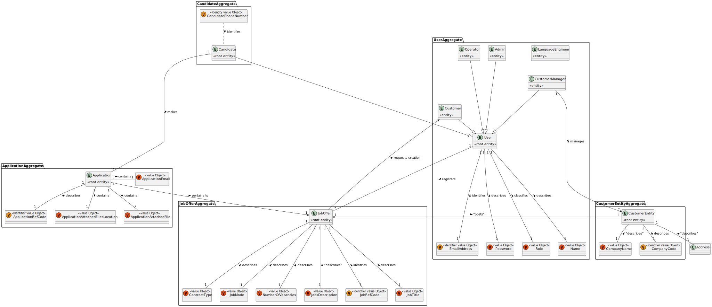
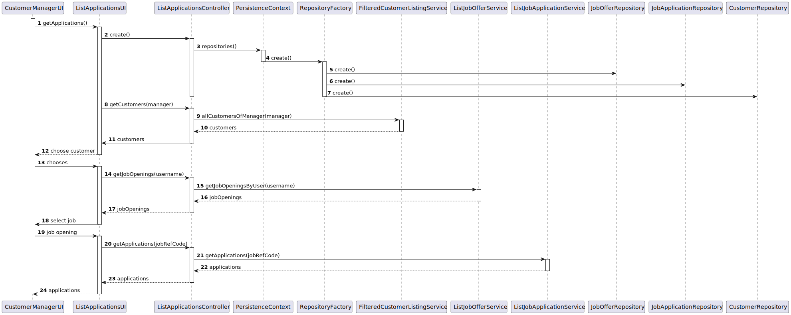
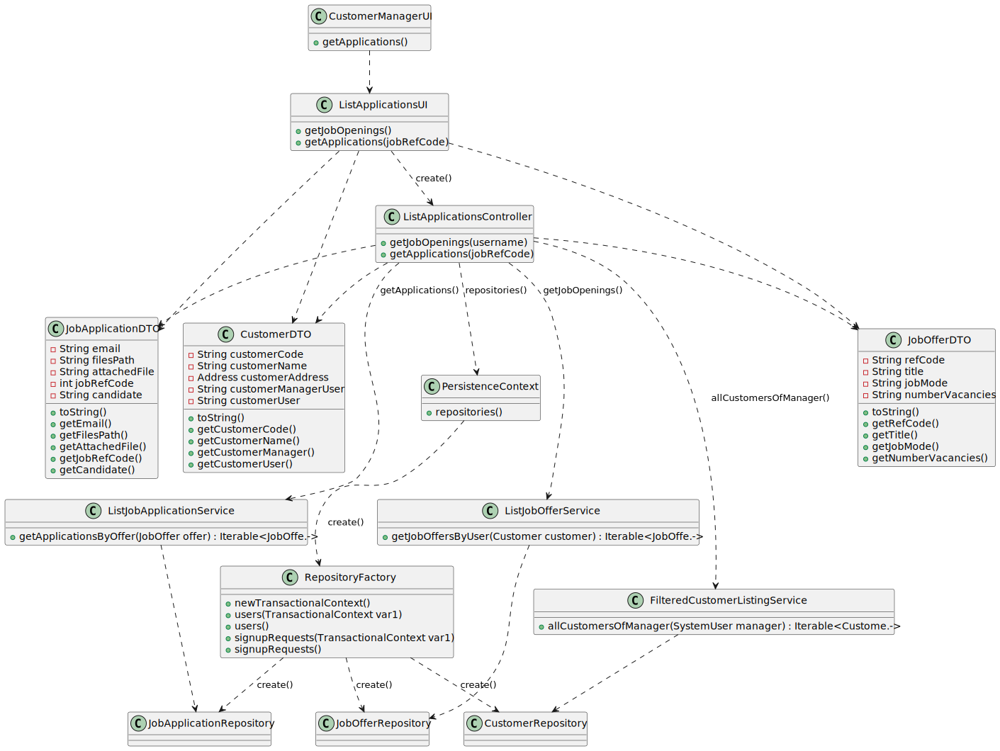
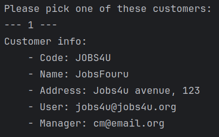
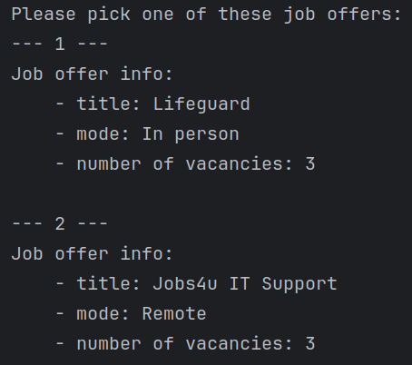
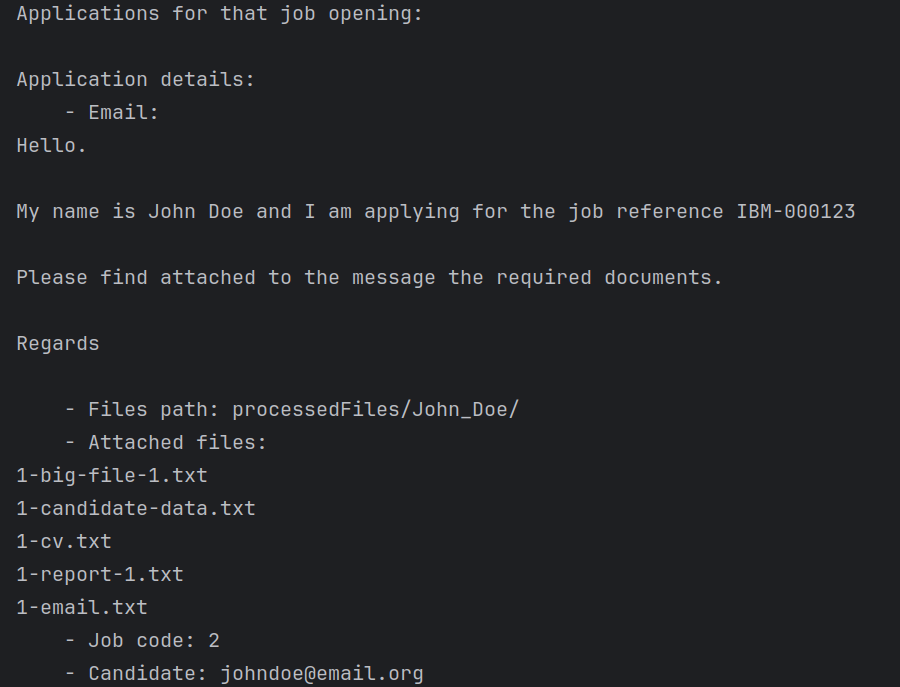
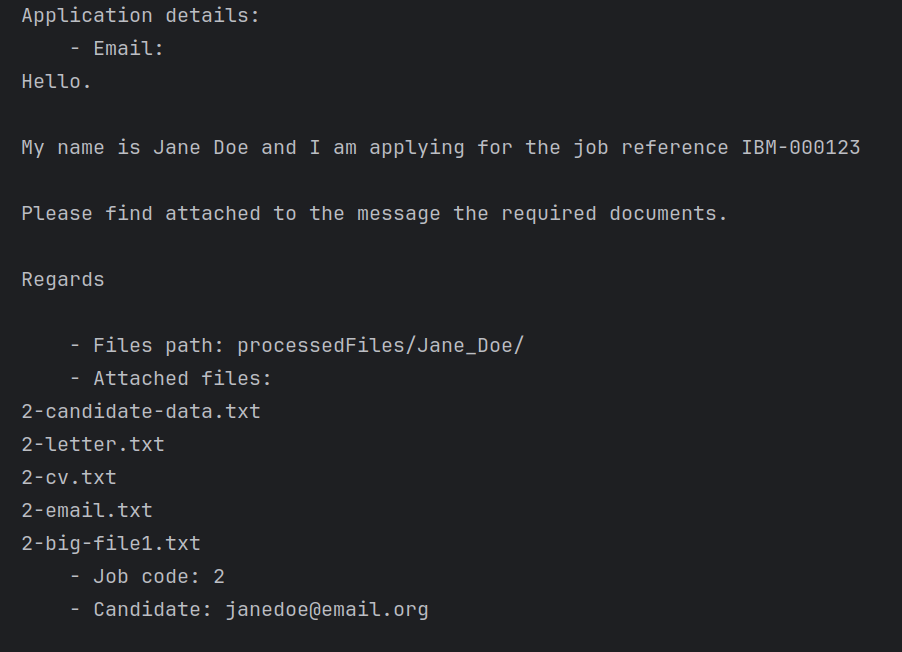

# US 1005 As Customer Manager, I want to list all applications for a job opening.


## 1. Context

In regard to a Customer Manager's function, they are in charge of job openings, as per their Use Case.
As such this functionality tackles their ability to check applications made to any job opening they have created, which is integral in the recruitment process, allowing a candidate to be picked, whether for another phase, or to recruit them.
Additionally, this US was first assigned during sprint B, as such it is the first time it is being worked on.

## 2. Requirements

"**US 1005 -** As Customer Manager, I want to list all applications for a job opening."

This User Story will require the creation of a user interface that enables the customer manager to manage their job openings, in this case, specify a job opening to check any applications submitted.

**Acceptance Criteria:**

- **US1005.1** The Customer Manager should be able to list job openings he has created.
- **US1005.2** A job opening can be selected from a list.
- **US1005.3** All applications to that job opening must be listed.

**Dependencies/References:**

- **G007 -** requires authentication to be implemented.
- **US 2001 -** requires applications to be in the system.
- **US 2002 -** requires the creation of applications.
- **US 1002 -** requires job openings to be created so that candidates can submit applications.
- **US 1007 -** requires the complete set-up of job openings prior to receiving applications.
- **US 1009 -** listing appropriate applications requires that requirements have been properly set for the job opening.

## 3. Analysis

For this US the following considerations were taken:

- Instead of requiring the customer manager to know all the info prior to utilization it was deemed better to show the information and allow them to pick whichever they wish to use.
- The UI should list customers assigned to the customer manager.
- After picking a customer, job openings referring to that customer should then be shown, allowing one to be picked.
- Finally, all application for the selected job opening should be shown.

### Relevant Domain Model Excerpt



## 4. Design

### 4.1. Realization



| Interaction ID |      Which Class is Responsible for...       |             Answer             |     Justification     |
|:--------------:|:--------------------------------------------:|:------------------------------:|:---------------------:|
|       2        |         instantiating the controller         |       ListApplicationUI        |   Pure Fabrication    |
|       3        |        instantiating the persistence         |   ListApplicationController    |   Pure Fabrication    |
|       4        |       instantiating repository factory       |       PersistenceContext       |        Factory        |
|       5        |      instantiating customer repository       |       RepositoryFactory        |        Factory        |
|       6        |      instantiating job offer repository      |       RepositoryFactory        |        Factory        |
|       7        |   instantiating job application repository   |       RepositoryFactory        |        Factory        |
|       8        |           requesting customer list           |       ListApplicationUI        | MVC, Pure Fabrication |
|       9        |    requesting customer list from service     |   ListApplicationController    | MVC, Pure Fabrication |
|       10       |           returning customer list            | FilteredCustomerListingService |        Service        |
|       14       |          requesting job offer list           |       ListApplicationUI        | MVC, Pure Fabrication |
|       15       |    requesting job offer list from service    |   ListApplicationController    | MVC, Pure Fabrication |
|       16       |           returning job offer list           |      ListJobOfferService       |        Service        |
|       20       |       requesting job application list        |       ListApplicationUI        | MVC, Pure Fabrication |
|       21       | requesting job application list from service |   ListApplicationController    | MVC, Pure Fabrication |
|       22       |        returning job application list        |      ListJobOfferService       |        Service        |

### 4.2. Class Diagram



### 4.3. Applied Patterns

- Factory
- Model View Controller
- DTO
- Service
- Builder
- Layered Architecture

### 4.4. Tests

As this user story relies on showing information related to the persistence there are no tests that can be run, especially as no new domain classes were created.

## 5. Implementation

### Relevant Implementation

**ListApplicationUI**
```
public class ListApplicationsUI extends AbstractUI {
	private final ListApplicationsController ctrl = new ListApplicationsController();

	private String pickCustomer() {
		List<CustomerDTO> customers = (ArrayList) ctrl.getCustomers();
		int choice = -1, i = 0;
		System.out.printf("Please pick one of these customers:\n");
		for (CustomerDTO c : customers) {
			i++;
			System.out.printf("--- %d ---\n%s\n", i, c.toString());
		}
		if (i == 0) {
			System.out.println("Current user does not have any assigned customers, returning,");
			return null;
		}
		choice = Console.readInteger("Customer number:");
		if (choice < 0 || choice > i) {
			System.out.println("Invalid choice, returning.");
			return null;
		}
		return customers.get(choice - 1).getCustomerCode();
	}

	private String pickJobOffer(String code) {
		List<JobOfferDto> jobs = (ArrayList) ctrl.getJobOpenings(code);
		int choice = -1, i = 0;
		System.out.printf("Please pick one of these job offers:\n");
		for (JobOfferDto j : jobs) {
			i++;
			System.out.printf("--- %d ---\n%s\n", i, j.toString());
		}
		if (i == 0) {
			System.out.println("Customer does not have any job offers in the system, returning,");
			return null;
		}
		choice = Console.readInteger("Customer number:");
		if (choice < 0 || choice > i) {
			System.out.println("Invalid choice, returning.");
			return null;
		}
		return jobs.get(choice - 1).getRefCode();
	}

	private void showApplications(String code) {
		Iterable<ApplicationDTO> applications = ctrl.getApplications(code);
		System.out.println("Applications for that job opening:\n");
		for (ApplicationDTO a : applications) {
			System.out.println(a.toString());
			System.out.println();
		}
	}

	@Override
	protected boolean doShow() {
		String customerCode = pickCustomer();
		if (customerCode == null) {
			System.out.println("Error picking a customer.");
			return false;
		}
		String jobCode = pickJobOffer(customerCode);
		if (jobCode == null) {
			System.out.println("Error picking a job.");
			return false;
		}
		showApplications(jobCode);
		return false;
	}

	@Override
	public String headline() {
		return "List all applications for a job opening";
	}
}
```

**ListApplicationsController**
```
public class ListApplicationsController {
	private final FilteredCustomerListingService customerListService = new FilteredCustomerListingService();
	private final ListJobOfferService offerListService = new ListJobOfferService();
	private final ListJobApplicationService applicationListService = new ListJobApplicationService();
    private final AuthorizationService authorizationService = AuthzRegistry.authorizationService();
	private Iterable<Customer> customers;
	private Iterable<JobOffer> joboffers;

	private SystemUser getLoggedUser() {
		return authorizationService.loggedinUserWithPermissions(BaseRoles.CUSTOMER_MANAGER).get();
	}

	public Iterable<CustomerDTO> getCustomers() {
		SystemUser manager = getLoggedUser();
		customers = customerListService.allCustomersOfAManager(manager);
		List<CustomerDTO> ret = new ArrayList<>();
		for (Customer c : customers) {
			ret.add(c.toDTO());
		}
		return ret;
	}

	public Iterable<JobOfferDto> getJobOpenings(String code) {
		Customer customer = null;
		List<JobOfferDto> ret = new ArrayList<>();
		for (Customer c : customers) {
			if (c.customerCode().toString().equals(code))
				customer = c;
		}
		joboffers = offerListService.getJobOffersByUser(customer);
		for (JobOffer j : joboffers) {
			ret.add(j.toDTO());
		}
		return ret;
	}

	public Iterable<ApplicationDTO> getApplications(String code) {
		JobOffer jobOffer = null;
		List<ApplicationDTO> ret =  new ArrayList<>();
		for (JobOffer j : joboffers) {
			if (j.identity().toString().equals(code))
				jobOffer = j;
		}
		Iterable<JobApplication> applications = applicationListService.getApplicationsByJobOffer(jobOffer);
		for (JobApplication j : applications) {
			ret.add(j.toDTO());
		}
		return ret;
	}
}
```

**ListJobApplicationService**
```
public class ListJobApplicationService {
    private final AuthorizationService authz = AuthzRegistry.authorizationService();
    private final JobApplicationRepository repo = PersistenceContext.repositories().jobApplications();
	
	public Iterable<JobApplication> getApplicationsByJobOffer(JobOffer offer) {
		Iterable<JobApplication> ls = repo.findAllApplications();
		List<JobApplication> ret = new ArrayList<>();
		for (JobApplication j : ls) {
			if (j.sameOffer(offer))
				ret.add(j);
		}
		return ret;
	}
}
```

### Relevant commits

> **01/05/2024 [US 1005] 17:24** - updating documentation
> 
> **01/05/2024 [US 1005] 21:01** - doc update and US implementation
> - Expanded documentation with class diagram and sequence diagram
> - Updated readme
> - Initial US implementation

> *02/05/2024 [US 1005] 20:13 - ui update and adding bootstrap info*
> - Added bootstrap elements to facilitate US demonstration

## 6. Integration/Demonstration

For the purpose of this User Story, that being showing system information to the user, DTOs for several of the classes had to be created, along with expanding or implementing new services.

### Applications for a job offer






# 7. Observations
This user story was not as complex as others and, as such, there was no need for the team to come together
and discuss how to implement it.