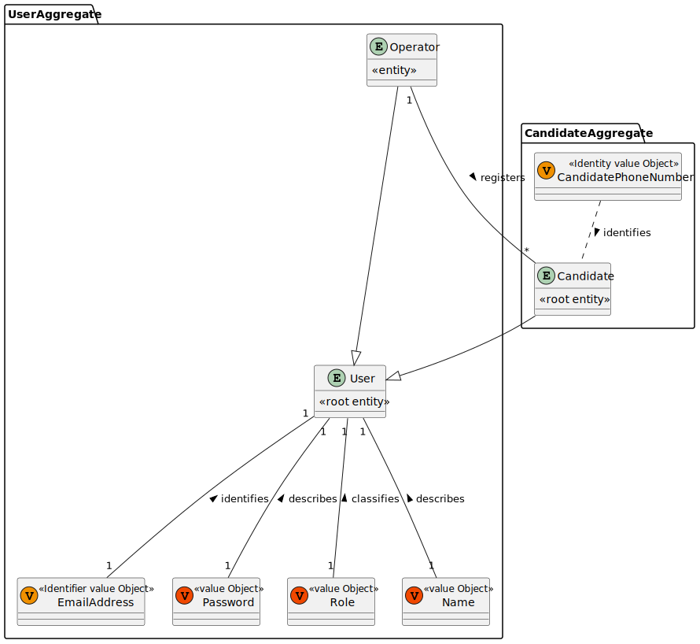
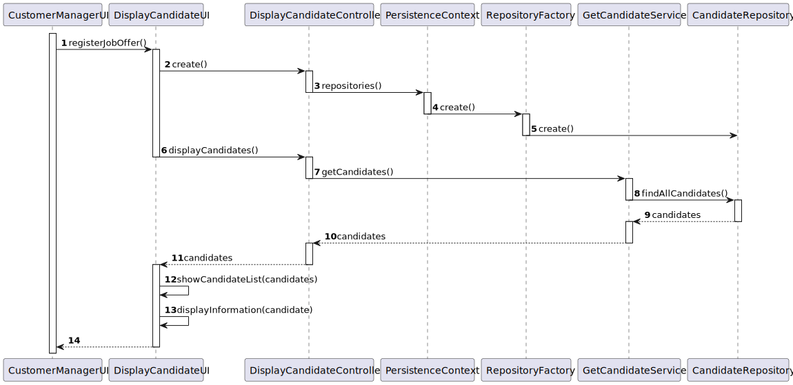
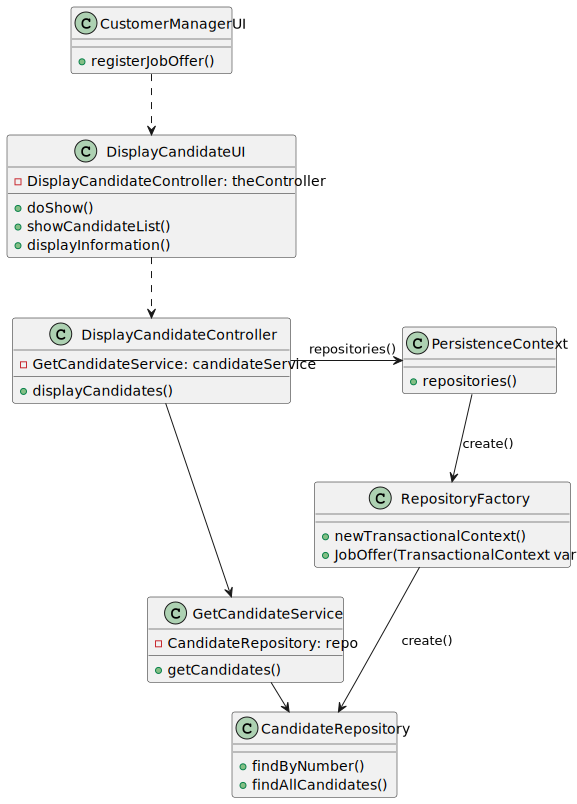
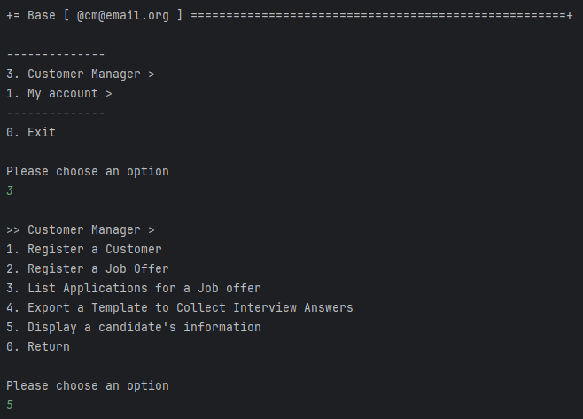
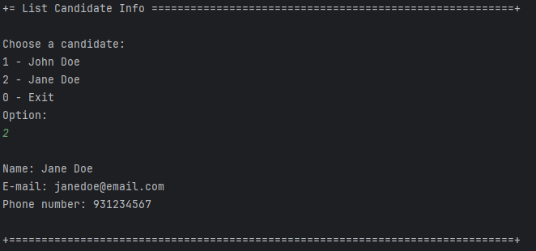

# US 1006 - As Customer Manager, I want to display all the personal data of a candidate


## 1. Context

The client has tasked the team with the development of a functionality to aid the customer manager in displaying the data of a candidate on demand.

## 2. Requirements


**US 1006** - As Customer Manager, I want to display all the personal data of a candidate

**Acceptance Criteria:**

- **1006.1.** Once the candidate is picked all information regarding them should be chosen.
- **1006.2**. A Customer Manager has access to all the candidates in the system.


**Dependencies/References:**

- **2000a -** As Operator, I want to register a candidate and create a corresponding user

## 3. Analysis

The team has arrived the following conclusions:
- The Customer Manager will be shown all the candidates in the system
- The Customer Manager will pick one of these candidates to see the information
- The information displayed will be the name, email and the phone number

### Relevant DM Excerpt



## 4. Design

As the User Story only has one distinct functionality, only one SD will be presented.

### 4.1. Realization

To Display Candidate Information



| Interaction ID |       Which Class is Responsible for...       |           Answer           | Justification (With Patterns)  |
|:--------------:|:---------------------------------------------:|:--------------------------:|:------------------------------:|
|       2        |         instantiating the controller          |     DisplayCandidateUI     |        Pure Fabrication        |
|       3        |       instantiating persistence context       | RegisterJobOfferController |        Pure Fabrication        |
|       4        |     instantiating the repository factory      |     PersistenceContext     |            Factory             |
|       5        |         instantiating the repository          |     RepositoryFactory      |            Factory             |
|       6        |          requesting for information           |     DisplayCandidateUI     |              MVC               |
|       7        |      requesting information from service      | DisplayCandidateController | MVC, Service, Pure Fabrication |
|       8        |        requesting information from db         |  DisplayCandidateService   |          MVC, Service          |
|       9        |          knowing its own information          |    CandidateRepository     |        MVC, Repository         |
|       10       |                       -                       |             -              |               -                |
|       11       |                       -                       |             -              |               -                |
|       12       |            showing the candidates             |     DisplayCandidateUI     |     MVC, Pure Fabrication      |
|       13       |   showing the chosen candidate information    |     DisplayCandidateUI     |     MVC, Pure Fabrication      |

### 4.2. Class Diagram



### 4.3. Applied Patterns

- Aggregate
- Entity
- Value Object
- Service
- MVC
- Layered Architecture

### 4.4. Tests

As the test system in the project does not support Persistence, the creation of meaningful tests, related to the US, is not possible and, as such, it can't be properly tested.

## 5. Implementation

### Relevant Implementation

**DisplayCandidateUI**
```
    public class DisplayCandidateUI extends AbstractUI {
    
        private final DisplayCandidateController theController = new DisplayCandidateController();
    
        @Override
        protected boolean doShow() {
            List<Candidate> candidateList = theController.displayCandidates();
            if(candidateList.isEmpty()){
                System.out.println("There are no candidates.");
                return false;
            }
            System.out.println("Choose a candidate:");
            final Candidate candidate = showCandidateList(candidateList);
            if(candidate.identity() == null) return false;
            displayInformation(candidate);
    
            return false;
        }
    
        public Candidate showCandidateList(List<Candidate> candidateList){
            int i = 0;
            boolean validOption = false;
            for (Candidate candidate : candidateList) {
                System.out.println(i++ + 1 + " - " + candidate.associatedUser().name());
            }
            System.out.println("0 - Exit");
    
            do{
                i = Console.readInteger("Option:");
                if(i == 0) return new Candidate();
                if((i-1) >= candidateList.size()) System.out.println("Invalid option");
                else validOption = true;
            }while(!validOption);
    
            return candidateList.get(i - 1);
        }
    
        public void displayInformation(Candidate candidate){
            System.out.println("\nName: " + candidate.associatedUser().name());
            System.out.println("E-mail: " + candidate.associatedUser().email());
            System.out.println("Phone number: " + candidate.identity() + "\n");
        }
        @Override
        public String headline() {
            return "List Candidate Info";
        }
    }
```
**DisplayCandidateController**
```
    public class DisplayCandidateController {
        
        private final GetCandidateService candidateService = new GetCandidateService();
        
        public List<Candidate> displayCandidates(){
            List<Candidate> candidateList = new ArrayList<>();
            for(Candidate candidate : candidateService.getCandidates()){
                candidateList.add(candidate);
            }
            return candidateList;
        }
        
    }
```
**GetCandidateService**
```
    public class GetCandidateService {
        private final CandidateRepository repo = PersistenceContext.repositories().candidate();
    
        public Iterable<Candidate> getCandidates() {
            return repo.findAllCandidate();
        }
    }
```

### Relevant Commits

> **04/05/2024 [US1006] 16:31** Implementation of the US
> - Created necessary UI and controller elements
> - Created service to fetch candidates
> - Made it so UI can list the candidates and the info of any specified one

## 6. Integration/Demonstration

This user story required the listing of the information of a chosen candidate. The customer manager has listing of all available candidates and chooses one to see their information. As such, the following was implemented:
- A new menu option for the Customer Manager
- A service that would fetch all candidates and would return them to the UI to be displayed.

### Candidate Information




## 7. Observations

This user story was not as complex as others and, as such, there was no need for the team to come together
and discuss how to implement it.