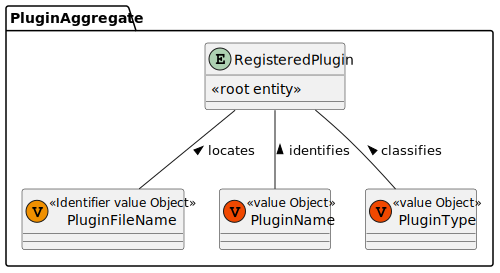
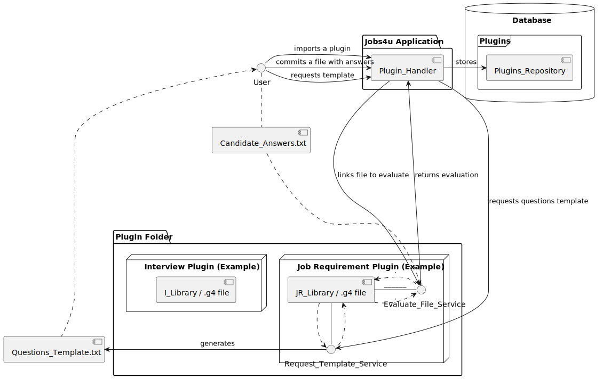
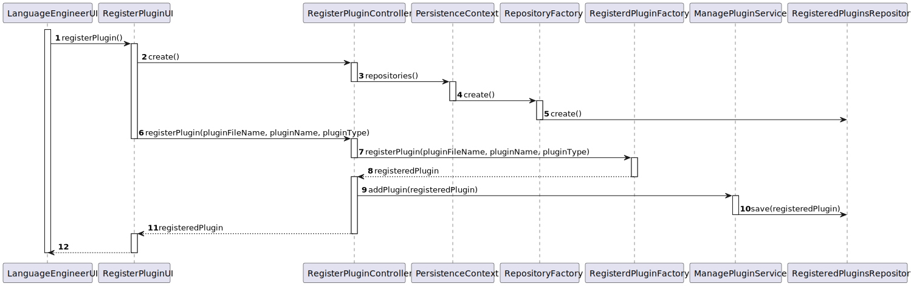
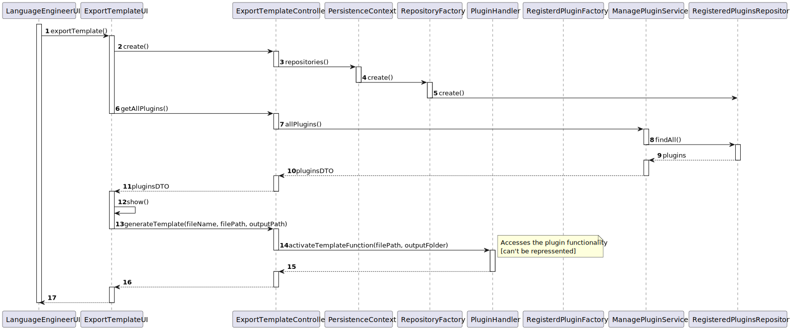
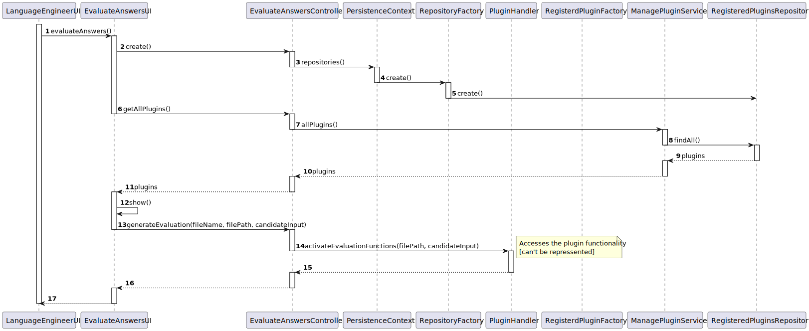
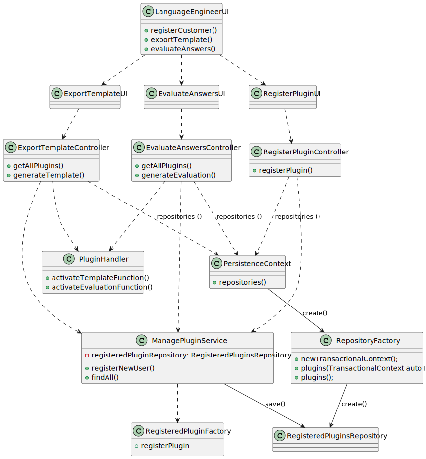
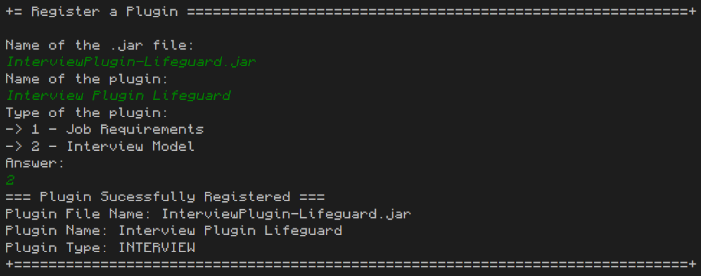
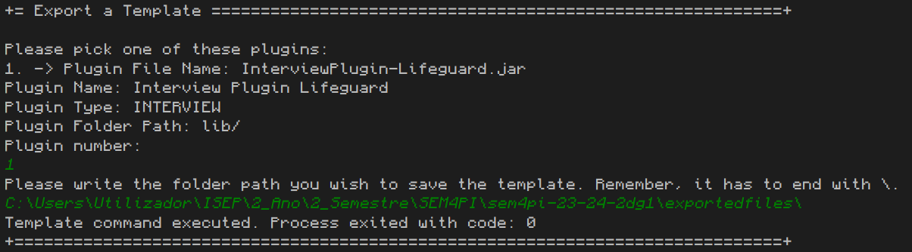
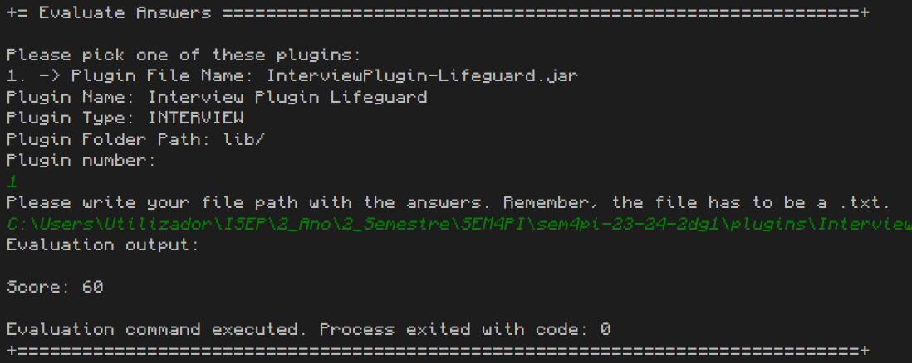

# US 1008 - As Language Engineer, I want to deploy and configure a plugin (i.e., Job Requirement Specication or Interview Model) to be used by the system.

## 1. Context

This is the first time this tasked is assigned. It is a subject specific US, where it will be necessary to follow specific technical requirements specified in LPROG and use ANTLR tool (which was already implemented in the US G003).

## 2. Requirements

"**US 1008 -** As Language Engineer, I want to deploy and configure a plugin (i.e., Job Requirement Specication or Interview Model) to be used by the system."

### Client Specifications:
- "O language enginner com informação passada pelo customer manager (que obteve do customer) vai desenvolver em java um jar correspondente ao modulo/plugin. Para esse desenvolvimento terá de utilizar técnicas de desenvolvimento de gramáticas/linguagens como o antlr. Esse código ficará num jar que depois o language engineer “instala/regista” na aplicação (US1008, por exemplo, associando um nome ao jar num ficheiro de configuração – “5 anos experiencia java”, “req-model-5-years-java.jar”). 
A aplicação com essa informação carrega dinamicamente esse jar. 
Na gramátca usada no jar é que vão estar espelhadas a estrutura das perguntas a usar nesse modelo e sua avaliação. 
Estas atividades têm de ser feitas antes de se poder fazer a US1008. 
Esse trabalho é feito “fora” dos sistema, apenas se registando o modelo (quando está pronto) na US1008"
- "(...) cada modulo será registado no sistema através de 2 dados, por exemplo, associando um nome ao jar num ficheiro de configuração – “5 anos experiencia java”, “req-model-5-years-java.jar”. 
Ou seja, assume-se que cada modulo terá um nome/designação (que suponho que deverá ser única) e a este nome ficará associado o nome do ficheiro jar (provavelmente um path completo) que implementa esse módulo. 
Ou seja, esse nome/designação pode ser considerado como um identificador especifico/manual."
- "Em qualquer dos plugins, o tipo de perguntas que deve ser suportado é o que está apresentado na página 8 do documento. 
Como product onwer eu gostaria que uma demonstração funcional do sistema incluísse pelo menos 2 plugins de cada tipo, para se poder demonstrar, minimamente, o suporte para mais do que um plugin usado (de cada tipo) em simultâneo. 
Deve ainda demonstrar o uso de todos os tipos de perguntas apresentados na página 8 (atualizado em 2024-04-27)."
- "As questões e as notas são definidas pelo Customer Manager em colaboração com o Customer."

**Acceptance Criteria:**

- **US 1008.1.** There has to be 2 types plugins/modules.
- **US 1008.2.** A job requirement specification module should:
  - **US 1008.2.1.** Generate a template text file with the requirements to be evaluated and the possible
  answers for each requirement
  - **US 1008.2.2.** Evaluate if a text file with the requirements for a particular candidate is syntactically
  correct
  - **US 1008.2.3.** Evaluate a text file with the requirements for a particular candidate and provide the
  result, approved or rejected, and in case of rejection, include justification
- **US 1008.3.** An interview model module should:
  - **US 1008.3.1.** Generate a template text file with the questions to be asked in the interview and the
  possible answers for each question
  - **US 1008.3.1.** Evaluate if a text file with the questions and answers for a particular candidate interview
  is syntactically correct
  - **US 1008.3.1.** Evaluate a text file with the questions and answers for a particular candidate interview
  and provide a numeric grade for that interview

- **US 1008.4.** There has to be 2 examples for each type of plugin/module.


**Dependencies/References:**

- "NFR09(LPROG) - Requirement Specifications and Interview Models The support
  for this functionality must follow specific technical requirements, specified in LPROG.
  The ANTLR tool should be used (https://www.antlr.org/)."

## 3. Analysis

This topic sparked a lot of discussions between team members, because, even though the task only requires the deployment and configurations of plugins, the adjacent work necessary to do for the main idea to work, exceeded what was requested.

So, for this US it was agreed to do the following functionalities:
- Creation of a way to deploy plugins and use there functionalities through the application (required task).
- Creation of a UI to register plugins to the program and store them (additional task, but enables testing).
- Creation of a UI to test the plugin functionalities through the program (additional task).

### Relevant DM Excerpts

**Registered Plugin Aggregate:** Plugin Registration



## 4. Design

Unfortunately, since this US tasks the implementation of plugins and functionalities that are manually implemented, there isn't a specific class or sequence diagram for this US main task and not even the possibility to do tests.

So, for the plugin configuration and handling, we will present a Component Diagram to represent how the components interact between each others.

For the new additional UIs implemented, there will be the normal Sequence Diagram and tests for the domain classes created.

### 4.1. Component Diagram



Here we see that the user will have 3 functionalities when in comes to handling with a plugin:
- The first one is the import of a plugin. The new plugin is stored by the plugin after the User provides the required information.
  This plugin is stored in the repository as a way to be accessed by other users of that app.
  - It's important to mention that the storing in the database isn't for the whole plugin, since the client didn't want that. 
    It only stores the required information for it to be accessed and used by other users.
  - This functionality also allows to add in the Bootstrap already implemented plugins, so they can all be used without the need for the Language Engineer to do it.
- The second and third ones are only a way to access functionalities that the plugins already have.
  - The second one asks for the evaluation of a document with the answers of a candidate. The handler accesses the plugin functionality and shows its output.
  - The third one asks for the creation of a questions' template. The handler accesses the plugin functionality and stores the file in the asked folder.

### 4.2. Sequence Diagrams

#### Register a Plugin



| Interaction ID |            Which Class is Responsible for...            |          Answer          | Justification (With Patterns) |
|:--------------:|:-------------------------------------------------------:|:------------------------:|:-----------------------------:|
|       2        |              instantiating the controller               |     RegisterPluginUI     |       Pure Fabrication        |
|       3        |            instantiating persistence context            | RegisterPluginController |       Pure Fabrication        |
|       4        |          instantiating the repository factory           |    PersistenceContext    |            Factory            |
|       5        |           instantiating the plugin repository           |    RepositoryFactory     |            Factory            |
|       6        |   requesting information for the plugin registration    |     RegisterPluginUI     |              MVC              |
|       7        |        requesting the registration of the plugin        | RegisterPluginController |              MVC              |
|       8        |               creating a registeredPlugin               | RegisteredPluginFactory  |            Factory            |
|       9        | requesting the addition of the plugin into the database | RegisterPluginController |       Pure Fabrication        |
|       10       |      saving the registeredPlugin into the database      |   ManagePluginService    |            Service            |
|       11       |         returning the created registeredPlugin          | RegisterPluginController |              MVC              |
|       12       |                            -                            |            -             |               -               |

### Export a Template



| Interaction ID |              Which Class is Responsible for...               |           Answer            | Justification (With Patterns) |
|:--------------:|:------------------------------------------------------------:|:---------------------------:|:-----------------------------:|
|       2        |                 instantiating the controller                 |      ExportTemplateUI       |       Pure Fabrication        |
|       3        |              instantiating persistence context               |  ExportTemplateController   |       Pure Fabrication        |
|       4        |             instantiating the repository factory             |     PersistenceContext      |            Factory            |
|       5        |             instantiating the plugin repository              |      RepositoryFactory      |            Factory            |
|       6        |      requesting the registered plugins in the database       |      ExportTemplateUI       |              MVC              |
|       7        |      requesting the registered plugins in the database       |  ExportTemplateController   |              MVC              |
|       8        |       searching the registered plugins in the database       |     ManagePluginService     |            Service            |
|       9        |        getting the registered plugins in the database        | RegisteredPluginsRepository |          Repository           |
|       10       |      returning the registered plugins from the database      |     ManagePluginService     |            Service            |
|       11       |      returning the registered plugins from the database      |  ExportTemplateController   |              MVC              |
|       12       |        showing the plugins available in the database         |      ExportTemplateUI       |       Pure Fabrication        |
|       13       |         requesting the generation of a template file         |      ExportTemplateUI       |              MVC              |
|       14       | activating the generation of a template file from the plugin |  ExportTemplateController   |              MVC              |
|       15       |                              -                               |              -              |               -               |
|       16       |                              -                               |              -              |               -               |
|       17       |                              -                               |              -              |               -               |

### Evaluate Answers



| Interaction ID |             Which Class is Responsible for...              |           Answer            | Justification (With Patterns) |
|:--------------:|:----------------------------------------------------------:|:---------------------------:|:-----------------------------:|
|       2        |                instantiating the controller                |      EvaluateAnswersUI      |       Pure Fabrication        |
|       3        |             instantiating persistence context              |  EvaluateAnswersController  |       Pure Fabrication        |
|       4        |            instantiating the repository factory            |     PersistenceContext      |            Factory            |
|       5        |            instantiating the plugin repository             |      RepositoryFactory      |            Factory            |
|       6        |     requesting the registered plugins in the database      |      EvaluateAnswersUI      |              MVC              |
|       7        |     requesting the registered plugins in the database      |  EvaluateAnswersController  |              MVC              |
|       8        |      searching the registered plugins in the database      |     ManagePluginService     |            Service            |
|       9        |       getting the registered plugins in the database       | RegisteredPluginsRepository |          Repository           |
|       10       |     returning the registered plugins from the database     |     ManagePluginService     |            Service            |
|       11       |     returning the registered plugins from the database     |  EvaluateAnswersController  |              MVC              |
|       12       |       showing the plugins available in the database        |      EvaluateAnswersUI      |       Pure Fabrication        |
|       13       |         requesting the evaluation of an input file         |      EvaluateAnswersUI      |              MVC              |
|       14       | activating the evaluation of an input file from the plugin |  EvaluateAnswersController  |              MVC              |
|       15       |                             -                              |              -              |               -               |
|       16       |                             -                              |              -              |               -               |
|       17       |                             -                              |              -              |               -               |

### 4.3 Class Diagram



### 4.4. Applied Patterns

- Aggregate
- Entity
- Value Object
- Service
- MVC
- Layered Architecture
- DTO

### 4.5 Tests

**Test 1:** Verifies if the PluginFileName filtration is working correctly [Successful Test].
```
  @Test
  void pluginFileNameFilteringSuccessful(){
    String fileName = "tEsT123.jar";
    PluginFileName pluginFileName = new PluginFileName(fileName);

    assertEquals(fileName, pluginFileName.toString());
  }
````


**Test 2:** Verifies if the PluginFileName filtration is working correctly [Unsuccessful Without JAR - Allows to check custom error message].
```
    @Test
    void pluginFileNameFilteringUnsuccessful_WithoutJAR(){
        String fileName = "test";

        IllegalArgumentException exception = assertThrows(IllegalArgumentException.class, () -> {
            PluginFileName pluginFileName = new PluginFileName(fileName);;
        });

        System.out.println("=== Error message: ===\n" + exception.getMessage());
    }
````
    
**Test 3:** Verifies if the PluginFileName filtration is working correctly [Unsuccessful With JAR - Allows to check custom error message].
```
    @Test
    void pluginFileNameFilteringUnsuccessful_WithJAR(){
        String fileName = "test.JAR";

        IllegalArgumentException exception = assertThrows(IllegalArgumentException.class, () -> {
            PluginFileName pluginFileName = new PluginFileName(fileName);;
        });

        System.out.println("=== Error message: ===\n" + exception.getMessage());
    }
````


**Test 4:** Verifies if the PluginName filtration is working correctly [Successful Test].
```
    @Test
    void pluginNameFilteringSuccessful(){
        String name = "Test";
        PluginName pluginName = new PluginName(name);

        assertEquals(name, pluginName.toString());
    }
````

**Test 5:** Verifies if the PluginName filtration is working correctly [Unsuccessful Test Capital Letter - Allows to check custom error message].
```
    @Test
    void pluginNameFilteringUnsuccessful_CapitalLetter(){
        String name = "test";

        IllegalArgumentException exception = assertThrows(IllegalArgumentException.class, () -> {
            PluginName pluginFileName = new PluginName(name);;
        });

        System.out.println("=== Error message: ===\n" + exception.getMessage());
    }
````

**Test 6:** Verifies if the PluginName filtration is working correctly [Unsuccessful Number - Allows to check custom error message].
```
    @Test
    void pluginNameFilteringUnsuccessful_Numbers(){
        String name = "1234";

        IllegalArgumentException exception = assertThrows(IllegalArgumentException.class, () -> {
            PluginName pluginFileName = new PluginName(name);;
        });

        System.out.println("=== Error message: ===\n" + exception.getMessage());
    }
````

**Test 7:** Verifies if the Handler can activate the Template Function [Successful Test].
```
    @Test
    void activateTemplateFunctionSuccessfully() {
        PluginHandler handler = new PluginHandler();

        int exitCode = handler.activateTemplateFunction("C:\\Users\\Utilizador\\ISEP\\2_Ano\\2_Semestre\\SEM4PI\\sem4pi-23-24-2dg1\\lib\\InterviewPlugin-Lifeguard.jar", "C:\\Users\\Utilizador\\ISEP\\2_Ano\\2_Semestre\\SEM4PI\\sem4pi-23-24-2dg1\\exportedfiles\\");

        assertEquals(0,exitCode);
    }
````

**Test 8:** Verifies if the Handler can activate the Template Function [Unsuccessful Test - Incorrect Path].
```
    @Test
    void activateTemplateFunctionUnsuccessfully_IncorrectPath() {
        PluginHandler handler = new PluginHandler();

        int exitCode = handler.activateTemplateFunction("lib/InterviewPlugin-Lifeguard.jar", "C:\\Users\\Utilizador\\ISEP\\2_Ano\\2_Semestre\\SEM4PI\\sem4pi-23-24-2dg1\\exportedfiles\\");

        assertEquals(1,exitCode);
    }
````

**Test 9:** Verifies if the Handler can activate the Evaluation Function [Successful Test].
```
    @Test
    void activateEvaluationFunctionSuccessfully() {
        PluginHandler handler = new PluginHandler();

        int exitCode = handler.activateEvaluationFunctions("C:\\Users\\Utilizador\\ISEP\\2_Ano\\2_Semestre\\SEM4PI\\sem4pi-23-24-2dg1\\lib\\InterviewPlugin-Lifeguard.jar", "C:\\Users\\Utilizador\\ISEP\\2_Ano\\2_Semestre\\SEM4PI\\sem4pi-23-24-2dg1\\plugins\\InterviewModelLifeguard\\InterviewPlugin-Lifeguard\\templates\\LifeGuardInput.txt");

        assertEquals(0,exitCode);
    }
````

**Test 10:** Verifies if the Handler can activate the Evaluation Function [Unsuccessful Test - Incorrect Path].
```
    @Test
    void activateEvaluationFunctionUnsuccessfully_IncorrectPath() {
        PluginHandler handler = new PluginHandler();

        int exitCode = handler.activateEvaluationFunctions("lib/InterviewPlugin-Lifeguard.jar", "C:\\Users\\Utilizador\\ISEP\\2_Ano\\2_Semestre\\SEM4PI\\sem4pi-23-24-2dg1\\plugins\\InterviewModelLifeguard\\InterviewPlugin-Lifeguard\\templates\\LifeGuardInput.txt");

        assertEquals(1,exitCode);
    }
````

## 5. Implementation

### Code Implementation Examples:
Simplified versions of the code (not with all the code implemented).

**RegisterPluginUI:**
```
public class RegisterPluginUI extends AbstractUI {

    private RegisterPluginController controller = new RegisterPluginController();

    protected boolean doShow() {
        final String pluginFileName = Console.readLine("Name of the .jar file: ");
        final String pluginName = Console.readLine("Name of the plugin: ");
        int pluginType;
        do {
             pluginType = Console.readInteger("Type of the plugin:\n-> 1 - Job Requirements\n-> 2 - Interview Model\nAnswer:");
             if (pluginType!= 1 && pluginType!= 2){
                 System.out.println("[Error] Please choose one of the 2 numbers.");
             }
        } while (pluginType!=1 && pluginType !=2);

        try {
            RegisteredPlugin createdPlugin = controller.registerPlugin(pluginFileName, pluginName, pluginType);
            System.out.println("=== Plugin Sucessfully Registered ===\n" + createdPlugin.toString());
        } catch (Exception e) {
            System.out.printf("[ERROR] " + e.getMessage());
        }

        return false;
    }

    @Override
    public String headline() {
        return "Register a Plugin";
    }

}
````

**RegisterPluginController:**
```
public class RegisterPluginController {

    public ManagePluginService service = new ManagePluginService();

    public RegisteredPlugin registerPlugin(String fileName, String pluginName, int pluginType){
        RegisteredPluginFactory factory = new RegisteredPluginFactory();
        RegisteredPlugin createdPlugin = factory.registerPlugin(fileName,pluginName,pluginType);
        service.addPlugin(createdPlugin);
        return createdPlugin;
    }

}
````

**EvaluatePluginUI:**
```
public class EvaluateAnswersUI extends AbstractUI {

    private EvaluateAnswersController controller = new EvaluateAnswersController();

    @Override
    protected boolean doShow() {
        List<RegisteredPluginDTO> plugins = (ArrayList) controller.getAllPlugins();
        int choice = -1, numberOfPlugins = 0;
        System.out.println("Please pick one of these plugins:");
        for (RegisteredPluginDTO p : plugins) {
            numberOfPlugins++;
            System.out.println(numberOfPlugins + ". -> " + p.toString());
        }
        if (numberOfPlugins == 0) {
            System.out.println("Currently, there are no plugins registered in the system.");
            return false;
        }
        do {
            choice = Console.readInteger("Plugin number:");
            if (choice < 0 || choice > numberOfPlugins) {
                System.out.println("Invalid choice. Try again.");
            }
        } while (choice < 0 || choice > numberOfPlugins);

        String answer;
        do {
            answer = Console.readLine("Please write your file path with the answers. Remember, the file has to be a .txt.");
            if (!answer.endsWith(".txt")){
                System.out.println("[Error] Doesn't end with .txt. Try again.");
            }
        } while (!answer.endsWith(".txt"));

        controller.generateEvaluation(plugins.get(choice-1).getFileName(),plugins.get(choice-1).getFolderPath(),answer);

        return false;
    }

    @Override
    public String headline() {
        return "Evaluate Answers";
    }
} 
````

**EvaluateAnswersController:**
```
public class EvaluateAnswersController {

    private ManagePluginService service = new ManagePluginService();

    private PluginHandler handler = new PluginHandler();

    public Iterable<RegisteredPluginDTO> getAllPlugins() {
        return service.allPluginsDTO();
    }

    public void generateEvaluation(String fileName, String filePath, String candidateInput){
        handler.activateEvaluationFunctions(filePath+fileName,candidateInput);
    }

}
````

**ExportTemplateUI:**
```
public class ExportTemplateUI extends AbstractUI {

    private final ExportTemplateController controller = new ExportTemplateController();

    @Override
    protected boolean doShow() {
        List<RegisteredPluginDTO> plugins = (ArrayList) controller.getAllPlugins();
        int choice = -1, numberOfPlugins = 0;
        System.out.println("Please pick one of these plugins:");
        for (RegisteredPluginDTO p : plugins) {
            numberOfPlugins++;
            System.out.println(numberOfPlugins + ". -> " + p.toString());
        }
        if (numberOfPlugins == 0) {
            System.out.println("Currently, there are no plugins registered in the system.");
            return false;
        }
        do {
            choice = Console.readInteger("Plugin number:");
            if (choice < 0 || choice > numberOfPlugins) {
                System.out.println("Invalid choice. Try again.");
            }
        } while (choice < 0 || choice > numberOfPlugins);

        String answer;
        do {
            answer = Console.readLine("Please write the folder path you wish to save the template. Remember, it has to end with \\.");
            if (!answer.endsWith("\\")){
                System.out.println("[Error] Doesn't end with \\. Try again.");
            }
        } while (!answer.endsWith("\\"));

        controller.generateTemplate(plugins.get(choice-1).getFileName(),plugins.get(choice-1).getFolderPath(),answer);

        return false;
    }

    @Override
    public String headline() {
        return "Export a Template";
    }
}
````

**ExportTemplateController:**
```
public class ExportTemplateController {

    private ManagePluginService service = new ManagePluginService();

    private PluginHandler handler = new PluginHandler();

    public Iterable<RegisteredPluginDTO> getAllPlugins() {
        return service.allPluginsDTO();
    }

    public void generateTemplate(String fileName, String filePath, String outputPath){
        handler.activateTemplateFunction(filePath+fileName,outputPath);
    }

}
````

**ManagePluginService:**
```
public class ManagePluginService {

    private final RegisteredPluginsRepository repo = PersistenceContext.repositories().plugins();

    public boolean addPlugin(RegisteredPlugin plugin) {
        if(plugin == null){ return false; }
        repo.save(plugin);
        return true;
    }

    public Iterable<RegisteredPlugin> allPlugins() {
        return this.repo.findAll();
    }


    public Iterable<RegisteredPluginDTO> allInterviewPlugins() {
        ArrayList<RegisteredPluginDTO> set = new ArrayList<>();
        Iterable<RegisteredPlugin> it = repo.findAllInterviews();

        for( RegisteredPlugin p : it){
            set.add(p.toDTO());
        }

        return set;
    }
}
````

**PluginHandler:**
```
public class PluginHandler {

    public int activateTemplateFunction(String pluginFilePath, String outputFolder) {
        try {
            String[] command = {"java", "-jar", pluginFilePath, "-template", outputFolder};

            ProcessBuilder processBuilder = new ProcessBuilder(command);
            Process process = processBuilder.start();

            int exitCode = process.waitFor();
            System.out.println("Template command executed. Process exited with code: " + exitCode);
            return exitCode;
        } catch (IOException | InterruptedException e) {
            e.printStackTrace();
        }
        return -1;
    }

    public int activateEvaluationFunctions (String pluginFilePath, String candidateInput){
        try {
            String[] command = {"java", "-jar", pluginFilePath, "-evaluate", candidateInput};

            ProcessBuilder processBuilder = new ProcessBuilder(command);
            Process process = processBuilder.start();

            InputStream inputStream = process.getInputStream();
            BufferedReader reader = new BufferedReader(new InputStreamReader(inputStream));
            String line;
            System.out.println("Evaluation output:");

            while ((line = reader.readLine()) != null) {
                System.out.println(line);
            }

            int exitCode = process.waitFor();
            System.out.println("Evaluation command executed. Process exited with code: " + exitCode);

            return exitCode;

        } catch (IOException | InterruptedException e) {
            e.printStackTrace();
        }
        return -1;
    }

}
````

### Main Commits:
> **2/05/2024 12:20 [US1008]** First Sketch of the US1008 Implementation:
> - Creation of the domain classes that will be used (RegisteredPlugin, RegisteredPluginFactory, PluginFileName, PluginName, PluginType);
> - Start of the registration of the RegisteredPluginsRepository (updating the RepositoryFactory);
> - First sketch for plugin activations code done and functional (PluginHandler).
>
> Still in a very early-stage, connections between classes is still required as well as creation of UIs and Controllers.

> **02/05/2024 20:25 [US1008]** Implementation Done:
> - Full creation of all the domain classes and the PluginHandler;
> - Creation of a UI to register plugins into the database (and its controller);
> - Creation of a UI to export a template from a plugin (and its controller);
> - Creation of a UI to evaluate the answers from an input

## 6. Integration/Demonstration

**RegisterPlugin Demonstration:**


**ExportTemplate Demonstration:**


**EvaluateAnswer Demonstration:**


## 7. Observations

Although this US isn't lacking in content, the main objective was hard to understand and may not have been achieved. 
In terms of functionality, this presents every necessary method for the required usage of the application, but it may be missing something extra that the client had envisioned. 

The first interpretation of the group, was a lot different from the proposed outcome and this one was the best one the team thought for this particular ask.
We are proud of the work made here, and we present every functionality required for the future USs, but we understand if we missed the mark of what the client aimed.
A lot of questions were made and this is our conclusion.