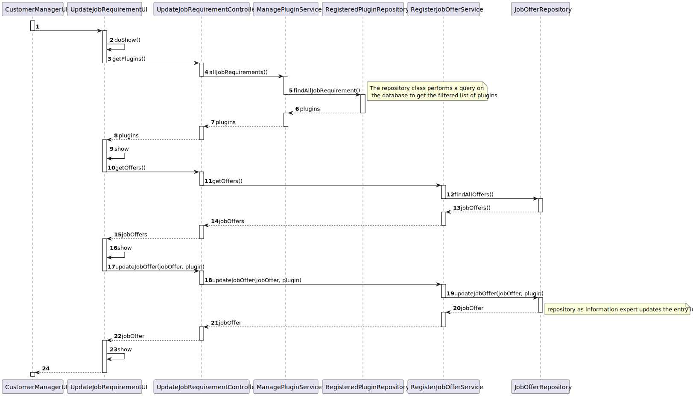
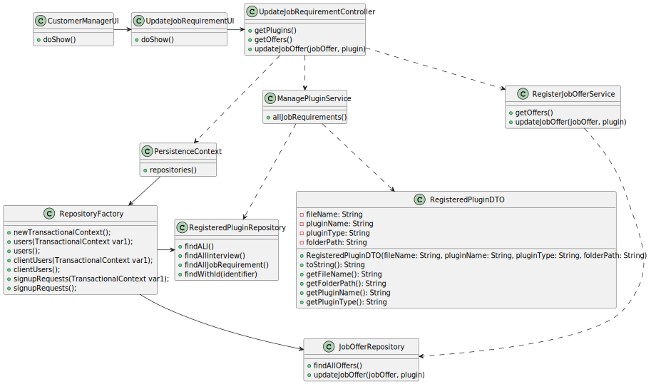

# US 1009 As Customer Manager, I want to select the requirements specification to be used for a job opening

## 1. Context

The Customer Manager, as per their Use Case, manages job openings, and, for this User Story specifically, the selection of requirement specifications.
Additionally, this US was first assigned during sprint B, as such it is the first time it is being worked on.

## 2. Requirements

"**US 1009 -** As Customer Manager, I want to select the requirements specification to be used for a job opening"

The User Interface to be developed should be able to list job openings and allow for the selection of them, further listing any requirements that had already been selected for it. Afterwards, the Customer Manager can add a new requirement or alter any existing one.

**Acceptance Criteria:**

- US1009.1 The system should list any already existing requirements.
- US10009.2 The system should allow the addition of requirements to any job opening.
- US10009.3 The system should allow altering and correcting requirements for any job opening.

**Dependencies/References:**

- NFR09(LPROG) - Requirement Specifications and Interview Models The support for this functionality must follow specific technical requirements, specified in LPROG. The ANTLR tool should be used (https://www.antlr.org/).
- G007 - this user story requires authentication to be implemented.
- US 2001 - requires applications to be in the system.
- US 1002 - requires job openings to be created so that requirements can be specified.
- US 1007 - requires the complete set up of job openings prior to requirement specification.

## 3. Analysis

During analysis of this User Story, some considerations were taken into account:
- The UI should list job opening created by the user (this was deemed a better alternative than requiring an ID for a specific job opening).
- From the listed openings one of them can be selected.
- Any requirements that had already been selected can be altered or removed in case a mistake was made.


## 4. Design

### 4.1. Realization



| Class                          | Responsibility                                   | Pattern              |
|--------------------------------|--------------------------------------------------|----------------------|
| CustomerManagerUI              | Displays UI for managing customer-related tasks  | Pure Fabrication     |
| UpdateJobRequirementUI         | Displays UI for updating job requirements        | Pure Fabrication     |
| UpdateJobRequirementController | Controls the flow of updating job requirements   | MVC (Controller)     |
| ManagePluginService            | Manages plugin-related functionalities           | Service              |
| RegisteredPluginRepository     | Handles operations related to registered plugins | Repository           |
| RegisterJobOfferService        | Manages job offer-related functionalities        | Service              |
| JobOfferRepository             | Handles operations related to job offers         | Repository           |
| PersistenceContext             | Manages persistence layer interactions           | Singleton            |
| RepositoryFactory              | Creates instances of repositories                | Factory              |
| RegisteredPluginDTO            | Data transfer object for registered plugins      | Data Transfer Object |


### 4.2. Class Diagram



### 4.3. Applied Patterns

- MVC
- DTO
- Layered Architecture
- Repository
- Builder

### 4.4. Tests

As this user story relies on Persistence to function, and the test system does not support its use, no meaningful tests can be created for it.

## 5. Implementation


**UpdateJobRequirementUI**
```
public class UpdateJobRequirementUI extends AbstractUI {
    private final UpdateJobRequirementController ctrl = new UpdateJobRequirementController();
    @Override
    protected boolean doShow() {
        JobOffer offer;
        RegisteredPluginDTO plugin;

        System.out.println("-=-=-= Job Offers =-=-=-");
        int i=0;
        ArrayList<JobOffer> offers = (ArrayList<JobOffer>) ctrl.getOffers();
        for(JobOffer j : offers){
            System.out.println("#"+(i+1) + "|"+  j.toString());
            i++;
        }

        int option = Console.readInteger("Select a job offer:");

        while(option<1 || option>i){
            option = Console.readInteger("Select a job offer:");
        }
        offer = offers.get(option-1);


        System.out.println("-=-=-= Available Plugins =-=-=-");

        ArrayList<RegisteredPluginDTO> plugins = (ArrayList<RegisteredPluginDTO>) ctrl.allJobRequirements();
        i=1;
        for(RegisteredPluginDTO plug : plugins){
            System.out.println("#" + i + "|"+plug.toString());
            i++;
        }

        option = Console.readInteger("Select a plugin:");

        while(option<1 || option>i){
            option = Console.readInteger("Select a plugin:");
        }
        plugin = plugins.get(option-1);

        System.out.println(ctrl.updateJobOffer(offer, plugin));
        return false;
    }

    @Override
    public String headline() {
        return ("-=-=-= Update Job Requirement =-=-=-");
    }
}
```

**UpdateJobRequirementController**
```
public class UpdateJobRequirementController {
    private final ManagePluginService plugSvc = new ManagePluginService();
    private final RegisterJobOfferService jobSvc = new RegisterJobOfferService();
    public Iterable<RegisteredPluginDTO> allJobRequirements(){
        return plugSvc.allJobRequirements();
    }

    public Iterable<JobOffer> getOffers(){
        return jobSvc.getOffers();
    }

    public JobOffer updateJobOffer(JobOffer jobOffer, RegisteredPluginDTO plugin){
        return jobSvc.updateJobOffer(jobOffer,plugin);
    }
}
```

### Relevant Commits

> **05/05/2024 11:50 - [US 1009] -** updating documentation
> - Created sequence diagram and class diagram
> - Updated readme

> **05/05/2024 18:51 - [US 1009] -** adding implementation
> - Created UI and Controller for this user story

## 6. Integration/Demonstration

This user story adding requirement specifications to a job offer, as such it needed to be updated, as well create a new function that allowed altering old job offers.
