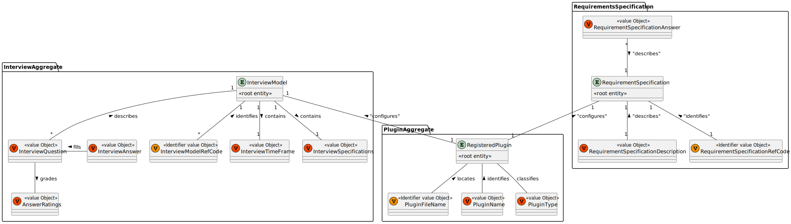
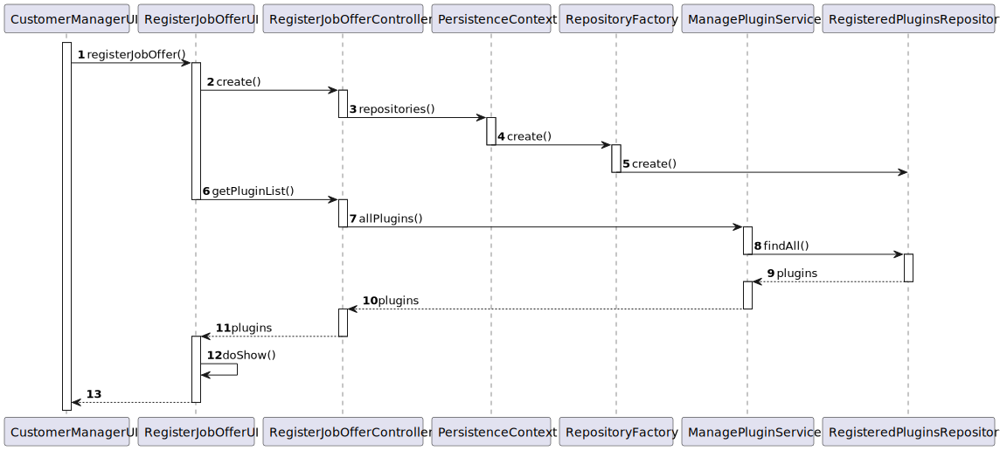
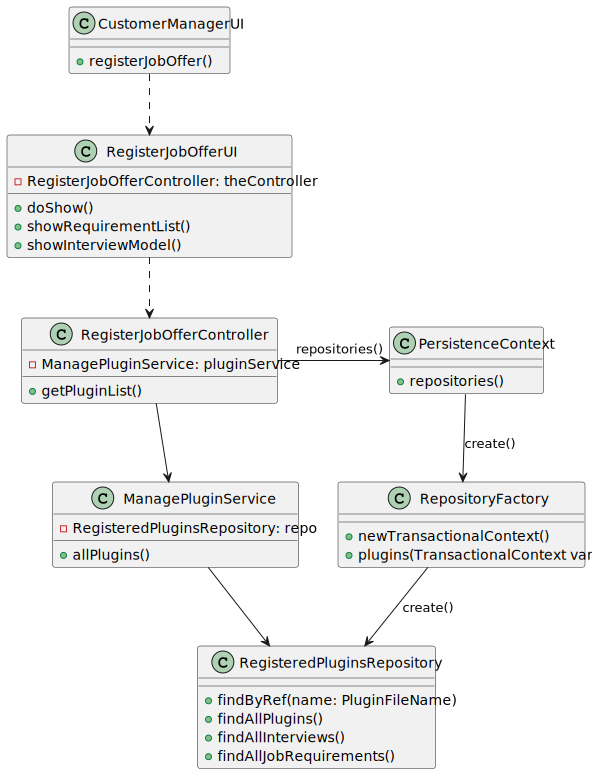
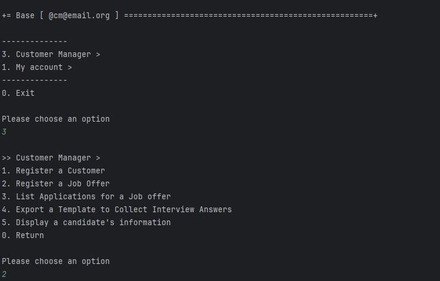
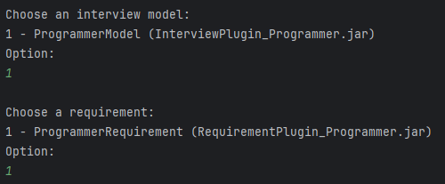

# US 1011 - As Customer Manager, I want to select the interview model to use for the interviews of a job opening (for their evaluation/grading).

## 1. Context

During the creation of a job offer, Customer Managers, have the ability to choose which interview model they pretend to use for the interviews of said job offer.
This task is assigned for the first time during Sprint B and is to be completed during the sprint.

## 2. Requirements

"**US 1011 -** As Customer Manager, I want to select the interview model to use for the interviews of a job opening (for their evaluation/grading)."

- Implementation of a function that, during the creation of a Job Offer, shows all interview models and allows the Customer Manager to pick one for the current job offer.

**Acceptance Criteria:**

- **US 1011.1** When creating a job offer, a list of all interview models must be displayed to the Customer Manager.
- **US 1011.2** The Customer Manager must be able to pick one of these interview models to implement in the job offer.

**Dependencies/References:**

- **US 1008** As Language Engineer, I want to deploy and configure a plugin (i.e., Job Requirement Specification or Interview Model) to be used by the system.

## 3. Analysis

The team has arrived to the following conclusions:
- There will only be one interview model per job offer.
- It would make sense that the interview model were picked during the creation of the job offer and not after.
- Both the interview models and requirement specifications were to be implemented into a generic class, RegisteredPlugin.

### Relevant DM Excerpt



## 4. Design

As the User Story only has one distinct functionality, only one SD will be presented.

### 4.1. Realization

To Create Job Offers



| Interaction ID |    Which Class is Responsible for...     |           Answer           | Justification (With Patterns)  |
|:--------------:|:----------------------------------------:|:--------------------------:|:------------------------------:|
|       2        |       instantiating the controller       |     RegisterJobOfferUI     |        Pure Fabrication        |
|       3        |    instantiating persistence context     | RegisterJobOfferController |        Pure Fabrication        |
|       4        |   instantiating the repository factory   |     PersistenceContext     |            Factory             |
|       5        |       instantiating the repository       |     RepositoryFactory      |            Factory             |
|       6        |         listing interview models         |     RegisterJobOfferUI     |     MVC, Pure Fabrication      |
|       7        | requesting interview models from service |   RegisterJobController    | MVC, Service, Pure Fabrication |
|       8        |   requesting interview models from db    | ListInterviewModelService  |        Pure Fabrication        |
|       9        |       knowing the interview models       |  InterviewModelRepository  |           Repository           |
|       10       |                    -                     |             -              |               -                |
|       11       |     displaying the interview models      |     RegisterJobOfferUI     |     MVC, Pure Fabrication      |

### 4.2. Class Diagram



### 4.3. Applied Patterns

- Aggregate
- Entity
- Value Object
- Service
- MVC
- Layered Architecture

### 4.4. Tests

As the test system in the project does not support Persistence, the creation of meaningful tests, related to the US, is not possible and, as such, it can't be properly tested.

## 5. Implementation

### Relevant Implementation

**RegisterJobOfferUI**
```
    public RegisteredPlugin showInterviewModels(List<RegisteredPlugin> pluginList){
        int option = 1;
        boolean validOption = false;
        List<RegisteredPlugin> interviewModels = new ArrayList<>();
        for (RegisteredPlugin plugin : pluginList) {
            if(plugin.pluginType().equals(PluginType.INTERVIEW)){
                System.out.println(option++ + " - " + plugin.pluginName() + " (" + plugin.fileName() + ")");
                interviewModels.add(plugin);
            }
        }

        do{
            option = Console.readInteger("Option:");
            if((option - 1) >= interviewModels.size()) System.out.println("Invalid option");
            else validOption = true;
        }while(!validOption);

        return interviewModels.get(option - 1);
    }

    public RegisteredPlugin showRequirementsList(List<RegisteredPlugin> pluginList){
        int option = 1;
        boolean validOption = false;
        List<RegisteredPlugin> requirements = new ArrayList<>();
        for (RegisteredPlugin plugin : pluginList) {
            if(plugin.pluginType().equals(PluginType.JOBREQUIREMENTS)){
                System.out.println(option++ + " - " + plugin.pluginName() + " (" + plugin.fileName() + ")");
                requirements.add(plugin);
            }
        }

        do{
            option = Console.readInteger("Option:");
            if((option - 1) >= requirements.size()) System.out.println("Invalid option");
            else validOption = true;
        }while(!validOption);

        return requirements.get(option - 1);
    }
```
**RegisterJobOfferController**
```
    public List<RegisteredPlugin> getPluginList() {
        List<RegisteredPlugin> pluginList = new ArrayList<>();
        for(RegisteredPlugin plugin : pluginService.allPlugins()){
            pluginList.add(plugin);
        }
        return pluginList;
    }
```
### Relevant Commits

> **03/05/2024 [US1011] 16:04** Added listing of plugins for both interview models and requirements and added support for plugins to the job offer class.
> - Implemented method to grab the plugins
> - Seperated interview model plugins and requirement plugins to show in the UI
> - Made plugins be applicable to Job Offer

## 6. Integration/Demonstration

This user story required the expansion of the job offer creation. As such, the following was implemented:
- Updated the job offer class and builder to be able to support plugins.
- Updated the job offer creation UI to list interview models and requirements as to be picked by the Customer Manager.

### Candidate Information




## 7. Observations

The team had to come together to discuss how to implement plugins into the program and Job Offer before developing this user story.