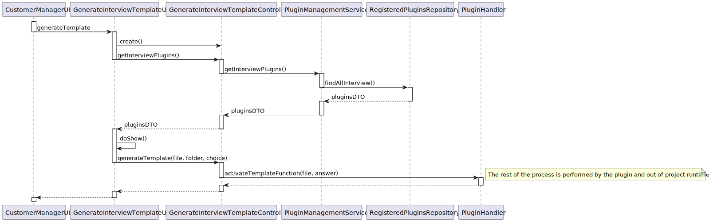
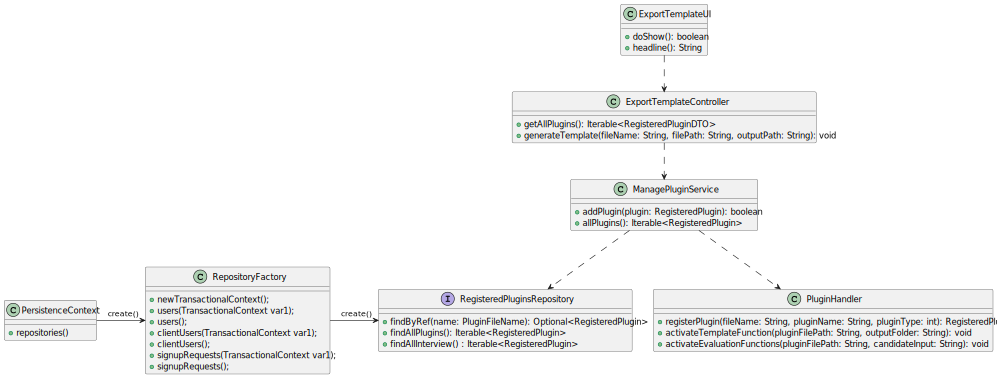
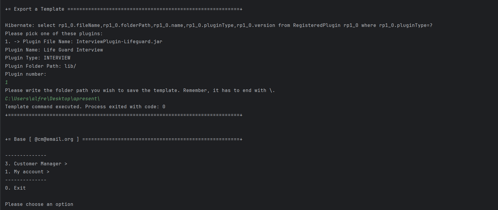

# US 1012 - As Customer Manager, I want to generate and export a template text file to help collect the candidate answers during the interviews.

## 1. Context

In this US the client has tasked the team with the development of a graphical interface to facilitate the Customer Manager's use of the system plugins, in specific we want to develop a UI that will ease the generation of the Interview Template for the Customer Manager so he can perform interview on the applicants.


## 2. Requirements

"**US 1012** - As Customer Manager, I want to generate and export a template text file to help collect the candidate answers during the interviews."

The functionality will be implemented in with the rest of the functionalities to be used by the Customer Manager in their respective UI.

**Acceptance Criteria:**

- **G1012.1.** The specification document presents, as I said, examples. These are just indicative examples. You can use these examples as test cases and as a starting point for defining others. But the solution is supposed to support more than just the examples in the document. In any of the plugins, the type of questions that must be supported is what is presented on page 8 of the document. As a product owner, I would like a functional demonstration of the system to include at least 2 plugins of each type, to be able to demonstrate, at a minimum, support for more than one plugin used (of each type) simultaneously. You must also demonstrate the use of all question types presented on page 8.
*Note : These dependencies are explored more in depth in us_1008 see [us_1008 - readme](../us_1008/readme.md)*

- **G1012.2.** The Customer Manager should only be given the option to generate a template for a Job Offer that has an associated plugin

**Dependencies/References:**

- This user story has functional dependencies with mainly US2003, as this US will configure and deploy the plugins developed by the team, but as the development of these plugins was done outside project scope this dependency is mainly focused on the implementation and persistence of the plugin information done by the team member assigned with US2003.

## 3. Analysis

This User Story was developed with the intent of providing the operator with an easy to user and comprehend interface where they can create interview templates to hand out to possible candidate in case an interview needs to happen.

The centerpiece of this functionality is/are the interview model plugins developed by the Language Engineers which enable and quick and user friendly way of storing and analyzing information regarding interviews.

## 4. Design


### 4.1. Realization



| Interaction ID |              Which Class is Responsible for...               |              Answer               | Justification (With Patterns) |
|:--------------:|:------------------------------------------------------------:|:---------------------------------:|:-----------------------------:|
|       2        |                 instantiating the controller                 |     ExportInterviewTemplateUI     |       Pure Fabrication        |
|       3        |              instantiating persistence context               | ExportInterviewTemplateController |       Pure Fabrication        |
|       4        |             instantiating the repository factory             |        PersistenceContext         |            Factory            |
|       5        |             instantiating the plugin repository              |         RepositoryFactory         |            Factory            |
|       6        |      requesting the registered plugins in the database       |     ExportInterviewTemplateUI     |              MVC              |
|       7        |      requesting the registered plugins in the database       | ExportInterviewTemplateController |              MVC              |
|       8        |       searching the registered plugins in the database       |        ManagePluginService        |            Service            |
|       9        |        getting the registered plugins in the database        |    RegisteredPluginsRepository    |          Repository           |
|       10       |      returning the registered plugins from the database      |        ManagePluginService        |            Service            |
|       11       |      returning the registered plugins from the database      | ExportInterviewTemplateController |              MVC              |
|       12       |        showing the plugins available in the database         |     ExportInterviewTemplateUI     |       Pure Fabrication        |
|       13       |         requesting the generation of a template file         |     ExportInterviewTemplateUI     |              MVC              |
|       14       | activating the generation of a template file from the plugin | ExportInterviewTemplateController |              MVC              |
|       15       |                              -                               |                 -                 |               -               |
|       16       |                              -                               |                 -                 |               -               |
|       17       |                              -                               |                 -                 |               -               |


*Note*: The plugin will export the information regarding the interview model chosen into a file ready to be handed to a candidate, this file's location can be specified via a parameter in the call of the plugin or it will be stored in a preset "default" directory
*Note : The inner machinations of the operations in the plugin are explained more in depth in us_1008 see [us_1008 - readme](../us_1008/readme.md)*

### 4.2. Class Diagram



### 4.3. Applied Patterns

- DTO
- MVC
- Layered Architecture
- Repository
- Factory

### 4.4. Tests

This user story's functionality is mostly based on the plugin which was developed outside of project scope as so the source code of this plugin is also outside of this project's scope (even though it is in the repository)

## 5. Implementation

### Implemented Code:
**ExportInterviewTemplateUI:**
```
public class ExportInterviewTemplateUI extends AbstractUI {

    private final ExportInterviewModelController controller = new ExportInterviewModelController();

    @Override
    protected boolean doShow() {
        List<RegisteredPluginDTO> plugins = (ArrayList) controller.getAllInterviewPlugins();
        int choice = -1, numberOfPlugins = 0;
        System.out.println("Please pick one of these plugins:");
        for (RegisteredPluginDTO p : plugins) {
            numberOfPlugins++;
            System.out.println(numberOfPlugins + ". -> " + p.toString());
        }
        if (numberOfPlugins == 0) {
            System.out.println("Currently, there are no plugins registered in the system.");
            return false;
        }
        do {
            choice = Console.readInteger("\nPlugin number:");
            if (choice < 0 || choice > numberOfPlugins) {
                System.out.println("Invalid choice. Try again.");
            }
        } while (choice < 0 || choice > numberOfPlugins);

        String answer;
        do {
            answer = Console.readLine("Please write the folder path you wish to save the template. Remember, it has to end with \\.");
            if (!answer.endsWith("\\")){
                System.out.println("[Error] Doesn't end with \\. Try again.");
            }
        } while (!answer.endsWith("\\"));

        controller.generateTemplate(plugins.get(choice-1).getFileName(),plugins.get(choice-1).getFolderPath(),answer);

        return false;
    }

    @Override
    public String headline() {
        return "Export a Template";
    }
}
````

**ExportInterviewModelController:**
```
public class ExportInterviewModelController {
    private ManagePluginService service = new ManagePluginService();
    private PluginHandler handler = new PluginHandler();

    public Iterable<RegisteredPluginDTO> getAllInterviewPlugins() {
        return service.allInterviewPlugins();

    }

    public void generateTemplate(String fileName, String filePath, String outputPath){
        handler.activateTemplateFunction(filePath+fileName,outputPath);
    }
}
````

**ManagePluginService:**
```
public class ManagePluginService {

    private final RegisteredPluginsRepository repo = PersistenceContext.repositories().plugins();

    public boolean addPlugin(RegisteredPlugin plugin) {
        if(plugin == null){ return false; }
        repo.save(plugin);
        return true;
    }

    public Iterable<RegisteredPlugin> allPlugins() {
        return this.repo.findAll();
    }

    public Iterable<RegisteredPluginDTO> allPluginsDTO(){
        Iterable<RegisteredPlugin> plugins = allPlugins();
        List<RegisteredPluginDTO> ret = new ArrayList<>();
        for (RegisteredPlugin plugin : plugins) {
            ret.add(plugin.toDTO());
        }
        return ret;
    }

    public Iterable<RegisteredPluginDTO> allInterviewPlugins() {
        ArrayList<RegisteredPluginDTO> set = new ArrayList<>();
        Iterable<RegisteredPlugin> it = repo.findAllInterviews();

        for( RegisteredPlugin p : it){
            set.add(p.toDTO());
        }

        return set;
    }

    public Iterable<RegisteredPluginDTO> allJobRequirements() {
        ArrayList<RegisteredPluginDTO> set = new ArrayList<>();
        Iterable<RegisteredPlugin> it = repo.findAllJobRequirements();

        for( RegisteredPlugin p : it){
            set.add(p.toDTO());
        }

        return set;
    }
}
````

### Commits:
>**[US1012] -** Documentation (Requirements) (on 01/05/2024 at 22:55)

>**[US1012] -** Implementation and Documentation finish - Closes #21 (on 02/05/2024 at 22:32)


## 6. Integration/Demonstration



## 7. Observations

Most of the functionality of the US is implemented in the plugin jar file, so it's hard to demonstrate a lot of the functionality in code, but do take a look at folder "plugins" in project root if you wish to view the source code of the parsers/lexers.