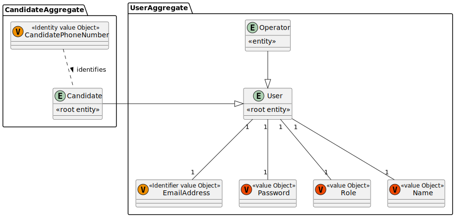
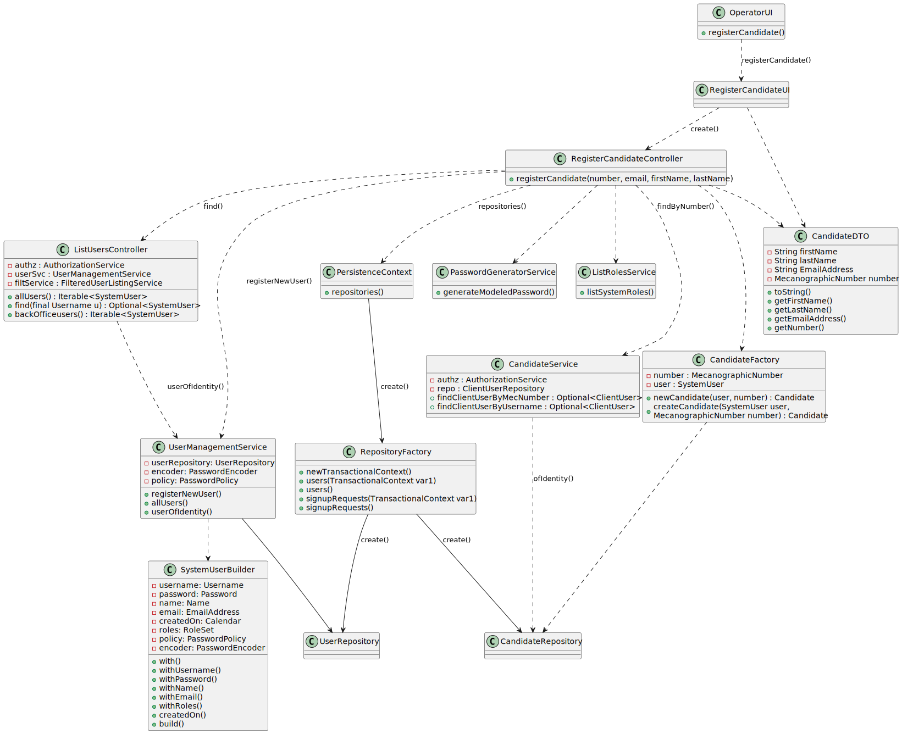
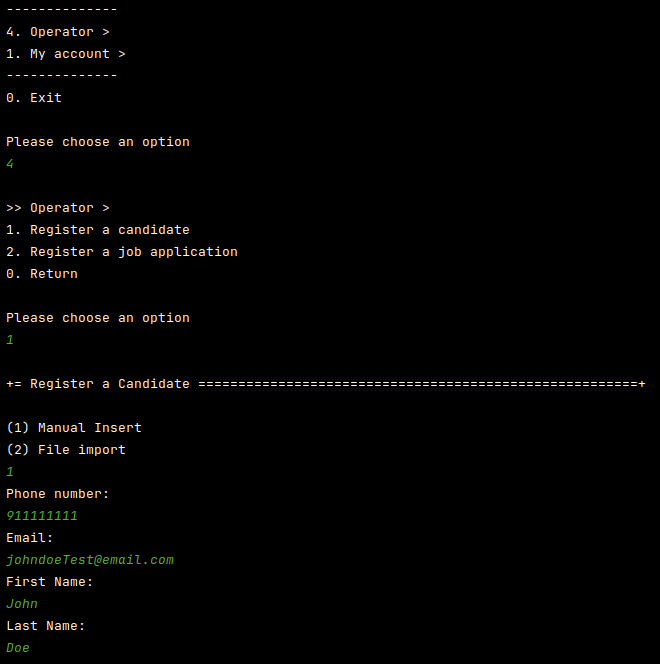
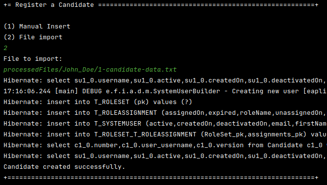

# US 2000a As Operator, I want to register a candidate and create a corresponding user.

## 1. Context

For this application's Use Case, an Operator imports files and registers applications, creating users that do not exist.
This User Story pertains to the last part of the Operator's task, especially as it is an integral part to the proper functionality of this project.
Additionally, this US was first assigned during sprint B, as such it is the first time it is being worked on.

## 2. Requirements

"**US 2000a -** As Operator, I want to register a candidate and create a corresponding user."

The implementation of this function requires the creation of a user interface that creates a user for any new candidate registered.

**Acceptance Criteria:**

- **US2000a.1** The operator should be able to discern if a candidate already exists in the system.
- **US2000a.2** The operator must be able to register a new candidate in the system.
- **US2000a.3** For any newly registered candidates, that are not already a user in the system, a new user must be created.

**Dependencies/References:**

- **G007 -** this user story requires authentication to be implemented.
- **EAPLI framework -** the framework handles user authorization.
- **Persistence -** this component relies on persistence for the creation and storage of new users in the database.

## 3. Analysis

Some conclusions were taken for the creation of this US:

- The UI takes a candidate and determines if a user already exists.
- For any candidate not in the system a new user will be registered, using an automatically generated password.
 
### Relevant Domain Model Excerpt


 
## 4. Design


### 4.1. Realization


| Interaction ID |      Which Class is Responsible for...      |           Answer            |     Justification     |
|:--------------:|:-------------------------------------------:|:---------------------------:|:---------------------:|
|       2        |        instantiating the controller         |     RegisterCandidateUI     |   Pure Fabrication    |
|       3        |        instantiating the persistence        | RegisterCandidateController |   Pure Fabrication    |
|       4        |      instantiating repository factory       |     PersistenceContext      |        Factory        |
|       5        |        instantiating user repository        |      RepositoryFactory      |        Factory        |
|       6        |     instantiating candidate repository      |      RepositoryFactory      |        Factory        |
|       11       |       request candidate registration        |     RegisterCandidateUI     | Model View Controller |
|       12       | request candidate registration from service | RegisterCandidateController | Model View Controller |
|       14       |  request candidate registration from file   |     RegisterCandidateUI     | Model View Controller |
|       15       | request candidate registration from service | RegisterCandidateController | Model View Controller |
|       17       |              extract file info              |      ImportFileService      |        Service        |
|       18       |                 return user                 |     ListUsersController     |        Service        |
|       22       |               returning roles               |      ListRolesService       |        Service        |
|       24       |               create password               |  PasswordGeneratorService   |        Service        |
|       26       |                  add user                   |       UserRepository        |        Builder        |
|       28       |               find candidate                |      CandidateService       |        Service        |
|       30       |                add candidate                |      CandidateFactory       |        Factory        |
|       32       |             present information             |     RegisterCandidateUI     | Model View Controller |

### 4.2. Class Diagram



### 4.3. Applied Patterns

- Factory
- Model View Controller
- Service
- Builder
- Layered Architecture

### 4.4. Tests


**Test 1:** *Verifies that it is not possible to create an empty or null phone number* 

```
@Test
void phoneNumberNull() {
	IllegalArgumentException exception = assertThrows(IllegalArgumentException.class, ()-> new PhoneNumber(null));
	assertEquals("Phone Number should neither be null nor empty", exception.getMessage());
}

@Test
void phoneNumberEmpty() {
	IllegalArgumentException exception = assertThrows(IllegalArgumentException.class, ()-> new PhoneNumber(""));
	assertEquals("Phone Number should neither be null nor empty", exception.getMessage());
}
```

**Test 2:** *Verifies that phone number has to be an exact length*

```
@Test
void incorrectPhoneNumberLength() {
	IllegalArgumentException exception = assertThrows(IllegalArgumentException.class, ()-> new PhoneNumber("9123"));
	assertEquals("Phone number must be 9 digits", exception.getMessage());
}
```

**Test 3:** *Verifies that phone number has the proper first digit*
```
@Test
void incorrectPhoneNumberStart() {
	IllegalArgumentException exception = assertThrows(IllegalArgumentException.class, ()-> new PhoneNumber("123456789"));
	assertEquals("Phone number must start with 9", exception.getMessage());
}
```

**Test 4:** *Verifies that phone number is formed only by digits*
```
@Test
void incorrectPhoneNumberFormat() {
	IllegalArgumentException exception = assertThrows(IllegalArgumentException.class, ()-> new PhoneNumber("92a456789"));
	assertEquals("Phone number must consist only of numbers", exception.getMessage());
}
```

**Test 5:** *Verifies that phone number is saved properly*
```
@Test
void phoneNumberSavedCorrectly() {
	String sNum = "999999999";
	PhoneNumber num =  new PhoneNumber(sNum);
	assertEquals(sNum, num.toString());
}
```


## 5. Implementation

### Relevant Implementation

**RegisterCandidateUI**
```
public class RegisterCandidateUI extends AbstractUI {
	private final RegisterCandidateController ctrl = new RegisterCandidateController();

	@Override
	protected boolean doShow() {
		final int mode = Console.readInteger("(1) Manual Insert\n(2) File import");
		String number = "999999999",
				email = "placeholder@email.com",
				firstName = "John",
				lastName = "Doe",
				file = "placeholder.txt";

		switch (mode) {
			case 1:
				number = Console.readLine("Phone number:");
				email = Console.readLine("Email:");
				firstName = Console.readLine("First Name:");
				lastName = Console.readLine("Last Name:");
				break;
			case 2:
				file = Console.readLine("File to import:");
				break;
			default:
			 	System.out.printf("Option not supported, returning.\n");
				return false;
		}

		try {
			if (mode == 2)
				this.ctrl.importCandidateInfo(file);
			else
				this.ctrl.registerCandidate(number, email, firstName, lastName);
		} catch (Exception e) {
			System.out.printf("Unexpected error, %s\n%s", e.toString(), e.getStackTrace());
		}
		return false;
	}

	@Override
	public String headline() {
		return "Register a Candidate";
	}
}
```

**RegisterCandidateController**
```
public class RegisterCandidateController {
	private final RegisterCandidateService candidateService = new RegisterCandidateService();
	private final AuthorizationService autService = AuthzRegistry.authorizationService();
	private final UserManagementService userService = AuthzRegistry.userService();
	private final ListUsersController usersController = new ListUsersController();
	private final CandidateFactory candidateFactory = new CandidateFactory();
	private final PasswordGenerator passwordGenerator = new PasswordGenerator.PasswordGeneratorBuilder()
			.useDigits(true)
			.useLower(true)
			.useUpper(true)
			.usePunctuation(true)
			.build();

	private static final Pattern EMAIL_PATTERN = Pattern.compile("^[\\w-\\.]+@([\\w-]+\\.)+[\\w-]{2,4}$"),
			NAME_PATTERN = Pattern.compile("^[\\w]+( [\\w]+)+$"),
			NUMBER_PATTERN = Pattern.compile("^[\\d]{9}$");

	private Role getCandidateRole() {
		return BaseRoles.getCandidateRole();
	}

	private String[] importFromFile(final String file) throws IOException {
		String[] info = { null, null, null, null };
		String ln;
		BufferedReader read = null;

		try {
			read = new BufferedReader(new FileReader(file));
		} catch (Exception e) {
			read.close();
			throw new FileNotFoundException();
		}
		while ((ln = read.readLine()) != null) {
			if (NUMBER_PATTERN.matcher(ln).matches()) {
				info[0] = ln.substring(0, ln.length());
			} else if (EMAIL_PATTERN.matcher(ln).matches()) {
				info[1] = ln.substring(0, ln.length());
			} else if (NAME_PATTERN.matcher(ln).matches()) {
				info[2] = ln.substring(0, ln.indexOf(" "));
				info[3] = ln.substring(ln.lastIndexOf(" ") + 1, ln.length());
			}
		}

		read.close();
		String s = "Missing Person info.";
		boolean err = false;
		for (int i = 0; i < info.length; i++) {
			if (info[i] == null) {
				switch (i) {
					case 0:
						s.concat(" Phone number not found.");
						break;
					case 1:
						s.concat(" Email not found.");
						break;
					case 2:
					case 3:
						s.concat(" Name not found.");
						break;
					default:
						break;
				}
				err = true;
			}
		}

		if (err)
			throw new IllegalArgumentException(s);
		return info;
	}

	public Candidate importCandidateInfo(final String file) {
		String[] info;
		try {
			info = importFromFile(file);
		} catch (Exception e) {
			String err = "Error reading file, either file not found or incorrect formatting.";
			err.concat(e.toString());
			throw new IllegalArgumentException(err);
		}
		return registerCandidate(info[0], info[1], info[2], info[3]);
	}

	public Candidate registerCandidate(final String number, final String email, final String firstName,
			final String lastName) {
		autService.ensureAuthenticatedUserHasAnyOf(BaseRoles.OPERATOR);
		SystemUser user = usersController.find(Username.valueOf(email)).orElse(null);
		if (user == null) {
			Random random = new Random();
			String password = passwordGenerator.generate(random.nextInt(9) + 8);
			Role role = getCandidateRole();
			Set<Role> roles = new HashSet<>();
			roles.add(role);
			user = userService.registerNewUser(email, password, firstName, lastName, email, roles);
		}
		Candidate candidate = candidateService.findByNumber(PhoneNumber.valueOf(number));
		if (candidate == null) {
			candidate = candidateFactory.newCandidate(user, PhoneNumber.valueOf(number));
			candidateService.addCandidate(candidate);
		}
		return candidate;
	}
}
```

**CandidateFactory**
```
public class CandidateFactory implements DomainFactory<Candidate> {
	private SystemUser user;
	private PhoneNumber number;

	public Candidate newCandidate(final SystemUser user, final PhoneNumber number) {
		this.user = user;
		this.number = number;
		return build();
	}

	@Override
	public Candidate build() {
		return new Candidate(this.user, this.number);
	}
}
```

**RegisterCandidateService**
```
public class RegisterCandidateService {
    private final AuthorizationService authz = AuthzRegistry.authorizationService();
    private final CandidateRepository repo = PersistenceContext.repositories().candidate();

	public Candidate findByNumber(PhoneNumber number) {
		return repo.findByNumber(number).orElse(null);
	}

	public boolean addCandidate(Candidate candidate) {
		if (candidate == null) return false;
		repo.save(candidate);
		return true;
	}

	public Iterable<Candidate> getCandidates(){
		return repo.findAllCandidate();
	}
}
```

### Relevant Commits

> **28/04/2024 [US 2000a] 22:20 -** updating readme and initial implementation
> - Created necessary UI and Controller elements
> - Created domain classes
> - Created repositories, along with updating factories

> **29/04/2024 [US 2000a] 10:51 -** implementation correction. candidate saved to database
> - Update persistence classes
> - Update candidate class

> **30/04/2024 [US 2000a] 15:13 -** adding file import functionality
> - Added file import functionality 


## 6. Integration/Demonstration

This user story required the creation of a Candidate, and an Operator that is responsible for creating them, by either manually inserting their information or by passing a document containing the necessary information. As such the following was implemented:
- a new Menu was created for the operator;
- a Candidate creation method that made use of SystemUser, having a one-to-one relation to it;
- a method to import the Candidate info from a file.

### Candidate Registration




## 7. Observations

This user story, along with a few others, required that the team came together and discussed the best way to go about connecting classes that were members of/connected with each other.