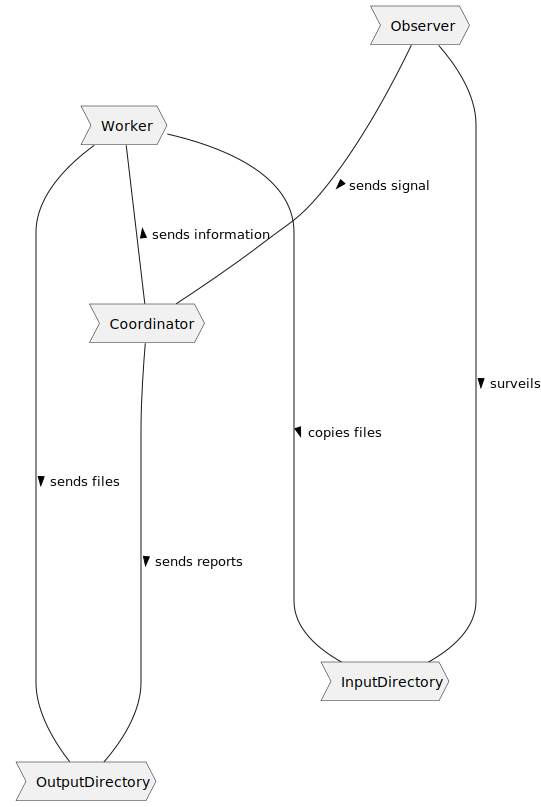
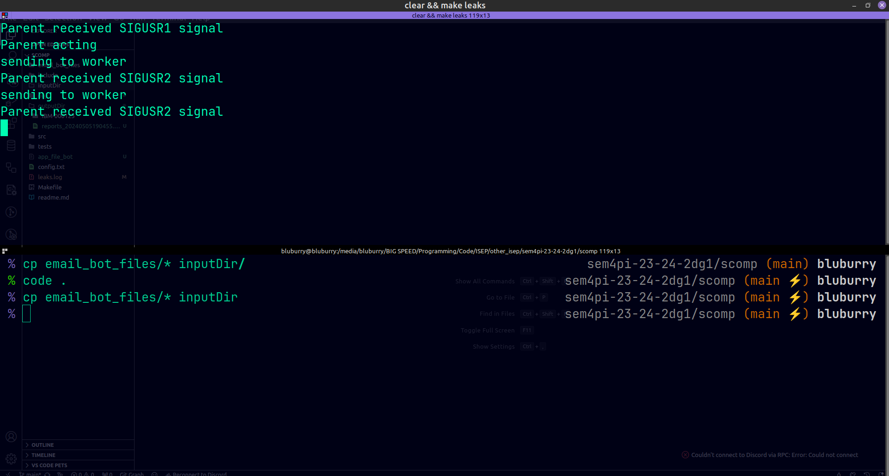
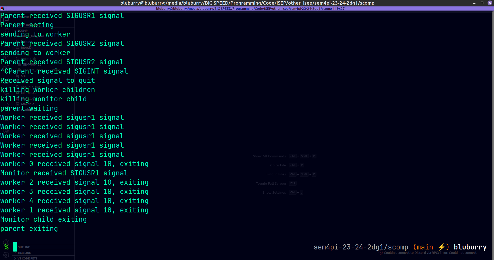
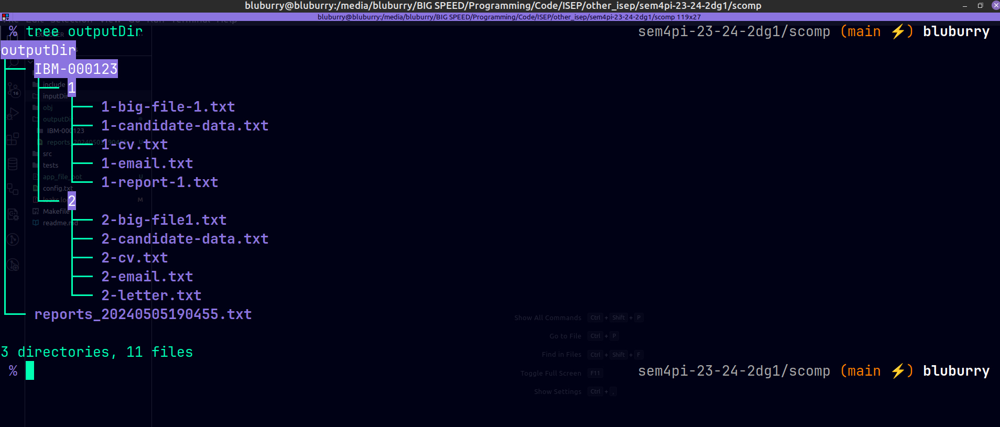
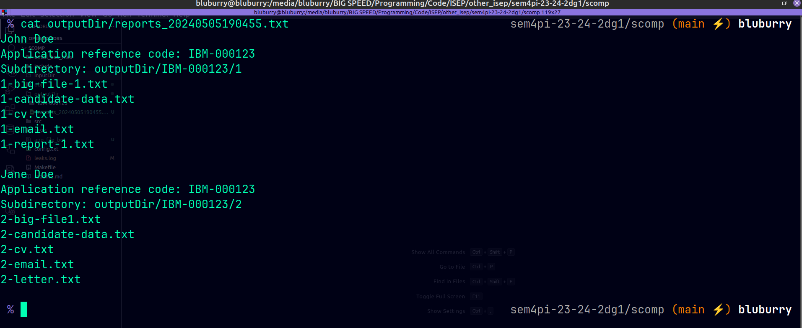

# US2001 - As Product Owner, I want the system to, continuously, process the files produced by the Applications Email Bot, so that they can be imported into the system by initiative of the Operator


## 1. Context

For this User Story the client has tasked the team with creating a bot to monitor the arrival of new files processed by the "Email File Bot" these files come in a standardized format already having been processed by the Email File Bot.
The task of this bot is to copy the files in the designated input to output directories whilst not modifying the input directory.


## 2. Requirements

"**US 2001 -** As Product Owner, I want the system to, continuously, process the files
produced by the Applications Email Bot, so that they can be imported into the system
by initiative of the Operator"

**Acceptance Criteria:**

- **2002.1.** The “Applications File Bot” must be developed in C and utilize processes, signals,
  pipes, and exec function primitives.

- **2001.2.** The names of the input and output directories, the number of worker children, the
  time interval for periodic checking of new files, etc., should be configurable.

- **2001.3.** The Bot must generate report files regarding the processing operations it executes

- **2001.4.** There can be multiple report files, each one uniquely identified by some sort of timestamp

**Dependencies/References:**

  - The only functional dependencies this User Story has are related to the Email File Bot, but as this part of the system is outside project scope this is largely discarded, although still worth noting.

## 3. Analysis

The bot will be composed of a parent process and 2 "types" of child processes, these processes have been given codenames by the team to more easily discuss the functioning of the system:
- The Parent process is the "coordinator" of the bot, it's responsibility is to receive updates when the file input directory receives new content via the "observer" child process and to inform the "worker" children processes of the work they need to perform. The coordinator is also tasked with reporting the operations performed by the Applications File Bot system.
- The "observer" is the child process delegated to the surveillance/observation of the input directory, whenever a new file is introduced to the input directory the observer will inform the coordinator that there is new information to process.
- The "workers" are the children processes delegated to the processing and reporting duties of the Application File Bot system, they will receive information from the coordinator, perform the needed actions and report back to the coordinator, after which they will be on standby awaiting new information.

The execution flow should (if there are no errors) go as follows:

- 1 - The parent process will create children (1 observer and X workers)
- 2 - All processes but the observer go on standby
- 3 - The observer will scan for new files
- 4 - The observer will send a signal to the coordinator when a new file appears in the input directory and go on standby
- 5 - The coordinator will inform the workers of the candidates that they are to process the files of
- 6 - The workers will process said new files and then send a report back to the coordinator
- 7 - The workers go on standby
- 8 - The coordinator will generate a report file based on the new information received from the workers
- 9 - If there are still candidates to be processed the  coordinator will dispatch more information to as many workers as it needs and those workers become active (return to step 6)
- 10 - Else if there are no more applications left for processing the coordinator will reactivate the observer with a signal and go on standby once again (return to step 1)

- To terminate the bot the coordinator process must handle the "SIGINT" signal as per specified in the NFR12 document, upon reception of the signal the coordinator will terminate all it's children and then itself.

Notes:
- The observer will keep and update a file containing the files in the input directory that have been processed in the current and previous iterations of the program, this file will be used by the observer and coordinator to maintain consistency between iterations of the program.
- The configuration file used to configure aspects of the system such as the number of workers and the input/output directories will only be handled by the coordinator process

## 4. Design

### 4.1. Process Diagram



### 4.2. Tests

**Clean_dir_test.c*

```
  void clean_dir_tester(const char *dir)
  {
      pid_t pid;
      int status;
  
      printf("running command: %s\n", CP_FILE);
      pid = fork();
      if (!pid)
          execl("/bin/sh", "sh", "-c", CP_FILE, (char *)NULL);
      wait(&status);
      if (!check_fls(dir))
      {
          printf("no files were created, exiting\n");
          return;
      }
      printf("running command: %s\n", LS_FILE);
      pid = fork();
      if (!pid)
          execl("/bin/sh", "sh", "-c", LS_FILE, (char *)NULL);
      wait(&status);
      printf("calling clean_dir function\n");
      clean_dir(dir);
      printf("running command: %s\n", LS_FILE);
      pid = fork();
      if (!pid)
          execl("/bin/sh", "sh", "-c", LS_FILE, (char *)NULL);
      wait(&status);
      if (!check_fls(dir))
          printf("SUCCESS: files were successfully deleted\n");
  }
```

**Create_out_test.c** 

```
void fldr_str_tester(void)
{
	char test_dir[] = "test", test_subdir[] = "subdir",
		 dir_result[] = "test/subdir";

	char *test = fldr_str(test_dir, test_subdir);

	printf("called fldr_str and got: %s, expected: %s\n", test, dir_result);
	if (!strcmp(test, dir_result))
		printf("SUCCESS: fldr_str passed test\n");
	else
		printf("FAIL: fldr_str failed test\n");
	free(test);
}

void create_app_folder_tester(void)
{
	pid_t pid;
	int status;
	char test[] = "new_subdirectory";

	printf("running command: %s, verify that directory is empty\n", LS_FILE);
	pid = fork();
	if (!pid)
		execl("/bin/sh", "sh", "-c", LS_FILE, (char *)NULL);
	wait(&status);
	printf("calling create_app_folder function with (%s, %s)\n", TEST_FLDR, test);
	if (!create_app_folder(TEST_FLDR, test))
	{
		printf("function failed, returning\n");
		return;
	}

	if (fldr_checker_subdir(TEST_FLDR, test))
		printf("SUCCESS: create_app_folder passed test\n");
	else
	{
		printf("create_app_folder failed test, returning\n");
		return;
	}

	printf("running command: %s, verify new subdir created\n", LS_FILE);
	pid = fork();
	if (!pid)
		execl("/bin/sh", "sh", "-c", LS_FILE, (char *)NULL);
	wait(&status);
	printf("calling clean_dir function\n");
	clean_dir(TEST_FLDR);
}

void create_out_tester(void)
{
	pid_t pid;
	int status;
	char test[] = "test_files/new_subdirectory";

	printf("running command: %s, verify that directory is empty\n", LS_FILE);
	pid = fork();
	if (!pid)
		execl("/bin/sh", "sh", "-c", LS_FILE, (char *)NULL);
	wait(&status);
	printf("calling create_out function with (%s)\n", test);
	if (!create_out(test))
	{
		printf("function failed, returning\n");
		return;
	}

	if (fldr_checker_subdir(TEST_FLDR, "new_subdirectory"))
		printf("SUCCESS: create_out passed test\n");
	else
	{
		printf("FAIL: create_out failed test, returning\n");
		return;
	}

	printf("running command: %s, verify new subdir created\n", LS_FILE);
	pid = fork();
	if (!pid)
		execl("/bin/sh", "sh", "-c", LS_FILE, (char *)NULL);
	wait(&status);
	printf("calling clean_dir function\n");
	clean_dir(TEST_FLDR);
}
```
**extras_test.c**
```
  void extract_app_code_test(void)
  {
      char str[] = "email_bot_files/1-candidate-data.txt";
      printf("calling extract_app_code with (%s)\n", str);
      int n = extract_app_code(str);
      printf("got %d, expected 1\n", n);
      if (n == 1)
          printf("SUCCESS: extract_app_code passed test\n");
      else
          printf("FAIL: extract_app_code failed test\n");
  }
  
  void extract_code_app_test(void)
  {
      char str[] = "email_bot_files/1-candidate-data.txt";
      printf("calling extract_code_app with (%s)\n", str);
      char *n = extract_code_app(str);
      printf("got %s, expected 1\n", n);
      if (!strcmp(n, "1"))
          printf("SUCCESS: extract_code_app passed test\n");
      else
          printf("FAIL: extract_code_app failed test\n");
      free(n);
  }
  
  void get_config_line_arg_test(void)
  {
      char str[] = "Input directory: inputDir\n",
           expected[] = "inputDir";
      printf("calling get_config_line_arg with %s", str);
      char *ret = get_config_line_arg(str);
      printf("got %s, expected %s\n", ret, expected);
      if (!strcmp(ret, expected))
          printf("SUCCESS: get_config_line_arg passed test\n");
      else
          printf("FAIL: get_config_line_arg failed test\n");
      free(ret);
  }
```
**folder_check.c**
```
  bool fldr_checker_subdir(const char *d, const char *subdir)
  {
      char path[PATH_MAX];
      struct stat st;
      struct dirent *dir_entry;
      DIR *dir = opendir(d);
  
      if (!dir)
      {
          perror("fldr_checker_subdir can't open directory");
          return (NULL);
      }
  
      while ((dir_entry = readdir(dir)))
      {
          sprintf(path, "%s/%s", d, dir_entry->d_name);
          if (stat(path, &st) == 0 && S_ISDIR(st.st_mode) && !strcmp(dir_entry->d_name, subdir))
          {
              closedir(dir);
              return (true);
          }
      }
      closedir(dir);
      return (false);
  }
  
  bool check_fls(const char *d)
  {
      int count = 0;
      char path[PATH_MAX];
      struct stat st;
      struct dirent *dir_entry;
      DIR *dir = opendir(d);
  
      // printf("d: %s\n", d);
      if (!dir)
      {
          perror("Clean_dir_tester can't open directory");
          return (NULL);
      }
  
      while ((dir_entry = readdir(dir)))
      {
          sprintf(path, "%s/%s", d, dir_entry->d_name);
          if (dir_entry->d_type == DT_REG || (stat(path, &st) == 0 && S_ISREG(st.st_mode)))
              count++;
      }
      closedir(dir);
      return (count > 0);
  }
```
**get_app_info_test.c**
```
  void get_job_ref_code_test(void)
  {
      char ref_code[] = "IBM-000123",
          fl[] = "../email_bot_files/1-candidate-data.txt";
      printf("calling get_job_ref_code with (%s)\n", fl);
      char *ret = get_job_ref_code(fl);
      printf("got: %s, expected: %s\n", ret, ref_code);
      if (!strcmp(ret, ref_code))
          printf("SUCCESS: get_job_ref_code passed test\n");
      else
          printf("FAILED: get_job_ref_code failed test\n");
      free(ret);
  }
  
  void find_data_file_test(void)
  {
      char data_file1[] = "../email_bot_files/1-candidate-data.txt",
           data_file2[] = "../email_bot_files/2-candidate-data.txt",
           fl[] = "../email_bot_files";
  
      printf("calling find_data_file with (%s, 0)\n", fl);
      char *ret = find_data_file(fl, 0);
      printf("got: %s, expected: %s\n", ret, data_file1);
      if (!strcmp(ret, data_file1))
          printf("SUCCESS: find_data_file passed test 1\n");
      else
          printf("FAILED: find_data_file failed test 1\n");
      free(ret);
  
      printf("calling find_data_file with (%s, 1)\n", fl);
      ret = find_data_file(fl, 1);
      printf("got: %s, expected: %s\n", ret, data_file2);
      if (!strcmp(ret, data_file2))
          printf("SUCCESS: find_data_file passed test 2\n");
      else
          printf("FAILED: find_data_file failed test 2\n");
      free(ret);
  
      printf("calling find_data_file with (%s, 2)\n", fl);
      ret = find_data_file(fl, 2);
      printf("got: %s, expected: null\n", ret);
      if (!ret)
          printf("SUCCESS: find_data_file passed test 3\n");
      else
          printf("FAILED: find_data_file failed test 3\n");
  }
  
  void get_application_name_test(void)
  {
      char applicant_name[] = "John Doe",
           fl[] = "../email_bot_files/1-candidate-data.txt";
      printf("calling get_job_applicant_name with (%s)\n", fl);
      char *ret = get_applicant_name(fl);
      printf("got: %s, expected: %s\n", ret, applicant_name);
      if (!strcmp(ret, applicant_name))
          printf("SUCCESS: get_applicant_name passed test\n");
      else
          printf("FAILED: get_applicant_name failed test\n");
      free(ret);
  }
```
**get_info_test.c**
```
  void get_arg_info_test(void)
  {
      char *args[] = {"app", "config_test.txt"},
           in_expected[] = "inputDir",
           out_expected[] = "outputDir",
           *in, *out;
      int n;
      printf("Calling get_arg_info\n");
      get_arg_info(2, args, &n, &out, &in);
  
      if (n == 2 && !strcmp(out, out_expected) && !strcmp(in, in_expected))
          printf("SUCCESS: get_arg_info passed test\n");
      else
          printf("FAILED: get_arg_info failed test\n");
      free(out);
      free(in);
  }
```
**validate_test.c**
```
  void valid_entry_args_test(void)
  {
      char *valid_av[] = {"app", "../inputDir", "../outputDir", "4"},
           *invalid_av1[] = {"app", "inputDir", "../outputDir", "4"},
           *invalid_av2[] = {"app", "../inputDir", "outputDir/", "4"},
           *invalid_av3[] = {"app", "../inputDir", "../outputDir", "-4"};
      
      printf("testing valid_entry_args\n");
  
      if (valid_entry_args(4, valid_av))
          printf("SUCCESS: valid_entry_args passed test 1\n");
      else
          printf("FAILED: valid_entry_args failed test 1\n");
      if (!valid_entry_args(4, invalid_av1))
          printf("SUCCESS: valid_entry_args passed test 2\n");
      else
          printf("FAILED: valid_entry_args failed test 2\n");
      if (!valid_entry_args(4, invalid_av2))
          printf("SUCCESS: valid_entry_args passed test 3\n");
      else
          printf("FAILED: valid_entry_args failed test 3\n");
      if (!valid_entry_args(4, invalid_av3))
          printf("SUCCESS: valid_entry_args passed test 4\n");
      else
          printf("FAILED: valid_entry_args failed test 4\n");
  }
```
## 5. Implementation

### Relevant Implementation

**main.c**
```
int main(int argc, char **argv)
{
	int n_workers = 0;
	char *out = NULL, *in = NULL, *report, *report_fldr;
	FILE *fl;
	// new_files = 0, stop_program = 0;
	p_sig = 0;

	// printf("%d\n%s\n%s\n%s\n", argc, argv[1], argv[2], argv[3]);
	if (!valid_entry_args(argc, argv))
	{
		printf("Invalid arguments\n");
		printf("Expected input:\n");
		printf("./program (input directory) (output directory) (number of workers)\n");
		printf("./program (config file)\n");
		printf("Example config file format: \n");
		printf("Input directory: (input directory)\n");
		printf("Output directory: (output directory)\n");
		printf("Number of worker: (number of worker)\n");
		return (0);
	}
	get_arg_info(argc, argv, &n_workers, &out, &in);
	create_out(out);
	// printf("in: %s\nout: %s\nn: %d\n", in, out, n_workers);

	pid_t monitor_pid = fork();
	if (!monitor_pid)
	{
		set_sig_monitor();
		monitor_directory(in, getppid());
		exit(1);
	}

	pid_t worker_pids[n_workers], wpid;
	int parent_pipe[2], status;
	if (pipe(parent_pipe) < 0)
	{
		perror("pipe error.");
		exit(1);
	}
	for (int i = 0; i < n_workers; i++)
	{
		worker_pids[i] = fork();
		if (!worker_pids[i])
		{
			set_sig_worker();
			worker(parent_pipe, in, out, i);
			exit(1);
		}
		close(parent_pipe[0]);
	}

	set_sig_parent();

	report = get_file_name();
	report_fldr = fldr_str(out, report);
	free(report);
	if (!(fl = fopen(report_fldr, "w")))
	{
		perror("error opening report file.");
		exit(1);
	}

	// info file contains all the necessary info
	// for whatever operations are required
	// ex.: 1-candidate-data.txt
	char *info_file;
	int apps;
	// printf("report file: %s\n", report_fldr);
	while (1)
	{
		pause();
		if (p_sig == SIGINT)
			break;
		p_sig = 0;
		printf("Parent acting\n");
		apps = 0;
		while (p_sig != SIGINT && (info_file = find_data_file(in, apps)))
		{
			printf("sending to worker\n");
			write(parent_pipe[1], info_file, strlen(info_file));
			report_handler(fl, in, out, info_file);
			free(info_file);
			if (p_sig != SIGINT)
				pause();
			apps++;
		}
		clean_dir(in);
		kill(monitor_pid, SIGUSR2);
	}

	printf("Received signal to quit\n");
	printf("killing worker children\n");
	for (int i = 0; i < n_workers; i++)
	{
		// printf("closing child %d\n", i);
		kill(worker_pids[i], SIGUSR1);
	}

	close(parent_pipe[1]);
	fclose(fl);
	if (argc == 2)
	{
		free(in);
		free(out);
	}
	free(report_fldr);
	
	printf("killing monitor child\n");
	kill(monitor_pid, SIGUSR1);
	printf("parent waiting\n");
	while ((wpid = wait(&status)) > 0)
	{
		// printf("wpid: %d, status: %d\n", wpid, status);
	}

	printf("parent exiting\n");

	return (0);
}
```
**worker.c**
```
  /**
   * @brief actual copying function
   * @param in file to copy
   * @param out new file
  */
  static void file_cpy(const char *in, const char *out)
  {
      FILE *src, *dest;
      char fl[PATH_MAX];
      size_t s;
  
      src = fopen(in, "rb");
      if (src == NULL)
      {
          perror("Worker child can't open in file");
          return;
      }
  
      dest = fopen(out, "wb");
      if (dest == NULL)
      {
          perror("Worker child can't open out file");
          fclose(src);
          return;
      }
  
      while ((s = fread(fl, 1, sizeof(fl), src)) > 0)
          fwrite(fl, 1, s, dest);
  
      fclose(src);
      fclose(dest);
  }
  
  /**
   * @brief copies files from in directory to out directory if 
   * the files match the application reference code
   * @param in input folder
   * @param out output folder
   * @param app_code application reference code
  */
  static void do_work(const char *in, const char *out, char *app_code)
  {
      DIR *dir;
      char path[PATH_MAX], in_path[PATH_MAX], out_path[PATH_MAX];
      struct stat st;
      struct dirent *s_dir;
  
      if (!(dir = opendir(in)))
      {
          perror("error opening input directory in worker child");
          exit(1);
      }
  
      while ((s_dir = readdir(dir)))
      {
          sprintf(path, "%s/%s", in, s_dir->d_name);
          // printf("dir_entry->d_name: %s, type: %d\n", s_dir->d_name, s_dir->d_type);
          if (s_dir->d_type != DT_REG && (stat(path, &st) == -1 || !S_ISREG(st.st_mode)))
              continue;
          if (strncmp(s_dir->d_name, app_code, strlen(app_code)))
              continue;
          sprintf(in_path, "%s/%s", in, s_dir->d_name);
          sprintf(out_path, "%s/%s", out, s_dir->d_name);
          file_cpy(in_path, out_path);
      }
      closedir(dir);
  }
  
  /**
   * @brief worker thread main function, waits for a read, creates
   * necessary folders and copies files from in folder to out folder
   * @param parent_pipe pipe where the parent will write
   * @param in input directory
   * @param out output directory
   * @param i worker number
   */
  void worker(int *parent_pipe, char *in, char *out, int i)
  {
      w_sig = 0;
      char file[PATH_MAX], *fldr, *last_fldr,
          *ref_code, *app_code;
      int app, n;
  
      (void)in;
      (void)out;
      close(parent_pipe[1]);
      while (!w_sig)
      {
          n = read(parent_pipe[0], file, PATH_MAX);
          file[n] = 0;
          if (n <= 0 || n >= PATH_MAX)
          {
              continue;
          }
          ref_code = get_job_ref_code(file);
          create_app_folder(out, ref_code);
          fldr = fldr_str(out, ref_code);
          app = extract_app_code(file);
          (void)app;
          app_code = extract_code_app(file);
          create_app_folder(fldr, app_code);
          last_fldr = fldr_str(fldr, app_code);
          do_work(in, last_fldr, app_code);
          kill(getppid(), SIGUSR2);
          free(ref_code);
          free(fldr);
          free(last_fldr);
          free(app_code);
      }
      close(parent_pipe[0]);
      printf("worker %d received signal %d, exiting\n", i, w_sig);
      exit(0);
  }
```
**monitor.c**
```
  /**
   * @brief utilizes inotify to watch over input directory, send a signal 
   * when a new file is created or moved into the directory
   * @param dirname directory over which function will watch
   * @param pid parent process id to send signals to
  */
  void monitor_directory(const char *dirname, const pid_t pid)
  {
      int fd, wd;
  
      m_sig = 0;
      fd = inotify_init();
      if (fd == -1)
      {
          perror("inotify_init");
          exit(EXIT_FAILURE);
      }
      // creates an inotify event that will reacted whenever 
      // a new file is created or moved into the directory
      wd = inotify_add_watch(fd, dirname, IN_MOVED_TO|IN_CREATE);
      if (wd == -1)
      {
          perror("inotify_add_watch");
          exit(EXIT_FAILURE);
      }
  
      char buf[sizeof(struct inotify_event) + NAME_MAX + 1];
      struct inotify_event *event = (struct inotify_event *)buf;
      ssize_t len;
  
      while (1 && m_sig != SIGUSR1)
      {
          len = read(fd, buf, sizeof(buf));
          if (len == -1)
          {
              if (m_sig != SIGUSR1) {
                  perror("inotify read");
                  exit(EXIT_FAILURE);
              }
              else
                  break;
          }
  
          if (event->mask & IN_CREATE || event->mask & IN_MOVED_TO)
          {
              sleep(2); // used purely to allow all the files to be copied before informing the parent process
              kill(pid, SIGUSR1);
              pause();
          }
      }
  
      if (inotify_rm_watch(fd, wd) == -1) {
          perror("inotify_rm_watch");
      }
      close(fd);
      printf("Monitor child exiting\n");
      exit(0);
  }
```

### Relevant Commits

> **05/05/2024 [US2001] 18:28** Adding Makefile, header, monitor and worker

> **05/05/2024 [US2001] 18:34** New functions implemented:
> - Get File Info;
> - Get App Info;
> - Some extras: clean_dir.c, create_out.c, extras.c.

> **05/05/2024 [US2001] 18:40** Signals and validate added

## 6. Integration/Demonstration






## 7. Observations

This user story was done by all the members of the team and, as such, any decision made during the development
was written down in the following document: [Team Planning Decisions](../team-planning-decisions.md)