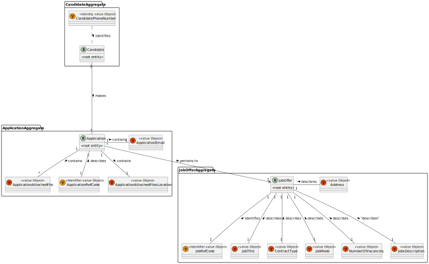
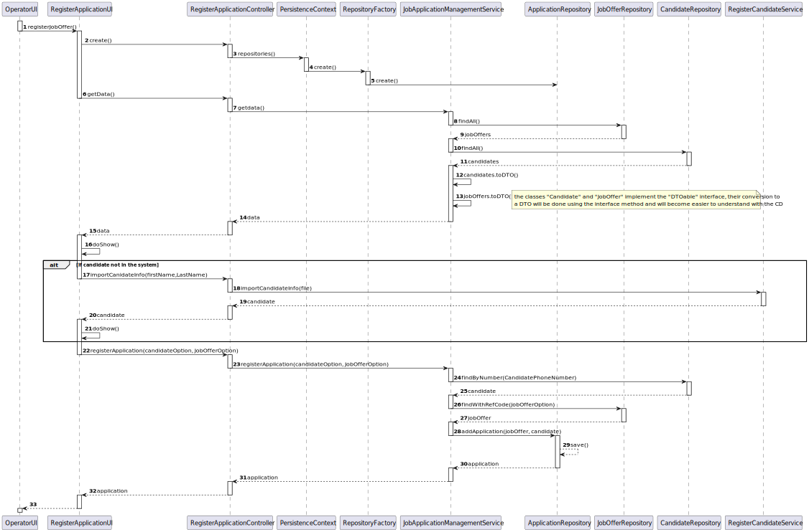
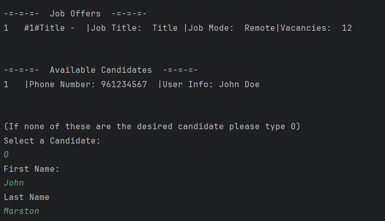
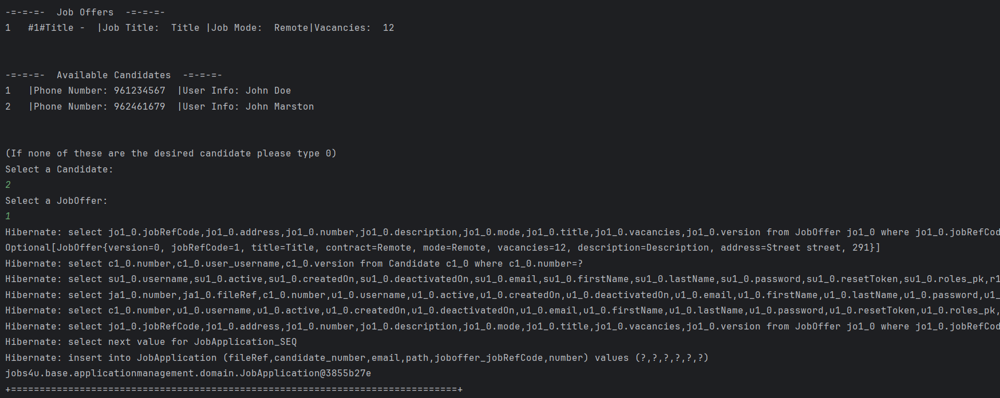

# US 2002 - As Operator, I want to register an application of a candidate for a job opening and import all files received.

## 1. Context

The client has tasked the team with the job of enabling the operator to register the application of a candidate to a job offer, this application implies the importing of all information in the files processed by the Application Files Bot pertaining to this application. 

## 2. Requirements

"**US 2002 -** As Operator, I want to register an application of a candidate for a job opening and import all files received."

**Acceptance Criteria:**

- **US2002.1.** When importing the files related to the application the files should be kept in the shared folder, but the Backoffice application needs to know the references to the file locations.

- **US2002.2.** All files related to an application must be registered in the system.

- **US2002.3.** When the application being registered is regarding a candidate that does not exist they should be registered in the system first, this registration is performed using the data in the applications sent in the application email.

**Dependencies/References:**

 - **US2000a -** This User Story's implementation included the coding of a service that will be repurposed for this US to avoid code duplication, the responsible for it also created the Candidate
 - **US1002  -** This User Story's assignee was responsible for creating the JobOffer class Entity and all the classes of the value objets of it's aggregate

## 3. Analysis

The operator should only be able to register a Job Application if there is at least 1 open job offer in the system.



## 4. Design

### 4.1. Realization



|   Which Class is Responsible for...   |             Answer              |  Justification (With Patterns)  |
|:-------------------------------------:|:-------------------------------:|:-------------------------------:|
|     instantiating the controller      |      RegisterApplicationUI      |        Pure Fabrication         |
|      retrieving the repositories      |       PersistenceContext        |        Pure Fabrication         |
|       creating the repositories       |        RepositoryFactory        |             Factory             |
|     communicating with the domain     | JobApplicationManagementService | Service / Layered Architecture  |
|        knowing the job offers         |       JobOfferRepository        | InformationExpert / Repository  |
|         knowing the candidate         |       CandidateRepository       | InformationExpert / Repository  |
| saving and persisting the application |    JobApplicationRepository     | InformationExpert / Repository  |


### 4.2. Class Diagram


### 4.3. Applied Patterns

- Root Entity
- Entity
- Value Object
- Builder
- DTO
- Repository
- MVC
- Layered Architecture

> Note: The DTO pattern is applied using the DTOParser interface.

### 4.4. Tests

**Test 1:** Test SetUp
```     
    public void setUp() {
        applicationBuilder = new ApplicationBuilder();
        email = new ApplicationEmail("blah blah blah \n\n blah blah blah");
        filesPath = new ApplicationFilesPath("path/to/files/");
        attachedFile = new ApplicationAttachedFile("resume.pdf");

    }
````

**Test 2:** Test email is built correctly
```
    @Test
    void withEmail() {
        setUp();
        applicationBuilder.withEmail(email);
        assertEquals(email, applicationBuilder.getEmail());
    }
````

**Test 3:**Test path is built correctly under right conditions
```
    @Test
    void withFilesPath() {
        setUp();
        applicationBuilder.withFilesPath(filesPath);
        assertEquals(filesPath, applicationBuilder.getFilesPath());
    }
````

**Test 4:** Test malicious path is handled
```
    @Test
    void withFilesPathFake(){
        setUp();
        try{
            filesPath = new ApplicationFilesPath("no");
            applicationBuilder.withFilesPath(filesPath);
            assertEquals(filesPath, applicationBuilder.getFilesPath());
        }catch (Exception e){
            assertEquals(e.getMessage(), "[ERROR] - Not a valid directory.");
        }
    }
````

**Test 5:** Test attached file is built correctly
```
    @Test
    void withAttachedFile() {
        setUp();
        applicationBuilder.withAttachedFile(attachedFile);
        assertEquals(attachedFile, applicationBuilder.getAttachedFile());
    }
````

**Test 6:** Check if malicious Build is handled
```
    @Test
    public void buildWithMissingData() {
        setUp();
        applicationBuilder.withEmail(email)
                .withFilesPath(filesPath)
                .withAttachedFile(attachedFile);
        try {
            applicationBuilder.build();
        } catch (IllegalStateException e) {
            // Verify that the exception message is correct
            assertEquals("Application Builder Failed!", e.getMessage());
            return;
        }
        // If the exception is not thrown, fail the test
        fail("Expected IllegalStateException was not thrown");
    }
````

## 5. Implementation

### Code Implementation:
**RegisterApplicationUI:**
```
public class RegisterApplicationUI extends AbstractUI {
    RegisterJobApplicationController ctrl = new RegisterJobApplicationController();

    @Override
    protected boolean doShow() {
        List<Iterable> data = ctrl.getData();
        ArrayList<JobOfferDto> offers = (ArrayList<JobOfferDto>) data.get(0);

        if(offers.isEmpty() || offers.size() == 0){
            System.out.println("\n\nThere are no open Job Offers. Please try again later.\n");
        }

        ArrayList<CandidateDto> candidates = (ArrayList<CandidateDto>) data.get(1);
        System.out.println("\n\n-=-=-=-  Available Candidates  -=-=-=-");
        int i=0;
        for(CandidateDto c : candidates){
            i++;
            System.out.println(i + "   |Phone Number: " + c.getPhoneNumber() + "  |User Info: " + c.getUserInfo());
        }
        i=0;
        System.out.println("\n\n-=-=-=-  Job Offers  -=-=-=-");
        for(JobOfferDto j : offers){
            i++;
            System.out.println( (i+ "   #" + j.getRefCode() +"#"+ j.getTitle() + " - " + " |Job Title:  " + j.getTitle() + " |Job Mode:  " + j.getJobMode() + "|Vacancies:  " + j.getNumberVacancies()));
        }

        System.out.println("\n\n(If none of these are the desired candidate please type 0)");
        String candidateOption = Console.readLine("Select a Candidate: ");

        if(!candidateOption.equals("0")){
            candidateOption = candidates.get(Integer.parseInt(candidateOption)-1).getPhoneNumber();
        }else{
            ctrl.importCandidateInfo(Console.readLine("First Name:") + "_" + Console.readLine("Last Name"));
            doShow();
            return true;
        }
        String jobOption = Console.readLine("Select a JobOffer: ");

        jobOption = offers.get(Integer.parseInt(jobOption)-1).getRefCode();

        JobApplication app  = ctrl.createJobApplication(jobOption,candidateOption);

        System.out.println(app.toString());

        return true;
    }

    @Override
    public String headline() {
        return "Register a Job Application";
    }
}
````

**RegisterJobApplicationController:**
```
public class RegisterJobApplicationController {
    private final RegisterJobOfferService jobOffsvc = new RegisterJobOfferService();
    private final RegisterCandidateService candidatesvc = new RegisterCandidateService();
    private JobApplicationManagementService jobAppsvc = new JobApplicationManagementService();

    public JobApplication createJobApplication(String jobOption, String candidateOption){
        Optional<JobOffer> jobOffer = jobOffsvc.findByRef(new JobRefCode(Integer.parseInt(jobOption)));
        System.out.println(jobOffer.toString());


        if(jobOffer.isPresent()){
            if(isInteger(candidateOption)){
                Optional<Candidate> candidate = Optional.of(candidatesvc.findByNumber(new PhoneNumber(candidateOption)));
                return jobAppsvc.addApplication(jobOffer.get(), candidate.get());
            }else{

                return jobAppsvc.addApplication(jobOffer.get(), candidateOption);
            }
        }else{
            throw new IllegalStateException("Job Offer does not exist");
        }
    }

    public List<Iterable> getData(){
        return jobAppsvc.getData();
    }


    public static boolean isInteger(String str) {
        try {
            Integer.parseInt(str);
            return true;
        } catch (NumberFormatException e) {
            return false;
        }
    }

    public Candidate importCandidateInfo(String lastName) {
        return candidatesvc.importCandidateInfo(Console.readLine("First Name:") + "_" + Console.readLine("Last Name"));

    }
}
````

### Commits:
>**[US2002] -** Documentation Design (28/04/2023 12:02)

>**[US2002] -** Design Correction (29/04/2024 14:31)

>**[US2002] -** Design Progression and Tests for TDD (this commit is expected to not pass the workflow) (30/04/2024 11:36)

>**[US2002] -** Implementation First Iteration (passes all tests but needs better UI presentation formatting and is missing a functionality due to pending dependency) (30/04/2024 11:39)


## 6. Integration/Demonstration

Here is a brief demonstration of the automatic candidate creation feature.

When an operator doesn't see the candidate that he wants to make a job application for in the UI, he can opt to instead type in their first and last name. This will initiate a procedure in the program where it looks for the information of the candidate in the application files processed by the bot and creates a new candidate with the information found about the person.

The UI will then show the operator the prompt again.







## 7. Observations

There were some troubles with desync of repository instances in the services that needed to be solved, but besides that nothing really worth pointing out