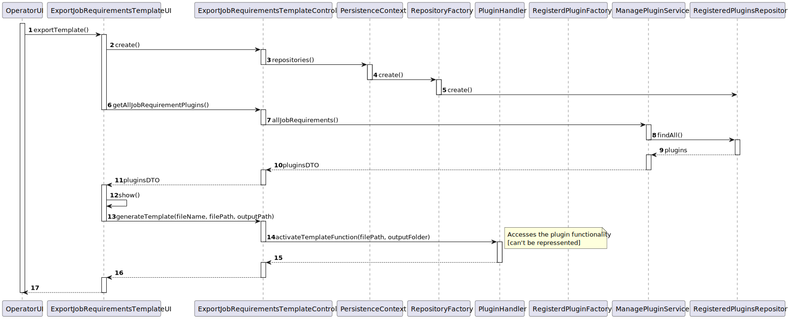
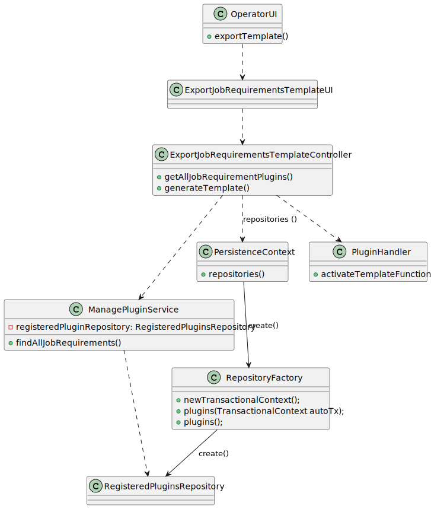

# US 2003 - As Operator, I want to generate and export a template text file to help collect data fields for candidates of a job opening (so the data is used to verify the requirements of the job opening).


## 1. Context

This is the first time this tasked is assigned. It is a subject specific US, where it will be necessary to follow specific technical requirements specified in LPROG and use ANTLR tool (which was already implemented in the US G003).

This is a follow-up task of US1008, since it will implement a functionality already created in there.

## 2. Requirements

"**US 2003 -** As Operator, I want to generate and export a template text file to help collect data fields for candidates of a job opening (so the data is used to verify the requirements of the job opening)."

**Acceptance Criteria:**

- **US2003.1.** The Operator should choose what template he wants to download from the available plugins.
- **US2003.2.** The Operator should be able to choose where to download the file.
- **US2003.2.** The Operator can only access "Job Requirement Plugins".

**Dependencies/References:**

- ""NFR09(LPROG) - Requirement Specifications and Interview Models The support
  for this functionality must follow specific technical requirements, specified in LPROG.
  The ANTLR tool should be used (https://www.antlr.org/)."

## 3. Analysis

This task doesn't require a lot of discussion from the team. As previously mentioned in the context, this task will re-implement a functionality already created for the Language Engineer.
But this time, this access will be given to the Operator, so it will be more restrict.

Following the written acceptance criteria:
- We need to create a UI that enables the download functionality from a specific plugin.
  - This plugins can only be the "Job Requirement Plugins".
- The Operator will be able to decide where he wants to download the template.

## 4. Design

### 4.1. Realization

#### Operator Export Template



| Interaction ID |                Which Class is Responsible for...                 |                 Answer                  | Justification (With Patterns) |
|:--------------:|:----------------------------------------------------------------:|:---------------------------------------:|:-----------------------------:|
|       2        |                   instantiating the controller                   |     ExportJobRequirementsTemplateUI     |       Pure Fabrication        |
|       3        |                instantiating persistence context                 | ExportJobRequirementsTemplateController |       Pure Fabrication        |
|       4        |               instantiating the repository factory               |           PersistenceContext            |            Factory            |
|       5        |               instantiating the plugin repository                |            RepositoryFactory            |            Factory            |
|       6        |    requesting the "job requirements" plugins in the database     |     ExportJobRequirementsTemplateUI     |              MVC              |
|       7        |    requesting the "job requirements" plugins in the database     | ExportJobRequirementsTemplateController |              MVC              |
|       8        |     searching the "job requirements" plugins in the database     |           ManagePluginService           |            Service            |
|       9        |      getting the "job requirements" plugins in the database      |       RegisteredPluginsRepository       |          Repository           |
|       10       |    returning the "job requirements" plugins from the database    |           ManagePluginService           |            Service            |
|       11       |    returning the "job requirements" plugins from the database    | ExportJobRequirementsTemplateController |              MVC              |
|       12       | showing the "job requirements" plugins available in the database |     ExportJobRequirementsTemplateUI     |       Pure Fabrication        |
|       13       |           requesting the generation of a template file           |     ExportJobRequirementsTemplateUI     |              MVC              |
|       14       |   activating the generation of a template file from the plugin   | ExportJobRequirementsTemplateController |              MVC              |
|       15       |                                -                                 |                    -                    |               -               |
|       16       |                                -                                 |                    -                    |               -               |
|       17       |                                -                                 |                    -                    |               -               |


### 4.2. Class Diagram



### 4.3. Applied Patterns

- Aggregate
- Entity
- Value Object
- Service
- MVC
- Layered Architecture
- DTO

### 4.4. Tests

**Test 1:** Verifies if the Handler can activate the Template Function [Successful Test].
```
    @Test
    void activateTemplateFunctionSuccessfully() {
        PluginHandler handler = new PluginHandler();

        int exitCode = handler.activateTemplateFunction("C:\\Users\\Utilizador\\ISEP\\2_Ano\\2_Semestre\\SEM4PI\\sem4pi-23-24-2dg1\\lib\\InterviewPlugin-Lifeguard.jar", "C:\\Users\\Utilizador\\ISEP\\2_Ano\\2_Semestre\\SEM4PI\\sem4pi-23-24-2dg1\\exportedfiles\\");

        assertEquals(0,exitCode);
    }
````

**Test 2:** Verifies if the Handler can activate the Template Function [Unsuccessful Test - Incorrect Path].
```
    @Test
    void activateTemplateFunctionUnsuccessfully_IncorrectPath() {
        PluginHandler handler = new PluginHandler();

        int exitCode = handler.activateTemplateFunction("lib/InterviewPlugin-Lifeguard.jar", "C:\\Users\\Utilizador\\ISEP\\2_Ano\\2_Semestre\\SEM4PI\\sem4pi-23-24-2dg1\\exportedfiles\\");

        assertEquals(1,exitCode);
    }
````


## 5. Implementation

### Code Implementation Examples:
Simplified versions of the code (not with all the code implemented).

**ExportJobRequirementsTemplateUI:**
```
public class ExportJobRequirementsTemplateUI extends AbstractUI {

    private final ExportJobRequirementsTemplateController controller = new ExportJobRequirementsTemplateController();

    @Override
    protected boolean doShow() {
        List<RegisteredPluginDTO> plugins = (ArrayList) controller.getAllJobRequirementPlugins();
        int choice = -1, numberOfPlugins = 0;
        System.out.println("Please pick one of these plugins:");
        for (RegisteredPluginDTO p : plugins) {
            numberOfPlugins++;
            System.out.println(numberOfPlugins + ". -> " + p.toString());
        }
        if (numberOfPlugins == 0) {
            System.out.println("Currently, there are no plugins registered in the system.");
            return false;
        }
        do {
            choice = Console.readInteger("\nPlugin number:");
            if (choice < 0 || choice > numberOfPlugins) {
                System.out.println("Invalid choice. Try again.");
            }
        } while (choice < 0 || choice > numberOfPlugins);

        String answer;
        do {
            answer = Console.readLine("Please write the folder path you wish to save the template. Remember, it has to end with \\.");
            if (!answer.endsWith("\\")){
                System.out.println("[Error] Doesn't end with \\. Try again.");
            }
        } while (!answer.endsWith("\\"));

        controller.generateTemplate(plugins.get(choice-1).getFileName(),plugins.get(choice-1).getFolderPath(),answer);

        return false;
    }

    @Override
    public String headline() {
        return "Export a Job Requirement Template";
    }
}
````

**ExportJobRequirementsTemplateController:**
```
public class ExportJobRequirementsTemplateController {
    private ManagePluginService service = new ManagePluginService();

    private PluginHandler handler = new PluginHandler();

    public Iterable<RegisteredPluginDTO> getAllJobRequirementPlugins() {
        return service.allJobRequirements();
    }

    public void generateTemplate(String fileName, String filePath, String outputPath){
        handler.activateTemplateFunction(filePath+fileName,outputPath);
    }

}
````

**ManagePluginService:**
```
public class ManagePluginService {

    private final RegisteredPluginsRepository repo = PersistenceContext.repositories().plugins();

    public boolean addPlugin(RegisteredPlugin plugin) {
        if(plugin == null){ return false; }
        repo.save(plugin);
        return true;
    }

    public Iterable<RegisteredPlugin> allPlugins() {
        return this.repo.findAll();
    }

    public Iterable<RegisteredPluginDTO> allPluginsDTO(){
        Iterable<RegisteredPlugin> plugins = allPlugins();
        List<RegisteredPluginDTO> ret = new ArrayList<>();
        for (RegisteredPlugin plugin : plugins) {
            ret.add(plugin.toDTO());
        }
        return ret;
    }

    public Iterable<RegisteredPluginDTO> allInterviewPlugins() {
        ArrayList<RegisteredPluginDTO> set = new ArrayList<>();
        Iterable<RegisteredPlugin> it = repo.findAllInterviews();

        for( RegisteredPlugin p : it){
            set.add(p.toDTO());
        }

        return set;
    }

    public Iterable<RegisteredPluginDTO> allJobRequirements() {
        ArrayList<RegisteredPluginDTO> set = new ArrayList<>();
        Iterable<RegisteredPlugin> it = repo.findAllJobRequirements();

        for( RegisteredPlugin p : it){
            set.add(p.toDTO());
        }

        return set;
    }
}
````

**PluginHandler:**
```
public class PluginHandler {

    public int activateTemplateFunction(String pluginFilePath, String outputFolder) {
        try {
            String[] command = {"java", "-jar", pluginFilePath, "-template", outputFolder};

            ProcessBuilder processBuilder = new ProcessBuilder(command);
            Process process = processBuilder.start();

            int exitCode = process.waitFor();
            System.out.println("Template command executed. Process exited with code: " + exitCode);
            return exitCode;
        } catch (IOException | InterruptedException e) {
            e.printStackTrace();
        }
        return -1;
    }

    public int activateEvaluationFunctions (String pluginFilePath, String candidateInput){
        try {
            String[] command = {"java", "-jar", pluginFilePath, "-evaluate", candidateInput};

            ProcessBuilder processBuilder = new ProcessBuilder(command);
            Process process = processBuilder.start();

            InputStream inputStream = process.getInputStream();
            BufferedReader reader = new BufferedReader(new InputStreamReader(inputStream));
            String line;
            System.out.println("Evaluation output:");

            while ((line = reader.readLine()) != null) {
                System.out.println(line);
            }

            int exitCode = process.waitFor();
            System.out.println("Evaluation command executed. Process exited with code: " + exitCode);

            return exitCode;

        } catch (IOException | InterruptedException e) {
            e.printStackTrace();
        }
        return -1;
    }

}
````


### Main Commits:
> **4/05/2024 17:30 [US2003]** Implementation Done:
> - Creation of the UI and Controller;
> - Update in the RegisteredPluginsRepository to have a find specific for JobRequirements plugins.

## 6. Integration/Demonstration


## 7. Observations

This US uses a lot of the same code made in the US1008, since its only a restricted use of a functionality created there.