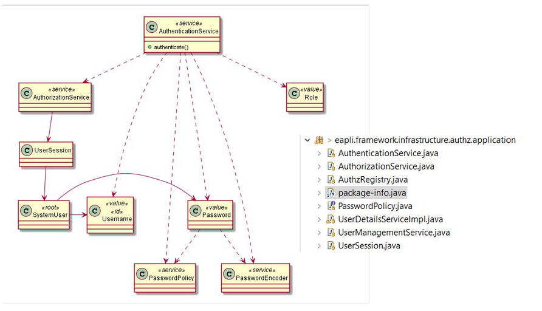
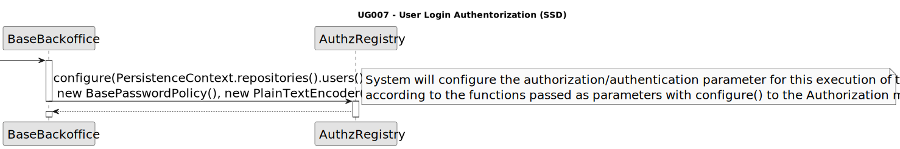
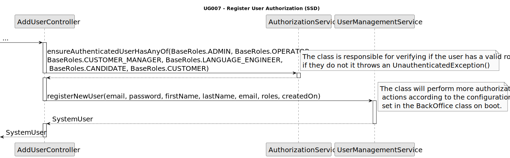
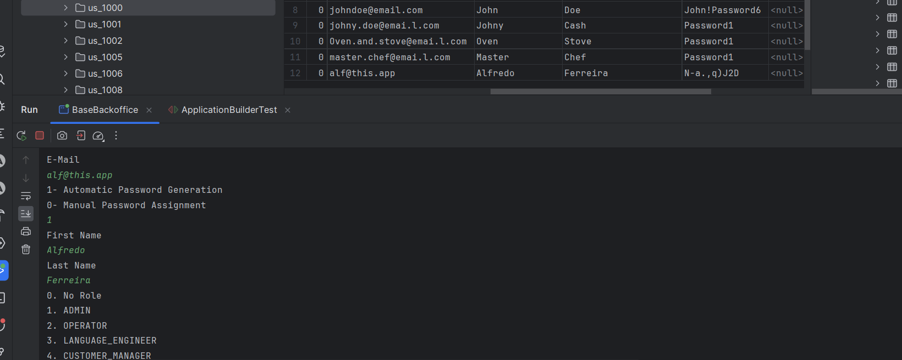

# G007 - As a Project Manager, I want the system to support and apply authentication and authorization for all its users and functionalities.
## 1. Context

The project manager intends for there to be authentication and authorization of users. This means that whenever a user is registered into the database or performs the login operator there must be operations performed by the system to guarantee that this user is indeed verified in the system and gets access to the correct information.

## 2. Requirements


**US G007 -** As a Project Manager, I want the system to support and apply authentication and authorization for all its users and functionalities.

**Acceptance Criteria:**

- **G007.1** The user must be authenticated via information matching with the database when the login operation is performed.

- **G002.2.** The user must be given authorization to access their respective UI/s **only** when authentication is successfully.

- **G002.3.** There should be no duplicate users in the database


**Dependencies/References:**
- None specified.


## 3. Analysis

This User Story will greatly benefit from the already implemented framework provided by the EAPLI teachers, this framework provides a subset of classes contained in the package "jobs4u.base.infrastructure.authz" that contain dependencies to the classes in the eapli framework, these classes will perform most of the heavy lifting when it comes to processing authorization requests and the trade of information with the relational db for verification purposes.

There will be 1 major change done to the way that the users are verified by this module, the program will not do any authentication when it comes to the username of the user since this field is going to be deprecated come the implementation of this US


## 4. Design

The class structure of the framework is as follows:



These classes' structure is as desired however we will perform some changes in these in order to fully


### 4.1. Sequence Diagrams

The authorization and authentication of users is divided and spreadout in a few sections of the package, these functions are also called in different locations at different times during the program's lifecycle, they are as follow, here are the sequence diagrams of these processes for easier understanding.

**The configuration of the authorization handler:**



**The Authentication process:**



### 4.2. Applied Patterns

 - Entity
 - ValueObject
 - Aggregate
 - MVC

### 4.3 Test

Could not implement tests for this UserStory as all it's features are in the framework.

## 5. Implementation

### Code Implementation
```
    public final class BaseRoles {
    /**
     * poweruser
     */
    public static final Role POWER_USER = Role.valueOf("POWER_USER");
    /**
     * Utente
     */

    /**
     * Base Administrator
     */
    public static final Role ADMIN = Role.valueOf("ADMIN");

    public static final Role CANDIDATE = Role.valueOf("CANDIDATE");

    public static final Role OPERATOR = Role.valueOf("OPERATOR");

    public static final Role CUSTOMER = Role.valueOf("CUSTOMER");


    /**
     * get available role types for adding new users
     *
     * @return
     */
        public static Role[] nonUserValues() {
            return new Role[] { ADMIN, CANDIDATE, OPERATOR, CUSTOMER};
        }
    }
````
```
    public SystemUser addUser(final String username, final String password, final String firstName,
        final String lastName,
        final String email, final Set<Role> roles, final Calendar createdOn) {
        authz.ensureAuthenticatedUserHasAnyOf(BaseRoles.POWER_USER, BaseRoles.ADMIN, BaseRoles.OPERATOR, BaseRoles.CANDIDATE, BaseRoles.OPERATOR);


        return userSvc.registerNewUser(email, password, firstName, lastName, email, roles,
                createdOn);
    }

    public SystemUser addUser(final String username, final String password, final String firstName,
            final String lastName,
            final String email, final Set<Role> roles) {
        return addUser(username, password, firstName, lastName, email, roles, CurrentTimeCalendars.now());
    }
````

### Commits:
>**[G007] -** Implementation Correction due to test (20/04/2024 at 20:23)

>**[G007] -** IMPLEMENTATION AND TESTS (20/04/2024 at 18:11)

>**[G007] -** Addition of Roles (20/04/2024 at 15:59)

>**[G007] -** User Story Documentation (20/04/2024 at 15:43)


## 6. Integration/Demonstration

The Domain/Persistence part of the user story was already completely implemented by the framework so the implementation was mostly done in the sense of creating user interfaces.




## 7. Observations
Considering the service that handled all the operations with the users was framework sided it was basically impossible to develop tests for these functionalities as they all call upon methods from that service.

The EAPLI Framework authorization cut down the development time for this US drastically