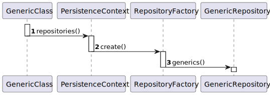

# Team Planning Decisions

In this file, the team registers decisions made during meetings and records interactions that may affect the content
of the project, for example: shared feedback, shift of work focus and help shared between peers.

## Project Decisions

### Task Division

The team divided every task equally between each member **according to the subjects** that each member has. This means that **there are some subjects that won't be done by all elements**, to accommodate the US discrepancy, but those will be **discussed and explained** by the members that did make them.

The team also created new tasks to register the work done for necessary updates to do to the previously done functionalities. These **aren't revisits to previous USs**, because **all the functionalities are already implemented as it was required**. These are upgrades that are required to be done to **accommodate the new given User Stories**. The assigned tasks were:

   - **US 7000** "*Update to functionalities done in the previous Sprint.*" - Global Task - Every time a UI is required to be updated or a controller or something that isn't worthy of being its own US, that change will be targeted to this US.
   - **US 7001** "*Update to the previous plugins.*" - Alfredo Ferreira - Although all the functionalities of the plugins are working and are correct, after some feedback from the teachers, there will be implemented a new approach (documented in the project decisions).
   Since the plugins are out-of-scope, this is a new US.
   - **US 7002** "*Update to the applications.*" - João Botelho - There are new functionalities that the applications will need to have, and for that we need to add new elements to the application objects to accommodate them.
   The applications aren't tied to a single US that we can revisit, so this is a new US.
   - **US 7003** "*Update to the Application Files Bot code.*" - Tiago Silva - This is a complementary US. After the delivery of the previous sprint, there were a few small updates that could be made to improve the efficiency of the code.
   These improvements were already made by Tiago to implement in the bot, before we knew we had to remake the bot with new code specifications, so this US serves to document those changes.

Since there was a US missing, and since there was one element that didn't have a "created User Story", the missing US went to that element (Ricardo Dias).

### Plugins Decision

The plugins required some attention from the team this sprint. Although the client requirements were met in the previous sprint, the resolution method was not how the LPROG teacher wanted.

So, we had to change how the plugins work, and how to interact with them:
- For now one, there will always be only **one** plugin that can interact with different *symbol tables* that will act as the new "plugins".
  - Each Symbol Table will contain - *type of question*, *question*, *possible answers*, *value for each answer*.
  This will be the format for either the interview models or the requirement models.
    - The **type of the question** will define the way to evaluate the answer.
    - The **question** is the question that will be presented in the template for that model.
    - The **possible answers** will depend on the type of question and will display the intended responses.
    - The **value for each answer** will determine how an answer will be evaluated. In the interviews, this value will represent the final grade. In the requirements, this is represented if a requirement is met (1 = meets requirement / 0 = does not meet requirement).
- The main plugin will have 3 functionalities, global to every symbolTable:
  - **Validation:** Checks if the file has the correct syntax to be analysed. This was already possible by checking the other 2 processes return any errors. Now, there's a dedicated functionality to test that.
  - **Template:** Creates a template with the questions of the symbol Table.
  - **Evaluation:** Grades / Validates the file with the parameters of the symbolTable.

### Repository Creation Process

Since this process is repetead in every task that requires the access of the repositories, the team decided to create a generic "repository creation process" to reduce the redundancy in-between USs.

### Non-specified Object Restrictions

There are many attributes for certain objects that don't present a specific restriction on the project description and that are too insignificant to ask the client.
This decisions will be recorded here to make it easier to know which restrictions were made and what needs to be changed.

- **(RecruitmentPhase) phaseDatePeriod:** Should follow this format > 11/11/2000-12/12/2000
- **Application State:** Can be one of this states > OPEN, PROCESSING, MR, DNMR, GRADED, ACCEPTED, REJECTED.

## Meetings

> **14/05/2024 15h00**
> This meeting was the first one of this sprint. The main idea was to discuss the USs, what was necessary to be done, and how to divide them.
> 
> **User Story Analysis:**
> - Our first job was to check the dependencies between tasks. Some might need to be done first, to be possible to create others.
> This was done by the Scrum Master, Ricardo Dias, who made a priority list to know which need to have special attention. 
> The main ones (that can be resumed here) are:
>   - **US 1015** "*As Customer Manager, I want to execute the process of verification of requirements of applications for a job opening.*" - Required to be done for US1016.
>   - **US 1018** "*As Customer Manager, I want to execute the process that evaluates (grades) the interviews for a job opening.*" - Required to be done to for US1019 and US1020.
>   - **US 1017** "*As Customer Manager, I want to upload a text file with the candidate responses for an interview.*" - Required to be done for US1018.
> 
> - We also created new US that task necessary updates to do to the previously done functionalities. These aren't revisits to previous USs, because all the functionalities are already implemented as it was required.
> These are upgrades that are required to be done to accommodate the new given User Stories. The assigned tasks were:
>   - **US 7000** "*Update to functionalities done in the previous Sprint.*" - Global Task - Every time a UI is required to be updated or a controller or something that isn't worthy of being its own US, that change will be targeted to this US.
>   - **US 7001** "*Update to the previous plugins.*" - Alfredo Ferreira - Although all the functionalities of the plugins are working and are correct, after some feedback from the teachers, there will be implemented a new approach (documented in the project decisions).
>   Since the plugins are out-of-scope, this is a new US.
>   - **US 7002** "*Update to the applications.*" - João Botelho - There are new functionalities that the applications will need to have, and for that we need to add new elements to the application objects to accommodate them. 
>   The applications aren't tied to a single US that we can revisit, so this is a new US.
>   - **US 7003** "*Update to the Application Files Bot code.*" - Tiago Silva - This is a complementary US. After the delivery of the previous sprint, there were a few small updates that could be made to improve the efficiency of the code.
>   These improvements were already made by Tiago to implement in the bot, before we knew we had to remake the bot with new code specifications, so this US serves to document those changes. 
> 
> - Lastly, we divided the USs equally between each other. The only main problems to document were:
>   - One of our elements doesn't have RCOMP, so there are a few USs that can't be assigned to him. This subject is the one with the most USs, so our division focused in giving mostly the same workload between each other, while giving a little bit less to that element. 
>   This means that there are some subjects that won't be done by all elements, to accommodate the US discrepancy, but those will be discussed and explained by the members that did make them.
>   - Since there was a US missing, and since there was one element that didn't have a "created User Story", the missing US went to that element (Ricardo Dias).
