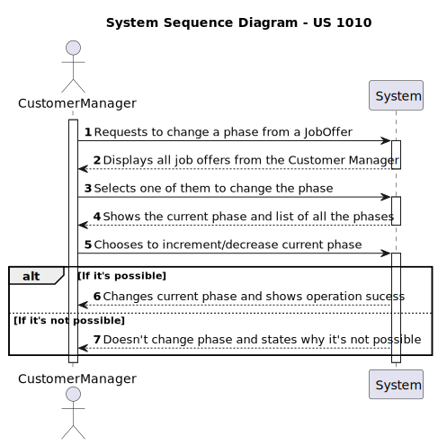
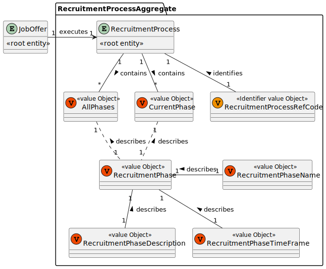
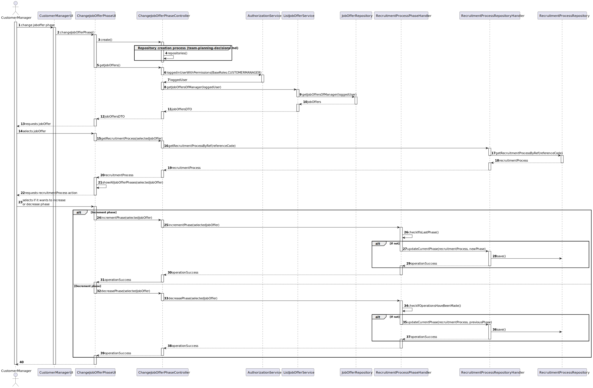
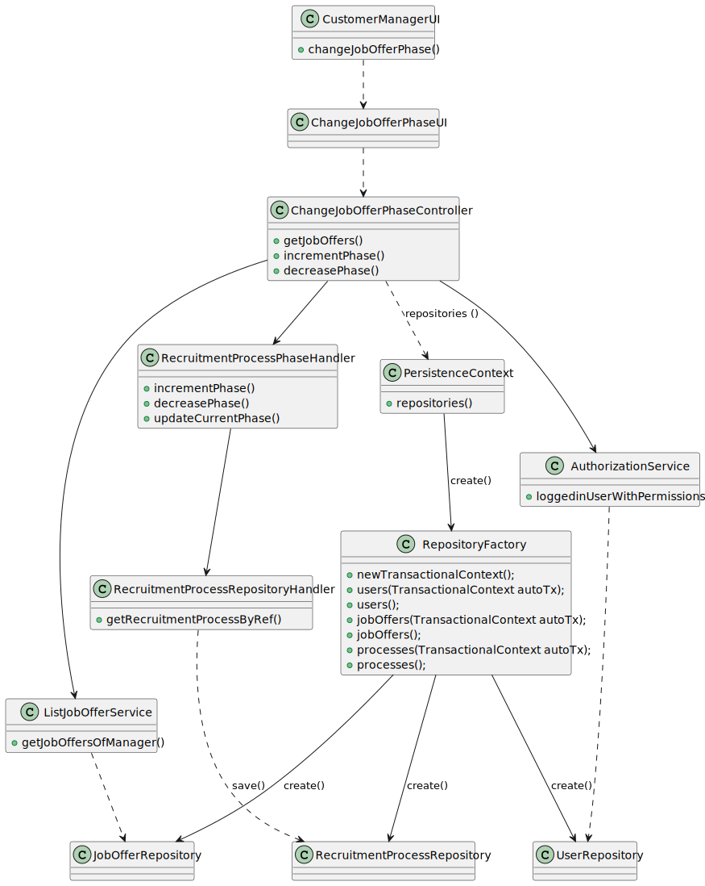
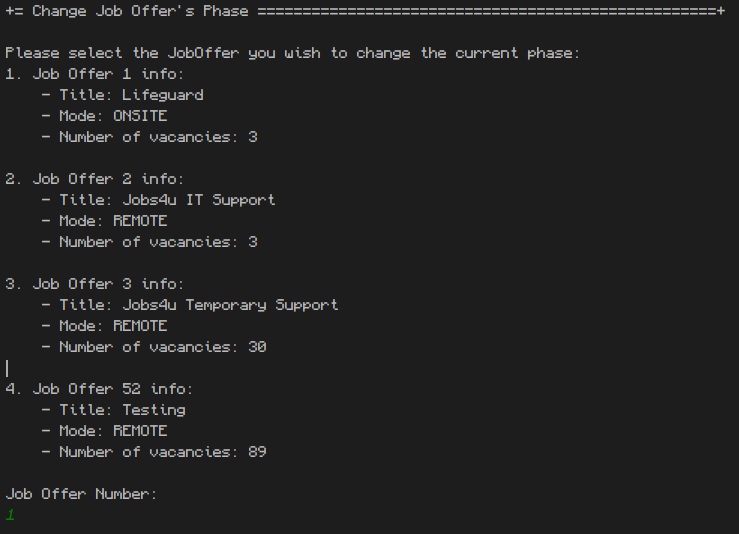
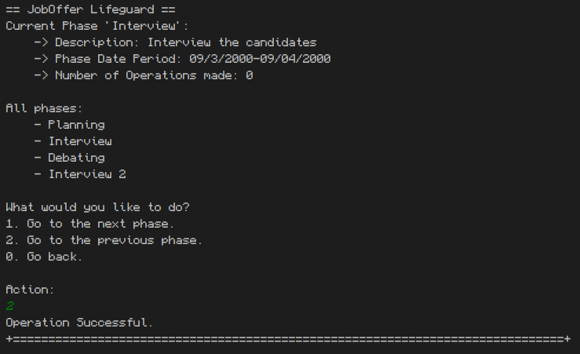

# US 1010 - As Customer Manager, I want to open or close phases of the process for a job opening.

## 1. Context

This is the first time this US is tasked to us. It targets an update to previously created implementations to add new functionalities.

## 2. Requirements

"**US 1010 -** As Customer Manager, I want to open or close phases of the process for a job opening."

**Client Specifications - Q&A:**

> **Q16 –** Relativamente à secção 2.2.1 e às fases do processo de recrutamento, para passarmos para a fase seguinte a anterior tem de fechar ou podemos avançar sem ter a anterior fechada?
>
>>**A16 -** A resposta curta é que as fases devem ser sequenciais e não sobrepostas. Quando fecha uma fase abre a próxima. A US 1007 prevê a definição das fases. A US 1010 prevê a abertura e fecho de fases do processo. A decisão do Customer Manager de fechar uma fase deve assumir que o processo avança para a próxima fase automaticamente (independentemente das datas definidas para as fases).

> **Q62 –** US1007/US1010. Segundo estas US's e a Q16, cada Job Opening deve ter fases definidas. Nas perguntas Q23, Q32 e Q45 é referido o estado da candidatura. A fase da Job Opening e o estado da candidatura são conceitos separados ou referem-se ao mesmo?
>
>> **A62 -** Tal como referido anteriormente, estão relacionados mas são conceitos diferentes.

> **Q143 –** US 1010 - Open or close phases of the process for a job opening. – Quando o Customer Manager deseja abrir ou fechar uma fase de recrutamento, este deve ter a oportunidade de escolher qual fase deseja abrir ou fechar, ou automaticamente ele avança para a próxima fase, isto é fecha a fase atual e abre a seguinte.
>
>> **A143 -** Já respondida em Q16. Mas, resumindo, a ideia desta US é permitir avançar nas fases de um job opening. As fases devem ser sempre sequenciais. Podemos considerar que o fecho de uma fase resulta na abertura da fase seguinte (e o avançar para a fase seguinte, significa fechar a anterior). Não deve ser possível “saltar” fases, a não ser fases que não façam parte do processo (por exemplo, se não tiver entrevistas).

> **Q147 -** US 1010 – gostaria de saber em quê que consiste abrir ou fechar as fases de uma job opening, tendo em conta a US1007 as datas já foram definidas para cada fase.
>
>> **A147 -** Por favor ver Q16 (e outras perguntas sobre o mesmo tema). Esta US permite que o processo mude de fase (tipicamente para avançar no processo). As fases têm datas mas, como referido em Q16, podemos “ativar” uma fase mesmo que ainda não estejamos no seu intervalo temporal. As datas das fases são “indicativas”, no sentido em que sugerem, em particular ao Customer Manager, como gerir temporalmente o processo. Existem “operações” que devem acontecer quando a fase respetiva esta “ativa”.

> **Q149 –** US 1010 – No ultimo sprint foi definido as datas em que começa cada fase de uma job opening, neste é possivel fechar e abrir fases. A minha pergunta seria a seguinte, caso se queira fechar uma fase antes da seguinte começar, o inicio dessa seguinte fase é antecipado? No cenário que já tenho passado a data de inicio de uma fase y tendo a x (antecessora) sido fechado, caso se queira re-abrir a fazer x, é possivel? Ou o sistema deve proibir essa tentativa visto violar as datas definidas?
>
>> **A149 -** Ver Q147 e Q16. A “mudança” de fases para “recuar” deve ser possível caso a fase que se deseje “abandonar” ainda não esteja, de facto, a ser “executada/ativa”. Por exemplo, se estou na fase de screening e já comecei a verificar requisitos de candidatos não faz sentido poder “regressar” à fase de application. Mas se eu estava na fase de application e decidi passar para a próxima (de screening) e passado algum tempo quero regressar à anterior (por exemplo, porque me enganei e ainda estou a receber candidaturas), devo poder faze-lo se ainda não tiver feito nenhuma “operação/processamento” especifico da fase de screening. No que se refere ao avançar deve-se aplicar um principio semelhante: deve ser possível avançar para a próxima fase se a anterior estiver “concluída”, por exemplo, posso avançar para as entrevistas se o screening estiver concluído, ou seja, se todos os candidatos foram verificados e notificados. Tipicamente/normalmente, as fases são para avançar de forma sequencial.

> **Q153 –** US 1010 - Na US 1010, considerando que quando fechamos uma fase a próxima começa, quando consideramos o caso de chegarmos á ultima fase, quando fecharmos a fase devemos também mudar o estado do job opening?
>
>> **A153 -** Ver Q151. Quanto à segunda questão, quando se fecha a última fase de um processo esse processo termina, ou seja, esse job opening já não está “activo”.

> **Q161 -** US1010 - O sistema para a Us1010 deve fazer validações de, por exemplo, o utilizador não pode abrir a fase de interview se o interview model ainda não tiver sido definido, ou o utilizador pode mudar de fase mas não vai conseguir, neste caso, executar o processo de avaliação de entrevistas enquanto não tiver um interview specification atribuído?
>
>> **A161 -** Penso que poderá fazer isso. O que não deve conseguir é fazer entrevistas sem ter o interview model especificado.

> **Q168 -** US1010 – O utilizador deve escolher a fase que quer abrir ou fechar?
>
>> **A168 -** Sem querer condicionar a UI/UX, penso que uma possibilidade seria o sistema apresentar a fase atual do processo e indicar o que é possível fazer. Se for possível avançar ou recuar, deve indicar que é possível e qual a fase resultante. Se não (ainda) possível avançar/recuar deve indicar a justificação desse facto.

> **Q171 –** US1010 - Consideramos que uma fase "open" não é o mesmo que uma fase "active". A fase "open" é uma fase que está disponível para ser executada, enquanto que a fase "active" é uma fase que está a ser executada. Concorda com esta distinção? Porque se o sistema quando fecha uma fase automaticamente considera a fase seguinte como "open" e se "open" for o mesmo que "active/in progress" então nunca vai ser possível "recuar" de fase.
>
>> **A171 -** Sim, penso que o que refere está de acordo com o que tentei explicar nas perguntas anteriores sobre esta US. Usei o termo “open” e “close” para indicar a abertura e o fecho das fases. Usei o termo “active” para indicar que alguma operação especifica da fase já teria sido executada (ou estava em execução) e consierava então essa fase como “activa”, o que significava que não podia mudar de fase enquanto essas “operações” não terminassem.

> **Q194 –** 1010 - Open or close phases of the process for a job opening – Para esta User Story, considerando que a fase de "Application" foi fechada em 19/05 e atualmente estamos na fase de "Screening". Caso seja necessário retroceder para a fase anterior, as datas devem ser ajustadas? Uma vez que pode afetar as datas das fases subsequentes que ainda não foram iniciadas.
>
>> **A194 -** A possibilidade indicada anteriormente que permite “retroceder” nas fases deve ser considerada excecional, mas possível se garantida a consistência do sistema. Quando isso acontece não estou a ver necessidade de ajustar datas.

> **Q195 -** 1010 – Já falou da possibilidade de reabrir uma fase quando uma fase se encontra no estado "open". A minha dúvida é se por exemplo a fase resume_screen se estiver concluída mas não estiver fechada pode ser colocada em progresso. Resumindo, quando uma fase está concluída devemos dar a possibilidade de fechar a fase e abrir a seguinte e também a possiblidade de voltar ao estado "in progress"?
>
>> **A195 -** Não consigo dar uma resposta clara pois existem alguns conceitos que carecem esclarecimento: “resume_screen”, “in progress”, etc. O que posso reforçar é que devem sempre garantir que a consistência do sistema se mantém.

> **Q199 –** US1018 – Relativamente à US1018, após a execução do processo de avalição de todas as entrevistas da job opening, a fase em que esta se encontra deve ser automaticamente mudado para "Result" ou deve ser mantida em "Analysis" e apenas pode ser mudada pela execução da US1010?
>
>> **A199 -** A US1018 não deve alterar a fase actual. A US1010 permite fazer a mudança de fases do processo de recrutamento.

> **Q201 –** US1010 – Em termos de estados da fase, os estado concluída e fechada são sinónimos ou representam conceitos diferentes? Deu um exemplo para a fase de "screening" que encontra-se concluída quando todos os candidatos forem verificados e notificados. Consegue dar uma explicação para as outras fases existentes, quando é que as podemos considerar fechadas.?
>
>> **A201 -** Quando, em questões anteriores sobre este tópico, usei o termos concluído era no sentido de indicar que as atividades relativas ao “propósito” da fase tinham sido terminadas, concluídas, portanto estariam reunidas as condições para poder avançar para a fase seguinte (i.e., fechar a atual). Quando às condições para cada fase penso que devem pensar no problema e tentar identificá-las. Como está colocada a questão parece-me muito ampla e julgo que devem conseguir chegar a elas através da análise detalhada do problema. Mas se tiverem questões mais especificas posso tentar responder.

> **Q212 –** US1010 – Quando se pode recuar de fase?
>
>> **A212 -** O princípio geral é, se não estiver a fazer nada específico da fase atual pode-se recuar. Por exemplo, se estiver na fase das entrevistas e ainda não comecei a avaliar nenhuma entrevista, então pode-se recuar para a fase de screening. Embora não faça sentido voltar a avaliar os requisitos dos candidatos se eles já foram avisados do resultado. Numa situação real, em que aconteça um erro que invalide um resultado que já foi notificado a terceiros (candidatos ou empresas) podemos assumir que isso será resolvido no âmbito de um processo excecional que está for do âmbito do nosso sistema atual (o sistema não tem atualmente de suportar esses casos).

**Acceptance Criteria:**

- **US 1010.1** Each phase is sequential.
    - **US 1010.1.1** One has to end to start a new one.
    - **US 1010.1.2** The end of one phase results on a new one.
- **US 1010.2** It should be possible to go back to the previous phase if no operation has been made in that phase.
- **US 1010.3** Each phase should have a specific date, but it will only work as suggestions, not forced rules.

**Dependencies/References:**

- No dependencies found.

## 3. Analysis

This task requires a simple implementation that it will mainly help the user to organize the job recruitment process. There isn't an additional functionality that this will allow, only help for the candidates to know which phase the process is, and orient the CustomerManager.

So, our decisions are:

- The system should present the current phase and what is possible to do.
  - It can be possible to go forth and change the current phase.
  - It can be possible to go back if no operation was made while being in the new phase.
  - If it is not possible to go back or forth, it should be stated why.
- Each phase will include some information like the name, the description and the dates for this phase.
  - Then each job function will have a list of phases, order by the input order.
- To check if it's possible to go back to the previous phase, each phase will have an "operations counter", that will state if an operation has been made for that JobOffer in the new phase.
  - This will be done with an event and a watchdog.

### System Sequence Diagram



### Relevant DM Excerpts

**Recruitment Process Aggregate:** 



## 4. Design

### 4.1. Realization



| Interaction ID |          Which Class is Responsible for...          |               Answer                | Justification (With Patterns) |
|:--------------:|:---------------------------------------------------:|:-----------------------------------:|:-----------------------------:|
|       3        |            instantiating the controller             |        ChangeJobOfferPhaseUI        |       Pure Fabrication        |
|       4        |          instantiating persistence context          |    ChangeJobOfferPhaseController    |       Pure Fabrication        |
|       5        |  requesting the jobOffers from the customerManager  |        ChangeJobOfferPhaseUI        |     Pure Fabrication, MVC     |
|       6        |             requesting the logged user              |    ChangeJobOfferPhaseController    |     Pure Fabrication, MVC     |
|       7        |               getting the logged user               |        AuthorizationService         |            Service            |
|       8        |    requesting the jobOffers from the logged user    |    ChangeJobOfferPhaseController    |       Pure Fabrication        |
|       9        |      getting the jobOffers from the repository      |         ListJobOfferService         |            Service            |
|       10       |                having the jobOffers                 |         JobOfferRepository          |          Repository           |
|       -        |                          -                          |                  -                  |               -               |
|       15       | requesting the recruitment process of the jobOffer  |        ChangeJobOfferPhaseUI        |       Pure Fabrication        |
|       16       | requesting the recruitment process of the jobOffer  |    ChangeJobOfferPhaseController    |     Pure Fabrication, MVC     |
|       17       | getting the recruitment process from the repository | RecruitmentProcessRepositoryHandler |            Service            |
|       -        |                          -                          |                  -                  |               -               |
|       21       |         showing the all the jobOffer phases         |        ChangeJobOfferPhaseUI        |       Pure Fabrication        |
|    24 / 32     |           requesting to change the phase            |        ChangeJobOfferPhaseUI        |     Pure Fabrication, MVC     |
|    25 / 33     |           requesting to change the phase            |    ChangeJobOfferPhaseController    |     Pure Fabrication, MVC     |
|    26 / 34     |      checking if its possible to change phase       |   RecruitmentProcessPhaseHandler    |       Pure Fabrication        |
|    27 / 35     |       requesting to update the current phase        |   RecruitmentProcessPhaseHandler    |       Pure Fabrication        |
|    28 / 36     |        saving the changes in the repository         | RecruitmentProcessRepositoryHandler |            Service            |
|       -        |                          -                          |                  -                  |               -               |


### 4.2. Class Diagram



### 4.3. Applied Patterns

- Aggregate
- Entity
- Value Object
- Service
- MVC
- Layered Architecture
- DTO

### 4.4. Tests

**Test 1:** Verifies if the increment phase process works correctly.
```
@Test
    void testIfIncrementPhaseWorks() {
        RecruitmentProcessDTO recruitmentProcessDTO = createProcessForTesting(0);

        assertEquals("Operation Successful.", incrementPhase(recruitmentProcessDTO)); //Check output message.
        assertEquals("Interview",recruitmentProcessDTO.getCurrentPhase().name()); //Check if it actually changed.
    }
````

**Test 2:** Verifies if the decrease phase process works correctly.

```
@Test
    void testIfDecreasePhaseWorks() {
        RecruitmentProcessDTO recruitmentProcessDTO = createProcessForTesting(1);

        assertEquals("Operation Successful.", decreasePhase(recruitmentProcessDTO)); //Check output message.
        assertEquals("Planning",recruitmentProcessDTO.getCurrentPhase().name()); //Check if it actually changed.
    }
````

**Test 3:** Verifies if the justification is returning correctly (increment phase).

```
@Test
    void testIfIncrementPhaseJustifiesCorrectly() {
        RecruitmentProcessDTO recruitmentProcessDTO = createProcessForTesting(3);

        assertEquals("Operation Failed: Current Phase is the last Phase. It's not possible to advance to the next one.", incrementPhase(recruitmentProcessDTO)); //Checks output message.
        assertEquals("Interview 2",recruitmentProcessDTO.getCurrentPhase().name()); //Check if it changed anything.
    }
````

**Test 4:** Verifies if the justification is returning correctly (decrease phase).

```
@Test
    void testIfDecreasePhaseJustifiesCorrectly_Limit() {
        RecruitmentProcessDTO recruitmentProcessDTO = createProcessForTesting(0);

        assertEquals("Operation Failed: Current Phase is the first phase. It's not possible to go to a previous phase, since it doesn't exist.", decreasePhase(recruitmentProcessDTO)); //Check output message.
        assertEquals("Planning",recruitmentProcessDTO.getCurrentPhase().name()); //Check if it changed anything.
    }
````

**Test 5:** Verifies if the justification is returning correctly (decrease phase).

```
@Test
    void testIfDecreasePhaseJustifiesCorrectly_Operations() {
        RecruitmentProcessDTO recruitmentProcessDTO = createProcessForTesting(1);

        recruitmentProcessDTO.getCurrentPhase().incrementOperationCount();

        assertEquals("Operation Failed: Current Phase has already been operated. It is not allowed to go to the previous phase, unless no operation has been made in the current phase.", decreasePhase(recruitmentProcessDTO)); //Check output message.
        assertEquals("Interview",recruitmentProcessDTO.getCurrentPhase().name()); //Check if it changed anything.
    }
````

**Test 6:** Verifies if the current phase is being changed correctly.

```
@Test
    void testIfUpdateCurrentRecruitmentProcessPhaseWorks() {
        RecruitmentProcessDTO recruitmentProcessDTO = createProcessForTesting(0);

        incrementPhase(recruitmentProcessDTO);
        assertEquals("Interview",recruitmentProcessDTO.getCurrentPhase().name()); //Check if it actually changed.

        decreasePhase(recruitmentProcessDTO);
        assertEquals("Planning",recruitmentProcessDTO.getCurrentPhase().name()); //Check if it actually changed.

        incrementPhase(recruitmentProcessDTO);
        incrementPhase(recruitmentProcessDTO);
        assertEquals("Debating",recruitmentProcessDTO.getCurrentPhase().name()); //Check if it actually changed.

        incrementPhase(recruitmentProcessDTO);
        assertEquals("Interview 2",recruitmentProcessDTO.getCurrentPhase().name()); //Check if it actually changed.
    }
````

### 4.5 Design Commits:
> **28/05/2024 12:22 [1010]** Documentation Updated:
> - Context and Requirements Done.
> - Analysis Fully Completed.
> - Design all done, except test portion

> **29/05/2024 13:42 [1010]**  Documentation updated:
> - Tests documented.

> **29/05/2024 18:28 [7001]**(*tagline-error*) Documentation remade:
> 
> While implementing the program, I noticed that it would be possible to do it like I planned it until the DataBase portion. Although possible, it would be against the normal rules of implementation. So, I remade the design plan. The analysis is the same because the idea is the same, the execution is the only thing different.
>
> - Design remade;
> - Domain model Updated to accommodate new changes.

> **30/05/2024 20:06 [7001]**(*tagline-error*) Third Design update:
>
> Once again, I changed the thought process of the implementation. This time, the design barely changed, only some method placements and domain names. The bigger changes will be in the implementation. 

## 5. Implementation

**ChangeJobOfferPhaseController:**
```
public class ChangeJobOfferPhaseController {

    private final AuthorizationService authService = AuthzRegistry.authorizationService();
    private final ListJobOfferService offerService = new ListJobOfferService();
    private final RecruitmentPhaseHandler handler = new RecruitmentPhaseHandler();

    public Iterable<JobOfferDto> getJobOffers() {
        authService.ensureAuthenticatedUserHasAnyOf(BaseRoles.CUSTOMER_MANAGER);
        SystemUser manager = authService.loggedinUserWithPermissions(BaseRoles.CUSTOMER_MANAGER).get();
        return offerService.getJobOffersOfManager(manager);
    }

    public String incrementPhase(RecruitmentProcessDTO processDto) {
        return handler.incrementPhase(processDto);
    }

    public String decreasePhase(RecruitmentProcessDTO processDto) {
        return handler.decreasePhase(processDto);
    }

}
````

**RecruitmentPhaseHandler:**
```
public class RecruitmentPhaseHandler {

    RecruitmentProcessRepository repo = PersistenceContext.repositories().processes();

    public String incrementPhase(RecruitmentProcessDTO process) {
        if (!checkIfItsLastPhase(process)) {
            int indexCurrent = searchForIndex(process);
            updateRecruitmentProcessPhase(process.getRecruitmentRefCode(), indexCurrent+1);
            return ("Operation Successful.");
        }
        return "Operation Failed: Current Phase is the last Phase. It's not possible to advance to the next one.";
    }

    private boolean checkIfItsLastPhase(RecruitmentProcessDTO process) {
        return process.getAllPhases().get(process.getAllPhases().size() - 1).name().equalsIgnoreCase(process.getCurrentPhase().name());
    }

    public String decreasePhase(RecruitmentProcessDTO process) {
        if (!checkIfOperationsHaveBeenMade(process)) {
            int indexCurrent = searchForIndex(process);
            if (!(indexCurrent==0)) {
                updateRecruitmentProcessPhase(process.getRecruitmentRefCode(), indexCurrent - 1);
                return ("Operation Successful.");
            } else {
                return "Operation Failed: Current Phase is the first phase. It's not possible to go to a previous phase, since it doesn't exist.";
            }
        }
        return "Operation Failed: Current Phase has already been operated. It is not allowed to go to the previous phase, unless no operation has been made in the current phase.";
    }

    private boolean checkIfOperationsHaveBeenMade(RecruitmentProcessDTO process) {
        return process.getCurrentPhase().numberOfOperations() != 0;
    }

    private int searchForIndex(RecruitmentProcessDTO process) {
        int index = 0;
        for (RecruitmentPhase phase : process.getAllPhases()) {
            if (phase.name().equalsIgnoreCase(process.getCurrentPhase().name())) {
                break;
            }
            index++;
        }
        return index;
    }


    public void updateRecruitmentProcessPhase(Integer processRef, Integer newPhaseRef){
        RecruitmentProcess process = repo.findByRef(processRef).get();
        process.updateCurrentPhase(newPhaseRef);
        repo.save(process);
    }

    public void incrementOperationCounter(Integer processRef){
        RecruitmentProcess process = repo.findByRef(processRef).get();

        int index = 0;
        for (RecruitmentPhase phase : process.phases()) {
            if (phase.name().equalsIgnoreCase(process.currentPhase().name())) {
                break;
            }
            index++;
        }

        process.phases().get(index).incrementOperationCount();
        process.currentPhase().incrementOperationCount();

        repo.save(process);
    }
}
````

**RecruitmentProcess:**
```
@Entity
public class RecruitmentProcess implements AggregateRoot<Integer>, DTOable<RecruitmentProcessDTO> {

    @Id
    @GeneratedValue(strategy = GenerationType.IDENTITY)
    private Integer recruitmentRefCode;

    @ElementCollection
    private List<RecruitmentPhase> allPhases;

    @Embedded
    @AttributeOverrides({
            @AttributeOverride(name = "name", column = @Column(name = "CurrentPhase_name")),
            @AttributeOverride(name = "description", column = @Column(name = "CurrentPhase_description")),
            @AttributeOverride(name = "phaseDatePeriod", column = @Column(name = "CurrentPhase_phaseDatePeriod")),
            @AttributeOverride(name = "numberOfOperations", column = @Column(name = "CurrentPhase_numberOfOperations"))
    })
    private RecruitmentPhase currentPhase;

    public RecruitmentProcess(List<RecruitmentPhase> phases, RecruitmentPhase currentPhase){
        this.allPhases=phases;
        this.currentPhase=currentPhase;
    }

    protected RecruitmentProcess() {
        // for ORM only
    }

    public List<RecruitmentPhase> phases() {
        return this.allPhases;
    }

    public RecruitmentPhase currentPhase(){
        return this.currentPhase;
    }

    public void updateCurrentPhase(Integer newPhase){
        this.currentPhase= allPhases.get(newPhase);
    }

    public boolean addPhase(RecruitmentPhase phase){
        if (!this.allPhases.contains(phase)){
            this.allPhases.add(phase);
            return true;
        } else {
            return false;
        }
    }

    @Override
    public boolean sameAs(Object other) {
        if (!(other instanceof RecruitmentProcess)) {
            return false;
        }
        RecruitmentProcess that = (RecruitmentProcess) other;
        if (this == that) {
            return true;
        } else
            return this.recruitmentRefCode.intValue()==that.recruitmentRefCode.intValue();
    }

    @Override
    public Integer identity() {
        return this.recruitmentRefCode;
    }

    @Override
    public RecruitmentProcessDTO toDTO() {
        return new RecruitmentProcessDTO(this.recruitmentRefCode, this.allPhases, this.currentPhase);
    }
}
````

**RecruitmentPhase:**
````
@Embeddable
public class RecruitmentPhase implements ValueObject {

    private String name;
    private String description;
    private String phaseDatePeriod;
    private int numberOfOperations;

    private static final Pattern VALID_DATE_PERIOD_REGEX = Pattern.compile("^([1-2][0-9]|0[1-9]|3[01]|[1-9])[/](1[0-2]|0*[1-9])[/](20[0-9][0-9])[-]([1-2][0-9]|0*[1-9]|3[01])[/](1[0-2]|0*[1-9])[/](20[0-9][0-9])");

    public RecruitmentPhase() {
        this.name = "";
        this.description = "";
        this.phaseDatePeriod = "11/11/2000-12/12/2000";
        this.numberOfOperations = 0;
    }

    public RecruitmentPhase(String name, String description, String date) {
        if (StringPredicates.isNullOrEmpty(name)) {
            throw new IllegalArgumentException(
                    "The name should neither be null nor empty");
        }
        this.name = name;
        if (StringPredicates.isNullOrEmpty(description)) {
            throw new IllegalArgumentException(
                    "The description should neither be null nor empty");
        }
        this.description = description;

        Preconditions.nonEmpty(date, "Date Period should neither be null nor empty");
        Preconditions.matches(VALID_DATE_PERIOD_REGEX, date, "Invalid Date Name: " + date + "\nRestrictions: should follow this format (11/11/2000-12/12/2000)");

        this.phaseDatePeriod = date;

        this.numberOfOperations = 0;
    }

    public void incrementOperationCount(){
        this.numberOfOperations++;
    }

    @Override
    public String toString() {
        return "Phase '" + this.name + "':" +
                "\n\t-> Description: " + this.description +
                "\n\t-> Phase Date Period: " + this.phaseDatePeriod +
                "\n\t-> Number of Operations made: " + this.numberOfOperations;
    }

    public Class<? extends Annotation> annotationType() {
        return null;
    }

    public String name() {
        return this.name;
    }

    public int numberOfOperations(){
        return this.numberOfOperations;
    }

}
````

**RecruitmentProcessFactory:**
```
public class RecruitmentProcessFactory {

    public RecruitmentProcess createRecruitmentProcess(List<RecruitmentPhase> process, RecruitmentPhase current){
        return new RecruitmentProcess(process, current);
    }

    public RecruitmentProcess createRecruitmentProcess(){
        return new RecruitmentProcess();
    }

}
````

**OperationMadeEventWatchDog:**
```
public class OperationMadeEventWatchDog implements EventHandler {

    final OperationMadeWatchdogController controller = new OperationMadeWatchdogController();

    @Override
    public void onEvent(final DomainEvent domainevent) {
        assert domainevent instanceof OperationMadeEvent;

        final OperationMadeEvent event = (OperationMadeEvent) domainevent;

        controller.incrementOperationCounter(event.getRefCode());
    }
}
````

### Main Commits:
> **29/05/2024 13:44 [1010]**  Implementation Sketch 1:
>- All domain classes created;
>- Some previous classes updated to accommodate new changes;
>
> Still need to test and interconnect new classes to previous functionalities.

> **29/05/2024 18:30 [7001]**(*tagline-error*) Implementation Sketch 2:
>
>Following the previous commit, this sketch implements the new design plan. Its missing the connections to the UIs but it has all the new classes required.
>
>- Rename of several classes;
>- Moved classes to help organize the project.
>- Created a new repository and everything it required.
>- Re-updated some classes that were updated before.

> **30/05/2024 20:10 [7001]**(*tagline-error*) Implementation Sketch 3:
>
>The reality is that this is more than a sketch. This is (hopefully) the last implementation commit for the overall workflow of the implementation.
>
>- Repository and domain classes clean-up.
>- Data-base connection and object creation completed.
>- Bootstrap updated with new functionalities.
>
>The remaining task are updating old functionalities to accommodate the new implementation and the creation of an Operation event, to track operations made during a phase. 

> **1/06/2024 17:14 [1010]** Final Implementation Done (previous commits with wrong names)
>
>In this implementation:
>- Updated previous functionalities;
>- Improved UI comprehension;
>- Created an event to track operations

## 6. Integration/Demonstration





## 7. Observations

As it was possible to check previously, most commits for this US were sent with the wrong tagline. This was my mistake, that I only caught in the final commits.
The wrong tagline wasn't referring to any important US and every description is detailed with every action made, but it still a mistake that I'm embarrassed to exist.