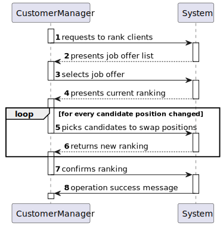
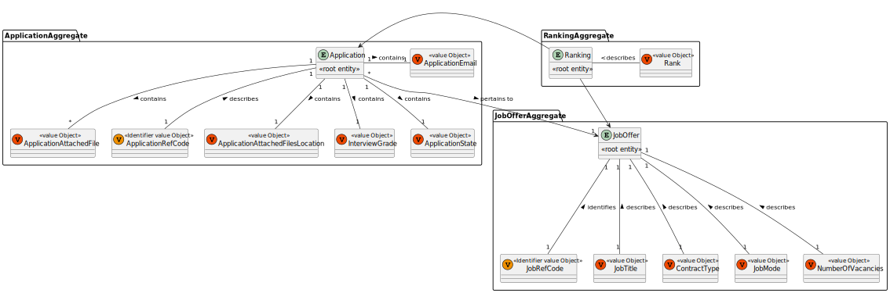
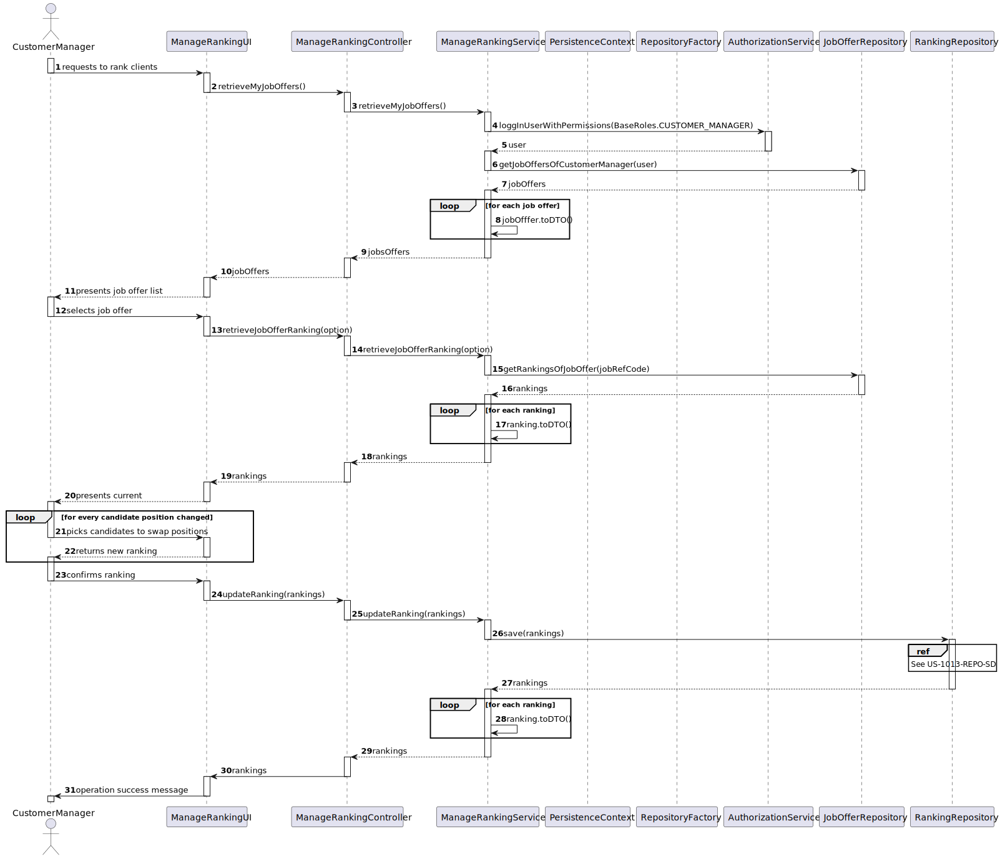
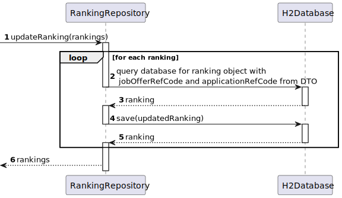
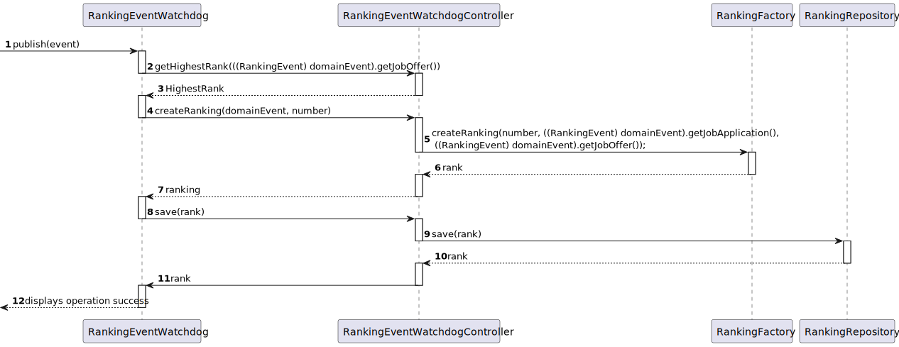
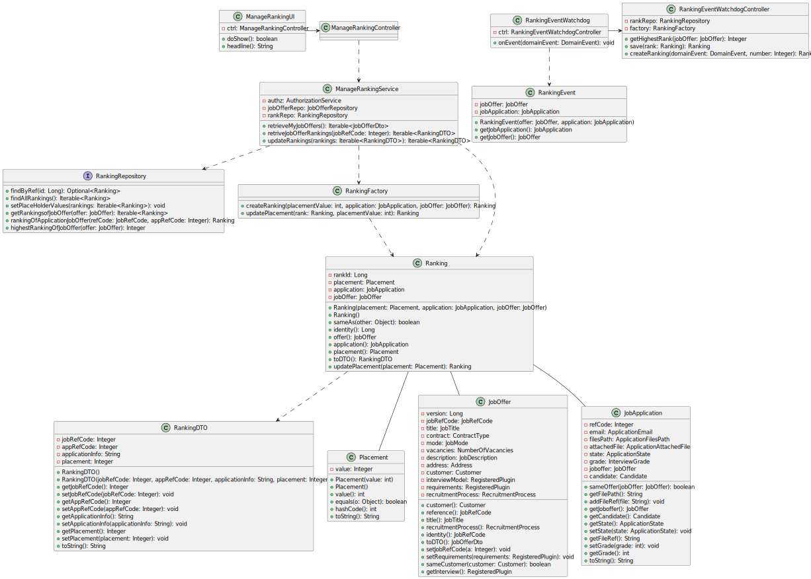
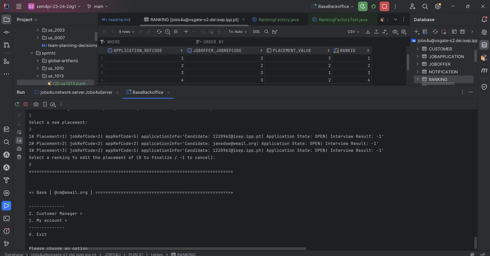

# 1013 As Customer Manager, I want to rank the candidates for a job opening.


## 1. Context

The Customer intends for the team to add a ranking functionality to the system.
The ranking functionality will be part automated and part manually managed by the customer manager.
The ranking will be as the name suggests an ordered lists of the candidates that applied for a job opening.
This list will be ordered by default via criteria of points scored in the interview but ultimately manually ordered by the customer manager.

## 2. Requirements

#### Client Questions

>**Q17**- Relativamente à secção 2.2.1, é na fase de Analysis que as entrevistas são avaliadas e é esse resultado que define o ranking dos candidatos? Além disso, para que serve o CV nesta fase? Visto que as entrevistas não são obrigatórias, o que acontece quando estas não se realizam?
>
>>**A17**- A pontuação das entrevistas é efetuada/calculada na fase das entrevistas. O CV e outros dados (como o resultado das entrevistas) é usado pelo Customer manager na fase de analise para ordenar os candidatos. Mas a ordenação é da responsabilidade do Customer Manager (por exemplo, não tem de seguir a ordem da pontuação nas entrevistas). A US 1013 corresponde à ordenação manual dos candidatos feita pelo Customer Manager. O facto de não haver entrevistas não tem implicações na ordenação dos candidatos pois esta não depende explicitamente das entrevistas.

>**Q142**- US1013 - Candidate Ranking – Mr Client mention a manual ranking (Q17). If the pontuation of an interview is not essential for the candidate's rank, what criteria is to be used when ranking?
>
>>**A142**- Please view again Q17. The ranking is a decision of the Customer Manager based on all the data that he/she may have during the process (including CV and other attached documents and the interviews as well as other data/information that may not be part of the system).

>**Q148**- US 1013 – A minha questão é relativa a como o ranking é feito. O customer manager dá uma nota a cada candidatura e o sistema ordena por ordem crescente sendo assim atribuído o ranking de cada candidatura? Se for assim, a nota terá que escala? Caso ainda seja assim ele só pode atribuir uma nota quando tiver conhecimento de todas? Ou pode ir colocando e o ranking só é atribuído quando todas as candidaturas já estiverem avaliadas?
>
>>**A148**- Ver Q17. A ordenação dos candidatos (ranking) é da responsabilidade do customer manager. Ele pode basear-se no resultado das entrevistas e de outra informação, mas o ranking não é automático. Não há nota nem escala a usar. As candidaturas são ordenadas.

>**Q152**– US 1013 - ranking scale - In US 1013, as mentioned before, the customer manager will decide the rank of each candidate's application for a job opening. As such, our team would like to know what is the scale of this rank and a bit of information about how it works. First of all, is the ranking a point system, in which the customer manager will award points to each application, making it so the the ranking is ordered by how many points each application has, or will the customer manager simply assign a place in the rank? For the second option, what I am picturing is the program asking the customer manager what position to place each candidate in, one by one, and the customer manager awarding, 1st, 2nd place and etc.. Second of all, if it is indeed a point system, is there a universal scale it should follow?
>
>>**A152**- See Q148.

>**Q155**- Varela – US1013 - Rank Entries - Is there a limit on rank entries? Let's say that 100 candidates apply for a job opening. Does the Customer Manager have to sort all 100 candidates?
>
>>**A155**- The order of candidates should include at least all the first candidates within the vacancy number and some following candidates. At the moment, I do not know exactly the number of the following candidates to be ordered. Therefore, I would like for it to be a global configuration property in the system. It could be a number representing a magnitude from the vacancy number. For instance, 1 could mean exactly the same number of vacancies, 2 the double, 0,5 half the number of vacancies. The remainder of the candidates could be just tagged as not ranked

>**Q157**- US1013 - Rank the candidates for a job Opening is the same as rank the job Applications for a Job Opening, knowing that I can only know the candidates throw the job application?
>
>>**A157**- In the context of a job opening, a candidate is someone that made an application to that job opening. But the same person can be a candidate to other job openings.

>**Q158**-  US1013 - Process of ranking - How is the ranking done? The customer manager selects a job opening and is shown the different candidates, and they assign a rank to each one. And the ranking process end when he assigns a rank to all candidates? Example: - Rank the candidate1: - Write the rank: 3 - Rank the candidate2: - Write the rank: 1 - Rank the candidate3: - Write the rank: 4
>
>>**A158**- See Q155. Once again, I do not have specific requirements for UI/UX. But I can provide some ideas. Being a console application limits the UI/UX. However, I see this functionality similar to the way people enter recipients for an email, for instance. In the case of the recipients of an email I simply write their emails separated by a comma. Could it be similar in this case?

>**Q159**-  US1013 - Stop the ranking process - When a customer manager starts the ranking process, he can stop and continue later? Or the ranking process must be done in one go?
>
>>**A159**- See Q158. I guess it may depend on how you implement the solution. But, in the case it may work as a “long operation” be aware of when and how to conclude the “operation".

>**Q162**- US1013 - When the analysis phase ends, the ranking need to have all the candidates? or can the customer manager rank only some of the candidates?
>
>>**A162**- All the candidates should be ranked before moving to the result phase.

>**Q163**- US1013 - When the customer manager is ranking the candidates, in terms of UI, should we display information from the application such as interview score, etc... or just the candidate's name and email?
>
>>**A163**- As stated before, I do not have specific requirements for the UI/UX. Use best practices. However, I would like it to be possible for the Customer Manager to have 2 or more instances of the application running, so that he/she could, for instance, see the interviews grades and, at the same time, register the order/ranking of the candidates.


#### Acceptance Criteria

**AC 1013.1.** The final ranking of the Candidates is ultimately a decision of the Customer Manager, regardless of the status of interview/requirements

**AC 1013.2.** The ranking up until the job opening closes may include any number of candidates but when it does close it should be shaved down to fit the number of vacancies

**AC 1013.3.** A ranking is made in the context of a job opening, any candidate may be present in 2 or more rankings but each job opening may only have 1 ranking

**AC 1013.4.** A ranking may be made and then be updated later up until the job offer is closed

**AC 1013.5.** All candidates must be ranked before the result phase of the job opening

**Dependencies/References:**

- No dependencies found.

## 3. Analysis

### System Sequence Diagram



### Relevant Domain Model Excerpt



## 4. Design

### 4.1. Realization

#### 4.1.1 Global SD



#### 4.1.2 REPO - SD



|     Which Class is Responsible for...     |        Answer        |  Justification (With Patterns)  |
|:-----------------------------------------:|:--------------------:|:-------------------------------:|
|       instantiating the controller        |   ManageRankingUI    |        Pure Fabrication         |
|        retrieving the repositories        |  PersistenceContext  |        Pure Fabrication         |
|         creating the repositories         |  RepositoryFactory   |             Factory             |
|       communicating with the domain       | ManageRankingService | Service / Layered Architecture  |
|        knowing the ranking entries        |  RankingRepository   | InformationExpert / Repository  |
|           knowing the jobOffers           |  JobOfferRepository  | InformationExpert / Repository  |
| saving and persisting the ranking entries |  RankingRepository   | InformationExpert / Repository  |

#### 4.1.3 Create Ranking on Job Application Creation



### 4.2. Class Diagram



### 4.3. Applied Patterns

- MVC
- Layered Architecture
- Service
- Event
- Repository
- Factory
- TDD
- DDD

### 4.4. Tests

```
private RankingFactory rankingFactory;
    private JobApplication validApplication;
    private JobOffer validJobOffer;

    @BeforeEach
    void setUp() {
        rankingFactory = new RankingFactory();
        validApplication = new JobApplication(); // Assuming a valid JobApplication constructor or a mock object
        validJobOffer = new JobOffer(); // Assuming a valid JobOffer constructor or a mock object
    }

    @Test
    void ensureRankgWithValidParameters() {
        int placementValue = 1;
        Ranking ranking = rankingFactory.createRanking(placementValue, validApplication, validJobOffer);

        assertNotNull(ranking);
        assertEquals(placementValue, ranking.placement().value());
        assertEquals(validApplication, ranking.application());
        assertEquals(validJobOffer, ranking.offer());
    }

    @Test
    void ensureInvalidPlacementValue() {
        int invalidPlacementValue = -1;
        IllegalArgumentException exception = assertThrows(IllegalArgumentException.class, () -> {
            rankingFactory.createRanking(invalidPlacementValue, validApplication, validJobOffer);
        });

        assertEquals("Placement value must be positive.", exception.getMessage());
    }

    @Test
    void ensureRankingWithNullApplication() {
        int placementValue = 1;
        IllegalArgumentException exception = assertThrows(IllegalArgumentException.class, () -> {
            rankingFactory.createRanking(placementValue, null, validJobOffer);
        });

        assertEquals("Job application cannot be null.", exception.getMessage());
    }

    @Test
    void ensureCreateRankingWithNullJobOffer() {
        int placementValue = 1;
        IllegalArgumentException exception = assertThrows(IllegalArgumentException.class, () -> {
            rankingFactory.createRanking(placementValue, validApplication, null);
        });

        assertEquals("Job offer cannot be null.", exception.getMessage());
    }

    @Test
    void ensurePlacementWithValidParameters() {
        int initialPlacementValue = 1;
        Ranking ranking = rankingFactory.createRanking(initialPlacementValue, validApplication, validJobOffer);
        int newPlacementValue = 2;

        Ranking updatedRanking = rankingFactory.updatePlacement(ranking, newPlacementValue);

        assertNotNull(updatedRanking);
        assertEquals(newPlacementValue, updatedRanking.placement().value());
    }
````

### 4.5 Design Commits:

> **[US1013] -** Requirements and Analysis 21/05/2024 14:11

> **[US1013] -** Design + Tests (This ) 02/06/2024 19:09

## 5. Implementation

**Ranking:**
````java
package jobs4u.base.rankingmanagement.domain;

import eapli.framework.domain.model.AggregateRoot;
import eapli.framework.representations.dto.DTOable;
import jakarta.persistence.*;
import jobs4u.base.applicationmanagement.domain.JobApplication;
import jobs4u.base.joboffermanagement.domain.JobOffer;

@Entity
public class Ranking implements AggregateRoot<Long>, DTOable<RankingDTO> {


    @Id
    @GeneratedValue(strategy = GenerationType.IDENTITY)
    private Long rankId;

    @Embedded
    private Placement placement;

    @ManyToOne
    private JobApplication application;

    @ManyToOne
    private JobOffer jobOffer;

    public Ranking(Placement placement, JobApplication application, JobOffer jobOffer){
        this.placement = placement;
        this.application = application;
        this.jobOffer = jobOffer;
    }

    public Ranking() {
        //for ORM
    }

    @Override
    public boolean sameAs(Object other) {
        return false;
    }

    @Override
    public Long identity() {
        return rankId;
    }

    public JobOffer offer(){return this.jobOffer;}

    public JobApplication application(){return this.application;}

    public Placement placement(){return this.placement;}

    @Override
    public RankingDTO toDTO() {
        String appInfo = "Candidate: " + this.application.getCandidate().associatedUser().username().toString() + "| Application State: " + this.application.getState().toString() + "| Interview Result: " + this.application.getGrade();


        return new RankingDTO(this.jobOffer.reference().getRef(), this.application.identity(), appInfo, this.placement.value());
    }


    public Ranking updatePlacement(Placement placement) {
        this.placement = placement;
        return this;
    }
}
````

**RankingEventWatchdog:**
````java
package jobs4u.base.rankingmanagement.domain;

import eapli.framework.domain.events.DomainEvent;
import eapli.framework.infrastructure.pubsub.EventHandler;
import jobs4u.base.notificationmanagement.domain.CheckNewNotificationsEvent;
import jobs4u.base.rankingmanagement.application.RankingEventWatchdogController;
import org.springframework.transaction.annotation.Transactional;

public class RankingEventWatchdog implements EventHandler {

    // Define RankingEventWatchdogController as a field in your class
    private final RankingEventWatchdogController ctrl = new RankingEventWatchdogController();

    @Override
    public void onEvent(DomainEvent domainEvent) {
        assert domainEvent instanceof RankingEvent;

        Integer number = ctrl.getHighestRank(((RankingEvent) domainEvent).getJobOffer());


        Ranking rank = ctrl.createRanking(domainEvent, number);

        rank = ctrl.save(rank);

        if(rank != null){
            System.out.println("Ranking updated!");
        }else{
            System.out.println("Ranking update failed!");
        }
    }

}
````

### Main Commits:

> **[US1013] -** Closes #27 - Implementation and follow-up documentation 03/06/2024 10:26

## 6. Integration/Demonstration



## 7. Observations

Nothing to add