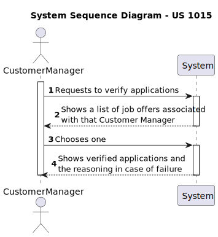
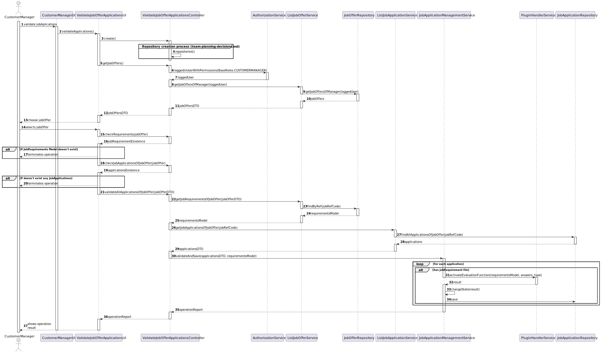
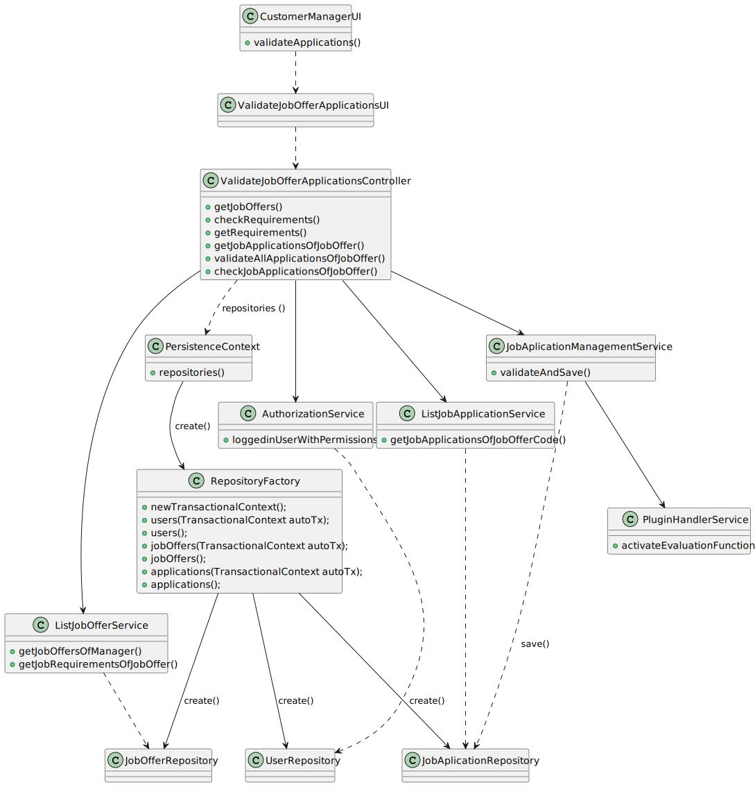
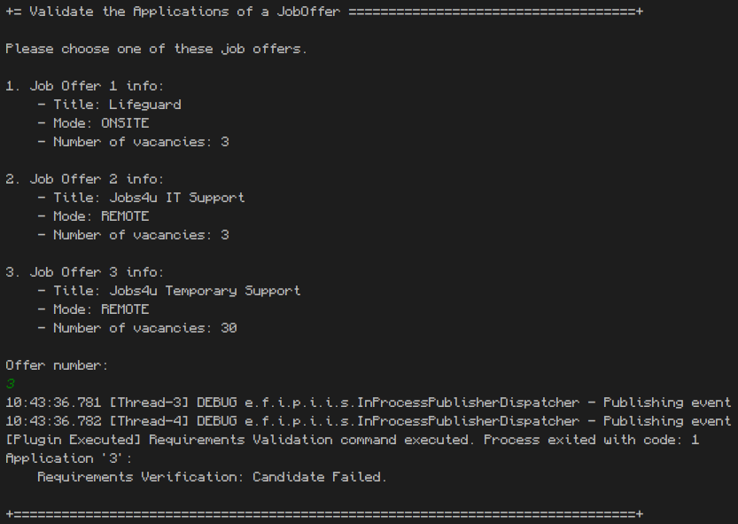

# US 1015 - As Customer Manager, I want to execute the process of verication of requirements of applications for a job opening.

## 1. Context

This is the first time this US is tasked to us. It targets the implementation of previously enabled functionalities to new users, while implementing new ones in the process.

## 2. Requirements

"**US 1015** As Customer Manager, I want to execute the process of verication of requirements of applications for a job opening."

**Client Specifications - Q&A:**

> **Q167 –** Deve ser executado o processo para todos os candidatos ou apenas para alguns (segundo algum critério)?
>
>> **A167 -** Os ficheiros com as respostas aos requisitos vão entrando no sistema gradualmente. Talvez seja mais “simples” que o processo execute (ou seja, faça a verificação dos requisitos) para os candidatos para os quais já foi submetido o ficheiro de requisitos. Nalgum momento o processo irá executar com todos os candidatos já com os ficheiros de requisitos submetidos.

> **Q180 -** Candidate Answers - Does US2004 only deals with the upload of the file to the system or also the registration of the candidate's answer by the Operator? I've seen many mentions about the file's answers but I want to understand if that aspect is also part of US2004.
>
>> **A180 -** In US2003 the Operator downloads a template file that he/she uses to register the candidate requirements. In US 2004, the Operator uploads a file with the requirements and the system should validate the file (verify of the syntax is correct). US 1015 is the one that executes the verification of requirements for the candidates (based on the previously uploaded files).

**Acceptance Criteria:**

- **US 1015.1** The system should allow the CustomerManager to choose a Job Offer from the ones he manages.
- **US 1015.2** The system should analyse all the applications that have a Job Requirement file and that weren't graded before.
- **US 1015.3** The system then changes the state of the application to MR or DNMR.

**Dependencies/References:**

- This US directly requires the importation of the candidate files from the US 2004.

## 3. Analysis

This User Story tasks us with a simple implementation, that will be made easy if the importation of the Job Requirement files is made properly.

This functionality will:
- Allow a CustomerManager to run an automated process for all the applications of a specific jobOffer, chosen by the user.
  - The system will print which application was verified and the result of it. This is something that will be possible to see in each application state (MR/DNMR), but it will facilitate the readability of the process.
    - In case of failure to pass a certain criteria, the system will also print the reasoning.

### System Sequence Diagram



### Relevant DM Excerpts

**Requirement Specification Aggregate:** (reduced version)


## 4. Design

### 4.1. Realization



| Interaction ID |                    Which Class is Responsible for...                    |                 Answer                 | Justification (With Patterns) |
|:--------------:|:-----------------------------------------------------------------------:|:--------------------------------------:|:-----------------------------:|
|       3        |                      instantiating the controller                       |     ValidateJobOfferApplicationsUI     |       Pure Fabrication        |
|       4        |                    instantiating persistence context                    | ValidateJobOfferApplicationsController |       Pure Fabrication        |
|       5        |             requesting the jobOffers of the customerManager             |     ValidateJobOfferApplicationsUI     |     Pure Fabrication, MVC     |
|       6        |                       requesting the logged user                        | ValidateJobOfferApplicationsController |     Pure Fabrication, MVC     |
|       7        |                         getting the logged user                         |          AuthorizationService          |            Service            |
|       8        |              requesting the jobOffers from the logged user              | ValidateJobOfferApplicationsController |       Pure Fabrication        |
|       9        |                getting the jobOffers from the repository                |          ListJobOfferService           |            Service            |
|       10       |                          having the jobOffers                           |           JobOfferRepository           |          Repository           |
|       -        |                                    -                                    |                   -                    |               -               |
|       15       |     requesting to check if the jobOffer has the requirementsPlugin      |     ValidateJobOfferApplicationsUI     |     Pure Fabrication, MVC     |
|       16       |           checkin if the jobOffer has the requirementsPlugin            | ValidateJobOfferApplicationsController |              MVC              |
|       -        |                                    -                                    |                   -                    |               -               |
|       18       |          requesting to check if the jobOffer has applications           |     ValidateJobOfferApplicationsUI     |     Pure Fabrication, MVC     |
|       19       |                checking if the jobOffer has applications                | ValidateJobOfferApplicationsController |              MVC              |
|       -        |                                    -                                    |                   -                    |               -               |
|       21       |              requesting the validation of all applications              |     ValidateJobOfferApplicationsUI     |     Pure Fabrication, MVC     |
|       22       |           requesting the recruitmentsPlugin from the jobOffer           | ValidateJobOfferApplicationsController |       Pure Fabrication        |
|       23       |            getting the recruitmentsPlugin from the jobOffer             |          ListJobOfferService           |            Service            |
|       -        |                                    -                                    |                   -                    |               -               |
|       26       |            requesting all the applications from the jobOffer            | ValidateJobOfferApplicationsController |       Pure Fabrication        |
|       27       |             getting all the applications from the jobOffer              |        LisJobApplicationService        |            Service            |
|       28       |                         having the applications                         |        JobApplicationRepository        |          Repository           |
|       -        |                                    -                                    |                   -                    |               -               |
|       30       |         requesting to validate all applications from a jobOffer         | ValidateJobOfferApplicationsController |     Pure Fabrication, MVC     |
|       31       | requesting to activate the plugin function to validate the applications |    JobApplicationManagementService     |            Service            |
|       32       |       activating the plugin function to validate the applications       |          PluginHandlerService          |            Service            |
|       33       |                  saving the result in the application                   |    JobApplicationManagementService     |            Service            |
|       34       |                saving the application in the repository                 |    JobApplicationManagementService     |            Service            |

### 4.2. Class Diagram



### 4.3. Applied Patterns

- Aggregate
- Entity
- Value Object
- Service
- MVC
- Layered Architecture
- DTO

### 4.4. Tests

This whole functionality is target to update values on the repository and nothing more. Since the repository is on the persistence, we can't test this functionality.

The only thing that can be tested is the plugin activation, which is already done in that task's US (1008).

### 4.5 Design Commits:
> **02/06/2024 12:13 [1015]** Documentation Started:
>
>- Context, Requirements and Analysis done;
>- Design started: SSD done.
>
>The rest of the design requires the design/implementation of US2004.

>**04/06/2024 16:06 [1015]** Documentation Updated:
>
>- Requirements Updated;
>- Design completed: SD, Rationale, CD.
>- Tests done.

## 5. Implementation

**ValidateJobOfferApplicationsController:**
````
public class ValidateJobOfferApplicationsController {

    private final AuthorizationService authService = AuthzRegistry.authorizationService();
    private final ListJobOfferService offerService = new ListJobOfferService();
    private final ListJobApplicationService listApplicationService = new ListJobApplicationService();
    private final JobApplicationManagementService applicationService = new JobApplicationManagementService();
    private final EventPublisher dispatcher = InProcessPubSub.publisher();

    public Iterable<JobOfferDto> getJobOffers() {
        authService.ensureAuthenticatedUserHasAnyOf(BaseRoles.CUSTOMER_MANAGER);
        SystemUser manager = authService.loggedinUserWithPermissions(BaseRoles.CUSTOMER_MANAGER).get();
        return offerService.getJobOffersOfManager(manager);
    }

    public boolean checkRequirements(JobOfferDto offerdto) {
        authService.ensureAuthenticatedUserHasAnyOf(BaseRoles.CUSTOMER_MANAGER);
        Optional<RegisteredPlugin> plugin = getRequirements(offerdto);
        return plugin.isPresent();
    }

    public Optional<RegisteredPlugin> getRequirements(JobOfferDto offerdto){
        return offerService.getJobRequirementsOfJobOffer(new JobRefCode(Integer.parseInt(offerdto.getRefCode())));
    }

    public Iterable<ApplicationDTO> getJobApplicationsOfJobOffer(JobOfferDto offerdto) {
        authService.ensureAuthenticatedUserHasAnyOf(BaseRoles.CUSTOMER_MANAGER);
        return listApplicationService.getJobApplicationsOfJobOfferCode(new JobRefCode(Integer.parseInt(offerdto.getRefCode())));
    }

    public String validateAllApplicationsOfJobOffer(JobOfferDto offerDto) throws IllegalArgumentException {
        authService.ensureAuthenticatedUserHasAnyOf(BaseRoles.CUSTOMER_MANAGER);

        RegisteredPlugin requirementsModel = getRequirements(offerDto).get();
        List <ApplicationDTO> applicationDTOS = (ArrayList) getJobApplicationsOfJobOffer(offerDto);

        return applicationService.validateAndSave(applicationDTOS,requirementsModel);
    }

    public boolean checkJobApplicationsOfJobOffer(JobOfferDto offerdto) {
        authService.ensureAuthenticatedUserHasAnyOf(BaseRoles.CUSTOMER_MANAGER);
        List<ApplicationDTO> list = (ArrayList) listApplicationService.getJobApplicationsOfJobOfferCode(new JobRefCode(Integer.parseInt(offerdto.getRefCode())));

        return !list.isEmpty();
    }
}
````

**ListJobOfferService:**
````
public class ListJobOfferService {
	private final JobOfferRepository repo = PersistenceContext.repositories().jobOffers();

	public Iterable<JobOfferDto> getJobOffersOfManager(SystemUser manager) {
		Iterable<JobOffer> offers = repo.findAllOffersOfManager(manager);
		List<JobOfferDto> ret = new ArrayList<>();
		offers.forEach(o -> ret.add(o.toDTO()));
		return ret;
	}
	
	public Optional<RegisteredPlugin> getJobRequirementsOfJobOffer(JobRefCode jobRefCode) {
		JobOffer offer = repo.findByRef(jobRefCode).orElse(null);
		if (offer == null || offer.requirements() == null)
			return Optional.empty();
		return Optional.of(offer.requirements());
	}
````

**LisJobApplicationService:**
````
public class ListJobApplicationService {
    private final JobApplicationRepository repo = PersistenceContext.repositories().jobApplications();

	public Iterable<ApplicationDTO> getJobApplicationsOfJobOfferCode(JobRefCode code) {
		Iterable <JobApplication> apps = repo.findAllApplicationsOfJobOffer(code);
		List<ApplicationDTO> ret = new ArrayList<>();
		apps.forEach(a -> ret.add(a.toDTO()));
		return ret;
	}

}
````

**JobApplicationManagementService:**
````
public class JobApplicationManagementService {
    public String validateAndSave(List<ApplicationDTO> applicationDTOS, RegisteredPlugin requirementsModel) {
        StringBuilder operationReport = new StringBuilder();

        boolean validated;
        int result = -5;

        for (ApplicationDTO appDto : applicationDTOS) {
            if (!appDto.getState().equalsIgnoreCase(ApplicationState.OPEN.toString()) && !appDto.getState().equalsIgnoreCase(ApplicationState.PROCESSING.toString()))
                continue;

            String[] files = appDto.getAttachedFile().split("\n");

            validated = false;
            for (String filePath : files) {

                if (!filePath.contains("_JOBREQUIREMENTS"))
                    continue;

                String jobRequirementFilePath = appDto.getFilesPath();
                if (!(jobRequirementFilePath.endsWith("/") || jobRequirementFilePath.endsWith("\\")))
                    jobRequirementFilePath += File.separator;
                jobRequirementFilePath += filePath;

                validated = true;
                result = pluginHandlerService.activateEvaluationFunction(requirementsModel.fileName().toString(), jobRequirementFilePath, 1);
                break;
            }

            if (!validated || result==-5)
                continue;

            JobApplication application = repo.findByRefCode(appDto.getRefCode()).get();

            if (result == 0) {
                application.setState(ApplicationState.MR);
                operationReport.append("Application '"+ application.identity() + "':\n\tRequirements Verification: Candidate Passed.\n");
            } else {
                application.setState(ApplicationState.DNMR);
                operationReport.append("Application '"+ application.identity() + "':\n\tRequirements Verification: Candidate Failed.\n");
            }
            repo.save(application);

        }
        return operationReport.toString();
    }
}
````

### Main Commits:
> **04/06/2024 16:10 [1015]** Implementation done:
>
>- UI and Controller implemented.
>- New methods added to previous services.
>- Update domain objects to accommodate the new functionally and clean-up in UI display.
>- Plugin Handler and associated classes updated to accommodate the new functionality and a new display.
>- New input files added to help test the program.
>
>Implementation tested and functional, but the plugins require some updates to be sure if the functionality is working as intended.

## 6. Integration/Demonstration



## 7. Observations

Although the methods are different, the work flow of this US is similar to the workflow of US1018, since they both implement similar functionalities.