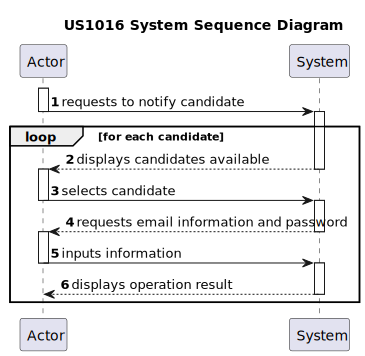
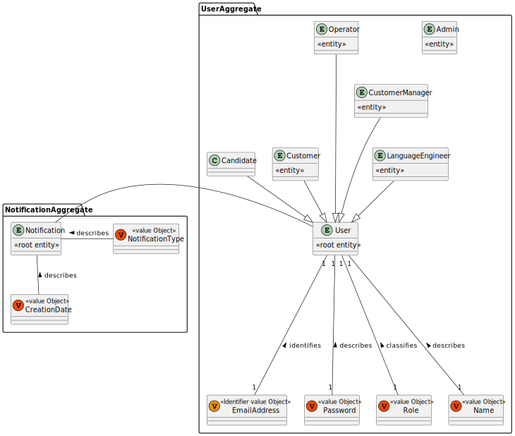
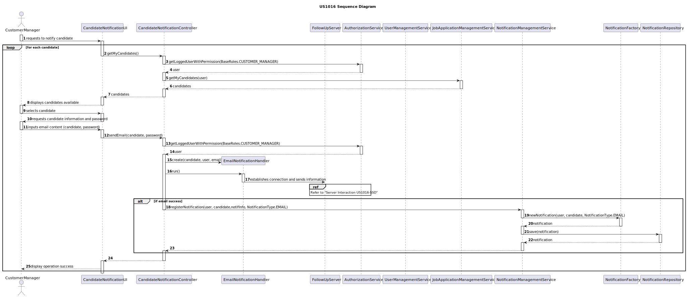
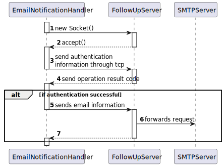
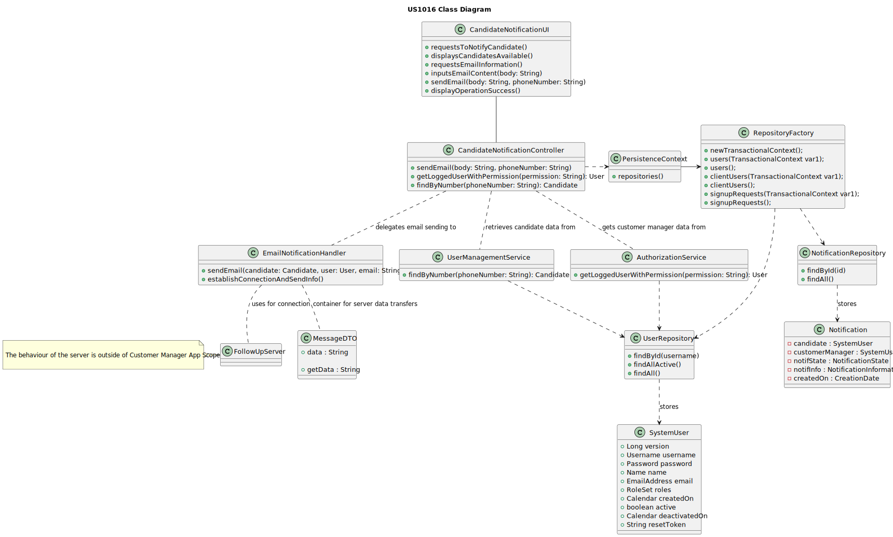

# 1016 As Customer Manager, I want the system to notify candidates, by email, of the result of the verification process


## 1. Context

The Client has tasked the team with developing email integration into the system.
This will be a completely manual feature with no automated components.

## 2. Requirements

### Client Questions

>**Q48** US1016 e US1020, relativamente ao envio das notificações por email, é necessário guardar que esse envio foi feito?
>
>>**A48** No documento nada de explicito é dito sobre este assunto. No entanto, do ponto de vista de gestão do processo da jobs4u parece-me adequado que essa informação fique registada.

>**Q69** US1016 – Acerca da US 1016 - "As Customer Manager, I want the system to notify candidates, by email, of the result of the verification process" qual é o processo através do qual essa notificação é gerada? Após a avaliação do Requirement Specification module, este gera um resultado "Aprovado" ou "Rejeitado". Este resultado despoleta automaticamente uma notificação para o candidato ou é o Customer Manager que tem a responsabilidade de informar o candidato através do sistema do resultado da verificação (ex. depois de um resultado negativo ser gerado, o Customer Manager vai no sistema rejeitar o candidato para que seja enviado o email)?
>
>>**A69** A69. É a segunda opção que apresenta. A US1015 permite que o Customer Manager invoque o processo de verificação de requisitos. Depois disso todas as candidaturas devem estar aceites ou recusadas. É então possível ao Customer Manager invocar a notificação através da US1016.


**Acceptance Criteria:**

- **G1016.1.** The email notification is to be sent manually by the Customer Manager. The option to do so is to only be available after verification of the requirements of the application of a candidate.

**Dependencies/References:**

- **D1016.1.** There is a functional dependency to US1015 as this User Story consists of the implementation of the feature of requirements verification.

## 3. Analysis

### System Sequence Diagram



### Relevant Domain Model Excerpt



## 4. Design

### 4.1. Realization





### 4.2. Class Diagram



### 4.3. Applied Patterns

- Layered Architecture
- MVC
- DDD
- TDD
- Entity
- Value Object
- Factory

### 4.4. Tests

**Test 1:** Verifies that it is not possible to build a notification with a null candidate.

```
@Test
    void assertCandidateNotNull() {
        final SystemUserBuilder userBuilder = UserBuilderHelper.builder();
        userBuilder.withUsername("johndoe@email.org").withPassword("John!Password6").withName("John", "Doe")
                .withEmail("johndoe@email.com").withRoles(BaseRoles.CUSTOMER_MANAGER);

        SystemUser customerManager = userBuilder.build();
        NotificationTypes notifType = NotificationTypes.EMAIL;

        NotificationFactory factory = new NotificationFactory();

        // Act & Assert
        IllegalArgumentException thrown = assertThrows(IllegalArgumentException.class, () -> {
            factory.newNotification(null, customerManager, notifType);
        });
    }
````

**Test 2:** Verifies that it is not possible to build a notification with a null customer manager.

```
@Test
    void assertCustomerManagerNotNull() {
        final SystemUserBuilder userBuilder = UserBuilderHelper.builder();
        userBuilder.withUsername("johndoe@email.org").withPassword("John!Password6").withName("John", "Doe")
                .withEmail("johndoe@email.com").withRoles(BaseRoles.CANDIDATE);

        SystemUser candidate = userBuilder.build();
        NotificationTypes notifType = NotificationTypes.EMAIL;

        NotificationFactory factory = new NotificationFactory();

        // Act & Assert
        IllegalArgumentException thrown = assertThrows(IllegalArgumentException.class, () -> {
            factory.newNotification(candidate, null, notifType);
        });
    }
````

**Test 3:** Verifies that it is not possible to build a notification with a null notification type.

```
 @Test
    void assertNotificationTypeNotNull() {
        final SystemUserBuilder userBuilder = UserBuilderHelper.builder();
        userBuilder.withUsername("johndoe@email.org").withPassword("John!Password6").withName("John", "Doe")
                .withEmail("johndoe@email.com").withRoles(BaseRoles.CUSTOMER_MANAGER);

        SystemUser customerManager = userBuilder.build();

        userBuilder.withUsername("johndoe@email.org").withPassword("John!Password6").withName("John", "Doe")
                .withEmail("johndoe@email.com").withRoles(BaseRoles.CANDIDATE);

        SystemUser candidate = userBuilder.build();


        NotificationFactory factory = new NotificationFactory();

        // Act & Assert
        IllegalArgumentException thrown = assertThrows(IllegalArgumentException.class, () -> {
            factory.newNotification(candidate, customerManager, null);
        });
    }
````

**Test 4:** Verifies that it is not possible to build a notification with all null arguments.

```
@Test
    void assertBuildWithoutSettingAttributesThrows() {
        // Arrange
        NotificationFactory factory = new NotificationFactory();

        // Act & Assert
        IllegalStateException thrown = assertThrows(IllegalStateException.class, factory::build);
        assertEquals("Candidate is not set", thrown.getMessage());
    }
````

### 4.5 Design Commits:

> **[US1016] -** Requirements + Analysis + Design 28/05/2024 13:14

> **[US1016] -** Class Diagram 28/05/2024 13:58

> **[US1016] -** DM Update 28/05/2024 14:42

> **[US1016] -** Tests and Design Update (This will not pass workflow checks as tests will fail) 28/05/2024 23:27

## 5. Implementation

**CandidateNotificationController:**
````
public class CandidateNotificationController {

    JobApplicationManagementService jobAppSvc = new JobApplicationManagementService();


    public Iterable<JobApplication> getMyCandidates() {
        return jobAppSvc.getMyCandidates();
    }

    public void sendEmail(JobApplication jobApplication, String password) {
        new Thread(new EmailNotificationHandler(jobApplication,password)).start();
    }
}
````

**NotificationFactory:**
````
public class NotificationFactory implements DomainFactory<Notification> {
    private SystemUser candidate;
    private SystemUser customerManager;

    private NotificationInformation notifInfo;

    private CreationDate creationDate;
    private NotificationTypes notifType;

    public Notification newNotification(SystemUser candidate, SystemUser customerManager, String notifInfo, NotificationTypes notifType) {
        if (candidate == null) {
            throw new IllegalArgumentException("Candidate must not be null");
        }
        if (customerManager == null) {
            throw new IllegalArgumentException("Customer Manager must not be null");
        }
        if (notifType == null) {
            throw new IllegalArgumentException("Notification type must not be null");
        }
        if (notifInfo == null) {
            throw new IllegalArgumentException("Notification type must not be null");
        }
        this.candidate = candidate;
        this.customerManager = customerManager;
        this.notifType = notifType;
        this.creationDate = new CreationDate(LocalDate.now());
        this.notifInfo = new NotificationInformation(notifInfo);

        return build();
    }

    @Override
    public Notification build() {
        if (candidate == null) {
            throw new IllegalStateException("Candidate is not set");
        }
        if (customerManager == null) {
            throw new IllegalStateException("Customer Manager is not set");
        }
        if (notifType == null) {
            throw new IllegalStateException("Notification type is not set");
        }
        if (creationDate == null) {
            throw new IllegalStateException("Creation Date is not set");
        }
        if (notifInfo == null) {
            throw new IllegalStateException("Creation Date is not set");
        }


        return new Notification(candidate, customerManager,notifInfo, creationDate, notifType);
    }
}
````

**EmailNotificationHandler:**
````
public class EmailNotificationHandler extends Thread{
    private final AuthorizationService authz = AuthzRegistry.authorizationService();

    private JobApplication jobApplication;

    private final NotificationRepository notifRepo = PersistenceContext.repositories().notifications();

    private static final int ASS_PORT_NUMBER = 6912;
    private static InetAddress serverIP;
    private static Socket sock;
    private String password;
    private String serverIp = "10.8.0.80";

    public EmailNotificationHandler(JobApplication jobApplication, String password) {
        this.jobApplication = jobApplication;
        this.password = password;
    }


    public void run() {


        try {
            serverIP = InetAddress.getByName(serverIp);
        } catch (UnknownHostException ex) {
            System.out.println("Invalid server specified: " + serverIp);
            System.exit(1);
        }

        try {
            sock = new Socket(serverIP, ASS_PORT_NUMBER);
            //sock.setSoTimeout(SOCKET_TIMEOUT * 1000);
        } catch (IOException ex) {
            System.out.println("Failed to establish TCP connection");
            System.exit(1);
        }

        try (ObjectOutputStream sOut = new ObjectOutputStream(sock.getOutputStream());
             ObjectInputStream sIn = new ObjectInputStream(sock.getInputStream());
             ) {

            SystemUser user = authz.loggedinUserWithPermissions(BaseRoles.CUSTOMER_MANAGER).get();

            sendVersionAndCode(sOut, 4);
            sendCredentials(sOut, user.username().toString(), password);

            String email = user.email().toString() + "/" + jobApplication.getCandidate().associatedUser().email() + "/Verification Process Results"  + "/The verification process for you job application has concluded, the outcome was: " + jobApplication.getState().toString();

            byte[] emailData = email.getBytes();
            int emailDataLen = emailData.length;
            int l = emailDataLen & 0xFF;
            int m = (emailDataLen >> 8) & 0xFF;


            MessageDTO message = new MessageDTO(email, l , m);
            sendVersionAndCode(sOut, 5);
            sendEmail(message, sOut);

            byte responseCode =0;
            // Read response from server
            sIn.readByte();
            responseCode = sIn.readByte();

            if(responseCode != 3 && responseCode != 0){
                NotificationFactory factory = new NotificationFactory();

                Notification notif = factory.newNotification(user, jobApplication.getCandidate().associatedUser(), ("Verification Process Results \n The verification process for you job application has concluded, the outcome was: " + jobApplication.getState().toString()) ,NotificationTypes.EMAIL);
                notifRepo.save(notif);
            }


        } catch (IOException e) {
            System.out.println("Exception: " + e.getMessage());
        } finally {
            closeSocket();
        }


    }

    private void sendEmail(MessageDTO message, ObjectOutputStream sOut) throws IOException {
        sOut.writeObject(message);
        sOut.flush();
    }


    private static void sendVersionAndCode(ObjectOutputStream sOut, int code) throws IOException {
        byte version = 1;
        sOut.writeByte(version);
        sOut.writeByte(code);
        sOut.flush();
    }

    private static void sendCredentials(ObjectOutputStream sOut, String username, String password) throws IOException {
        byte[] usernameData = username.getBytes();
        int usernameLen = usernameData.length;
        sOut.writeByte(usernameLen & 0xFF);
        sOut.writeByte((usernameLen >> 8) & 0xFF);
        sOut.write(usernameData);

        byte[] passwordData = password.getBytes();
        int passwordLen = passwordData.length;
        sOut.writeByte(passwordLen & 0xFF);
        sOut.writeByte((passwordLen >> 8) & 0xFF);
        sOut.write(passwordData);

        sOut.flush();
    }

    private static void closeSocket() {
        try {
            if (sock != null && !sock.isClosed()) {
                sock.close();
            }
        } catch (IOException e) {
            System.out.println("Failed to close socket: " + e.getMessage());
        }
    }

}
````

### Main Commits:

> **[US1016] -** Further Implementation and Design correction due to constraint 29/05/2024 14:38

> **[US1016] -** Documentation Update post implementation 29/05/2024 22:03

> **[US1016] -** Commits Catalogue 01/06/2024 19:46

## 6. Integration/Demonstration


## 7. Observations

Functionality of the User Story is largely dependant on follow up server implementation.