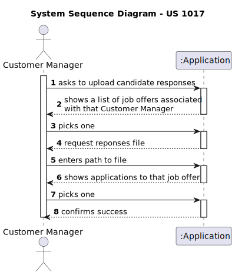
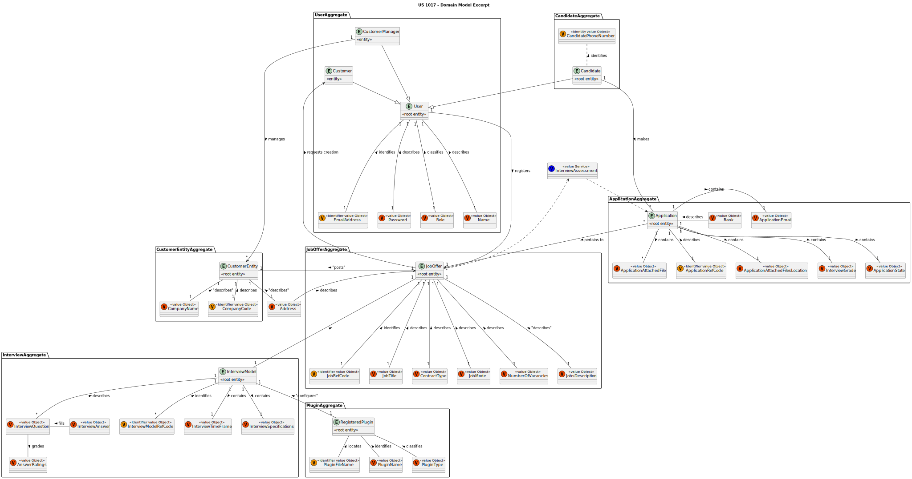
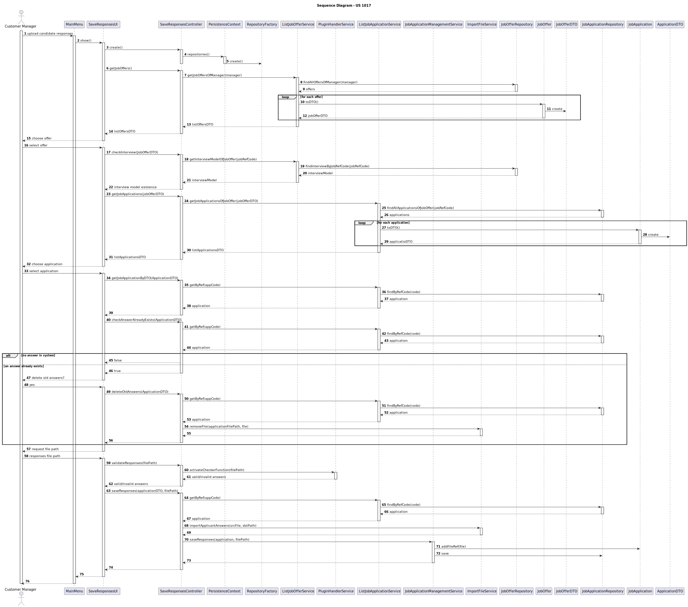
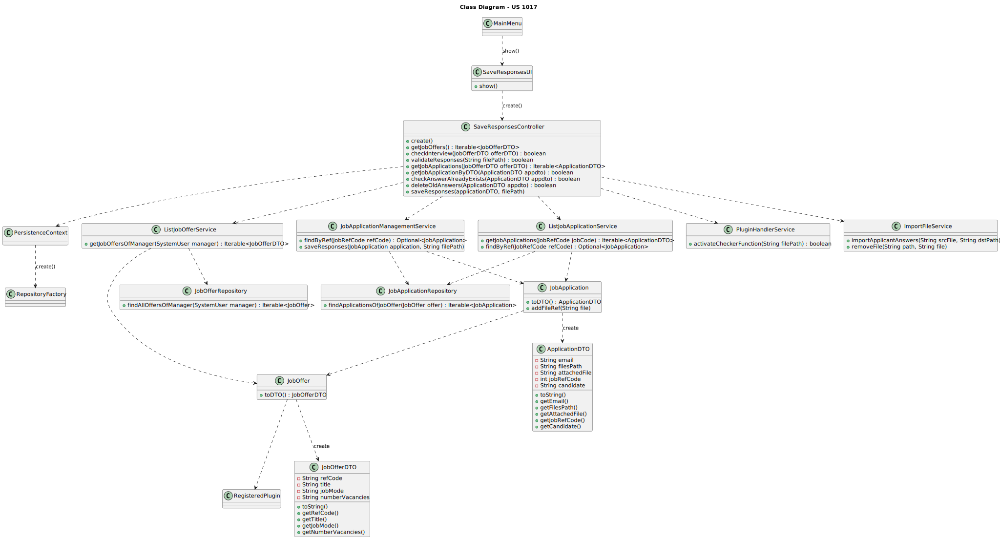
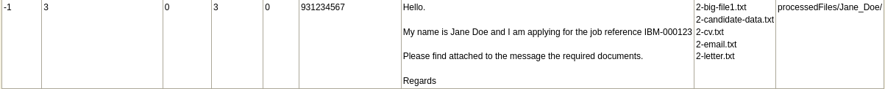
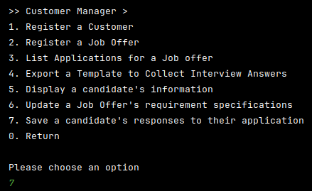
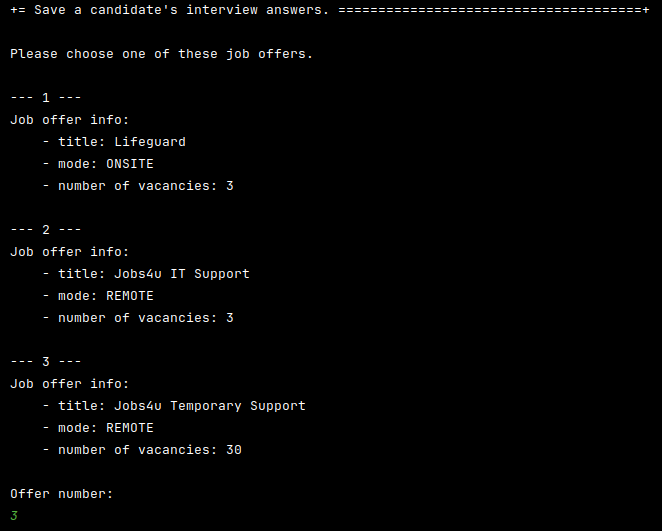
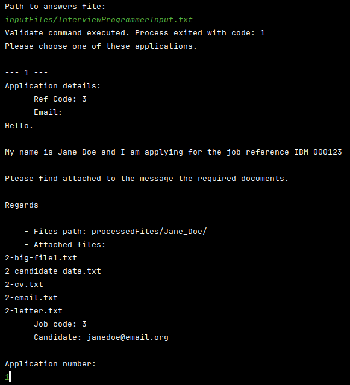
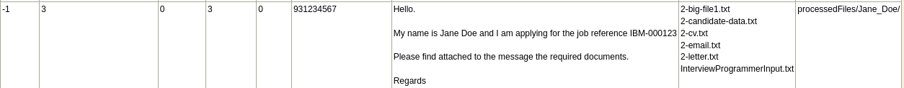

# 1017 As Customer Manager, I want to upload a text file with the candidate responses for an interview

## 1. Context

The Customer Manager is required to rank the applicants for each job opening, the first step in this process is uploading the candidate's interview answers so that they can be evaluated further on.
This US was first assigned during sprint C, as such it is the first time it is being worked on.

## 2. Requirements

"**US 1017 -** As Customer Manager, I want to upload a text file with the candidate responses for an interview."

**Acceptance Criteria:**

- **US 1017.1.** The system should retrieve job openings tied to the customer manager.
- **US 1017.2.** The system should allow the customer manager to select a job opening.
- **US 1017.3.** The system should validate that an interview model has already been chosen for that selected job opening.
- **US 1017.4.** The system should validate the answers file.
- **US 1017.5.** The system should then retrieve all applications to that job opening.
- **US 1017.6.** In the case of an answers file already existing the system should ask the user if they want to delete the previous one.
- **US 1017.7.** The system should copy the answer file into the appropriate location.

**Client Questions and Answers**

> **Q214** Pedro - US1017/1018 - O nosso grupo tem uma dúvida em relação ao processamento dos ficheiros de respostas dos candidatos para a entrevista. No caso de upload de um ficheiro, se a pergunta que requer um número como resposta for preenchida com um formato inválido, por exemplo, uma letra, devemos considerar isso como um formato inválido na US 1017 (e pedir para o user voltar a dar upload a um ficheiro válido) ou devemos, na US1018, considerar que está incorreta e atribuir 0 pontos automaticamente para essa resposta inválida? Isto é, na US 1017, devemos apenas verificar o formato do ficheiro ou devemos verificar também se as respostas são preenchidas com o tipo de dados correto?
>> **A214.** O caso mencionado deve ser considerado um erro de validação do ficheiro (ou seja, o ficheiro submetido não corresponde à gramática definida).

> **Q227** Bruno Fernandes – US 1017 - Em termos "upload" certamente passa pela verificação com a gramática e após sucesso colocar o ficheiro das respostas da entrevista junto da pasta com os ficheiros da "Application" certo?
>> **A227.** Sim, a sintaxe deve ser verificada e, se tudo estiver correto, o ficheiro deve ser “importado” para o sistema de forma a que possa ser usado posteriormente, por exemplo, no âmbito da US 1018. Qual a solução para o “importar” faz parte da vossa solução. Idealmente julgo que faria sentido que ficasse integrado na base de dados. Não sendo possível, penso que é aceitável que fique numa pasta/diretório de um servidor.

## 3. Analysis

Following the study of how the User Story should work, along with client clarifications, a few conclusions were taken:

- The system should check if a job offer has an associated interview model.
- The system must verify that the file given by the Customer Manager is according to the interview model chosen for that job offer.
- The system should copy the file to its appropriate location in the application files.

### System Sequence Diagram



### Relevant Domain Model Excerpt



## 4. Design

### 4.1. Realization



| Interaction ID |      Which Class is Responsible for...      |             Answer              |     Justification     |
| :------------: | :-----------------------------------------: | :-----------------------------: | :-------------------: |
|       3        |        instantiating the controller         |         SaveResponsesUI         |   Pure Fabrication    |
|       4        |        instantiating the persistence        |     SaveResponsesController     |   Pure Fabrication    |
|       5        |      instantiating repository factory       |       PersistenceContext        |        Factory        |
|       6        |            requesting job offers            |         SaveResponsesUI         |          MVC          |
|       7        |     requesting job offers from service      |     SaveResponsesController     |          MVC          |
|       8        |             finding job offers              |       ListJobOfferService       |        Service        |
|       9        |        knowing job offer information        |       JobOfferRepository        |    MVC, Repository    |
|       10       |         converting job offer to DTO         |            JobOffer             |          DTO          |
|       15       |         showing job offers to user          |         SaveResponsesUI         | MVC, Pure Fabrication |
|       16       |            accepting user input             |         SaveResponsesUI         | MVC, Pure Fabrication |
|       17       |      requesting interview model check       |         SaveResponsesUI         | MVC, Pure Fabrication |
|       18       |   requesting interview model from service   |     SaveResponsesController     | MVC, Pure Fabrication |
|       19       |              finding job offer              |       ListJobOfferService       |        Service        |
|       20       |        knowing job offer information        |       JobOfferRepository        |        Service        |
|       23       |         requesting job applications         |         SaveResponsesUI         | MVC, Pure Fabrication |
|       24       |    requesting applications from service     |     SaveResponsesController     | MVC, Pure Fabrication |
|       25       |            finding applications             |    ListJobApplicationService    |        Service        |
|       26       |       knowing application information       |    JobApplicationRepository     |    MVC, Repository    |
|       27       |        converting application to DTO        |         JobApplication          |          DTO          |
|       32       |        showing applications to user         |         SaveResponsesUI         | MVC, Pure Fabrication |
|       33       |            accepting user input             |         SaveResponsesUI         | MVC, Pure Fabrication |
|       34       |         requesting job application          |         SaveResponsesUI         | MVC, Pure Fabrication |
|       35       |     requesting application from service     |     SaveResponsesController     | MV, Pure Fabrication  |
|       36       |             finding application             |    ListJobApplicationService    |        Service        |
|       37       |       knowing application information       |    JobApplicationRepository     |    MVC, Repository    |
|       40       | requesting a check if answers already exist |         SaveResponsesUI         | MVC, Pure Fabrication |
|       41       |     requesting application from service     |     SaveResponsesController     | MV, Pure Fabrication  |
|       42       |             finding application             |    ListJobApplicationService    |        Service        |
|       43       |       knowing application information       |    JobApplicationRepository     |    MVC, Repository    |
|     47/48      |           communicating with user           |         SaveResponsesUI         | MVC, Pure Fabrication |
|       49       |            accepting user input             |         SaveResponsesUI         | MVC, Pure Fabrication |
|       49       |           requesting file removal           |         SaveResponsesUI         | MVC, Pure Fabrication |
|       50       |     requesting application from service     |     SaveResponsesController     | MV, Pure Fabrication  |
|       51       |             finding application             |    ListJobApplicationService    |        Service        |
|       52       |       knowing application information       |    JobApplicationRepository     |    MVC, Repository    |
|       54       |    requesting file removal from service     |     SaveResponsesController     | MVC, Pure Fabrication |
|       55       |                removing file                |        ImportFileService        |        Service        |
|       57       |          requesting responses file          |         SaveResponsesUI         | MVC, Pure Fabrication |
|       58       |            accepting user input             |         SaveResponsesUI         | MVC, Pure Fabrication |
|       59       |     requesting answers file validation      |         SaveResponsesUI         | MVC, Pure Fabrication |
|       60       |     requesting validation from service      |     SaveResponsesController     | MVC, Pure Fabrication |
|       61       |               validating file               |      PluginHandlerService       |        Service        |
|       63       |  requesting that the answers file is saved  |         SaveResponsesUI         | MVC,Pure Fabrication  |
|       64       |     requesting application from service     |     SaveResponsesController     | MV, Pure Fabrication  |
|       65       |             finding application             |    ListJobApplicationService    |        Service        |
|       66       |       knowing application information       |    JobApplicationRepository     |    MVC, Repository    |
|       68       |  requesting that file is saved to service   |     SaveResponsesController     | MVC, Pure Fabrication |
|       69       |    copying file to appropriate directory    |        FileImportService        |        Service        |
|       70       |      requesting application alteration      |     SaveResponsesController     | MVC, Pure Fabrication |
|       71       |          altering job application           | JobApplicationManagementService |        Service        |
|       72       |              saving alteration              |    JobApplicationRepository     |    MVC, Repository    |

### 4.2. Class Diagram



### 4.3. Applied Patterns

- Model View Controller
- DTO
- TDD
- Service
- Layered Architecture

### 4.4. Tests

**Refers to Acceptance Criteria: US 1017.4**

**Test 1:** Validates Symbol Table file is not null

```
@Test
void ensureInterviewNotNull() {
	IllegalArgumentException exception = assertThrows(IllegalArgumentException.class,
			() -> service.activateCheckerFunction(null, answersPath));
	assertEquals("Interview plugin should not be null.", exception.getMessage());
}

```

**Test 2:** Validates answers file is not null or empty

```
@Test
void ensureAnswerNotNull() {
	setup();
	IllegalArgumentException exception = assertThrows(IllegalArgumentException.class,
			() -> service.activateCheckerFunction(plugin, null));
	assertEquals("Source file should neither be empty nor null.", exception.getMessage());
	try {
		tearDown();
	} catch (IOException e) {
	}
}

@Test
void ensureAnswerNotEmpty() {
	setup();
	IllegalArgumentException exception = assertThrows(IllegalArgumentException.class,
			() -> service.activateCheckerFunction(plugin, ""));
	assertEquals("Source file should neither be empty nor null.", exception.getMessage());
	try {
		tearDown();
	} catch (IOException e) {
	}
}
```

**Test 3:** Ensures function can find answers file

```
@Test
void ensureAnswerFileExists() {
	setup();
	IllegalArgumentException exception = assertThrows(IllegalArgumentException.class,
			() -> service.activateCheckerFunction(plugin, "src/invalidDir/invalidSubDir/hello.txt"));
	assertEquals("Source file not found.", exception.getMessage());
	try {
		tearDown();
	} catch (IOException e) {
	}
}
```

**Refers to Acceptance Criteria: US 1017.6**

**Test 1:** Validates that path and file passed as parameter are not null or empty

```
@Test
void ensureRemovePathNotNull() {
	IllegalArgumentException exception = assertThrows(IllegalArgumentException.class,
			() -> service.removeFile(null, fl));
	assertEquals("Path should neither be empty nor null.", exception.getMessage());
}

@Test
void ensureRemovePathNotEmpty() {
	IllegalArgumentException exception = assertThrows(IllegalArgumentException.class,
			() -> service.removeFile("", fl));
	assertEquals("Path should neither be empty nor null.", exception.getMessage());
}


@Test
void ensureRemoveFileNotNull() {
	IllegalArgumentException exception = assertThrows(IllegalArgumentException.class,
			() -> service.removeFile(dstPath, null));
	assertEquals("File should neither be empty nor null.", exception.getMessage());
}

@Test
void ensureRemoveFileNotEmpty() {
	IllegalArgumentException exception = assertThrows(IllegalArgumentException.class,
			() -> service.removeFile(dstPath, ""));
	assertEquals("File should neither be empty nor null.", exception.getMessage());
}
```

**Test 2:** Validates file to remove exists

```
@Test
void ensureRemoveFileExists() {
	IllegalArgumentException exception = assertThrows(IllegalArgumentException.class,
			() -> service.removeFile(dstPath, fl));
	assertEquals("Source file not found.", exception.getMessage());
}
```

**Test 3:** Validates file was correctly removed from folder

```
@Test
void ensureCorrectRemoval() {
	File src = new File(fileTest);
	try {
		src.createNewFile();
	} catch (IOException e) {
		e.printStackTrace();
	}
	try {
		service.removeFile(dstPath, fl);
	} catch (IOException e) {
		e.printStackTrace();
	}
	assertFalse(src.exists());
}
```

**Refers to Acceptance Criteria: US 1017.7**

**Test 1:** Validates that files passed as parameter are not null or empty

```
@Test
void ensureImportSrcNotNull() {
	IllegalArgumentException exception = assertThrows(IllegalArgumentException.class,
			() -> service.importApplicantAnswers(null, dstPath));
	assertEquals("Source file should neither be empty nor null.", exception.getMessage());
}

@Test
void ensureImportSrcNotEmpty() {
	IllegalArgumentException exception = assertThrows(IllegalArgumentException.class,
			() -> service.importApplicantAnswers("", dstPath));
	assertEquals("Source file should neither be empty nor null.", exception.getMessage());
}

@Test
void ensureImportDstNotNull() {
	IllegalArgumentException exception = assertThrows(IllegalArgumentException.class,
			() -> service.importApplicantAnswers(srcFile, null));
	assertEquals("Destination directory should neither be empty nor null.", exception.getMessage());
}

@Test
void ensureImportDstNotEmpty() {
	IllegalArgumentException exception = assertThrows(IllegalArgumentException.class,
			() -> service.importApplicantAnswers(srcFile, ""));
	assertEquals("Destination directory should neither be empty nor null.", exception.getMessage());
}
```

**Test 2:** Validates that files passed as parameter exist

```
@Test
void ensureImportSrcExists() {
	IllegalArgumentException exception = assertThrows(IllegalArgumentException.class,
			() -> service.importApplicantAnswers("helper/src/testFile.txt", dstPath));
	assertEquals("Source file not found.", exception.getMessage());
}

@Test
void ensureImportDstExists() {
	IllegalArgumentException exception = assertThrows(IllegalArgumentException.class,
			() -> service.importApplicantAnswers(srcFile, "helper/dst"));
	assertEquals("Destination directory not found.", exception.getMessage());
}
```

**Test 3:** Validates successful copy of file

```
@Test
void ensureImportSuccessfulCopy() throws IOException {
	service.importApplicantAnswers(srcFile, dstPath);
	File f = new File("src/test/java/jobs4u/base/common/helper/dest/testFile.txt");
	assertTrue(f.exists() && f.isFile());
	f.delete();
}
```

**Test 4:** Validates that files is not null or empty

```
@Test
void ensureExtractNotNull() {
	IllegalArgumentException exception = assertThrows(IllegalArgumentException.class,
			() -> service.extractFileName(null));
	assertEquals("File should neither be empty nor null.", exception.getMessage());
}

@Test
void ensureExtractNotEmpty() {
	IllegalArgumentException exception = assertThrows(IllegalArgumentException.class,
			() -> service.extractFileName(""));
	assertEquals("File should neither be empty nor null.", exception.getMessage());
}
```

**Test 5:** Validates that file exists

```
@Test
void ensureExtractExists() {
	IllegalArgumentException exception = assertThrows(IllegalArgumentException.class,
			() -> service.extractFileName("helper/src/testFile.txt"));
	assertEquals("File not found.", exception.getMessage());
}
```
	
**Test 6:** Verifies successfully operation

```
@Test
void ensureExtractSuccessful() {
	assertEquals("testFile.txt", service.extractFileName(srcFile));
}
```

### 4.5 Design Commits:

> **[US 1017] -** getting started with readme documentation
> May 21 2024 19:51:32

> **[US 1017] -** creating sd and ssd for US 1017
> May 22 2024 19:30:12
> - Creating System Sequence Diagram and Sequence Diagram

> **[US 1017] -** updating documentation
> May 24 2024 20:55:14
> - Created Class Diagram

> **[US 1017] -** updating documentation
> May 25 2024 17:46:08
> - Updated SD, SSD, CD
> - Created Domain Model excerpt

> **[US 1017] -** update documentation and creating possible tests framework
> May 26 2024 17:44:32
> - Documentation update
> - Implementing testing framework

## 5. Implementation

**SaveResponsesController**

```java
public class SaveResponsesController {
	public Iterable<JobOfferDto> getJobOffers() {
		autService.ensureAuthenticatedUserHasAnyOf(BaseRoles.CUSTOMER_MANAGER);
		SystemUser manager = autService.loggedinUserWithPermissions(BaseRoles.CUSTOMER_MANAGER).get();
		return offerService.getJobOffersOfManager(manager);
	}

	public boolean checkInterview(JobOfferDto offerdto) {
		autService.ensureAuthenticatedUserHasAnyOf(BaseRoles.CUSTOMER_MANAGER);
		Optional<RegisteredPlugin> plugin = offerService
				.getInterviewModelOfJobOffer(new JobRefCode(Integer.parseInt(offerdto.getRefCode())));
		if (plugin.isEmpty())
			return false;
		return true;
	}

	public boolean validateResponses(String filePath) throws IllegalArgumentException {
		autService.ensureAuthenticatedUserHasAnyOf(BaseRoles.CUSTOMER_MANAGER);
		return pluginHandlerService.activateCheckerFunction(filePath);
	}

	public Iterable<ApplicationDTO> getJobApplicationsOfJobOffer(JobOfferDto offerdto) {
		autService.ensureAuthenticatedUserHasAnyOf(BaseRoles.CUSTOMER_MANAGER);
		return listApplicationService
				.getJobApplicationsOfJobOfferCode(new JobRefCode(Integer.parseInt(offerdto.getRefCode())));
	}

	public boolean getJobApplicationByDTO(ApplicationDTO appdto) {
		autService.ensureAuthenticatedUserHasAnyOf(BaseRoles.CUSTOMER_MANAGER);
		Optional<JobApplication> temp = listApplicationService.getByRef(appdto.getRefCode());
		if (temp.isEmpty())
			return false;
		return true;

	}

	public boolean checkAnswerAlreadyExists(ApplicationDTO appdto) {
		autService.ensureAuthenticatedUserHasAnyOf(BaseRoles.CUSTOMER_MANAGER);
		JobApplication app = listApplicationService.getByRef(appdto.getRefCode()).orElse(null);
		String[] fls = app.getFileRef().split("\n");
		for (String s : fls) {
			if (s.contains("_INTERVIEW"))
				return true;
		}
		return false;
	}

	public boolean deleteOldAnswers(ApplicationDTO appdto) {
		autService.ensureAuthenticatedUserHasAnyOf(BaseRoles.CUSTOMER_MANAGER);
		JobApplication app = listApplicationService.getByRef(appdto.getRefCode()).orElse(null);
		String file = "";
		String[] fls = app.getFileRef().split("\n");
		for (String s : fls) {
			if (s.contains("_INTERVIEW"))
				file = s;
		}
		if (file.isEmpty())
			return false;
		try {
			fileService.removeFile(app.getFilePath(), file);
		} catch (IOException e) {
			System.out.println("Error removing file.");
			e.printStackTrace();
			return false;
		}
		return true;
	}

	public void saveResponses(ApplicationDTO appdto, String filePath) throws IOException {
		autService.ensureAuthenticatedUserHasAnyOf(BaseRoles.CUSTOMER_MANAGER);

		JobApplication app = listApplicationService.getByRef(appdto.getRefCode()).orElse(null);

		String fileName = "";
		if (app == null)
			throw new IllegalArgumentException("Job Application not found.");
		try {
			fileName = fileService.importApplicantAnswers(filePath, app.getFilePath(), PluginType.INTERVIEW);
		} catch (IOException e) {
			throw e;
		}
		applicationService.saveResponses(app, fileName);
	}
}
```

**ListJobOfferService**
```java
public class ListJobOfferService {
    public Iterable<JobOfferDto> getJobOffersOfManager(SystemUser manager) {
        Iterable<JobOffer> offers = repo.findAllOffersOfManager(manager);
        List<JobOfferDto> ret = new ArrayList<>();
        offers.forEach(o -> ret.add(o.toDTO()));
        return ret;
    }

    public Optional<RegisteredPlugin> getInterviewModelOfJobOffer(JobRefCode code) {
        JobOffer offer = repo.findByRef(code).orElse(null);
        if (offer == null || offer.getInterview() == null)
            return null;
        return Optional.of(offer.getInterview());
    }
}
```

**JpaJobOfferRepository**
```java
class JpaJobOfferRepository
        extends JpaAutoTxRepository<JobOffer, JobRefCode, JobRefCode>
        implements JobOfferRepository {
    public Iterable<JobOffer> findAllOffersOfManager(SystemUser manager) {
        return createQuery(
                "select j from JobOffer j where j.customer.customerManagerUser = :manager",
                JobOffer.class).setParameter("manager", manager).getResultList();
    }
}
```

**PluginHandlerService**
```java
public class PluginHandlerService {
    public boolean activateCheckerFunction(RegisteredPlugin interview, String answersFile) {
        return activatePluginValidate("-validate", "-interview", interview.fileName().toString(), answersFile);
    }

    private boolean activatePluginValidate(String action, String type, String file, String answers) {
        int exitCode = 0;
        try {
            String[] command = {"java", "-jar", "lib/InterviewModel.jar", action, type, file, answers};
            ProcessBuilder processBuilder = new ProcessBuilder(command);
            Process process = processBuilder.start();

            exitCode = process.waitFor();
            System.out.println("Validate command executed. Process exited with code: " + exitCode);

        } catch (IOException | InterruptedException e) {
            e.printStackTrace();
        }
        if (exitCode != 1)
            return false;
        return true;
    }
}
```

**ListJobApplicationService**
```java
public class ListJobApplicationService {
    public Iterable<ApplicationDTO> getJobApplicationsOfJobOfferCode(JobRefCode code) {
        Iterable<JobApplication> apps = repo.findAllApplicationsOfJobOffer(code);
        List<ApplicationDTO> ret = new ArrayList<>();
        apps.forEach(a -> ret.add(a.toDTO()));
        return ret;
    }

    public Optional<JobApplication> getByRef(int code) {
        return repo.findByRefCode(code);
    }
}
```

**JpaJobApplicationRepository**
```java
public class JpaJobApplicationRepository
        extends JpaAutoTxRepository<JobApplication, Integer, Integer>
        implements JobApplicationRepository {
    public Iterable<JobApplication> findAllApplicationsOfJobOffer(JobRefCode code) {
        return createQuery("select a from JobApplication a where a.joboffer.jobRefCode = :code", JobApplication.class)
                .setParameter("code", code).getResultList();
    }

    public Optional<JobApplication> findByRefCode(Integer code) {
        JobApplication app = (createQuery("select a from JobApplication a where a.refCode = :code", JobApplication.class)
                .setParameter("code", code).getSingleResult());
        if (app == null)
            return null;
        return Optional.of(app);
    }
}
```

**ImportFileService**
```java
public class ImportFileService {
    public void importApplicantAnswers(String srcPath, String dstPath) throws IOException {
        if (srcPath == null || srcPath.isBlank())
            throw new IllegalArgumentException("Source file should neither be empty nor null.");
        if (dstPath == null || dstPath.isBlank())
            throw new IllegalArgumentException("Destination directory should neither be empty nor null.");
        File src = new File(srcPath);
        if (!src.exists() || !src.isFile())
            throw new IllegalArgumentException("Source file not found.");
        File dst = new File(dstPath);
        if (!dst.exists() || !dst.isDirectory())
            throw new IllegalArgumentException("Destination directory not found.");
        FileUtils.copyFileToDirectory(src, dst, false);
    }

    public String extractFileName(String filePath) {
        if (filePath == null || filePath.isBlank())
            throw new IllegalArgumentException("File should neither be empty nor null.");
        File f = new File(filePath);
        if (!f.exists() || !f.isFile())
            throw new IllegalArgumentException("File not found.");
        return f.getName();
    }

    public void removeFile(String path, String file) throws IOException {
        if (path == null || path.isBlank())
            throw new IllegalArgumentException("Path should neither be empty nor null.");
        if (file == null || file.isBlank())
            throw new IllegalArgumentException("File should neither be empty nor null.");
        String filePath = path;
        if (!(filePath.endsWith("/") || filePath.endsWith("\\")))
            filePath += File.separator;
        filePath += file;
        File src = new File(filePath);
        if (!src.exists() || !src.isFile())
            throw new IllegalArgumentException("Source file not found.");
        if (!src.delete())
            throw new IOException("Error deleting file.");
    }
}
```

**JobApplicationManagementService**
```java
public class JobApplicationManagementService {
    public void saveResponses(JobApplication app, String file) {
        app.addFileRef(file);
        repo.save(app);
    }
}
```

### Main Commits

> **[US 1017] -** update documentationa and creating possible tests framework
> May 26 2024 17:44:32
> - Documentation update
> - Implementing testing framework

> **[US 1017] -** created implementation
> May 26 2024 19:14:59
> - Created Framework for implementation according to diagrams

> **[US 1017] -** Implementation almost finished, updating documentation
> May 27 2024 20:49:30
> - Finished implementation

> **[US 1017] -** documentation update
> Sat Jun 08 2024 15:56:38
> - Updated documentation to reflect information acquired during class (removal of global variables from controller)

> **[US 1017] -** updating implementation to better reflect documentation
> Sat Jun 08 2024 17:04:50
> - Updated implementation to remove global variables from controller


## 6. Integration/Demonstration

This User Story required processing new files in the system and altering objects in the data base, along with extending the purpose of the plugin developed in the previous sprint.

### Saving Answers File











**Relevant Script excerpt**
```
if (arg.contains("-validate")) {
	try {
		lexer = new ModelLexer(CharStreams.fromFileName(args[1]));
		tokens = new CommonTokenStream(lexer);
		parser = new ModelParser(tokens);
		model = new Interview(parser.start());
		System.exit(1);
	} catch (Exception e) {
		System.exit(-1);
	}
}
```
> Script developed for LPROG that can do several things relevant to the project. For this US specifically it attempts to build all the necessary requirements to validate the answers, without outputting their grade. If successful it'll return a 1, otherwise resulting in a -1.
