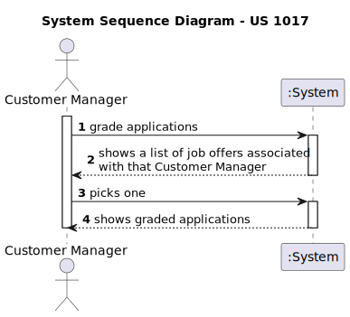
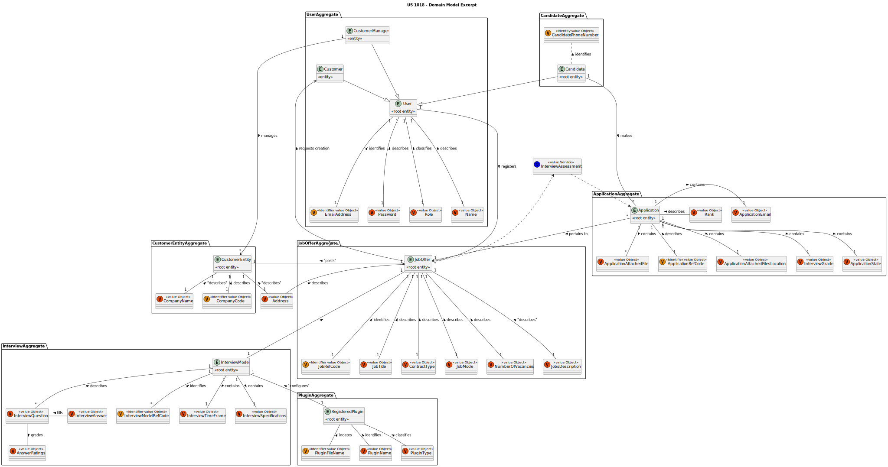
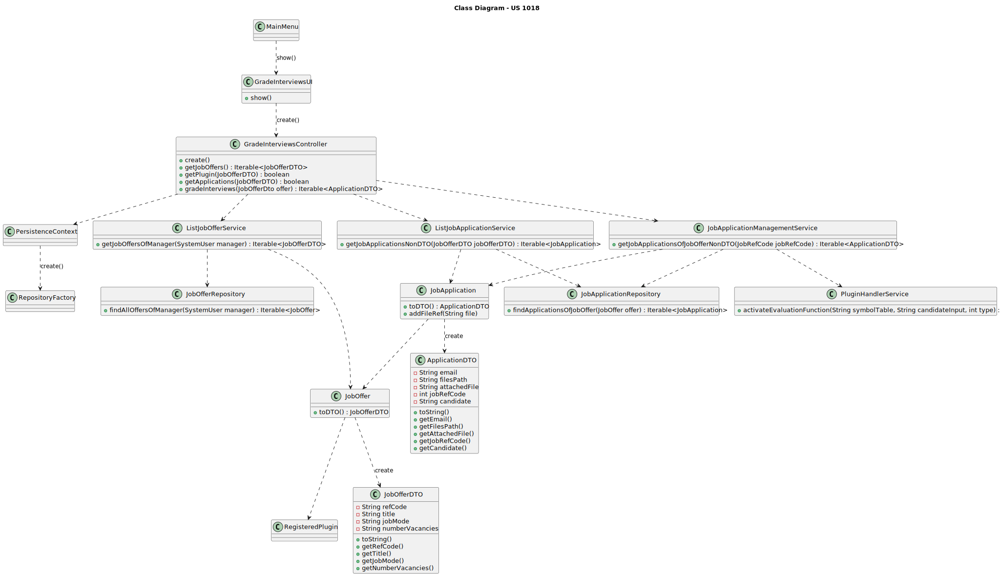
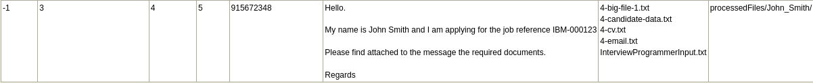
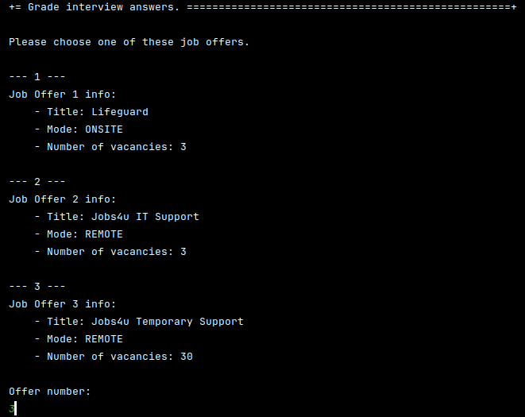
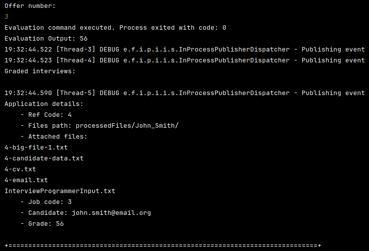

# US 1018 - As Customer Manager, I want to execute the process that evaluates (grades) the interviews for a job opening

## 1. Context

The focus of this User Story is to allow Customer Managers to grade the applications submitted to job offers assigned to them, which serves as an important start point for several other USs that require an ordered list of applicants.
This US was first assigned during sprint C, as such it is the first time it is being worked on.

## 2. Requirements

**US 1018** As Customer Manager, I want to execute the process that evaluates (grades) the interviews for a job opening.

**Client Questions and Answers**

> **Q49** Diogo – Numa validação de requisitos a falha deve ser justificada. Numa entrevista também?
>> **A49.** Não. Nas entrevistas a ideia não é aceitar ou rejeitar um candidato mas avaliar um candidato numa escala de 0 a 100. A forma como isso é feito está descrita na secção 2.2.4.

> **Q199** Ribeiro – US1018 – Relativamente à US1018, após a execução do processo de avalição de todas as entrevistas da job opening, a fase em que esta se encontra deve ser automaticamente mudado para "Result" ou deve ser mantida em "Analysis" e apenas pode ser mudada pela execução da US1010?
>> **A199.** A US1018 não deve alterar a fase actual. A US1010 permite fazer a mudança de fases do processo de recrutamento

> **Q214** Pedro - US1017/1018 - O nosso grupo tem uma dúvida em relação ao processamento dos ficheiros de respostas dos candidatos para a entrevista. No caso de upload de um ficheiro, se a pergunta que requer um número como resposta for preenchida com um formato inválido, por exemplo, uma letra, devemos considerar isso como um formato inválido na US 1017 (e pedir para o user voltar a dar upload a um ficheiro válido) ou devemos, na US1018, considerar que está incorreta e atribuir 0 pontos automaticamente para essa resposta inválida? Isto é, na US 1017, devemos apenas verificar o formato do ficheiro ou devemos verificar também se as respostas são preenchidas com o tipo de dados correto?
>> **A214.** O caso mencionado deve ser considerado um erro de validação do ficheiro (ou seja, o ficheiro submetido não corresponde à gramática definida).

> **Q238** Nuno Marinho – US1018 - Relativamente a resposta que forneceu na Q206, referiu que uma jobOpening suporta apenas uma entrevista, isto significa que só um candidato que fez uma candidatura pode ser entrevistado de cada vez ou que cada candidatura está associada aquela entrevista em específico? Além disso cada candidatura que sofre uma entrevista terá de ter uma resposta a essa entrevista ou será antes a entrevista de uma job Opening terá uma resposta? Esta dúvida surge pois na US1018 é suposto avaliar todas as entrevistas de uma jobOpening quando disse que uma jobOpening suporta apenas uma entrevista.
>> **A238.** Peço desculpa se não ficou claro, mas então deviam ter colocar a questão há mais tempo. Para cada job opening define-se o processo de recrutamento. Este pode ter ou não uma fase e entrevista. Se tiver fase de entrevista, então podemos admitir que é apenas uma entrevista. Mas quando digo isso, quero dizer uma entrevista para cada candidato e não uma entrevista para todos os candidatos a essa job opening. Penso que isso era claro. Caso contrário não fazia sentido ter, por exemplo, uma US para marcar uma entrevista com um candidato. Marcava-se uma entrevista com “todos” os candidatos ao mesmo tempo? Cada candidato, quando é entrevistado, são preenchidas as respostas que esse candidato deu na sua entrevista no documento que depois é submetido (US1017). Portanto, se houver fase de entrevistas, cada candidato deve ter a sua entrevista e a sua “classificação” nessa sua entrevista.

**Acceptance Criteria:**

- **US 1018.1.** The system should retrieve job openings tied to the customer manager.
- **US 1018.2.** The system should allow the customer manager to select a job opening.
- **US 1018.3.** The system should then retrieve all applications to that job opening.
- **US 1018.4.** Having obtained the applications it should then grade any ungraded applications based on the interview questions, ignoring any applications that don't have an answers file.

**Dependencies/References:**

- **NFR09 (LPROG) -** Requirement Specifications and Interview Models The support for this functionality must follow  technical requirements, specified in LPROG. The ANTLR tool should be used (<https://www.antlr.org/>)
- **G007 -** requires authentication to be implemented.
- **US 2002 -** requires the creation of applications.
- **US 2001 -** requires applications to be in the system.
- **US 1002 -** requires job openings to be created so that candidates can submit applications.
- **US 1007 -** requires the complete set-up of job openings.
- **US 1008 -** requires plugins to have already been configured to use them to grade the answers.
- **US 1011 -** requires that a job opening already have an associated interview model to be used in grading.
- **US 1017 -** requires the candidate answers to already be in the system.

## 3. Analysis

Following the study of how the user story should work, the following conclusions were taken:

- The system should check if a job offer has an associated interview model.
- Only applications that are in the state MR (meets requirements) are graded
- All applications of that job offer that meet the above requirements should be graded

### System Sequence Diagram



### Relevant Domain Model Excerpt



## 4. Design

### 4.1. Realization


| Interaction ID |     Which Class is Responsible for...     |             Answer              |     Justification     |
| :------------: | :---------------------------------------: | :-----------------------------: | :-------------------: |
|       3        |       instantiating the controller        |        GradeInterviewsUI        |   Pure Fabrication    |
|       4        |       instantiating the persistence       |    GradeInterviewsController    |   Pure Fabrication    |
|       5        |     instantiating repository factory      |       PersistenceContext        |        Factory        |
|       6        |           requesting job offers           |        GradeInterviewsUI        |          MVC          |
|       7        |    requesting job offers from service     |    GradeInterviewsController    |          MVC          |
|       8        |            finding job offers             |       ListJobOfferService       |        Service        |
|       9        |       knowing job offer information       |       JobOfferRepository        |    MVC, Repository    |
|       10       |        converting job offer to DTO        |            JobOffer             |          DTO          |
|       15       |        showing job offers to user         |        GradeInterviewsUI        | MVC, Pure Fabrication |
|       16       |           accepting user input            |        GradeInterviewsUI        | MVC, Pure Fabrication |
|       17       |        requesting interview model         |        GradeInteviewsUI         | MVC, Pure Fabrication |
|       18       |  requesting interview model from service  |    GradeInterviewsController    | MVC, Pure Fabrication |
|       19       |             finding job offer             |       ListJobOfferService       |        Service        |
|       20       |       knowing job offer information       |       JobOfferRepository        |        Service        |
|       23       |          requesting applications          |        GradeInterviewsUI        | MVC, Pure Fabrication |
|       24       |    requesting application from service    |    GradeInterviewsController    | MVC, Pure Fabrication |
|       25       |           finding applications            |    ListJobApplicationService    |        Service        |
|       26       |      knowing application information      |    JobApplicationRepository     |    MVC, Repository    |
|       29       |       requesting interview grading        |        GradeInterviewsUI        | MVC, Pure Fabrication |
|       30       |  requesting interview model from service  |    GradeInterviewsController    | MVC, Pure Fabrication |
|       31       |             finding job offer             |       ListJobOfferService       |        Service        |
|       32       |       knowing job offer information       |       JobOfferRepository        |        Service        |
|       34       |    requesting application from service    |    GradeInterviewsController    | MVC, Pure Fabrication |
|       35       |           finding applications            |    ListJobApplicationService    |        Service        |
|       36       |      knowing application information      |    JobApplicationRepository     |    MVC, Repository    |
|       38       | requesting interview grading from service |    GradeInterviewsController    | MVC, Pure Fabrication |
|       39       |            grading interviews             |      PluginHandlerService       |        Service        |
|       40       |         altering job application          | JobApplicationManagementService |        Service        |
|       41       |             saving alteration             |    JobApplicationRepository     |    MVC, Repository    |
|       42       |       converting application to DTO       |         JobApplication          |          DTO          |

### 4.2. Class Diagram



### 4.3. Applied Patterns

- Model View Controller
- DTO
- Service
- Repository
- Layered Architecture

### 4.4. Tests

This User Story relies on information related to persistence, be it retrieving and showing it, or altering, thus there are no tests that can be developed for this functionality.

## 5. Implementation

**GradeInterviewsController**
```java
public class SaveResponsesController {
	public Iterable<JobOfferDto> getJobOffers() {
		autService.ensureAuthenticatedUserHasAnyOf(BaseRoles.CUSTOMER_MANAGER);
		SystemUser manager = autService.loggedinUserWithPermissions(BaseRoles.CUSTOMER_MANAGER).get();
		return offerService.getJobOffersOfManager(manager);
	}

	public boolean checkInterview(JobOfferDto offerdto) {
		autService.ensureAuthenticatedUserHasAnyOf(BaseRoles.CUSTOMER_MANAGER);
		Optional<RegisteredPlugin> plugin = offerService
				.getInterviewModelOfJobOffer(new JobRefCode(Integer.parseInt(offerdto.getRefCode())));
		if (plugin.isEmpty())
			return false;
		return true;
	}

	public boolean validateResponses(String filePath) throws IllegalArgumentException {
		autService.ensureAuthenticatedUserHasAnyOf(BaseRoles.CUSTOMER_MANAGER);
		return pluginHandlerService.activateCheckerFunction(filePath);
	}

	public Iterable<ApplicationDTO> getJobApplicationsOfJobOffer(JobOfferDto offerdto) {
		autService.ensureAuthenticatedUserHasAnyOf(BaseRoles.CUSTOMER_MANAGER);
		return listApplicationService
				.getJobApplicationsOfJobOfferCode(new JobRefCode(Integer.parseInt(offerdto.getRefCode())));
	}

	public boolean getJobApplicationByDTO(ApplicationDTO appdto) {
		autService.ensureAuthenticatedUserHasAnyOf(BaseRoles.CUSTOMER_MANAGER);
		Optional<JobApplication> temp = listApplicationService.getByRef(appdto.getRefCode());
		if (temp.isEmpty())
			return false;
		return true;

	}

	public boolean checkAnswerAlreadyExists(ApplicationDTO appdto) {
		autService.ensureAuthenticatedUserHasAnyOf(BaseRoles.CUSTOMER_MANAGER);
		JobApplication app = listApplicationService.getByRef(appdto.getRefCode()).orElse(null);
		String[] fls = app.getFileRef().split("\n");
		for (String s : fls) {
			if (s.contains("_INTERVIEW"))
				return true;
		}
		return false;
	}

	public boolean deleteOldAnswers(ApplicationDTO appdto) {
		autService.ensureAuthenticatedUserHasAnyOf(BaseRoles.CUSTOMER_MANAGER);
		JobApplication app = listApplicationService.getByRef(appdto.getRefCode()).orElse(null);
		String file = "";
		String[] fls = app.getFileRef().split("\n");
		for (String s : fls) {
			if (s.contains("_INTERVIEW"))
				file = s;
		}
		if (file.isEmpty())
			return false;
		try {
			fileService.removeFile(app.getFilePath(), file);
		} catch (IOException e) {
			System.out.println("Error removing file.");
			e.printStackTrace();
			return false;
		}
		return true;
	}

	public void saveResponses(ApplicationDTO appdto, String filePath) throws IOException {
		autService.ensureAuthenticatedUserHasAnyOf(BaseRoles.CUSTOMER_MANAGER);

		JobApplication app = listApplicationService.getByRef(appdto.getRefCode()).orElse(null);

		String fileName = "";
		if (app == null)
			throw new IllegalArgumentException("Job Application not found.");
		try {
			fileName = fileService.importApplicantAnswers(filePath, app.getFilePath(), PluginType.INTERVIEW);
		} catch (IOException e) {
			throw e;
		}
		applicationService.saveResponses(app, fileName);
	}
}

```

**ListJobOfferService**
```java
public class ListJobOfferService {
    public Iterable<JobOfferDto> getJobOffersOfManager(SystemUser manager) {
        Iterable<JobOffer> offers = repo.findAllOffersOfManager(manager);
        List<JobOfferDto> ret = new ArrayList<>();
        offers.forEach(o -> ret.add(o.toDTO()));
        return ret;
    }

    public Optional<RegisteredPlugin> getInterviewModelOfJobOffer(JobRefCode code) {
        JobOffer offer = repo.findByRef(code).orElse(null);
        if (offer == null || offer.getInterview() == null)
            return null;
        return Optional.of(offer.getInterview());
    }
}
```

**JpaJobOfferRepository**
```java
class JpaJobOfferRepository
        extends JpaAutoTxRepository<JobOffer, JobRefCode, JobRefCode>
        implements JobOfferRepository {
    public Iterable<JobOffer> findAllOffersOfManager(SystemUser manager) {
        return createQuery(
                "select j from JobOffer j where j.customer.customerManagerUser = :manager",
                JobOffer.class).setParameter("manager", manager).getResultList();
    }
}
```

**ListJobApplicationService**
```java
public class ListJobApplicationService {
    public Iterable<JobApplication> getJobApplicationsOfJobOfferCodeNonDTO(JobRefCode code) {
        Iterable<JobApplication> ret = repo.findAllApplicationsOfJobOffer(code);
        return ret;
    }
}
```

**JobApplicationManagementService**
```java
public class JobApplicationManagementService {
    public Iterable<ApplicationDTO> gradeAndSave(List<JobApplication> apps, String interview) {
        String arr[], helper;
        boolean graded;
        int grade, helper2;
        List<ApplicationDTO> ret = new ArrayList<>();
        Pattern nonAnswersPattern = Pattern.compile(
                "^\\d+-((candidate-data|cv|email|letter)|(big-file-\\d+|report-\\d+)){1}(.txt)$",
                Pattern.CASE_INSENSITIVE);

        for (JobApplication a : apps) {
            if (a.getState() != ApplicationState.MR)
                continue;

            arr = a.getFileRef().split("\n");
            grade = 0;
            graded = false;

            for (String s : arr) {
                if (nonAnswersPattern.matcher(s).matches())
                    continue;

                helper = a.getFilePath();
                if (!helper.endsWith(File.separator))
                    helper += File.separator;
                helper += s;

                grade = pluginHandlerService.activateEvaluationFunction(interview, helper, 2);
                graded = true;
            }

            if (!graded)
                continue;

            a.setGrade(grade);
            a.setState(ApplicationState.GRADED);
            repo.save(a);
            ret.add(a.toDTO());
        }
        return ret;
    }
}
```

### Relevant Commits

> **[US 1018] -** getting started with readme documentation
> May 21 2024 19:51:46

> **[US 1018] -** updated documentation, creatd SSD, SD, and CD
> May 29 2024 18:14:01
>> First iteration of:
>> - System Sequence Diagram
>> - Sequence Diagram
>> - Class Diagram

> **[US 1018] -** implementation complete, needs testing
> May 30 2024 16:54:52
>> Implemented code according to documention. Unable to test due to bootstrap errors at the time.

> **[US 1018] -** added state change to service
> May 31 2024 16:40:34
>> Updated implementation to enable working with application state

> **[US 1018] -** updating sequence diagram and class diagram with controller rework
> Jun 02 2024 19:39:33
>> Updated controller class in documentation

> **[US 1018] -** bugfixing and updating implementation to reflect controller changes
> Jun 02 2024 19:41:08
>> Finished testing and implementing controller changes

> **[US 1018] -** updating SD and CD
> Sat Jun 08 2024 16:12:12
> - Updated documentation to reflect information aquired during class (removal of global variables from controller)

> **[US 1018] -** updating implementation to better reflect documentation
> Sat Jun 08 2024 17:04:16
> - Updated implementation to remove global variables from controller

## 6. Integration/Demonstration

This user story required the use of the plugin developed in the previous sprint in order to grade the interviews, thus efforts were taken in accordance to this necessity.

### Grading interviews









**Relevant Script excerpt**
```
if (arg.contains("-evaluate")) {
	SymbolTable.getInstance().importTableFromFile(args[2]);
	SymbolTable.getInstance();
	lexer = new ModelLexer(CharStreams.fromFileName(args[3]));
	tokens = new CommonTokenStream(lexer);
	parser = new ModelParser(tokens);
	switch (args[1]) {
		case "-requirements":
			model = new Requirements(parser.start());
			break;
		case "-interview":
			model = new Interview(parser.start());
			break;
	}
	if (args[1].contains("-interview")) {
		try {
			System.exit(model.assessAnswers());
			// System.out.println(model.assessAnswers());
		} catch (IOException e) {
			System.exit(-1);
			// throw new RuntimeException(e.getMessage());
		}
	} else {
		if (model.assessAnswers() != 0) {
			System.exit(1);
			// System.out.println(1);
		} else {
			System.exit(0);
			// System.out.println(0);
		}
	}
}
```
> Script developed for LPROG that can do several things relevant to the project. For this US specifically it attempts to grade the interview answer according to the interview model specified in the job offer.
