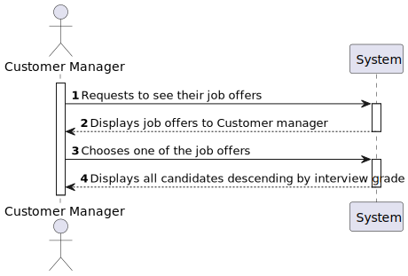
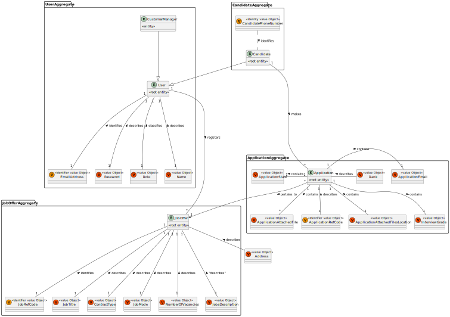
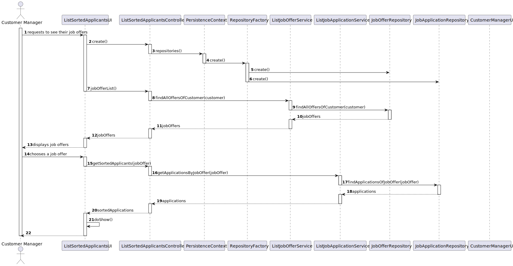
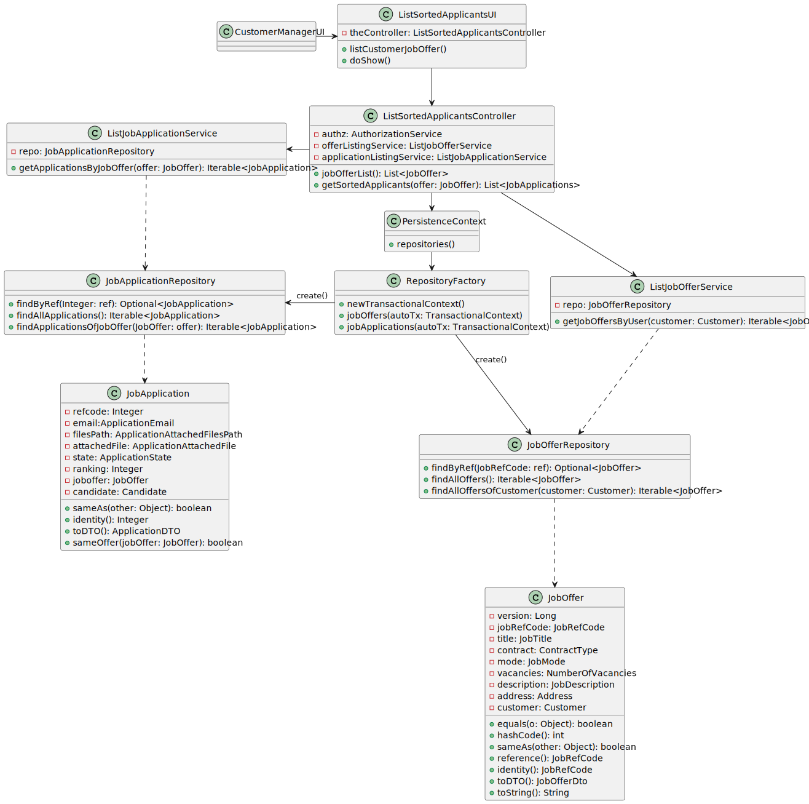
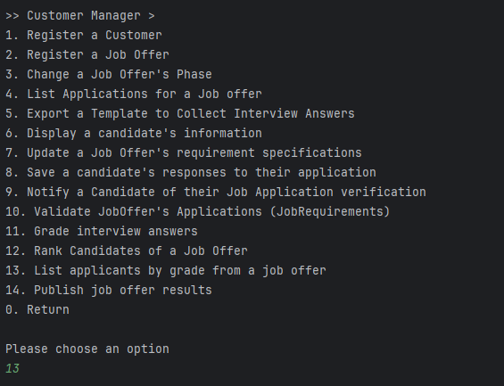
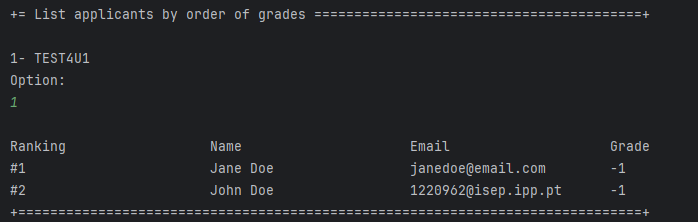

# US 1019 - As Customer Manager, I want to get an ordered list of candidates, using the job interview points (grades), to help me analyze the candidates

## 1. Context

The Customer Manager can see the list of candidates to a job offer. In this user story, those candidates are meant to be ordered by their interview grades. This is a newly assigned task during Sprint C and is to be completed in said sprint.

## 2. Requirements

"**US 1019 -** As Customer Manager, I want to get an ordered list of candidates, using the job interview points (grades), to help me analyze the candidates"

**Questions answered by the client:**

>**Q169.** US1019 - The list referenced is meant to be related to a job offer, right? Should the order be ascending or descending or should there be an option to choose?
>
>>**A169**, Yes, the order is relative to the applications to a job offer. The order should be descending, from the highest scoring to the lowest.

>**Q204.** US1019 - Considering the answer A197 should we, then, allow only the listing of job offers that have interviews?
>
>>**A204.** It doesn't make sense in this US for there to be job offers that don't have an interview considering that applicants are ordered by the score they got in their interview.

**Acceptance Criteria:**

- US1019.1 - The order in which the candidates are sorted is descending based on their grade.
- US1019.2 - Only job offers that have an interview are shown.
- US1019.3 - A customer manager will only be able to display information on the job offers that are tied to them.

**Dependencies/References:**

**US 1018 - As Customer Manager I want to execute the process that evaluates (grades) the interviews for a job opening.**
- In order to list the candidates by grades there needs to be an grading system so they can have grades, allowing them to be sorted as asked.

## 3. Analysis

The team has come to the following conclusions:
- There will be a User Interface accessed by users with the role Customer Manager, to be able to list by grade the candidates of a job offer.
- Only one job offer at a time will be displayed.
- Only the candidates of said job offer will be displayed, alongside with their interview score.

#### System Sequence Diagram


### Relevant DM Excerpt



## 4. Design

Since the User Story only has one distinct functionality, only one SD will be presented.

### 4.1. Realization

**Functionality:** To list applicants, sorted by their interview grades, of job offers related to a Customer Manager.



| Interaction ID |  Which Class is Responsible for...   |             Answer             | Justification (With Patterns)  |
|:--------------:|:------------------------------------:|:------------------------------:|:------------------------------:|
|       2        |         instantiating the UI         |           CustomerUI           |        Pure Fabrication        |
|       3        |     instantiating the controller     |     ListSortedApplicantsUI     |        Pure Fabrication        |
|       4        |  instantiating persistence context   | ListSortedApplicantsController |        Pure Fabrication        |
|       5        | instantiating the repository factory |       PersistenceContext       |            Factory             |
|      5/6       |    instantiating the repositories    |       RepositoryFactory        |            Factory             |
|      8/16      |      requesting for information      |     ListSortedApplicantsUI     |              MVC               |
|      9/17      | requesting information from service  | ListSortedApplicantsController | MVC, Service, Pure Fabrication |
|       10       |    requesting information from db    |      ListJobOfferService       |          MVC, Service          |
|       11       |     knowing its own information      |       JobOfferRepository       |        MVC, Repository         |
|       12       |                  -                   |               -                |               -                |
|       13       |                  -                   |               -                |               -                |
|       14       |   asking information from the user   |     ListSortedApplicantsUI     |        Pure Fabrication        |
|       15       |                  -                   |               -                |               -                |
|       18       |    requesting information from db    |   ListJobApplicationService    |          MVC, Service          |
|       19       |     knowing its own information      |    JobApplicationRepository    |        MVC, Repository         |
|       20       |                  -                   |               -                |               -                |
|       21       |                  -                   |               -                |               -                |
|       22       |       showing the information        |      ListCustomerOffersUI      |     MVC, Pure Fabrication      |
|       23       |                  -                   |               -                |               -                |
|       24       |                  -                   |               -                |               -                |

### 4.2. Class Diagram



### 4.3. Applied Patterns

- Aggregate
- Entity
- Value Object
- Service
- MVC
- Layered Architecture

### 4.4. Tests

**Test 1:** Checks if sorting is descending starting from highest grade.
```
void sortedApplicantsTest() {
    final CustomerFactory customerFactory = new CustomerFactory();
    final JobOfferBuilder jobOfferBuilder = new JobOfferBuilder();
    final CandidateFactory candidateFactory = new CandidateFactory();

    SystemUserBuilder userBuilder = UserBuilderHelper.builder();
    userBuilder.withUsername("jobs4u@jobs4u.org").withPassword("jobs4U$$$").withName("Jobs", "FourU")
            .withEmail("jobs4u@jobs4u.org").withRoles(BaseRoles.CUSTOMER);

    SystemUser builderUser = userBuilder.build();
    Customer customer = customerFactory.createCustomer("JobsFouru", "JOBS4U",
            "Jobs4u avenue, 123", builderUser, builderUser);

    jobOfferBuilder.withCustomer(customer)
            .withJobTitle("Lifeguard")
            .withContractType(ContractType.PARTTIME)
            .withJobMode(JobMode.ONSITE)
            .withVacancies(3)
            .withDescription("Come save lives 4 us")
            .withAddress("Jobs4u beach, 123");

    JobOffer job = jobOfferBuilder.build();

    userBuilder.withUsername("candidate1@jobs4u.org").withPassword("jobs4U$$$").withName("candidate", "one")
            .withEmail("candidate1@jobs4u.org").withRoles(BaseRoles.CANDIDATE);
    builderUser = userBuilder.build();

    List<JobApplication> sortedApps = new ArrayList<>();

    Candidate candidate1 = candidateFactory.newCandidate(builderUser, new PhoneNumber("929929929"));

    userBuilder.withUsername("candidate2@jobs4u.org").withPassword("jobs4U$$$").withName("candidate", "two")
            .withEmail("candidate2@jobs4u.org").withRoles(BaseRoles.CANDIDATE);
    builderUser = userBuilder.build();

    Candidate candidate2 = candidateFactory.newCandidate(builderUser, new PhoneNumber("923456789"));

    ApplicationBuilder builderApplication = new ApplicationBuilder();

    builderApplication.withJobOffer(job).withEmail(new ApplicationEmail("ola@email.org"))
            .withApplicationState(ApplicationState.GRADED).withInterviewGrade(new InterviewGrade(90))
            .withCandidate(candidate1).withFilesPath(new ApplicationFilesPath("processedFiles/candidate_one/"))
            .withAttachedFile(new ApplicationAttachedFile("./something.txt"));

    sortedApps.add(builderApplication.build());

    builderApplication.withJobOffer(job).withEmail(new ApplicationEmail("ol2a@email.org"))
            .withApplicationState(ApplicationState.GRADED).withInterviewGrade(new InterviewGrade(95))
            .withCandidate(candidate2).withFilesPath(new ApplicationFilesPath("processedFiles/candidate_two/"))
            .withAttachedFile(new ApplicationAttachedFile("./nothing.txt"));

    sortedApps.add(builderApplication.build());

    sortedApps.sort(Comparator.comparingInt(JobApplication::getGrade).reversed());
    assertEquals(95, sortedApps.get(0).getGrade());
}
````

### 4.5 Design Commits

> **24/05/2024 [US1019] 21:45** Added the needed documentation and diagrams

## 5. Implementation

**ListSortedApplicantsUI**
```
public class ListSortedApplicantsUI extends AbstractUI{

    public ListSortedApplicantsController theController = new ListSortedApplicantsController();

    public void showApplicantsSorted(List<JobApplication> jobApplications){
        for(int i = 0; i < jobApplications.size(); i++){
            System.out.println("#" + (i+1) + ": " + jobApplications.get(i).getCandidate().associatedUser().name()
                    + " Email: " + jobApplications.get(i).getCandidate().associatedUser().email()
                    + " Grade: " + jobApplications.get(i).getGrade());
        }
    }

    public JobOffer showJobOffers(List<JobOffer> jobOffers){
        int option = 0;
        for(int i = 0; i < jobOffers.size(); i++){
            System.out.println(i+1 + "- " + jobOffers.get(i).customer().customerCode() + jobOffers.get(i).identity());
        }

        while(option <= 0){
            try{
                option = Console.readInteger("Option:");
            }catch(Exception e){
                System.out.println("Invalid argument!");
            }
        }
        return jobOffers.get(option-1);
    }

    @Override
    protected boolean doShow() {
        List<JobOffer> jobOffers = theController.findAllOffers();
        List<JobApplication> jobApplications = theController.getSortedApplicants(showJobOffers(jobOffers));
        showApplicantsSorted(jobApplications);
        return true;
    }

    @Override
    public String headline() {
        return "List applicants by order of grades";
    }
}
```

**ListSortedApplicantsController**
``` 
public class ListSortedApplicantsController {
    private final ListJobApplicationService applicationListService = new ListJobApplicationService();
    private final AuthorizationService authorizationService = AuthzRegistry.authorizationService();

    private final ListJobOfferService jobOfferService = new ListJobOfferService();

    public List<JobOffer> findAllOffers(){
        List<JobOffer> allOffersOfCM = new ArrayList<>();
        Iterable<JobOffer> offers = jobOfferService.getJobOffersBySystemUser(authorizationService.loggedinUserWithPermissions(BaseRoles.CUSTOMER_MANAGER).get());
        for(JobOffer job : offers){
            allOffersOfCM.add(job);
        }

        return allOffersOfCM;
    }

    public List<JobApplication> getSortedApplicants(JobOffer job){
        List<JobApplication> applications = new ArrayList<>();

        for(JobApplication app : applicationListService.getJobApplicationsOfJobOfferCodeNonDTO(job.identity())){
            applications.add(app);
        }

        applications.sort(Comparator.comparingInt(JobApplication::getGrade).reversed());
        return applications;
    }
}
```

### Main Commits

> **31/05/2024 [US1019] 17:11** Added tests to the sorting method of the usar story

> **07/06/2024 [US1019] 21:58** Added the UI and the functionality

## 6. Integration/Demonstration

This user story required the ordering of all applicants in a job offer related to a Customer Manager. As such, the following was implemented:
- A new menu option for the customer manager
- A method that gets all applicants in a job offer and sorts them by their grades.

### Ordered Applicants Listing




## 7. Observations

In the demonstration, the grades of the applicants is -1 due to the fact that when registering an application,
the grade is automatically set to -1.