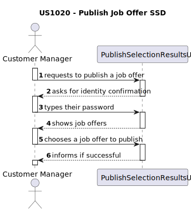
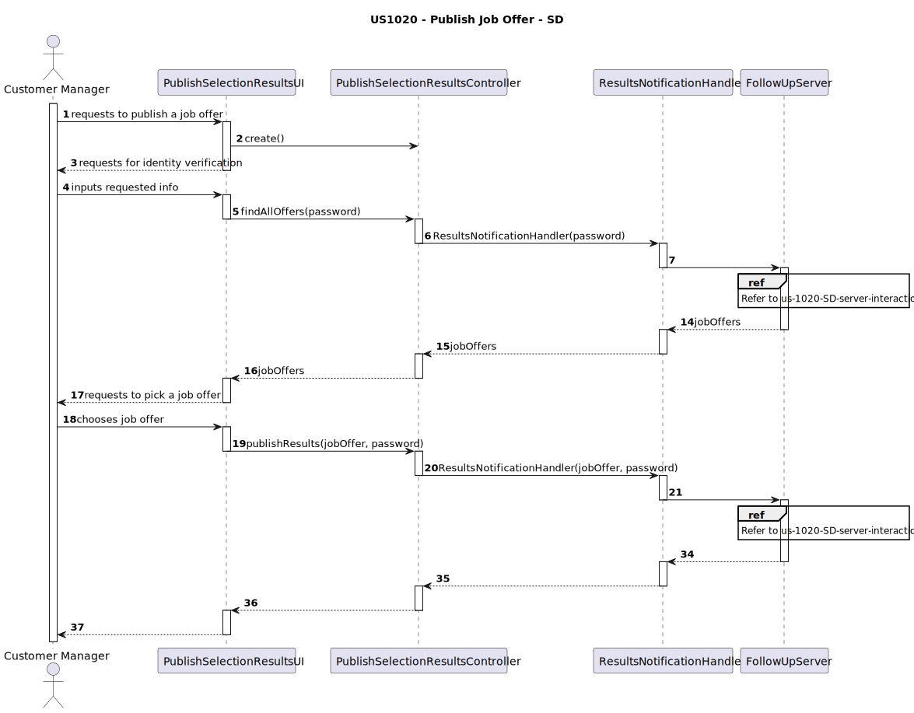
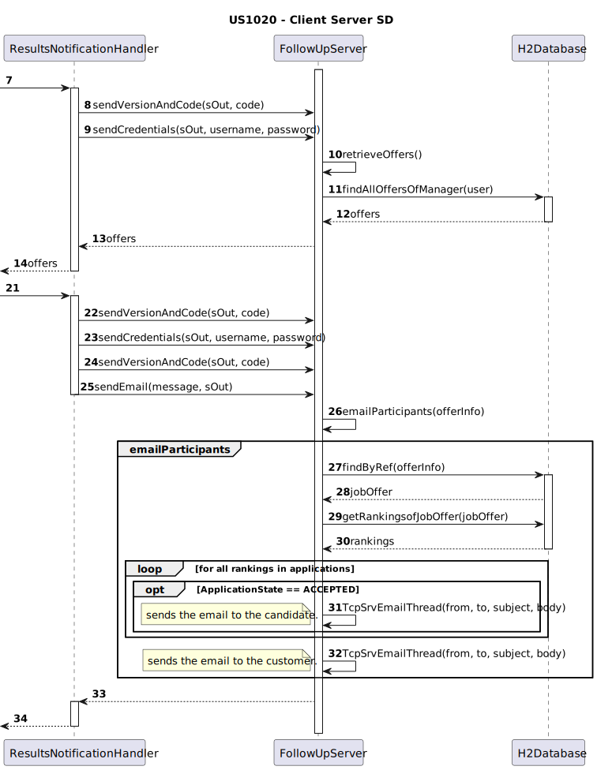
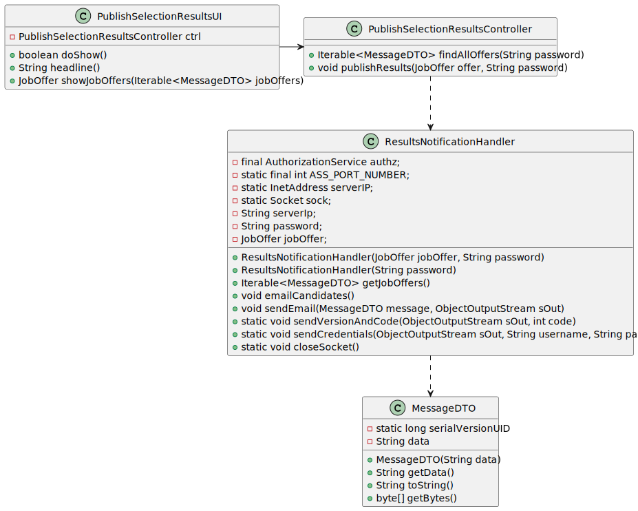
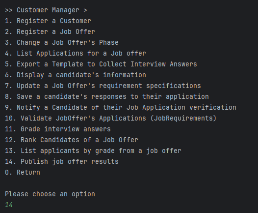
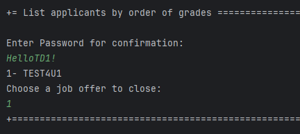
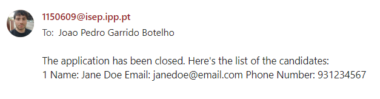
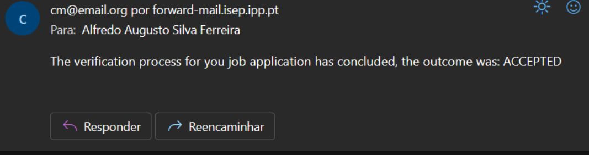

# US 1020 - As Customer Manager, I want to publish the results of the selection of candidates for a job offer, so that candidates and customer are notified by email of the result

## 1. Context

A Customer Manager can publish the results of any of the job offers that belong to them. In doing so they'll send an email to any candidate that passed and the customer related to the job offer. This is a newly assigned task during Sprint C and is to be completed in said sprint.

## 2. Requirements

"**US 1020 -** As Customer Manager, I want to publish the results of the selection of candidates for a job offer, so that candidates and customer are notified by email of the result"

**Questions answered by the client:**

>**Q190.** US1020, Regarding the selection of candidates, should we assume that the first N candidates in the ranking (where N is the number of job vacancies) are chosen, or should we allow the customer manager to select the N candidates?
>
>>**A190.** The first option (using the results from US1013).

**Acceptance Criteria:**

- US1020.1 - The system should display all job offers.
- US1020.2 - The system should email the **top** Candidates, **that passed**.
- US1020.3 - The system should email **as many** Candidates **as the amount of vacancies it has**, if possible.
- US1020.4 - If there are **fewer** Candidates than vacancies it will email all of those who passed.
- US1020.5 - The Customer will receive a list of the Candidates which have been emailed.

**Dependencies/References:**

No dependencies were found between this user story and the other ones of the current sprint.

## 3. Analysis

The team has arrived to the following conclusions:
- There will be a User Interface accessed by users with the role Customer Manager, to be able to list the job offers.
- The job offers displayed will be the ones managed by the logged in Customer Manager.
- The Customer Manager must input his password before closing the job offer as a way to confirm his action.

### Relevant DM Excerpt


#### Customer Manager - System Interaction (Publish offer results)


## 4. Design

### 4.1. Realization

**Functionality:** To list job offers related to a customer

#### Listing Job Offer Execution Flow



| Interaction ID |   Which Class is Responsible for...    |              Answer               | Justification (With Patterns) |
|:--------------:|:--------------------------------------:|:---------------------------------:|:-----------------------------:|
|       2        |      instantiating the controller      |     PublishSelectionResultsUI     |       Pure Fabrication        |
|      4/17      |    requesting information from user    |     PublishSelectionResultsUI     |       Pure Fabrication        |
|       4        |                   -                    |                 -                 |               -               |
|       5        | requesting information from controller |     PublishSelectionResultsUI     |       Pure Fabrication        |
|      6/20      |    instantiating the server handler    | PublishSelectionResultsController |       Pure Fabrication        |
|      7/21      |   requesting information from server   |    ResultsNotificationHandler     |       Pure Fabrication        |
|       15       |                   -                    |                 -                 |               -               |
|       16       |                   -                    |                 -                 |               -               |
|       18       |                   -                    |                 -                 |               -               |
|       19       |                   -                    |                 -                 |               -               |
|       21       |                   -                    |                 -                 |               -               |
|       34       |                   -                    |                 -                 |               -               |
|       35       |                   -                    |                 -                 |               -               |
|       36       |                   -                    |                 -                 |               -               |
|       37       |                   -                    |                 -                 |               -               |

#### Server Interaction Execution Flow


### 4.2. Class Diagram



### 4.3. Applied Patterns

- Layered Architecture
- MVC
- DTO
- TCP
- Entity
- ValueObject
- Aggregate
- DDD

### 4.4. Tests

Since this task only uses persistence gathering and search, it's not possible to test it.

### 4.5 Design Commits

> **06/06/2024 [US1020] 22:38** Documentation

## 5. Implementation

**PublishSelectionResultsUI**
```
public class PublishSelectionResultsUI extends AbstractUI{

    public PublishSelectionResultsController ctrl = new PublishSelectionResultsController();

    public String showJobOffers(Iterable<MessageDTO> jobOffers){
        int option = 0, i = 0;
        ArrayList<String> options = new ArrayList<>();
        for(MessageDTO offer : jobOffers){
            String[] offerInfo = offer.getData().split("/");
            options.add(offerInfo[1]);
            System.out.println(++i + "- " + offerInfo[0] + offerInfo[1]);
        }

        while(option <= 0){
            try{
                option = Console.readInteger("Choose a job offer to close:");
            }catch(Exception e){
                System.out.println("Invalid argument!");
            }
        }

        return options.get(option-1);
    }

    @Override
    protected boolean doShow() {

        String password = Console.readLine("Enter Password for confirmation:");
        try{
            Iterable<MessageDTO> jobOffers = ctrl.findAllOffers(password);

            if(!((ArrayList<MessageDTO>) jobOffers).isEmpty()){
                String offer = showJobOffers(jobOffers);
                ctrl.publishResults(offer, password);
            }else{
                System.out.println("Nothing to show.");
            }
        }catch(Exception e){
            System.out.println(e);
        }
        return true;
    }
}
```

**PublishSelectionResultsController**
```
public class PublishSelectionResultsController {

    public Iterable<MessageDTO> findAllOffers(String password) throws ClassNotFoundException{
        ResultsNotificationHandler handler = new ResultsNotificationHandler(password);
        return handler.getJobOffers();
    }

    public void publishResults(String offer, String password) {
        ResultsNotificationHandler handler = new ResultsNotificationHandler(offer, password);
        handler.emailCandidates();
    }
    
}
```

### Main Commits

> **07/06/2024 [US1020] 09:33** Changed server to be able to retrieve the data needed for the US

> **07/06/2024 [US1020] 09:40** Added UI and functionality

> **08/06/2024 [US1020] 18:11** Changes to server

> **08/06/2024 [US1020] 18:18** Fixed US class that interacts with the server

## 6. Integration/Demonstration









## 7. Observations

There were no relevant observations to be mentioned.