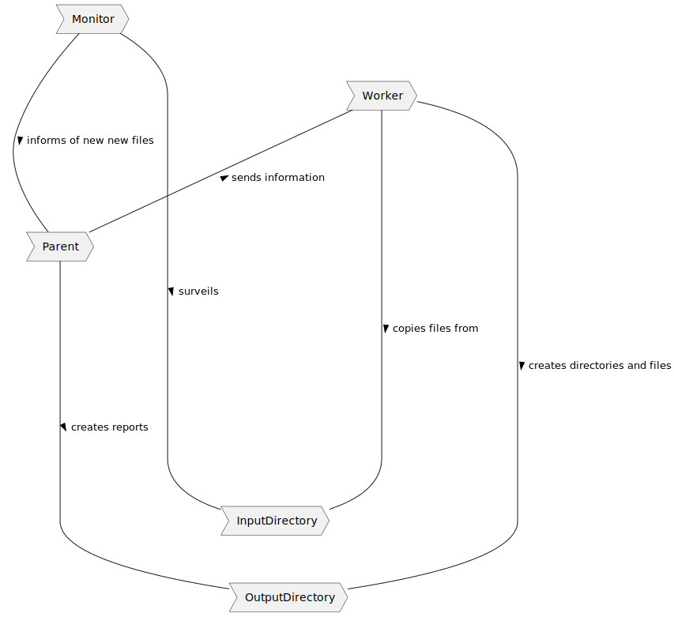
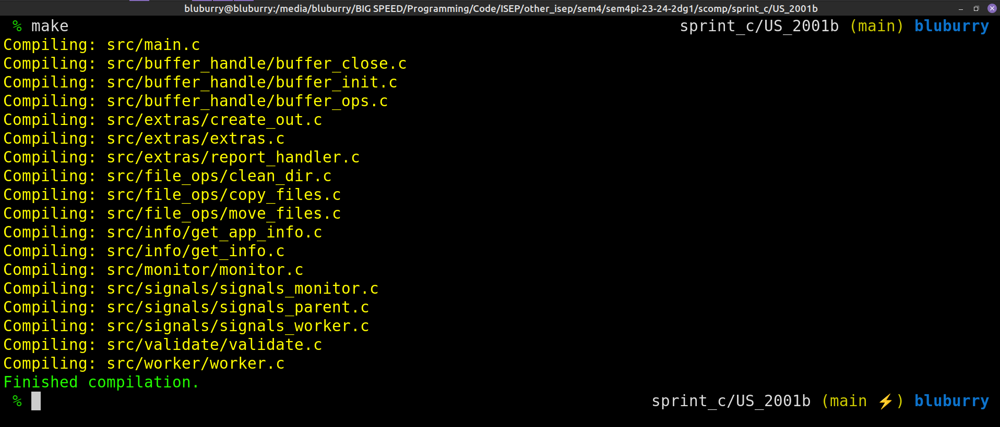
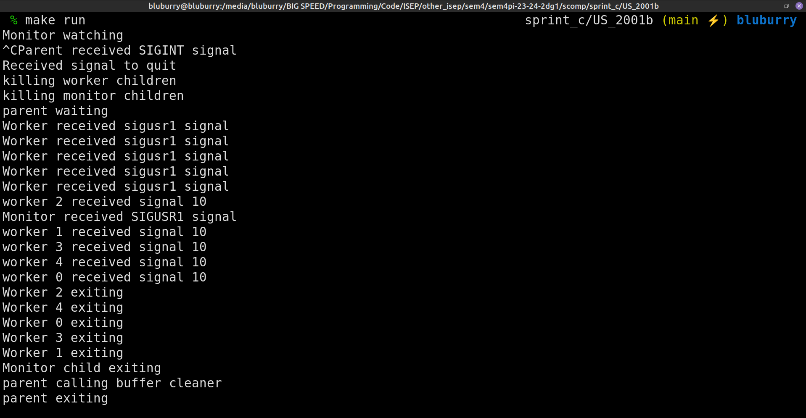
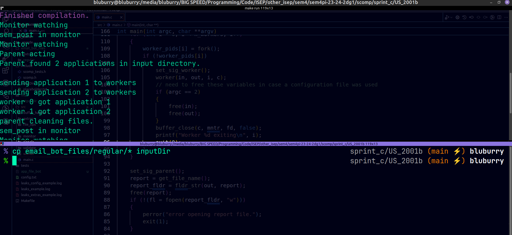
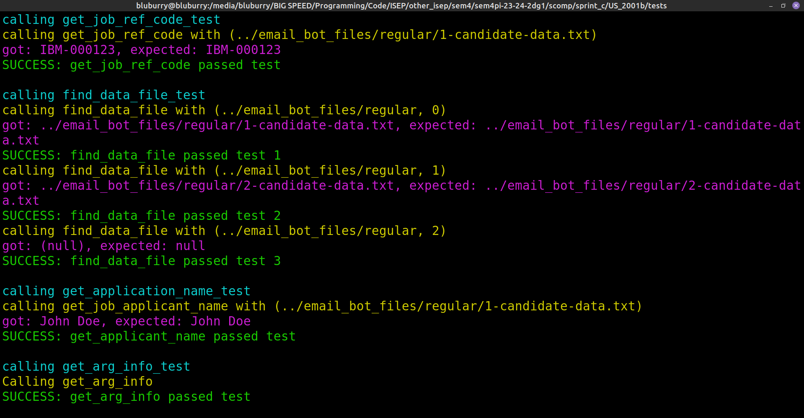

# US2001 - As Product Owner, I want the system to, continuously, process the files produced by the Applications Email Bot, so that they can be imported into the system by initiative of the Operator

## 1. Context

For this User Story the client has tasked the team with creating a bot to monitor the arrival of new files processed by the "Email File Bot" these files come in a standardized format already having been processed by the Email File Bot.
The task of this bot is to copy the files in the designated input to output directories whilst not modifying the input directory.

## 2. Requirements

"**US 2001 -** As Product Owner, I want the system to, continuously, process the files
produced by the Applications Email Bot, so that they can be imported into the system
by initiative of the Operator"

**Acceptance Criteria:**

- **2002.1.** The “Applications File Bot” must be developed in C and utilize processes, shared memory, and semaphores.

- **2001.2.** The names of the input and output directories, the number of worker children, etc., should be configurable, either by input parameters or a configuration file.

- **2001.3.** The Bot must generate report files in accordance to the applications it processed.

- **2001.4.** There can be multiple report files, each one uniquely identified by some sort of timestamp.

**Dependencies/References:**

  - The only functional dependencies this User Story has are related to the Email File Bot
but as this part of the system is outside project scope this is largely discarded, although still worth noting.

## 3. Analysis

The bot will be composed of a parent process and 2 "types" of child processes, these processes have been given codenames by the team to more easily discuss the functioning of the system:

- The Parent process is the "coordinator" of the bot, it's responsibility is to receive updates when the file input directory receives new content via the "observer" child process and to inform the "worker" children processes of the work they need to perform. The coordinator is also tasked with reporting the operations performed by the Applications File Bot system.
- The "observer" is the child process delegated to the surveillance/observation of the input directory, whenever a new file is introduced to the input directory the observer will inform the coordinator that there is new information to process.
- The "workers" are the children processes delegated to the processing and reporting duties of the Application File Bot system, they will receive information from the coordinator, perform the needed actions and report back to the coordinator, after which they will be on standby awaiting new information.

The execution flow should (if there are no errors) go as follows:

- 1 - The coordinator process will create the monitor child, along with its semaphore, and set it to work.
- 2 - The observer will scan for new files
- 3 - The coordinator process sets up the shared memory struct (circular buffer + semaphores)
- 4 - The coordinator process will create n worker children 
- 5 - The coordinator will enter standby
- 6 - The worker children go on standby
- 7 - The observer will unlock its semaphore when a new file appears in the input directory and go on standby, allowing the coordinator do act
- 8 - The coordinator will count how many applications are in the input directory (if none are found it returns to standby), and save them to a dynamically sized array
- 9 - The coordinator will inform the workers of the application they are meant to process, entering standby once all applications have been dispatched
- 10 - The workers will process said new files
- 11 - Once all the workers have finished, a semaphore is unlocked to let the coordinator continue
- 12 - The workers go on standby
- 13 - The coordinator will generate a report file based on the information sent to the workers

As no information was given to the program's closure, the following functionality was retained:

- To terminate the bot the coordinator process must handle the "SIGINT" signal as per specified in the NFR12 document, upon reception of the signal the coordinator will terminate all it's children and then itself.

Notes:

- The configuration file used to configure aspects of the system such as the number of workers and the input/output directories will only be handled by the coordinator process

## 4. Design

### 4.1. Process Diagram



### 4.2. Tests

**Makefile**

```Makefile
# COLOURS
DEF_COLOR = \033[0;39m
GRAY = \033[0;90m
RED = \033[0;91m
GREEN = \033[0;92m
YELLOW = \033[0;93m
BLUE = \033[0;94m
MAGENTA = \033[0;95m
CYAN = \033[0;96m
WHITE = \033[0;97m

# DEFINITIONS
NAME			= file_bot_tester
DEPENDENCIES	= ../include
CC				= gcc
SRC_DIR			= ../src/
TEST_DIR		= src/
OBJ_DIR			= ../obj/
INPUT_DIR		= ../inputDir
OUTPUT_DIR		= ../outputDir
CONFIG			= ../config.txt
OUT_FILE		= test_output.log
REPORT_FILE		= report_test_file.txt
NUM_WORKERS		= 2
RM				= rm -rf
NODIRS			= --no-print-directory
CC_FLAGS		= -g -Wall -Werror -Wextra -I $(DEPENDENCIES)
VG				= valgrind -s --leak-check=full --show-leak-kinds=all --track-origins=yes --log-file=leaks.log

# DIRECTORIES
DIRS	= buffer_handle extras file_ops info monitor signals validate worker
PATHS	= $(addprefix $(SRC_DIR), $(DIRS))
TEST_DIRS = extras_test info_test validate_test helpers file_ops_test
TEST_PATHS	= $(addprefix $(TEST_DIR), $(TEST_DIRS))
vpath %.c $(SRC_DIR) $(PATHS) $(TEST_PATHS)

# FILES
SRCS	= buffer_close buffer_init buffer_ops create_out \
		extras report_handler clean_dir copy_files move_files get_app_info \
		get_info monitor signals_monitor signals_parent signals_worker validate worker
SRCS_TESTS = main create_out_test extras_test report_handler_test clean_dir_test \
	copy_files_test folder_check get_app_info_test get_info_test validate_test
OBJS	= $(addprefix $(OBJ_DIR), $(addsuffix .o, $(SRCS)))
TEST_OBJS	= $(addprefix $(OBJ_DIR), $(addsuffix .o, $(SRCS_TESTS)))
OBJS_FILES	= .tst


# COMPILATION
all : $(NAME)

$(NAME) : $(OBJS) $(TEST_OBJS)
	@$(CC) $(CFLAGS) $(OBJS) $(TEST_OBJS) -o $(NAME)
	@echo "$(GREEN)Finished compilation.$(DEF_COLOR)"

$(OBJ_DIR)%.o : %.c | $(OBJS_FILES) 
	@echo "$(YELLOW)Compiling: $<$(DEF_COLOR)"
	@$(CC) $(CC_FLAGS) -c $< -o $@

$(OBJS_FILES) :
	@mkdir -p $(OBJ_DIR)

clean :
	@$(RM) $(OBJ_DIR)
	@echo "$(BLUE)Cleaned files.$(DEF_COLOR)"

fclean : clean
	@$(RM) $(OBJS_FILES)
	@$(RM) $(OBJ_DIR)
	@echo "" > $(REPORT_FILE)
	@$(RM) $(NAME)

re : fclean all

run : all
	@./$(NAME)

.PHONY : all, clean, fclean, re, run
```

**scomp_tests.h**

```c
#ifndef SCOMP_TESTS_H
#define SCOMP_TESTS_H

#include "scomp.h"

#define RESET "\033[0m"
#define RED "\033[0;31m"
#define GREEN "\033[0;32m"
#define YELLOW "\033[0;33m"
#define BLUE "\033[0;34m"
#define MAGENTA "\033[0;35m"
#define CYAN "\033[0;36m"
#define TEST_FLDR "test_files"
#define CP_FILE_REGULAR "cp ../email_bot_files/regular/* test_files"
#define CP_FILE_1 "cp ../email_bot_files/regular/1* test_files"
#define CP_FILE_2 "cp ../email_bot_files/regular/2* test_files"
#define OG_FILE_DIR "../email_bot_files/regular"
#define LS_FILE "ls test_files"
#define REPORT_EXAMPLE "report_output_example.txt"
#define REPORT_FILE "report_test_file.txt"

// --- extras_test ---


// create_out_test.c
void fldr_str_tester(void);
void create_app_folder_tester(void);
void create_out_tester(void);

// extras_test.c
void extract_app_code_test(void);
void extract_code_app_test(void);
void get_config_line_arg_test(void);

// report_handler_test.c
void report_handler_test(char *in, char *out, char *example);

// --- file_ops_test

// clean_dir_test.c
void clean_dir_tester(const char *dir);
void clean_files_tester(const char *dir);

// copy_files_test.c
void copy_files_test(char *in, char *out, char *app_code);

// --- info_test ---

// get_app_info_test.c
void get_job_ref_code_test(void);
void find_data_file_test(void);
void get_application_name_test(void);
void get_data_file_of_app_test(char *dir);
void count_applications_test(char *dir);
void fill_codes_test(char *dir);

// get_info_test.c
void get_arg_info_test(void);

// --- validate_test ---

// validate_test.c
void valid_entry_args_test(void);

// --- helpers ---

//  folder_check.c
bool fldr_checker_subdir(const char *d, const char *subdir);
bool check_fls(const char *d);
bool check_files_partial(const char *d, int code1, int code2);

#endif
```

**create_out_test.c**

```c
#include "scomp_tests.h"

void fldr_str_tester(void)
{
	char test_dir[] = "test", test_subdir[] = "subdir",
		 dir_result[] = "test/subdir";

	char *test = fldr_str(test_dir, test_subdir);

	printf("%scalled fldr_str and got: %s, expected: %s%s\n", MAGENTA, test, dir_result, RESET);

	if (!strcmp(test, dir_result))
		printf("%sSUCCESS: fldr_str passed test%s\n", GREEN, RESET);
	else
		printf("%sFAIL: fldr_str failed test%s\n", RED, RESET);
	free(test);
}

void create_app_folder_tester(void)
{
	pid_t pid;
	int status;
	char test[] = "new_subdirectory";

	printf("running command: %s, verify that directory is empty\n", LS_FILE);
	pid = fork();
	if (!pid)
		execl("/bin/sh", "sh", "-c", LS_FILE, (char *)NULL);
	wait(&status);
	printf("%scalling create_app_folder function with (%s, %s)%s\n", YELLOW, TEST_FLDR, test, RESET);
	if (!create_app_folder(TEST_FLDR, test))
	{
		printf("function failed, returning\n");
		return;
	}

	if (fldr_checker_subdir(TEST_FLDR, test))
		printf("%sSUCCESS: create_app_folder passed test%s\n", GREEN, RESET);
	else
	{
		printf("%sFAIL: create_app_folder failed test, returning%s\n", RED, RESET);
		return;
	}

	printf("running command: %s, verify new subdir created\n", LS_FILE);
	pid = fork();
	if (!pid)
		execl("/bin/sh", "sh", "-c", LS_FILE, (char *)NULL);
	wait(&status);
	printf("calling clean_dir function\n");
	clean_dir(TEST_FLDR);
}

void create_out_tester(void)
{
	pid_t pid;
	int status;
	char test[] = "test_files/new_subdirectory";

	printf("running command: %s, verify that directory is empty\n", LS_FILE);
	pid = fork();
	if (!pid)
		execl("/bin/sh", "sh", "-c", LS_FILE, (char *)NULL);
	wait(&status);
	printf("%scalling create_out function with (%s)%s\n", YELLOW, test, RESET);
	if (!create_out(test))
	{
		printf("function failed, returning\n");
		return;
	}

	if (fldr_checker_subdir(TEST_FLDR, "new_subdirectory"))
		printf("%sSUCCESS: create_out passed test%s\n", GREEN, RESET);
	else
	{
		printf("%sFAIL: create_out failed test, returning%s\n", RED, RESET);
		return;
	}

	printf("running command: %s, verify new subdir created\n", LS_FILE);
	pid = fork();
	if (!pid)
		execl("/bin/sh", "sh", "-c", LS_FILE, (char *)NULL);
	wait(&status);
	printf("calling clean_dir function\n");
	clean_dir(TEST_FLDR);
}
```

**extras_test.c**

```c
#include "scomp_tests.h"

void extract_app_code_test(void)
{
	char str[] = "email_bot_files/1-candidate-data.txt";
	printf("%scalling extract_app_code with (%s)%s\n", YELLOW, str, RESET);
	int n = extract_app_code(str);
	printf("%sgot %d, expected 1%s\n", MAGENTA, n, RESET);
	if (n == 1)
		printf("%sSUCCESS: extract_app_code passed test%s\n", GREEN, RESET);
	else
		printf("%sFAIL: extract_app_code failed test%s\n", RED, RESET);
}

void extract_code_app_test(void)
{
	char str[] = "email_bot_files/1-candidate-data.txt";
	printf("%scalling extract_code_app with (%s)%s\n", YELLOW, str, RESET);
	char *n = extract_code_app(str);
	printf("%sgot %s, expected 1%s\n", MAGENTA, n, RESET);
	if (!strcmp(n, "1"))
		printf("%sSUCCESS: extract_code_app passed test%s\n", GREEN, RESET);
	else
		printf("%sFAIL: extract_code_app failed test%s\n", RED, RESET);
	free(n);
}

void get_config_line_arg_test(void)
{
	char str[] = "Input directory: inputDir\n",
		 expected[] = "inputDir";
	printf("%scalling get_config_line_arg with %s%s\n", YELLOW, str, RESET);
	char *ret = get_config_line_arg(str);
	printf("%sgot %s, expected %s%s\n", MAGENTA, ret, expected, RESET);
	if (!strcmp(ret, expected))
		printf("%sSUCCESS: get_config_line_arg passed test%s\n", GREEN, RESET);
	else
		printf("%sFAIL: get_config_line_arg failed test%s\n", RED, RESET);
	free(ret);
}
```

**report_handler_test.c**

```c
#include "scomp_tests.h"

void report_handler_test(char *in, char *out, char *example)
{
	FILE *fl = fopen(REPORT_FILE, "w");

	printf("%scalling report_handler(-, %s, %s, 1)%s\n",
		   YELLOW, in, out, RESET);

	report_handler(fl, in, out, 1);

	fclose(fl);

	FILE *fl_example = fopen(example, "r"),
		 *fl_output = fopen(REPORT_FILE, "r");
	char line_example[1000], line_output[1000], *ret_example, *ret_output;

	if (fl_example == NULL || fl_output == NULL)
	{
		if (fl_example != NULL)
			fclose(fl_example);
		if (fl_output != NULL)
			fclose(fl_output);
		return;
	}

	bool same = true;

	while (same)
	{
		ret_example = fgets(line_example, 1000, fl_example);
		ret_output = fgets(line_output, 1000, fl_output);

		if (ret_example == NULL || ret_output == NULL)
		{
			if (!(ret_example == NULL && ret_output == NULL))
				same = false;
			break;
		}

		if (strcmp(line_example, line_output))
			same = false;
	}

	fclose(fl_example);
	fclose(fl_output);

	if (same)
		printf("%sSUCCESS: report_handler passed test%s\n", GREEN, RESET);
	else
		printf("%sFAILED: report_handler_test failed test%s\n", RED, RESET);
}
```

**clean_dir_test.c**

```c
#include "scomp_tests.h"

void clean_dir_tester(const char *dir)
{
	pid_t pid;
	int status;

	printf("running command: %s\n", CP_FILE_REGULAR);
	pid = fork();
	if (!pid)
		execl("/bin/sh", "sh", "-c", CP_FILE_REGULAR, (char *)NULL);
	wait(&status);
	if (!check_fls(dir))
	{
		printf("no files were created, exiting\n");
		return;
	}
	printf("running command: %s\n", LS_FILE);
	pid = fork();
	if (!pid)
		execl("/bin/sh", "sh", "-c", LS_FILE, (char *)NULL);
	wait(&status);
	printf("calling clean_dir function\n");
	clean_dir(dir);
	printf("running command: %s\n", LS_FILE);
	pid = fork();
	if (!pid)
		execl("/bin/sh", "sh", "-c", LS_FILE, (char *)NULL);
	wait(&status);
	if (!check_fls(dir))
		printf("%sSUCCESS: files were successfully deleted%s\n", GREEN, RESET);
	else
		printf("%sERROR: files were not deleted%s\n", RED, RESET);
}

void clean_files_tester(const char *dir)
{
	pid_t pid;
	int status;

	printf("running command: %s\n", CP_FILE_REGULAR);
	pid = fork();
	if (!pid)
		execl("/bin/sh", "sh", "-c", CP_FILE_REGULAR, (char *)NULL);
	wait(&status);
	if (!check_fls(dir))
	{
		printf("no files were created, exiting\n");
		return;
	}
	printf("running command: %s\n", LS_FILE);
	pid = fork();
	if (!pid)
		execl("/bin/sh", "sh", "-c", LS_FILE, (char *)NULL);
	wait(&status);
	printf("%scalling clean_files function to clean code 1%s\n", YELLOW, RESET);
	clean_files(dir, 1);
	printf("running command: %s\n", LS_FILE);
	pid = fork();
	if (!pid)
		execl("/bin/sh", "sh", "-c", LS_FILE, (char *)NULL);
	wait(&status);
	if (check_files_partial(dir, 1, 2))
		printf("%sSUCCESS: files with application code 1 were successfully deleted%s\n", GREEN, RESET);
	else
		printf("%sERROR: files were not deleted%s\n", RED, RESET);
	
	clean_dir(dir);
}
```

**copy_files_test.c**

```c
#include "scomp_tests.h"

void copy_files_test(char *in, char *out, char *app_code)
{
	pid_t pid;
	int status;


	printf("running command: %s\n", LS_FILE);
	pid = fork();
	if (!pid)
		execl("/bin/sh", "sh", "-c", LS_FILE, (char *)NULL);
	wait(&status);

	printf("%scalling copy_files function (%s, %s, %s)%s\n", 
	YELLOW, in, out, app_code, RESET);
 
	printf("running command: %s\n", LS_FILE);
	pid = fork();
	if (!pid)
		execl("/bin/sh", "sh", "-c", LS_FILE, (char *)NULL);
	wait(&status);

	if (check_files_partial(out, -1, atoi(app_code)))
		printf("%sSUCCESS: files with application code 1 were successfully deleted%s\n", GREEN, RESET);
	else
		printf("%sERROR: files were not deleted%s\n", RED, RESET);

	clean_dir(out);
}
```

**get_app_info_test.c**

```c
#include "scomp_tests.h"

void get_job_ref_code_test(void)
{
	char ref_code[] = "IBM-000123",
		 fl[] = "../email_bot_files/regular/1-candidate-data.txt";
	printf("%scalling get_job_ref_code with (%s)%s\n", YELLOW, fl, RESET);
	char *ret = get_job_ref_code(fl);
	printf("%sgot: %s, expected: %s%s\n", MAGENTA, ret, ref_code, RESET);
	if (!strcmp(ret, ref_code))
		printf("%sSUCCESS: get_job_ref_code passed test%s\n", GREEN, RESET);
	else
		printf("%sFAILED: get_job_ref_code failed test%s\n", RED, RESET);
	free(ret);
}

void find_data_file_test(void)
{
	char data_file1[] = "../email_bot_files/regular/1-candidate-data.txt",
		 data_file2[] = "../email_bot_files/regular/2-candidate-data.txt",
		 fl[] = "../email_bot_files/regular";

	printf("%scalling find_data_file with (%s, 0)%s\n", YELLOW, fl, RESET);
	char *ret = find_data_file(fl, 0);
	printf("%sgot: %s, expected: %s%s\n", MAGENTA, ret, data_file1, RESET);
	if (!strcmp(ret, data_file1))
		printf("%sSUCCESS: find_data_file passed test 1%s\n", GREEN, RESET);
	else
		printf("%sFAILED: find_data_file failed test 1%s\n", RED, RESET);
	free(ret);

	printf("%scalling find_data_file with (%s, 1)%s\n", YELLOW, fl, RESET);
	ret = find_data_file(fl, 1);
	printf("%sgot: %s, expected: %s%s\n", MAGENTA, ret, data_file2, RESET);
	if (!strcmp(ret, data_file2))
		printf("%sSUCCESS: find_data_file passed test 2%s\n", GREEN, RESET);
	else
		printf("%sFAILED: find_data_file failed test 2%s\n", RED, RESET);
	free(ret);

	printf("%scalling find_data_file with (%s, 2)%s\n", YELLOW, fl, RESET);
	ret = find_data_file(fl, 2);
	printf("%sgot: %s, expected: null%s\n", MAGENTA, ret, RESET);
	if (!ret)
		printf("%sSUCCESS: find_data_file passed test 3%s\n", GREEN, RESET);
	else
		printf("%sFAILED: find_data_file failed test 3%s\n", RED, RESET);
}

void get_application_name_test(void)
{
	char applicant_name[] = "John Doe",
		 fl[] = "../email_bot_files/regular/1-candidate-data.txt";
	printf("%scalling get_job_applicant_name with (%s)%s\n", YELLOW, fl, RESET);
	char *ret = get_applicant_name(fl);
	printf("%sgot: %s, expected: %s%s\n", MAGENTA, ret, applicant_name, RESET);
	if (!strcmp(ret, applicant_name))
		printf("%sSUCCESS: get_applicant_name passed test%s\n", GREEN, RESET);
	else
		printf("%sFAILED: get_applicant_name failed test%s\n", RED, RESET);
	free(ret);
}

void get_data_file_of_app_test(char *dir)
{
	char to_find[] = "../email_bot_files/regular/2-candidate-data.txt";
	int code = 2;

	printf("%scalling get_data_file_of_app(%s, %d)%s\n",
		   YELLOW, dir, code, RESET);

	char *ret = get_data_file_of_app(dir, code);

	printf("%sgot: %s, expected: %s%s\n", MAGENTA, ret, to_find, RESET);

	if (!strcmp(ret, to_find))
		printf("%sSUCCESS: get_data_file_of_app passed test%s\n", GREEN, RESET);
	else
		printf("%sFAILED: get_data_file_of_app failed test%s\n", RED, RESET);

	free(ret);
}

void count_applications_test(char *dir)
{
	int expected = 2;

	printf("%scalling count_applications(%s)%s\n", YELLOW, dir, RESET);

	int get = count_applications(dir);

	printf("%sgot: %d, expected: %d%s\n", MAGENTA, get, expected, RESET);

	if (get == expected)
		printf("%sSUCCESS: count_applications passed test%s\n", GREEN, RESET);
	else
		printf("%sFAILED: count_applications failed test%s\n", RED, RESET);
}

void fill_codes_test(char *dir)
{
	bool code1 = false, code2 = false;
	int arr[2];

	printf("%scalling fill_codes%s\n", YELLOW, RESET);

	fill_codes(dir, arr, 2);

	for (int i = 0; i < 2; i++) {
		if (!code1 && arr[i] == 1)
			code1 = true;
		else if (!code2 && arr[i] == 2)
			code2 = true;
	}

	if (code1 && code2)
		printf("%sSUCCESS: fill_codes passed test%s\n", GREEN, RESET);
	else
		printf("%sFAILED: fill_codes failed test%s\n", RED, RESET);
}
```

**get_info_test.c**

```c
#include "scomp_tests.h"

void get_arg_info_test(void)
{
	char *args[] = {"app", "config_test.txt"},
		 in_expected[] = "inputDir",
		 out_expected[] = "outputDir",
		 *in, *out;
	int n;
	printf("%sCalling get_arg_info\n%s", YELLOW, RESET);
	get_arg_info(2, args, &n, &out, &in);

	if (n == 2 && !strcmp(out, out_expected) && !strcmp(in, in_expected))
		printf("%sSUCCESS: get_arg_info passed test%s\n", GREEN, RESET);
	else
		printf("%sFAILED: get_arg_info failed test%s\n", RED, RESET);
		
	free(out);
	free(in);
}
```

**validate_test.c**

```c
#include "scomp_tests.h"

void valid_entry_args_test(void)
{
	char *valid_av[] = {"app", "../inputDir", "../outputDir", "4"},
		 *invalid_av1[] = {"app", "inputDir", "../outputDir", "4"},
		 *invalid_av2[] = {"app", "../inputDir", "outputDir/", "4"},
		 *invalid_av3[] = {"app", "../inputDir", "../outputDir", "-4"};
	
	printf("testing valid_entry_args\n");

	if (valid_entry_args(4, valid_av))
		printf("%sSUCCESS: valid_entry_args passed test 1%s\n", GREEN, RESET);
	else
		printf("%sFAILED: valid_entry_args failed test 1%s\n", RED, RESET);
	if (!valid_entry_args(4, invalid_av1))
		printf("%sSUCCESS: valid_entry_args passed test 2%s\n", GREEN, RESET);
	else
		printf("%sFAILED: valid_entry_args failed test 2%s\n", RED, RESET);
	if (!valid_entry_args(4, invalid_av2))
		printf("%sSUCCESS: valid_entry_args passed test 3%s\n", GREEN, RESET);
	else
		printf("%sFAILED: valid_entry_args failed test 3%s\n", RED, RESET);
	if (!valid_entry_args(4, invalid_av3))
		printf("%sSUCCESS: valid_entry_args passed test 4%s\n", GREEN, RESET);
	else
		printf("%sFAILED: valid_entry_args failed test 4%s\n", RED, RESET);
}
```

## 5. Implementation

### Relevant Implementation

**Makefile**

```Makefile
# COLOURS
DEF_COLOR = \033[0;39m
GRAY = \033[0;90m
RED = \033[0;91m
GREEN = \033[0;92m
YELLOW = \033[0;93m
BLUE = \033[0;94m
MAGENTA = \033[0;95m
CYAN = \033[0;96m
WHITE = \033[0;97m

# DEFINITIONS
NAME			= app_file_bot
DEPENDENCIES	= include
CC				= gcc
SRC_DIR			= src/
OBJ_DIR			= obj/
INPUT_DIR		= inputDir
OUTPUT_DIR		= outputDir
CONFIG			= config.txt
NUM_WORKERS		= 5
RM				= rm -rf
NODIRS			= --no-print-directory
CC_FLAGS		= -g -Wall -Werror -Wextra -lrt -lpthread -I $(DEPENDENCIES)
VG				= valgrind -s --leak-check=full --show-leak-kinds=all --track-origins=yes --log-file=leaks.log

# DIRECTORIES
DIRS	= buffer_handle extras file_ops info monitor signals validate worker
PATHS	= $(addprefix $(SRC_DIR), $(DIRS))
vpath %.c $(SRC_DIR) $(PATHS)

# FILES
SRCS	= main buffer_close buffer_init buffer_ops create_out \
		extras report_handler clean_dir copy_files move_files get_app_info \
		get_info monitor signals_monitor signals_parent signals_worker validate worker
OBJS	= $(addprefix $(OBJ_DIR), $(addsuffix .o, $(SRCS)))
OBJS_FILES	= .tst


# COMPILATION
all : $(NAME)

$(NAME) : $(OBJS)
	@$(CC) $(CFLAGS) $(OBJS) -o $(NAME)
	@echo "$(GREEN)Finished compilation.$(DEF_COLOR)"

$(OBJ_DIR)%.o : %.c | $(OBJS_FILES)
	@echo "$(YELLOW)Compiling: $<$(DEF_COLOR)"
	@$(CC) $(CC_FLAGS) -c $< -o $@

$(OBJS_FILES) :
	@mkdir -p $(OBJ_DIR)

clean :
	@$(RM) $(OBJ_DIR)
	@echo "$(BLUE)Cleaned files.$(DEF_COLOR)"

fclean : clean
	@$(RM) $(OBJS_FILES)
	@$(RM) $(OBJ_DIR)
	@$(RM) $(NAME)

extras :
	@rm /dev/shm/*
	@rm $(INPUT_DIR)/*

re : fclean all

run : all
	@./$(NAME) $(INPUT_DIR) $(OUTPUT_DIR) $(NUM_WORKERS)

leaks : all
	@$(VG) ./$(NAME) $(INPUT_DIR) $(OUTPUT_DIR) $(NUM_WORKERS)

config : all
	@$(VG) ./$(NAME) $(CONFIG)

debug : all
	@gdb -tui --args $(NAME)

.PHONY : all, clean, fclean, re, run, leaks, debug, extras
```

**scomp.h**

```c
#ifndef SCOMP_H
#define SCOMP_H

#include <stdio.h>
#include <ctype.h>
#include <time.h>
#include <fcntl.h>
#include <errno.h>
#include <stdlib.h>
#include <unistd.h>
#include <signal.h>
#include <string.h>
#include <limits.h>
#include <dirent.h>
#include <stdbool.h>
#include <sys/stat.h>
#include <sys/mman.h>
#include <sys/wait.h>
#include <semaphore.h>
#include <sys/types.h>
#include <sys/inotify.h>
#include <linux/limits.h>

#define REF_CODE_MAX 15
#define APP_CODE_MAX 20
#define REF_CODE_MAX 15
#define APPLICANT_MAX 50
#define CONFIG_MAX 100
#define FILE_SIZE 27
#define TITLE1 "Application code:\n\t"
#define TITLE2 "Subdirectory:\n\t"
#define TITLE3 "Files:\n"
#define DATA_FILE "candidate-data.txt"
#define MMAP_NAME "file_bot_app_shm"
#define SEM_OPEN "file_bot_semaphore_open"
#define SEM_CLOSED "file_bot_semaphore_closed"
#define SEM_DEL "file_bot_semaphore_delete"
#define SEM_EXCL "file_bot_semaphore_exclusive"
#define SEM_MNTR "file_bot_semaphore_monitor"

typedef struct s_circular
{
	// dynamically sized to be an array with 
	// as many slots as there are workers
	int *bfr;
	// number of workers
	int size;
	// buffer position to read from
	int read;
	// buffer position to write to
	int write;
	// counts how many times a worker successfully copied the files
	int cnt;
	// saves how many applications are being processed
	// (how many applications are in the input directory
	// when the parent process leaves standby)
	int apps;
	// how many slots in the buffer are open (start: 0, max: size)
	sem_t *open;
	// how many slots in the buffer are closed (start: size, min: 0)
	sem_t *closed;
	// activates once all workers are done
	// basically tells the parent to clean the input directory
	sem_t *del;
	// exclusivity semaphore
	sem_t *exclude;
} t_circular;
// Additional note on sem_t *del
// this is used so that the parent can write the report
// without worry of the children having moved the files
// (instead of copying them), and still allow the input
// directory to be emptied in between uses

// saves what signal the processes received
extern int p_sig, w_sig, m_sig, w_ret;

// --- buffer_handle

// buffer_close.c
void buffer_close(t_circular *c, sem_t *mntr, int fd, bool og);

// buffer_init.c
t_circular *buffer_init(int size, int *fd);

// buffer_ops.c
void buffer_add(t_circular *c, int app_code);
int buffer_get(t_circular *c);
void buffer_set(t_circular *c, int n_apps);
void buffer_inc(t_circular *c);
void buffer_reset(t_circular *c);

// --- extras ---

// create_out.c
char *fldr_str(char *out, char *code);
bool create_app_folder(char *out, char *code);
bool create_out(char *out);

// extras.c
int extract_app_code(char *str);
char *extract_code_app(char *str);
char *get_file_name();
char *get_config_line_arg(char *ln);

// report_handler.c
void report_handler(FILE *fl, char *in, char *out, int app_code);

// --- file_ops

// clean_dir.c
void clean_dir(const char *dir);
void clean_files(const char *dir, int code);

// copy_files.c
void copy_files(char *in, char *out, char *app_code);

// move_files.c
void move_files(char *in, char *out, char *app_code);

// --- info ---

// get_app_info.c
char *get_job_ref_code(char *fl);
char *find_data_file(char *d, int n);
char *get_applicant_name(char *fl);
int get_app_code(char *in, int n);
char *get_data_file_of_app(char *d, int app_code);
int count_applications(char *in);
void fill_codes(char *in, int *arr, int sz);

// get_info.c
void get_arg_info(int ac, char **av, int *n, char **out, char **in);

// --- monitor ---

// monitor.c
void monitor_directory(const char *dirname, sem_t *mntr);

// --- signals ---

// signals_monitor.c
void set_sig_monitor(void);
void sig_monitor_handler(int sig, siginfo_t *info, void *ucontext);

// signals_parent.c
void set_sig_parent(void);
void sig_parent_handler(int sig, siginfo_t *info, void *ucontext);

// signals_worker.c
void set_sig_worker(void);
void sig_worker_handler(int sig, siginfo_t *info, void *ucontext);

// --- validate ---

// validate.c
bool valid_entry_args(int ac, char **av);

// --- worker ---

// worker.c
void worker(char *in, char *out, int i, t_circular *c);

#endif
```

**main.c**

```c
int main(int argc, char **argv)
{
	int n_workers = 0, // number of workers
		fd;			   // saves shared memory file descriptor
	char *out = NULL,  // output directory
		*in = NULL,	   // input directory
		*report,	   // name of the report file (temporary)
		*report_fldr;  // relative path to report file
	sem_t *mntr;	   // semaphore used to communicate between monitor and parent
	t_circular *c;	   // struct that holds the circular buffer and semaphores used by parent and workers
	FILE *fl;		   // report file
	p_sig = 0;

	// printf("%d\n%s\n%s\n%s\n", argc, argv[1], argv[2], argv[3]);
	if (!valid_entry_args(argc, argv))
	{
		printf("Invalid arguments\n");
		printf("Expected input:\n");
		printf("./program (input directory) (output directory) (number of workers)\n");
		printf("./program (config file)\n");
		printf("Example config file format: \n");
		printf("Input directory: (input directory)\n");
		printf("Output directory: (output directory)\n");
		printf("Number of worker: (number of worker)\n");
		return (0);
	}

	get_arg_info(argc, argv, &n_workers, &out, &in);
	create_out(out);
	// printf("in: %s\nout: %s\nn: %d\n", in, out, n_workers);

	if ((mntr = sem_open(SEM_MNTR, O_CREAT | O_EXCL, 0644, 0)) == SEM_FAILED)
	{
		perror("sem_open for monitor semaphore");
		exit(1);
	}

	pid_t monitor_pid = fork();
	if (!monitor_pid)
	{
		set_sig_monitor();
		monitor_directory(in, mntr);
		printf("Monitor child exiting\n");
		// need to free these variables in case a configuration file was used
		if (argc == 2)
		{
			free(in);
			free(out);
		}
		exit(0);
	}

	c = buffer_init(n_workers, &fd);
	pid_t worker_pids[n_workers], wpid;
	int status;
	for (int i = 0; i < n_workers; i++)
	{
		worker_pids[i] = fork();
		if (!worker_pids[i])
		{
			set_sig_worker();
			worker(in, out, i, c);
			// need to free these variables in case a configuration file was used
			if (argc == 2)
			{
				free(in);
				free(out);
			}
			buffer_close(c, mntr, fd, false);
			printf("Worker %d exiting\n", i);
			exit(0);
		}
	}

	set_sig_parent();
	report = get_file_name();
	report_fldr = fldr_str(out, report);
	free(report);
	if (!(fl = fopen(report_fldr, "w")))
	{
		perror("error opening report file.");
		exit(1);
	}

	int n,		// number of applications found at the start of the loop
		*codes; // int array of applications codes found
	// printf("report file: %s\n", report_fldr);
	while (p_sig != SIGINT)
	{
		sem_wait(mntr);
		if (p_sig == SIGINT)
			break;
		printf("Parent acting\n");
		p_sig = 0;

		n = count_applications(in);
		if (n <= 0)
		{
			printf("Parent didn't find anything in input directory\n");
			continue;
		}

		codes = (int *)calloc(n, sizeof(int));
		fill_codes(in, codes, n);

		printf("Parent found %d applications in input directory.\n", n);
		for (int i = 0; i < n; i++)
		{
			// printf("%d | ", codes[i]);
			if (codes[i] <= 0)
			{
				printf("\nError getting all the applications\n");
				n = 0;
				break;
			}
		}
		if (n <= 0)
			continue;
		printf("\n");

		buffer_set(c, n);

		for (int i = 0; p_sig != SIGINT && i < n; i++)
		{
			printf("sending application %d to workers\n", codes[i]);
			buffer_add(c, codes[i]);
		}

		sem_wait(c->del);

		printf("parent cleaning files.\n");
		// printf("c->cnt = %d, c->apps: %d\n", c->cnt, c->apps);
		for (int i = 0; i < n; i++)
		{
			// printf("cleaning %d\n", codes[i]);
			report_handler(fl, in, out, codes[i]);
			clean_files(in, codes[i]);
		}

		free(codes);
	}

	printf("Received signal to quit\n");
	printf("killing worker children\n");
	for (int i = 0; i < n_workers; i++)
	{
		// printf("closing child %d\n", i);
		kill(worker_pids[i], SIGUSR1);
	}

	fclose(fl);
	if (argc == 2)
	{
		free(in);
		free(out);
	}
	free(report_fldr);

	printf("killing monitor children\n");
	kill(monitor_pid, SIGUSR1);
	printf("parent waiting\n");
	while ((wpid = wait(&status)) > 0)
	{
		// printf("wpid: %d, status: %d\n", wpid, status);
	}

	printf("parent calling buffer cleaner\n");
	buffer_close(c, mntr, fd, true);

	printf("parent exiting\n");

	return (0);
}
```

**buffer_close.c**

```c
#include "scomp.h"

/**
 * @brief cleans up worker and parent processes
 * @param c struct that holds almost all the info
 * @param mntr monitor semaphore
 * @param fd shared memory file descriptor
 * @param og used to distinguish between being called by parent 
 * or worker, parent unlinks semaphores and shared memory
 */
void buffer_close(t_circular *c, sem_t *mntr, int fd, bool og)
{
	if (og)
	{
		sem_unlink(SEM_OPEN);
		sem_unlink(SEM_CLOSED);
		sem_unlink(SEM_DEL);
		sem_unlink(SEM_EXCL);
		sem_unlink(SEM_MNTR);
	}

	sem_close(c->open);
	sem_close(c->closed);
	sem_close(c->del);
	sem_close(c->exclude);
	sem_close(mntr);

	if ((munmap(c, sizeof(t_circular) + c->size * sizeof(int))) < 0)
	{
		perror("Munmap in buffer_close");
		exit(1);
	}

	if (og && (shm_unlink(MMAP_NAME)) < 0)
	{
		perror("Shm_unlink in buffer_close");
		exit(1);
	}
	close(fd);
}
```

**buffer_init.c**

```c
#include "scomp.h"

/**
 * @brief initializes all the values inside the circular buffer
 * @param size number of workers
 * @param fd reference to a variable in main, 
 * so the shared memory file descriptor can be saved
 * @return t_circular struct initialized in shared memory
 */
t_circular *buffer_init(int size, int *fd)
{
	size_t s = sizeof(t_circular) + size * sizeof(int);

	*fd = shm_open(MMAP_NAME, O_CREAT | O_EXCL | O_RDWR, S_IRUSR | S_IRUSR);
	if (*fd == -1)
	{
		perror("shm_open fd in buffer_init");
		exit(1);
	}

	if (ftruncate(*fd, s) == -1) {
		perror("ftruncate in buffer_init");
		exit(1);
	}

	t_circular *c = mmap(NULL, s, PROT_READ | PROT_WRITE, MAP_SHARED, *fd, 0);
	if (c == NULL || c == MAP_FAILED) {
		perror("mmap error in buffer_init");
		exit(1);
	}

	if ((c->open = sem_open(SEM_OPEN, O_CREAT | O_EXCL, 0644, size)) == SEM_FAILED) {
		perror("sem_open for c->open in buffer init");
		exit(1);
	}

	if ((c->closed = sem_open(SEM_CLOSED, O_CREAT | O_EXCL, 0644, 0)) == SEM_FAILED) {
		perror("sem_open for c->closed in buffer init");
		exit(1);
	}

	if ((c->exclude = sem_open(SEM_EXCL, O_CREAT | O_EXCL, 0644, 1)) == SEM_FAILED) {
		perror("sem_open for c->exclude in buffer init");
		exit(1);
	}

	if ((c->del = sem_open(SEM_DEL, O_CREAT | O_EXCL, 0644, 0)) == SEM_FAILED) {
		perror("sem_open for c->del in buffer init");
		exit(1);
	}

	c->size = size;
	c->read = 0;
	c->write = 0;
	c->bfr = (int *) (c + 1);

	return (c);
}
```

**buffer_ops.c**

```c
#include "scomp.h"

/**
 * @brief adds an application code to the circular buffer, 
 * using the semaphores for exclusivity and, if needed, 
 * to block adding new ones until some are freed
 * @param c struct that holds the information
 * @param app_code application code to add
 */
void buffer_add(t_circular *c, int app_code)
{
	sem_wait(c->open);
	sem_wait(c->exclude);

	c->bfr[c->write] = app_code;
	c->write = (c->write + 1 >= c->size) ? 0 : c->write + 1;
	// c->write = (c->write + 1) % c->size;
	// ex: size = 4, write = 3, (3 + 1) % 4 = 0; write = 2, (2 + 1) % 4 = 3; etc.

	sem_post(c->exclude);
	sem_post(c->closed);
}

/**
 * @brief "extracts" an application code from the circular buffer
 * @param c struct with the information
 */
int buffer_get(t_circular *c)
{
	int app_code;

	sem_wait(c->closed);
	sem_wait(c->exclude);

	app_code = c->bfr[c->read];
	c->read = (c->read + 1) % c->size;

	sem_post(c->exclude);
	sem_post(c->open);

	return app_code;
}

/**
 * @brief resets the counter and number of applications, 
 * used at start of every parent loop
 * @param c struct with the information
 * @param n_apps number of applications
 */
void buffer_set(t_circular *c, int n_apps)
{
	sem_wait(c->exclude);
	c->cnt = 0;
	c->apps = n_apps;
	sem_post(c->exclude);
}

/**
 * @brief increments the counter inside the struct
 * @param c struct with the information
 */
void buffer_inc(t_circular *c)
{
	sem_wait(c->exclude);
	c->cnt = c->cnt + 1;
	if (c->cnt == c->apps)
		sem_post(c->del);
	sem_post(c->exclude);
}

/**
 * @brief resets the counter and applications number inside the struct
 * - unused
 * @param c struct with the information
 */
void buffer_reset(t_circular *c)
{
	sem_wait(c->del);
	sem_wait(c->exclude);

	c->cnt = 0;
	c->apps = 0;

	sem_post(c->exclude);
	sem_post(c->del);
}
```

**create_out.c**

```c
#include "scomp.h"

/**
 * @brief creates and returns a new path composed of
 * a directory (out) and its subdirectory (code)
 * @param directory in which to create new folder
 * @param code new folder to create
 * @return new path
 */
char *fldr_str(char *out, char *code)
{
	char *fldr, path[PATH_MAX];
	size_t s;

	sprintf(path, "%s/%s", out, code);
	int i = -1;
	while (path[++i] && path[i] != '\n')
		;
	if (path[i] == '\n')
		path[i] = 0;

	s = strlen(path) + 1;
	fldr = (char *) malloc(s * sizeof(char));
	strcpy(fldr, path);
	fldr[s - 1] = 0;
	return (fldr);
}

/**
 * @brief creates a subdirectory (code) withing a specified directory (out)
 * @param directory in which to create new folder
 * @param code new folder to create
 * @return true if creation successful, false otherwise
*/
bool create_app_folder(char *out, char *code)
{
	char path[PATH_MAX];

	sprintf(path, "%s/%s", out, code);
	// printf("in create_app_folder, sending %s to create_out\n", path);
	int i = -1;
	while (path[++i] && path[i] != '\n')
		;
	if (path[i] == '\n')
		path[i] = 0;
	return create_out(path);
}

/**
 * @brief checks if out param exists, if not creates it as a directory
 * @param out char* directory
 */
bool create_out(char *out)
{
	struct stat st;

	if (stat(out, &st) == 0)
		return false ;
	if (mkdir(out, 0777))
	{
		/*perror("error creating folder");
		printf("couldn't create: %s\n", out);*/
		return false;
	}
	return true;
}

```

**extras.c**

```c
#include "scomp.h"

/**
 * @brief extract the application code from a file
 * @param str string from which to get code
 * @return application reference code
 */
int extract_app_code(char *str)
{
	char *strt = strrchr(str, '/');
	strt++;
	return (atoi(strt));
}

/**
 * @brief extract the application code from a file
 * @param str string from which to get code
 * @return application reference code
*/
char *extract_code_app(char *str)
{
	//printf("in extract code app, received: %s\n", str);
	if (!str)
		return (NULL);
	char *strt = strrchr(str, '/'), *ret;
	strt++;
	int i = -1;
	while (strt[++i] && isdigit(strt[i]))
		;
	ret = (char *)malloc((i + 1) * sizeof(char));
	strncpy(ret, strt, i);
	ret[i] = 0;
	return (ret);
}

static void fill_file(char *file, int *i, int helper)
{
	int n = *i;
	file[n++] = helper / 10 + 48;
	file[n++] = helper - (helper / 10 * 10) + 48;
	*i = n;
}

/**
 * @brief creates a file name based on date
 * @return file name
*/
char *get_file_name()
{
	char *file;
	int helper, i = 8;
	time_t t = time(NULL);
	struct tm datetime = *localtime(&t);

	file = (char *)malloc(sizeof(char) * (FILE_SIZE + 1));
	if (file == NULL)
	{
		exit(EXIT_FAILURE);
	}
	file[FILE_SIZE] = 0;
	strcpy(file, "reports_");
	//strcpy(file, "sensors_");
	helper = datetime.tm_year + 1900;
	for (int j = 1000; i < 12; i++, j /= 10)
		file[i] = helper / j - (helper / (j * 10) * 10) + 48;
	helper = datetime.tm_mon + 1;
	fill_file(file, &i, helper);
	helper = datetime.tm_mday;
	fill_file(file, &i, helper);
	helper = datetime.tm_hour;
	fill_file(file, &i, helper);
	helper = datetime.tm_min;
	fill_file(file, &i, helper);
	helper = datetime.tm_sec;
	fill_file(file, &i, helper);
	// printf("i: %d\n", i);
	strcpy(file + i, ".txt");
	return (file);
}

/**
 * @brief extracts info from a line, assumes 
 * it's from the config file
 * @param ln line to extract from
 * @return information extracted
*/
char *get_config_line_arg(char *ln)
{
	char *temp, *ret;
	size_t s;

	temp = strrchr(ln, ':');
	temp += 2;
	s = strlen(temp);
	ret = (char *) malloc(s * sizeof(char));
	strncpy(ret, temp, s - 1);
	ret[s - 1] = 0;
	return (ret);
}
```

**report_handler.c**

```c
#include "scomp.h"

/**
 * @brief utilizing an already opened file descriptor in generates
 * a report of what files were copied for what applicant
 * @param fl open file descriptor
 * @param in input directory
 * @param out outpur directory
 * @param info_file file from which to extract necessary info
 */
void report_handler(FILE *fl, char *in, char *out, int app_code) // char *info_file)
{
	char *info_file = get_data_file_of_app(in, app_code),
		 *ref_code = get_job_ref_code(info_file),
		 *applicant_name = get_applicant_name(info_file),
		 *app = extract_code_app(info_file),
		 *fldr = fldr_str(out, ref_code),
		 *final_fldr = fldr_str(fldr, app),
		 path[PATH_MAX];
	DIR *dir;
	struct stat st;
	struct dirent *s_dir;

	if (!(dir = opendir(in)))
	{
		perror("error opening input directory in report handler");
		exit(1);
	}
	fprintf(fl, "%s\nApplication reference code: %s\nSubdirectory: %s\n",
			applicant_name, ref_code, final_fldr);

	while ((s_dir = readdir(dir)))
	{
		sprintf(path, "%s/%s", in, s_dir->d_name);
		// printf("dir_entry->d_name: %s, type: %d\n", s_dir->d_name, s_dir->d_type);
		if (s_dir->d_type != DT_REG && (stat(path, &st) == -1 || !S_ISREG(st.st_mode)))
			continue;
		if (app_code != atoi(s_dir->d_name))
			continue;
		/* if (strncmp(s_dir->d_name, app, strlen(app)))
			continue; */
		fprintf(fl, "%s\n", s_dir->d_name);
	}

	fprintf(fl, "\n");
	closedir(dir);
	free(info_file);
	free(ref_code);
	free(applicant_name);
	free(app);
	free(fldr);
	free(final_fldr);
}

```

**clean_dir.c**

```c
#include "scomp.h"

/**
 * @brief uses execl to call rm -rf to clean
 * everything inside a directory
 * @param dir directory to clean
 */
void clean_dir(const char *dir)
{
	pid_t cleaner;
	int status;
	char cmd[PATH_MAX + 13];

	sprintf(cmd, "rm -rf %s/*", dir);
	cleaner = fork();
	if (!cleaner)
	{
		execl("/bin/sh", "sh", "-c", cmd, (char *)NULL);
	}
	wait(&status);
}

/**
 * @brief uses execl to remove all files starting with code from directory dir
 * @param dir directory to clean
 * @param code application code which files will start with
 */
void clean_files(const char *dir, int code)
{
	pid_t cleaner;
	int status;
	char cmd[PATH_MAX + 13];

	sprintf(cmd, "rm -rf %s/%d-*", dir, code);
	// printf("in clean_files %s\n", cmd);
	cleaner = fork();
	if (!cleaner)
	{
		execl("/bin/sh", "sh", "-c", cmd, (char *)NULL);
	}
	wait(&status);
}
```

**copy_files.c**

```c
#include "scomp.h"

/**
 * @brief uses execl to call sh and use cp to copy 
 * applications from an input directory to an output directory
 * @param in directory to copy from
 * @param out directory to copy to
 * @param app_code application code of the files to copy
 */
void copy_files(char *in, char *out, char *app_code)
{
	char cmd[PATH_MAX];
	pid_t pid;
	int status;

	sprintf(cmd, "cp %s/%s-* %s", in, app_code, out);
	// printf("in copy_files, %s\n", cmd);
	pid = fork();
	if (!pid)
	{
		execl("/bin/sh", "sh", "-c", cmd, (char *)NULL);
		exit(1);
	}
	wait(&status);
}
```

**move_files.c**

```c
#include "scomp.h"

/**
 * @brief uses execl to call sh and use mv to move 
 * applications from an input directory to an output directory
 * @param in directory to copy from
 * @param out directory to copy to
 * @param app_code application code of the files to copy
 * @warning unused in new implementation
 */
void move_files(char *in, char *out, char *app_code)
{
	char cmd[PATH_MAX];
	pid_t pid;
	int status;

	sprintf(cmd, "mv %s/%s-* %s", in, app_code, out);
	pid = fork();
	if (!pid)
	{
		execl("/bin/sh", "sh", "-c", cmd, (char *)NULL);
		exit(1);
	}
	wait(&status);
}
```

**get_app_info.c**

```c
#include "scomp.h"

/**
 * @brief given a file, it extracts the first line
 * (assumes the file is -candidate-data.txt),
 * which is the job reference code
 * @param fl file from which to extract job reference code
 * @return if successful returns the job reference code
 */
char *get_job_ref_code(char *fl)
{
	FILE *file;
	char line[REF_CODE_MAX + 1];

	if (!fl)
		return (NULL);
	// printf("in get_job_ref_code, fl: %s\n", fl);
	file = fopen(fl, "r");
	if (!file)
	{
		perror("Error opening file.");
		return (NULL);
	}

	fgets(line, sizeof(line), file);
	fclose(file);

	// printf("job ref code: %s\n", line);
	char *ln;
	size_t s = strlen(line);
	ln = (char *)malloc(s * sizeof(char));
	int i = -1, j = -1;
	while (line[++i] && line[i] != '\n')
		ln[++j] = line[i];
	ln[++j] = 0;
	// printf("fl in get_job_ref_code: %s\n", fl);
	return (ln);
}

/**
 * @brief searches a folder for a data file that follows
 * a specific naming format, can extract more than one, until there
 * are no more data files in directory
 * @param d directory
 * @param n number of data files already found
 * @return memory allocated string of file name
 * @warning unused in current implementation
 */
char *find_data_file(char *d, int n)
{
	int i, count = 0;
	char *fl, path[PATH_MAX];
	size_t s;
	struct stat st;
	struct dirent *dir_entry;
	DIR *dir = opendir(d);

	if (!dir)
	{
		perror("Error opening directory.");
		return (NULL);
	}
	// printf("hello from find_data_file\n");

	while ((dir_entry = readdir(dir)))
	{
		sprintf(path, "%s/%s", d, dir_entry->d_name);
		// printf("dir_entry->d_name: %s, type: %d\n", dir_entry->d_name, dir_entry->d_type);
		if (dir_entry->d_type != DT_REG && (stat(path, &st) == -1 || !S_ISREG(st.st_mode)))
		{
			// printf("skipping entry\n");
			continue;
		}
		i = -1;
		while (dir_entry->d_name[++i])
			;
		if (i < 20)
			continue;
		i -= 18;
		// printf("file after formatting: %s\n", &fl[i]);
		if (!strcmp(&dir_entry->d_name[i], DATA_FILE))
		{
			if (count++ < n)
				continue;
			s = strlen(dir_entry->d_name) + strlen(d) + 2;
			fl = (char *)malloc(s * sizeof(char));
			strcpy(fl, d);
			fl[strlen(d)] = '/';
			strcpy(fl + strlen(d) + 1, dir_entry->d_name);
			fl[s - 1] = 0;
			closedir(dir);
			// printf("file returned: %s\n", fl);
			return (fl);
		}
	}
	// printf("leaving find_data_file without returning.\n");
	closedir(dir);
	return (NULL);
}

/**
 * @brief extracts applicant name from file
 * @param fl file from which to extract
 * @return memory allocated string containing name
 */
char *get_applicant_name(char *fl)
{
	FILE *file;
	char line[APPLICANT_MAX + 1];

	if (!fl)
		return (NULL);
	file = fopen(fl, "r");
	if (!file)
	{
		perror("Error opening file.");
		return (NULL);
	}

	for (int i = 0; i < 3; i++)
	{
		fgets(line, sizeof(line), file);
		// printf("line: %s\n", line);
	}
	fclose(file);

	char *ln;
	size_t s = strlen(line);
	ln = (char *)malloc(s * sizeof(char));
	int i = -1, j = -1;
	while (line[++i] && line[i] != '\n')
		ln[++j] = line[i];
	ln[++j] = 0;
	// printf("in get applicant name, returning: %s\n", ln);
	return (ln);
}

/**
 * @brief searches a folder for a data file that follows
 * a specific naming format, can extract more than one code, 
 * until there are no more data files in directory
 * @param d directory
 * @param n number of data files already found
 * @return int application code
 * @warning unused in current implementation
 */
int get_app_code(char *in, int n)
{
	int i, code = -1, count = 0, current, prev = -1;
	char path[PATH_MAX];
	struct stat st;
	struct dirent *dir_entry;
	DIR *dir = opendir(in);

	if (!dir)
	{
		perror("Error opening directory.");
		return (-1);
	}

	while ((dir_entry = readdir(dir)))
	{
		sprintf(path, "%s/%s", in, dir_entry->d_name);
		if (dir_entry->d_type != DT_REG && (stat(path, &st) == -1 || !S_ISREG(st.st_mode)))
		{
			continue;
		}
	
		i = -1;
		while (dir_entry->d_name[++i])
			;
		if (i < 20)
			continue;
		i -= 18;
		if (strcmp(&dir_entry->d_name[i], DATA_FILE))
			continue;

		current = atoi(dir_entry->d_name);
		if (current == prev)
			continue;

		if (++count < n)
			continue;
		code = atoi(dir_entry->d_name);
		break;
	}

	closedir(dir);
	return (code);
}

/**
 * @brief using a directory and an application code 
 * finds and returns that application's information file
 * @param d directory to search
 * @param app_code application number to search for
 * @return memory allocated string containing info file name
 */
char *get_data_file_of_app(char *d, int app_code)
{
	int i;
	char *fl, path[PATH_MAX];
	size_t s;
	struct stat st;
	struct dirent *dir_entry;
	DIR *dir = opendir(d);

	if (!dir)
	{
		perror("Error opening directory.");
		return (NULL);
	}
	// printf("hello from find_data_file\n");

	while ((dir_entry = readdir(dir)))
	{
		sprintf(path, "%s/%s", d, dir_entry->d_name);
		// printf("dir_entry: %s\n", dir_entry->d_name);
		if (dir_entry->d_type != DT_REG && (stat(path, &st) == -1 || !S_ISREG(st.st_mode)))
		{
			continue;
		}

		if (atoi(dir_entry->d_name) != app_code)
			continue;

		i = -1;
		while (dir_entry->d_name[++i])
			;
		if (i < 20)
			continue;
		i -= 18;
		// printf("file after formatting: %s\n", &fl[i]);
		if (!strcmp(&dir_entry->d_name[i], DATA_FILE))
		{
			s = strlen(dir_entry->d_name) + strlen(d) + 2;
			fl = (char *)malloc(s * sizeof(char));
			strcpy(fl, d);
			fl[strlen(d)] = '/';
			strcpy(fl + strlen(d) + 1, dir_entry->d_name);
			fl[s - 1] = 0;
			closedir(dir);
			return (fl);
		}
	}

	closedir(dir);
	return (NULL);
}

/**
 * @brief counts number of distinct applications 
 * found in directory in (uses the application code at 
 * the start to distinguish)
 * @param in directory to search
 */
int count_applications(char *in)
{
	int i, count = 0, prev = -1, current;
	char path[PATH_MAX];
	struct stat st;
	struct dirent *dir_entry;
	DIR *dir = opendir(in);

	if (!dir)
	{
		perror("Error opening directory.");
		return (-1);
	}
	// printf("hello from find_data_file\n");

	while ((dir_entry = readdir(dir)))
	{
		sprintf(path, "%s/%s", in, dir_entry->d_name);
		// printf("dir_entry->d_name: %s, type: %d\n", dir_entry->d_name, dir_entry->d_type);
		if (dir_entry->d_type != DT_REG && (stat(path, &st) == -1 || !S_ISREG(st.st_mode)))
			continue;
	
		i = -1;
		while (dir_entry->d_name[++i])
			;
		if (i < 20)
			continue;
		i -= 18;
		if (strcmp(&dir_entry->d_name[i], DATA_FILE))
			continue;

		current = atoi(dir_entry->d_name);

		if (current == prev)
			continue;
		count++;
		prev = current;
	}

	closedir(dir);
	return (count);
}

/**
 * @brief fills an array of ints with the application codes 
 * found in a directory
 * @param in directory to search
 * @param arr array to fill
 * @param sz size of array
 */
void fill_codes(char *in, int *arr, int sz)
{
	int i, count = 0, prev = -1, current;
	char path[PATH_MAX];
	struct stat st;
	struct dirent *dir_entry;
	DIR *dir = opendir(in);

	if (!dir)
	{
		perror("Error opening directory.");
		return ;
	}

	while (count < sz && (dir_entry = readdir(dir)))
	{
		sprintf(path, "%s/%s", in, dir_entry->d_name);
		if (dir_entry->d_type != DT_REG && (stat(path, &st) == -1 || !S_ISREG(st.st_mode)))
			continue;
	
		i = -1;
		while (dir_entry->d_name[++i])
			;
		if (i < 20)
			continue;
		i -= 18;
		if (strcmp(&dir_entry->d_name[i], DATA_FILE))
			continue;

		current = atoi(dir_entry->d_name);

		if (current == prev)
			continue;
		
		arr[count++] = current;
		prev = current;
	}

	closedir(dir);
}
```

**get_info.c**

```c
#include "scomp.h"

/**
 * @brief obtains necessary information from configuration file, 
 * allocating memory for the char * components, 
 * so in and out must be freed later
 * @param av arguments from main
 * @param n reference to number of workers
 * @param out reference to output directory
 * @param in reference to input directory
 */
static void get_from_file(char **av, int *n, char **out, char **in)
{
	char *temp_n, line[CONFIG_MAX];
	FILE *fl;

	if (!(fl = fopen(av[1], "r")))
	{
		perror("Can't open configuration file");
		exit(0);
	}

	fgets(line, sizeof(line), fl);
	*in = get_config_line_arg(line);
	fgets(line, sizeof(line), fl);
	*out = get_config_line_arg(line);
	fgets(line, sizeof(line), fl);
	temp_n = get_config_line_arg(line);
	*n = atoi(temp_n);
	free(temp_n);
	fclose(fl);
}

/**
 * @brief extracts info from either file or input arguments
 * @param ac int, number of arguments
 * @param av arguments
 * @param n reference to number of workers
 * @param out reference to output directory
 * @param in reference to input directory
 */
void get_arg_info(int ac, char **av, int *n, char **out, char **in)
{
	if (ac == 4)
	{
		*n = atoi(av[3]);
		*out = av[2];
		*in = av[1];
	}
	else
		get_from_file(av, n, out, in);
}
```

**monitor.c**

```c
#include "scomp.h"

/**
 * @brief utilizes inotify to watch over input directory, send a signal
 * when a new file is created or moved into the directory
 * @param dirname directory over which function will watch
 * @param pid parent process id to send signals to
 */
void monitor_directory(const char *dirname, sem_t *mntr)
{
	int fd, wd;

	m_sig = 0;
	fd = inotify_init();
	if (fd == -1)
	{
		perror("inotify_init");
		exit(EXIT_FAILURE);
	}
	// creates an inotify event that will reacted whenever
	// a new file is created or moved into the directory
	wd = inotify_add_watch(fd, dirname, IN_MOVED_TO | IN_CREATE);
	if (wd == -1)
	{
		perror("inotify_add_watch");
		exit(EXIT_FAILURE);
	}

	char buf[sizeof(struct inotify_event) + NAME_MAX + 1];
	struct inotify_event *event = (struct inotify_event *)buf;
	ssize_t len;

	while (1 && m_sig != SIGUSR1)
	{
		// sem_wait(mntr);
		printf("Monitor watching\n");
		len = read(fd, buf, sizeof(buf));
		if (len == -1)
		{
			if (m_sig != SIGUSR1)
			{
				printf("Error in monitor read\n");
				perror("inotify read");
				exit(EXIT_FAILURE);
			}
			else
				break;
		}

		// printf("Monitor read %s, len %ld\n", event->name, len);
		// printf("Event mask: %x\n", event->mask);
		if (event->mask & IN_CREATE || event->mask & IN_MOVED_TO)
		{
			sleep(1);
			// used purely to allow all the files to be copied
			// before informing the parent process
			sem_post(mntr);
			printf("sem_post in monitor\n");
			// usleep(500);
		}
	}

	if (inotify_rm_watch(fd, wd) == -1)
		perror("inotify_rm_watch");
	
	sem_close(mntr);
	close(fd);
}
```

**signals_monitor.c**

```c
#include "scomp.h"

int m_sig;

void sig_monitor_handler(int sig, siginfo_t *info, void *ucontext)
{
	(void)ucontext;
	(void)info;
	if (sig == SIGUSR1)
	{
		printf("Monitor received SIGUSR1 signal\n");
		m_sig = sig;
	}
}

/**
 * @brief sets the signals for the monitor child, 
 * SIGUSR2 is used by the parent process to let the child 
 * resume work, and SIGUSR1 to stop it
*/
void set_sig_monitor(void)
{
	struct sigaction sig;

	// this method doesn't require memory allocation
	// thus removing the risk of leaks
	sig = (struct sigaction){.sa_flags = SA_SIGINFO,
		.sa_sigaction = sig_monitor_handler};
	/* sig.sa_handler = &sig_monitor_handler;
	sig.sa_flags = SA_SIGINFO; */
	sigaction(SIGUSR1, &sig, NULL);
	signal(SIGQUIT, SIG_IGN);
	signal(SIGINT, SIG_IGN);
	signal(SIGUSR2, SIG_IGN);
}

```

**signals_parent.c**

```c
#include "scomp.h"

int p_sig;
int w_ret;

void sig_parent_handler(int sig, siginfo_t *info, void *ucontext)
{
	(void)ucontext;
	(void)info;
	/* if (sig == SIGUSR1)
	{
		printf("Parent received SIGUSR1 signal\n");
		p_sig = sig;
	}
	else if (sig == SIGUSR2)
	{
		printf("Parent received SIGUSR2 signal\n");
		p_sig = sig;
		w_ret++;
	} */
	if (sig == SIGINT)
	{
		printf("Parent received SIGINT signal\n");
		p_sig = sig;
	}
}

/**
 * @brief sets the signals for the parent process, 
 * SIGUSR1 is used by the monitor child to inform of new files, 
 * SIGUSR2 is used by the worker child to inform that it has finished copying files
 */
void set_sig_parent(void)
{
	struct sigaction sig;

	// this method doesn't require memory allocation
	// thus removing the risk of leaks
	sig = (struct sigaction){.sa_flags = SA_SIGINFO,
		.sa_sigaction = sig_parent_handler};
	/* sig.sa_handler = &sig_parent_handler;
	sig.sa_flags = SA_SIGINFO; */
	// sigaction(SIGUSR1, &sig, NULL);
	// sigaction(SIGUSR2, &sig, NULL);
	sigaction(SIGINT, &sig, NULL);
}
```

**signals_worker.c**

```c
#include "scomp.h"

int w_sig;

void sig_worker_handler(int sig, siginfo_t *info, void *ucontext)
{
	(void)ucontext;
	(void)info;
	if (sig == SIGUSR1)
	{
		printf("Worker received sigusr1 signal\n");
		w_sig = sig;
	}
}

/**
 * @brief sets the signals for the monitor child,
 * SIGUSR1 is used by the parent to stop the process
 */
void set_sig_worker(void)
{
	struct sigaction sig;

	// this method doesn't require memory allocation
	// thus removing the risk of leaks
	sig = (struct sigaction){.sa_flags = SA_SIGINFO,
		.sa_sigaction = sig_worker_handler};
	/* sig.sa_handler = &sig_worker_handler;
	sig.sa_flags = SA_SIGINFO; */
	sigaction(SIGUSR1, &sig, NULL);
	signal(SIGQUIT, SIG_IGN);
	signal(SIGINT, SIG_IGN);
}
```

**validate.c**

```c
#include "scomp.h"

/**
 * @brief checks the 3 required field for any unacceptable parameters
 * @param n number of workers
 * @param in input directory
 * @param out output directory
 * @return true if valid, false otherwise.
 * prints error message with additional information
 */
static bool check_args(char *n, char *in, char *out)
{
	int test = 0, i = -1;
	struct stat st;

	while (n[++i])
	{
		if (!isdigit(n[i]))
		{
			printf("Number of workers not a digit.\n");
			return false;
		}
	}
	if (!(test = atoi(n)))
	{
		printf("Error parsing number of workers.\n");
		return false;
	}
	else if (test < 1)
	{
		printf("Invalid number of workers (%d).\n", test);
		return false;
	}
	if (stat(in, &st) == -1 || !S_ISDIR(st.st_mode))
	{
		printf("Invalid input directory.\n");
		return false;
	}
	size_t s = strlen(in);
	if (in[s - 1] == '/' || in[s - 1] == '\\')
	{
		printf("Invalid input directory, can't end in \\ or /.\n");
		return false;
	}
	if (stat(out, &st) == 0 && !S_ISDIR(st.st_mode))
	{
		printf("Invalid output directory.\n");
		return false;
	}
	s = strlen(out);
	if (out[s - 1] == '/' || out[s - 1] == '\\')
	{
		printf("Invalid output directory, can't end in \\ or /.\n");
		return false;
	}
	return true;
}

/**
 * @brief checks if file config is valid
 * @param ac number of arguments
 * @param av arguments
 * @return true if valid, false otherwise
 */
static bool check_file(int ac, char **av)
{
	char *in, *out, *n, line[CONFIG_MAX];
	FILE *fl;
	(void)ac;

	if (!(fl = fopen(av[1], "r")))
	{
		perror("Can't open configuration file");
		return false;
	}

	fgets(line, sizeof(line), fl);
	in = get_config_line_arg(line);
	fgets(line, sizeof(line), fl);
	out = get_config_line_arg(line);
	fgets(line, sizeof(line), fl);
	n = get_config_line_arg(line);

	// printf("in check_file, in: %s, out: %s, n: %s\n", in, out, n);
	bool ret = check_args(n, in, out);
	fclose(fl);
	return (free(in), free(out), free(n), ret);
}

/***
 * @brief checks if input arguments are valid
 * @param ac number of arguments
 * @param av char** arguments
 * @return true if valid, false otherwise
 */
bool valid_entry_args(int ac, char **av)
{
	if (ac < 2)
		return false;
	else if (ac == 2)
		return check_file(ac, av);
	else if (ac != 4)
		return false;
	return check_args(av[3], av[1], av[2]);
}
```

**worker.c**

```c
#include "scomp.h"

/**
 * @brief worker thread main function, waits for a read, creates
 * necessary folders and copies files from in folder to out folder
 * @param parent_pipe pipe where the parent will write
 * @param in input directory
 * @param out output directory
 * @param i worker number
 */
void worker(char *in, char *out, int i, t_circular *c)
{
	w_sig = 0;
	char *file, *fldr, *last_fldr, *ref_code, *app_code;
	int app;

	while (!w_sig)
	{
		app = buffer_get(c);
		if (w_sig)
			break;
		printf("worker %d got application %d\n", i, app);

		file = get_data_file_of_app(in, app);
		ref_code = get_job_ref_code(file);
		create_app_folder(out, ref_code);
		fldr = fldr_str(out, ref_code);
		app_code = extract_code_app(file);
		create_app_folder(fldr, app_code);
		last_fldr = fldr_str(fldr, app_code);

		/* printf("worker %d\napp: %d | file: %s | ref_code: %s | fldr: %s | last_fldr: %s | app_code: %s\n", \
			i, app, file, ref_code, fldr, last_fldr, app_code); */

		copy_files(in, last_fldr, app_code);
		// move_files(in, last_fldr, app_code);

		printf("worker %d calling buffer inc\n", i);
		buffer_inc(c);

		free(ref_code);
		free(fldr);
		free(last_fldr);
		free(app_code);
		free(file);

		usleep(500);
		// ^ just here to see if in practice 
		// more than one worker is seen acting
	}

	printf("worker %d received signal %d\n", i, w_sig);
}

```

### Relevant Commits


## 6. Integration/Demonstration







### Leaks

Valgrind was called with the program to test for leaks with the following commands:

```bash
valgrind -s --leak-check=full --show-leak-kinds=all --track-origins=yes --log-file=leaks.log
```

*Using sample email-bot output*
Running program as

```bash
./app_file_bot inputDir outputDir 5
```

Testing done with command 

```bash
cp email_bot_files/* inputDir
```

```log
==12398== Memcheck, a memory error detector
==12398== Copyright (C) 2002-2017, and GNU GPL'd, by Julian Seward et al.
==12398== Using Valgrind-3.18.1 and LibVEX; rerun with -h for copyright info
==12398== Command: ./app_file_bot inputDir outputDir 5
==12398== Parent PID: 12320
==12398== 
==12402== 
==12402== HEAP SUMMARY:
==12402==     in use at exit: 0 bytes in 0 blocks
==12402==   total heap usage: 11 allocs, 11 frees, 1,436 bytes allocated
==12402== 
==12402== All heap blocks were freed -- no leaks are possible
==12402== 
==12402== ERROR SUMMARY: 0 errors from 0 contexts (suppressed: 0 from 0)
==12403== 
==12403== HEAP SUMMARY:
==12403==     in use at exit: 0 bytes in 0 blocks
==12403==   total heap usage: 11 allocs, 11 frees, 1,436 bytes allocated
==12403== 
==12403== All heap blocks were freed -- no leaks are possible
==12403== 
==12403== ERROR SUMMARY: 0 errors from 0 contexts (suppressed: 0 from 0)
==12400== 
==12400== HEAP SUMMARY:
==12400==     in use at exit: 0 bytes in 0 blocks
==12400==   total heap usage: 19 allocs, 19 frees, 38,907 bytes allocated
==12400== 
==12400== All heap blocks were freed -- no leaks are possible
==12400== 
==12400== ERROR SUMMARY: 0 errors from 0 contexts (suppressed: 0 from 0)
==12399== 
==12399== HEAP SUMMARY:
==12399==     in use at exit: 0 bytes in 0 blocks
==12399==   total heap usage: 3 allocs, 3 frees, 1,107 bytes allocated
==12399== 
==12399== All heap blocks were freed -- no leaks are possible
==12399== 
==12399== ERROR SUMMARY: 0 errors from 0 contexts (suppressed: 0 from 0)
==12404== 
==12404== HEAP SUMMARY:
==12404==     in use at exit: 0 bytes in 0 blocks
==12404==   total heap usage: 11 allocs, 11 frees, 1,436 bytes allocated
==12404== 
==12404== All heap blocks were freed -- no leaks are possible
==12404== 
==12404== ERROR SUMMARY: 0 errors from 0 contexts (suppressed: 0 from 0)
==12401== 
==12401== HEAP SUMMARY:
==12401==     in use at exit: 0 bytes in 0 blocks
==12401==   total heap usage: 19 allocs, 19 frees, 38,907 bytes allocated
==12401== 
==12401== All heap blocks were freed -- no leaks are possible
==12401== 
==12401== ERROR SUMMARY: 0 errors from 0 contexts (suppressed: 0 from 0)
==12398== 
==12398== HEAP SUMMARY:
==12398==     in use at exit: 0 bytes in 0 blocks
==12398==   total heap usage: 57 allocs, 57 frees, 359,572 bytes allocated
==12398== 
==12398== All heap blocks were freed -- no leaks are possible
==12398== 
==12398== ERROR SUMMARY: 0 errors from 0 contexts (suppressed: 0 from 0)
```

*Using bulk files to better limit test*
Running program as

```bash
./app_file_bot inputDir outputDir 5
```

Testing done with commands

```bash
cp email_bot_files/extras/1* inputDir
cp email_bot_files/extras/2* inputDir
```

```log
==12554== Memcheck, a memory error detector
==12554== Copyright (C) 2002-2017, and GNU GPL'd, by Julian Seward et al.
==12554== Using Valgrind-3.18.1 and LibVEX; rerun with -h for copyright info
==12554== Command: ./app_file_bot inputDir outputDir 5
==12554== Parent PID: 12552
==12554== 
==12555== 
==12555== HEAP SUMMARY:
==12555==     in use at exit: 0 bytes in 0 blocks
==12555==   total heap usage: 3 allocs, 3 frees, 1,107 bytes allocated
==12555== 
==12555== All heap blocks were freed -- no leaks are possible
==12555== 
==12555== ERROR SUMMARY: 0 errors from 0 contexts (suppressed: 0 from 0)
==12558== 
==12558== HEAP SUMMARY:
==12558==     in use at exit: 0 bytes in 0 blocks
==12558==   total heap usage: 43 allocs, 43 frees, 151,332 bytes allocated
==12558== 
==12558== All heap blocks were freed -- no leaks are possible
==12558== 
==12558== ERROR SUMMARY: 0 errors from 0 contexts (suppressed: 0 from 0)
==12559== 
==12560== 
==12559== HEAP SUMMARY:
==12559==     in use at exit: 0 bytes in 0 blocks
==12559==   total heap usage: 67 allocs, 67 frees, 263,751 bytes allocated
==12559== 
==12560== HEAP SUMMARY:
==12560==     in use at exit: 0 bytes in 0 blocks
==12560==   total heap usage: 35 allocs, 35 frees, 113,858 bytes allocated
==12560== 
==12559== All heap blocks were freed -- no leaks are possible
==12560== All heap blocks were freed -- no leaks are possible
==12559== 
==12560== 
==12559== ERROR SUMMARY: 0 errors from 0 contexts (suppressed: 0 from 0)
==12560== ERROR SUMMARY: 0 errors from 0 contexts (suppressed: 0 from 0)
==12556== 
==12557== 
==12556== HEAP SUMMARY:
==12556==     in use at exit: 0 bytes in 0 blocks
==12556==   total heap usage: 43 allocs, 43 frees, 151,329 bytes allocated
==12556== 
==12556== All heap blocks were freed -- no leaks are possible
==12557== HEAP SUMMARY:
==12557==     in use at exit: 0 bytes in 0 blocks
==12557==   total heap usage: 43 allocs, 43 frees, 151,332 bytes allocated
==12557== 
==12556== 
==12557== All heap blocks were freed -- no leaks are possible
==12556== ERROR SUMMARY: 0 errors from 0 contexts (suppressed: 0 from 0)
==12557== 
==12557== ERROR SUMMARY: 0 errors from 0 contexts (suppressed: 0 from 0)
==12554== 
==12554== HEAP SUMMARY:
==12554==     in use at exit: 0 bytes in 0 blocks
==12554==   total heap usage: 298 allocs, 298 frees, 1,889,808 bytes allocated
==12554== 
==12554== All heap blocks were freed -- no leaks are possible
==12554== 
==12554== ERROR SUMMARY: 0 errors from 0 contexts (suppressed: 0 from 0)
```

*Using configuration file*
Running program as

```bash
./app_file_bot config.txt
```

Testing done with command

```bash
cp email_bot_files/1* inputDir
```

```log
==20902== Memcheck, a memory error detector
==20902== Copyright (C) 2002-2017, and GNU GPL'd, by Julian Seward et al.
==20902== Using Valgrind-3.18.1 and LibVEX; rerun with -h for copyright info
==20902== Command: ./app_file_bot config.txt
==20902== Parent PID: 20892
==20902== 
==20904== 
==20904== HEAP SUMMARY:
==20904==     in use at exit: 0 bytes in 0 blocks
==20904==   total heap usage: 29 allocs, 29 frees, 48,085 bytes allocated
==20904== 
==20904== All heap blocks were freed -- no leaks are possible
==20904== 
==20904== ERROR SUMMARY: 0 errors from 0 contexts (suppressed: 0 from 0)
==20903== 
==20903== HEAP SUMMARY:
==20903==     in use at exit: 0 bytes in 0 blocks
==20903==   total heap usage: 13 allocs, 13 frees, 10,285 bytes allocated
==20903== 
==20903== All heap blocks were freed -- no leaks are possible
==20903== 
==20903== ERROR SUMMARY: 0 errors from 0 contexts (suppressed: 0 from 0)
==20905== 
==20905== HEAP SUMMARY:
==20905==     in use at exit: 0 bytes in 0 blocks
==20905==   total heap usage: 21 allocs, 21 frees, 10,614 bytes allocated
==20905== 
==20905== All heap blocks were freed -- no leaks are possible
==20905== 
==20905== ERROR SUMMARY: 0 errors from 0 contexts (suppressed: 0 from 0)
==20902== 
==20902== HEAP SUMMARY:
==20902==     in use at exit: 0 bytes in 0 blocks
==20902==   total heap usage: 51 allocs, 51 frees, 195,434 bytes allocated
==20902== 
==20902== All heap blocks were freed -- no leaks are possible
==20902== 
==20902== ERROR SUMMARY: 0 errors from 0 contexts (suppressed: 0 from 0)
```

### Tests



## 7. Observations

This user story was done by all the members of the team and, as such, any decision made during the development
was written down in the following document: [Team Planning Decisions](../team-planning-decisions/team-planning-decisions.md)