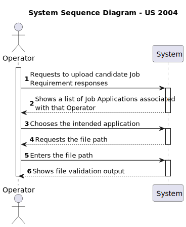
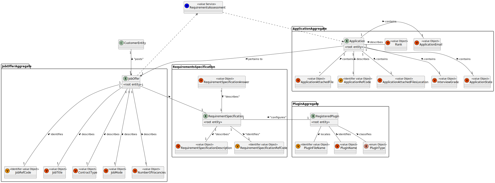
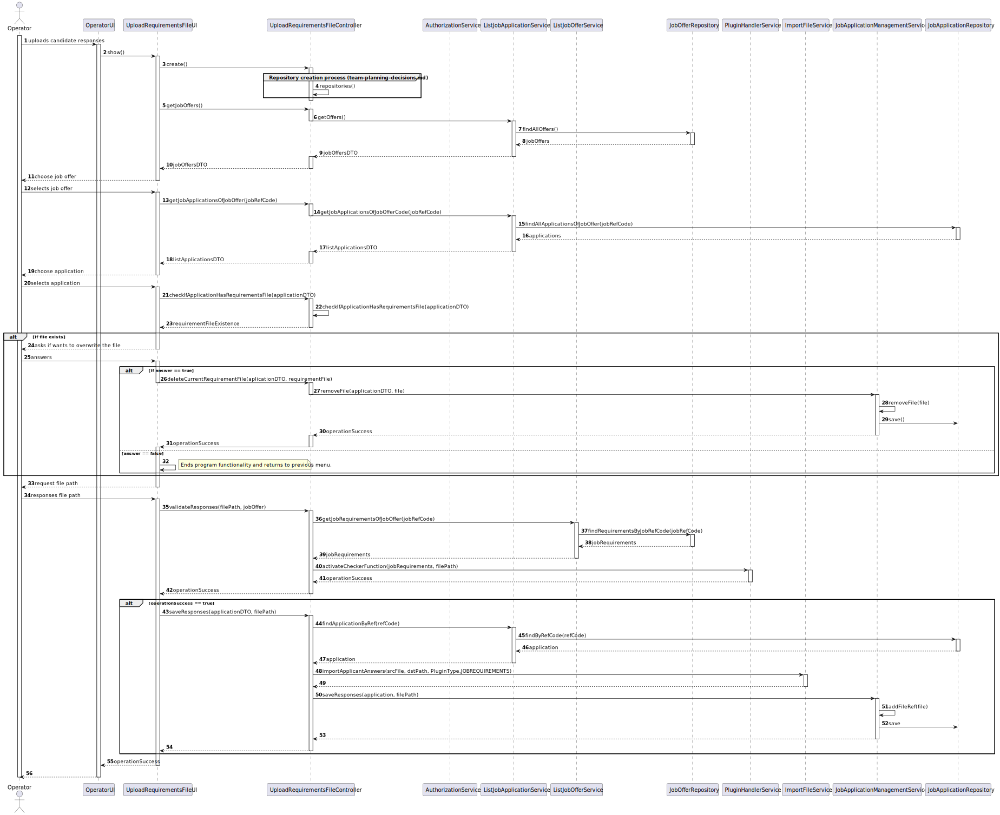
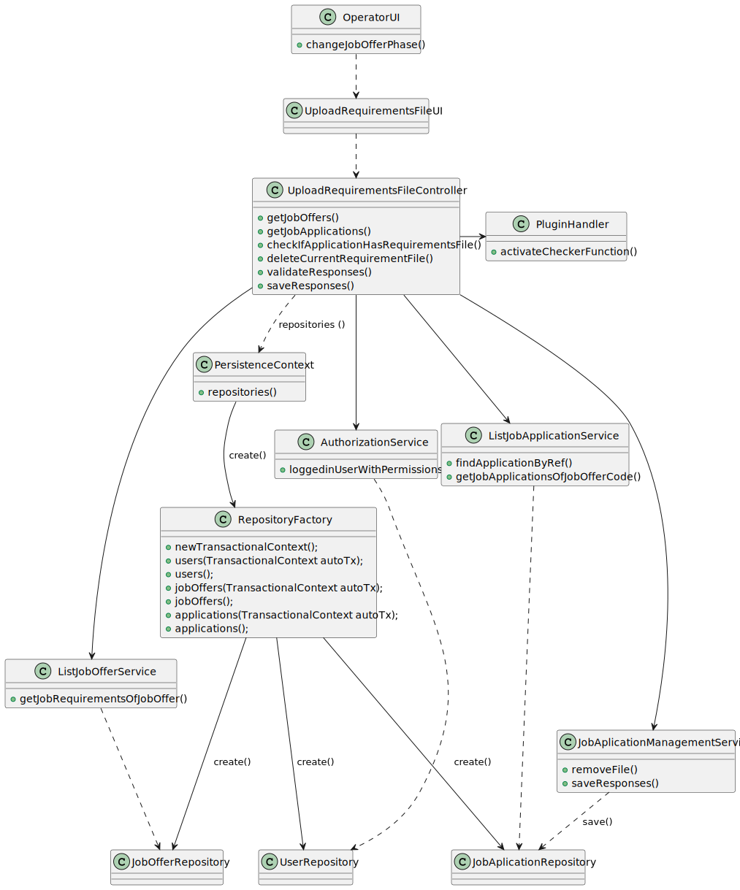
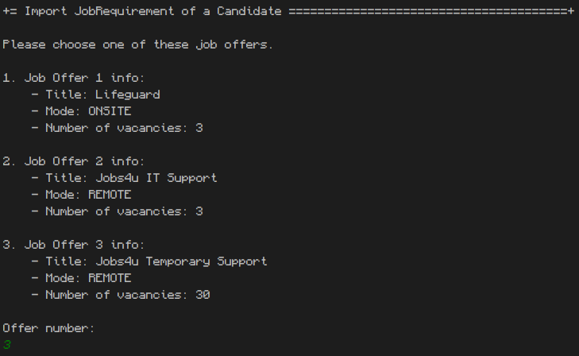
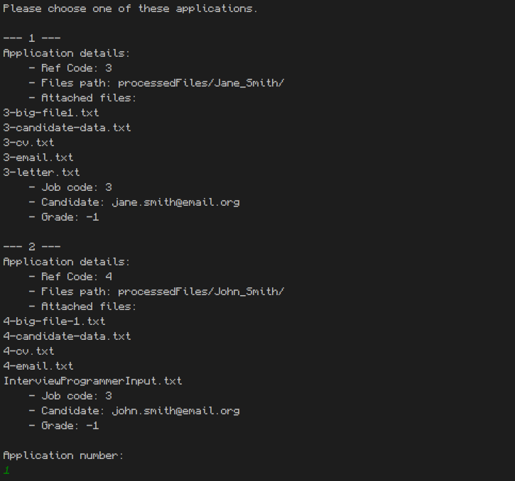
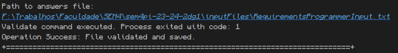

# US 2004 - As Operator, I want to upload a text file with the data fields (requirements) of a candidate for its verification.

## 1. Context

This is the first time this US is tasked to us. It targets the implementation of previously enabled functionalities to new users, while implementing new ones in the process.

## 2. Requirements

"**US 2004** As Operator, I want to upload a text file with the data fields (requirements) of a candidate for its verification."

**Client Specifications - Q&A:**

> **Q119 -** Management of screening data - We have a question about the management of the screen phase of the recruitment process. Specifically, after the applications are filtered during the screening process, I'm unsure about who manages the results and oversees this phase. Could you please clarify if the responsibility for managing the screening results falls under the customer manager, the operators, or both?
>
>> **A119 -** In US2003 and US2004 it is the Operator that “downloads” a template file to register the requirements, registers the answers for the requirements in the file, and then uploads the file. It is then the Costumer manager that executes the verification process (US1015) and executes the notification of the results (US1016)

> **Q166 -** Requirements Answers - I'm having trouble understading where are the requirements answer obtained from the candidates, so that the operator can then register their answers in the template previously generated and submit them to the system. Are these answers already within the files processed by tge application fie bot?
>
>> **A166 -** Please see Q15, Q102, Q119 and Q123. We can assume that the operator has access to all the files submitted by the candidates (since he/she is the one that imports the files into the system – US2002). He/she can than consult these files in order to answer the questions in the requirements template file. She/he then submits the file with the answers (US2004).

> **Q180 -** Candidate Answers - Does US2004 only deals with the upload of the file to the system or also the registration of the candidate's answer by the Operator? I've seen many mentions about the file's answers but I want to understand if that aspect is also part of US2004.
>
>> **A180 -** In US2003 the Operator downloads a template file that he/she uses to register the candidate requirements. In US 2004, the Operator uploads a file with the requirements and the system should validate the file (verify of the syntax is correct). US 1015 is the one that executes the verification of requirements for the candidates (based on the previously uploaded files).

> **Q218 -** Submissão de um ficheiro para verificação – O meu grupo tem uma dúvida em relação à US2004, nomeadamente sobre o processo de submissão do ficheiro. Gostaríamos de saber se "submeter o ficheiro para verificação" na US 2004 implica apenas guardar o caminho do ficheiro no sistema e fazer a sua análise sintática (como referiu na Q180) ou se envolve também a extração e armazenamento da informação contida no ficheiro em estruturas específicas para posterior verificação. Temos esta dúvida porque há User Stories em que está explícito que é suposto importar as informações dos ficheiros, como por exemplo na US2002: "As Operator, I want to register an application of a candidate for a job opening and import all files received". No entanto, na US2004 não está explícito o que significa "submeter o ficheiro".
>
>> **A218 -** Submeter o ficheiro significa “importar” o ficheiro para o sistema, verificando se está sintaticamente correto. O ficheiro passa a fazer parte do sistema, sendo possível operações posteriores sobre esse ficheiro/dados, como a US1015. Não quero/devo condicionar como é que isso é feito em termos de solução.

> **Q223 –** About the Us2004, in A180 you previously stated that "the Operator uploads a file with the requirements and the system should validate the file (verify of the syntax is correct). US 1015 is the one that executes the verification...". What should happen if the file failes this verification? Is the application instantly refused or do you have something else in mind?
>
>> **A223 -** A file that fails the verification means that that file has an error (syntactic error) it does not mean that the application does not meet the requirements. The user should fix the error and submit again. Only US 1015 results in approving or rejecting an application

> **Q228 -** About the Us2004, when the Operator uploads the text file, in which phase is this US going to be?
>
>> **A228 -** All the files of the candidate must have been imported before. These files will be necessary for the operator to be able to answer the questions in the requirements specification template. Only then can the operator upload the file with the answers. This is the normal sequence. Regarding the phase of the process, I think it will depend on the proposed solution. I am open to solutions that do not invalidate the data consistency of the system.

**Acceptance Criteria:**

- **US 2004.1.** The system should validate that an interview model has already been chosen for that selected job opening.
- **US 2004.2.** The system should validate the answers file.
- **US 2004.3.** The system should copy the answer file into the appropriate location.

**Dependencies/References:**

- No dependencies found to current sprint USs.

## 3. Analysis

This implementation appears to be simple, but it may require some updates to previous functionalities to accomplish the intended goals.

This task will:
- Allow the Operator to check their candidates' job applications and choose which one to add the new file to be validated.
  - Currently, there is no connection between the Operator and the job applications, so this needs to be updated.
- In case the validation isn't successful, the file shouldn't be stored and the operator allowed to try again after being warned of the process failure.
- After uploading the file and validating it, the file should be copied to a new directory for storage, and the job application object updated with the addition of the new path.

### System Sequence Diagram



### Relevant DM Excerpts

**Requirement Specification Aggregate:** (reduced version)



## 4. Design

### 4.1. Realization



| Interaction ID |                   Which Class is Responsible for...                   |              Answer              | Justification (With Patterns) |
|:--------------:|:---------------------------------------------------------------------:|:--------------------------------:|:-----------------------------:|
|       3        |                     instantiating the controller                      |     UploadRequirementsFileUI     |       Pure Fabrication        |
|       4        |                   instantiating persistence context                   | UploadRequirementsFileController |       Pure Fabrication        |
|       5        |                     requesting all the jobOffers                      |     UploadRequirementsFileUI     |     Pure Fabrication, MVC     |
|       6        |                     requesting all the jobOffers                      | UploadRequirementsFileController |     Pure Fabrication, MVC     |
|       7        |               getting the jobOffers from the repository               |    ListJobApplicationService     |            Service            |
|       8        |                         having the jobOffers                          |        JobOfferRepository        |          Repository           |
|       9        |                    converting the jobOffers to DTO                    |    ListJobApplicationService     |            Service            |
|       -        |                                   -                                   |                -                 |                               |
|       13       |            requesting the jobApplications of the jobOffer             |     UploadRequirementsFileUI     |     Pure Fabrication, MVC     |
|       14       |            requesting the jobApplications of the jobOffer             | UploadRequirementsFileController |       Pure Fabrication        |
|       15       |            getting the jobApplications from the repository            |    ListJobApplicationService     |            Service            |
|       16       |                      having the jobApplications                       |     JobApplicationRepository     |          Repository           |
|       17       |                 converting the jobApplications to DTO                 |    ListJobApplicationService     |            Service            |
|       -        |                                   -                                   |                -                 |               -               |
|       21       | requesting to check if the application has already a requirement file |     UploadRequirementsFileUI     |       Pure Fabrication        |
|       22       |      checking if the application has already a requirement file       | UploadRequirementsFileController |     Pure Fabrication, MVC     |
|       -        |                                   -                                   |                -                 |               -               |
|       26       |        requesting the deletion of the current requirement file        |     UploadRequirementsFileUI     |     Pure Fabrication, MVC     |
|       27       |        requesting the deletion of the current requirement file        | UploadRequirementsFileController |     Pure Fabrication, MVC     |
|       28       |                 deleting the current requirement file                 | JobApplicationManagementService  |            Service            |
|       29       |                  saving the change in the repository                  | JobApplicationManagementService  |            Service            |
|       -        |                                   -                                   |                -                 |               -               |
|       35       |               requesting the validation of the new file               |     UploadRequirementsFileUI     |     Pure Fabrication, MVC     |
|       36       |               requesting the jobOffer from the refCode                | UploadRequirementsFileController |     Pure Fabrication, MVC     |
|       37       |                 getting the jobOffer from the refCode                 |       ListJobOfferService        |            Service            |
|       -        |                                   -                                   |                -                 |               -               |
|       40       |      requesting to activate the checker function from the plugin      | UploadRequirementsFileController |       Pure Fabrication        |
|       41       |            activating the checker function from the plugin            |          PluginHandler           |            Handler            |
|       -        |                                   -                                   |                -                 |               -               |
|       43       |                   requesting to save the operation                    |     UploadRequirementsFileUI     |     Pure Fabrication, MVC     |
|       44       |            requesting the jobApplication from the refCode             | UploadRequirementsFileController |     Pure Fabrication, MVC     |
|       45       |              getting the jobApplication from the refCode              |    ListJobApplicationService     |            Service            |
|       -        |                                   -                                   |                -                 |               -               |
|       48       |             requesting to import the application answers              | UploadRequirementsFileController |       Pure Fabrication        |
|       49       |      importing the application answers to the correct directory       |        ImportFileService         |            Service            |
|       50       |                   requesting to save the responses                    | UploadRequirementsFileController |       Pure Fabrication        |
|       51       |                adding the new file to the application                 | JobApplicationManagementService  |            Service            |
|       52       |                saving the new file to the application                 | JobApplicationManagementService  |            Service            |

### 4.2. Class Diagram



### 4.3. Applied Patterns

- Aggregate
- Entity
- Value Object
- Service
- MVC
- Layered Architecture
- DTO

### 4.4. Tests

**Test 1:** Validates Symbol Table file is not null

```
@Test
void ensureInterviewNotNull() {
	IllegalArgumentException exception = assertThrows(IllegalArgumentException.class,
			() -> service.activateCheckerFunction(null, answersPath));
	assertEquals("Interview plugin should not be null.", exception.getMessage());
}
```

**Test 2:** Validates answers file is not null or empty

```
@Test
void ensureAnswerNotNull() {
	setup();
	IllegalArgumentException exception = assertThrows(IllegalArgumentException.class,
			() -> service.activateCheckerFunction(plugin, null));
	assertEquals("Source file should neither be empty nor null.", exception.getMessage());
	try {
		tearDown();
	} catch (IOException e) {
	}
}

@Test
void ensureAnswerNotEmpty() {
	setup();
	IllegalArgumentException exception = assertThrows(IllegalArgumentException.class,
			() -> service.activateCheckerFunction(plugin, ""));
	assertEquals("Source file should neither be empty nor null.", exception.getMessage());
	try {
		tearDown();
	} catch (IOException e) {
	}
}
```

**Test 3:** Ensures function can find answers file

```
@Test
void ensureAnswerFileExists() {
	setup();
	IllegalArgumentException exception = assertThrows(IllegalArgumentException.class,
			() -> service.activateCheckerFunction(plugin, "src/invalidDir/invalidSubDir/hello.txt"));
	assertEquals("Source file not found.", exception.getMessage());
	try {
		tearDown();
	} catch (IOException e) {
	}
}
```

**Test 4:** Validates that path and file passed as parameter are not null or empty

```
@Test
void ensureRemovePathNotNull() {
	IllegalArgumentException exception = assertThrows(IllegalArgumentException.class,
			() -> service.removeFile(null, fl));
	assertEquals("Path should neither be empty nor null.", exception.getMessage());
}

@Test
void ensureRemovePathNotEmpty() {
	IllegalArgumentException exception = assertThrows(IllegalArgumentException.class,
			() -> service.removeFile("", fl));
	assertEquals("Path should neither be empty nor null.", exception.getMessage());
}


@Test
void ensureRemoveFileNotNull() {
	IllegalArgumentException exception = assertThrows(IllegalArgumentException.class,
			() -> service.removeFile(dstPath, null));
	assertEquals("File should neither be empty nor null.", exception.getMessage());
}

@Test
void ensureRemoveFileNotEmpty() {
	IllegalArgumentException exception = assertThrows(IllegalArgumentException.class,
			() -> service.removeFile(dstPath, ""));
	assertEquals("File should neither be empty nor null.", exception.getMessage());
}
```

**Test 5:** Validates file to remove exists

```
@Test
void ensureRemoveFileExists() {
	IllegalArgumentException exception = assertThrows(IllegalArgumentException.class,
			() -> service.removeFile(dstPath, fl));
	assertEquals("Source file not found.", exception.getMessage());
}
```

**Test 6:** Validates file was correctly removed from folder

```
@Test
void ensureCorrectRemoval() {
	File src = new File(fileTest);
	try {
		src.createNewFile();
	} catch (IOException e) {
		e.printStackTrace();
	}
	try {
		service.removeFile(dstPath, fl);
	} catch (IOException e) {
		e.printStackTrace();
	}
	assertFalse(src.exists());
}
```

**Test 7:** Validates that files passed as parameter are not null or empty

```
@Test
void ensureImportSrcNotNull() {
	IllegalArgumentException exception = assertThrows(IllegalArgumentException.class,
			() -> service.importApplicantAnswers(null, dstPath));
	assertEquals("Source file should neither be empty nor null.", exception.getMessage());
}

@Test
void ensureImportSrcNotEmpty() {
	IllegalArgumentException exception = assertThrows(IllegalArgumentException.class,
			() -> service.importApplicantAnswers("", dstPath));
	assertEquals("Source file should neither be empty nor null.", exception.getMessage());
}

@Test
void ensureImportDstNotNull() {
	IllegalArgumentException exception = assertThrows(IllegalArgumentException.class,
			() -> service.importApplicantAnswers(srcFile, null));
	assertEquals("Destination directory should neither be empty nor null.", exception.getMessage());
}

@Test
void ensureImportDstNotEmpty() {
	IllegalArgumentException exception = assertThrows(IllegalArgumentException.class,
			() -> service.importApplicantAnswers(srcFile, ""));
	assertEquals("Destination directory should neither be empty nor null.", exception.getMessage());
}
```

**Test 8:** Validates that files passed as parameter exist

```
@Test
void ensureImportSrcExists() {
	IllegalArgumentException exception = assertThrows(IllegalArgumentException.class,
			() -> service.importApplicantAnswers("helper/src/testFile.txt", dstPath));
	assertEquals("Source file not found.", exception.getMessage());
}

@Test
void ensureImportDstExists() {
	IllegalArgumentException exception = assertThrows(IllegalArgumentException.class,
			() -> service.importApplicantAnswers(srcFile, "helper/dst"));
	assertEquals("Destination directory not found.", exception.getMessage());
}
```

**Test 9:** Validates successful copy of file

```
@Test
void ensureImportSuccessfulCopy() throws IOException {
	service.importApplicantAnswers(srcFile, dstPath);
	File f = new File("src/test/java/jobs4u/base/common/helper/dest/testFile.txt");
	assertTrue(f.exists() && f.isFile());
	f.delete();
}
```

**Test 10:** Validates that files is not null or empty

```
@Test
void ensureExtractNotNull() {
	IllegalArgumentException exception = assertThrows(IllegalArgumentException.class,
			() -> service.extractFileName(null));
	assertEquals("File should neither be empty nor null.", exception.getMessage());
}

@Test
void ensureExtractNotEmpty() {
	IllegalArgumentException exception = assertThrows(IllegalArgumentException.class,
			() -> service.extractFileName(""));
	assertEquals("File should neither be empty nor null.", exception.getMessage());
}
```

**Test 11:** Validates that file exists

```
@Test
void ensureExtractExists() {
	IllegalArgumentException exception = assertThrows(IllegalArgumentException.class,
			() -> service.extractFileName("helper/src/testFile.txt"));
	assertEquals("File not found.", exception.getMessage());
}
```

**Test 12:** Verifies successfully operation

```
@Test
void ensureExtractSuccessful() {
	assertEquals("testFile.txt", service.extractFileName(srcFile));
}
```

### 4.5 Design Commits:
> **28/05/2024 12:22 [2004]** Documentation Started:
>
> - Context, Requirements and Analysis done;
> - Design started: SSD done.
>
> The rest of the design will be discussed as a team to follow the same thought process of similar USs.

> **28/05/2024 12:22 [2004]** Documentation Update:
>
> - Design completed: SD, CD and Rationale completed;
> - Tests done.

> **28/05/2024 12:22 [2004]** Design Update:
>
> This design update was made to correct the names and workflow of the methods to be more in-line with previously created methods.
>
> - SD updated.
> - Rationale updated.
> - Class Diagram updated

## 5. Implementation

**UploadRequirementsFileController:**
````
public class UploadRequirementsFileController {

    private final AuthorizationService autService = AuthzRegistry.authorizationService();
    private final ListJobOfferService offerService = new ListJobOfferService();
    private final PluginHandlerService pluginHandlerService = new PluginHandlerService();
    private final ListJobApplicationService listApplicationService = new ListJobApplicationService();
    private final JobApplicationManagementService applicationService = new JobApplicationManagementService();
    private final ImportFileService fileService = new ImportFileService();

    public Iterable<JobOfferDto> getJobOffers() {
        autService.ensureAuthenticatedUserHasAnyOf(BaseRoles.OPERATOR);
        return offerService.getOffers();
    }

    public boolean checkRequirements(JobOfferDto offerdto) {
        autService.ensureAuthenticatedUserHasAnyOf(BaseRoles.OPERATOR);
        Optional<RegisteredPlugin> plugin = getRequirements(offerdto);
        if (plugin.isEmpty())
            return false;
        return true;
    }

    public Optional<RegisteredPlugin> getRequirements(JobOfferDto offerdto){
        return offerService.getJobRequirementsOfJobOffer(new JobRefCode(Integer.parseInt(offerdto.getRefCode())));
    }


    public boolean validateResponses(String filePath, JobOfferDto offerDto) throws IllegalArgumentException {
        autService.ensureAuthenticatedUserHasAnyOf(BaseRoles.OPERATOR);
        return pluginHandlerService.activateCheckerFunction(getRequirements(offerDto).orElse(null), filePath);
    }

    public Iterable<ApplicationDTO> getJobApplicationsOfJobOffer(JobOfferDto offerdto) {
        autService.ensureAuthenticatedUserHasAnyOf(BaseRoles.OPERATOR);
        return listApplicationService.getJobApplicationsOfJobOfferCode(new JobRefCode(Integer.parseInt(offerdto.getRefCode())));
    }

    public void saveResponses(ApplicationDTO appdto, String filePath) throws IOException {
        autService.ensureAuthenticatedUserHasAnyOf(BaseRoles.OPERATOR);
        JobApplication app = listApplicationService.getByRef(appdto.getJobRefCode()).orElse(null);
        String fileName;
        if (app == null)
            throw new IllegalArgumentException("Job Application not found.");
        try {
            fileName = fileService.importApplicantAnswers(filePath, app.getFilePath(), PluginType.JOBREQUIREMENTS);
        } catch (IOException e) {
            throw e;
        }
        applicationService.saveResponses(app, fileName);
    }

    public String checkIfApplicationHasRequirementsFile(ApplicationDTO app) {
        String[] appFiles = app.getAttachedFile().split("\n");

        for (int i = 0; i < appFiles.length; i++) {
            if (appFiles[i].contains("_JOBREQUIREMENTS")){
                return appFiles[i];
            }
        }
        return null;
    }

    public String deleteCurrentRequirementFile(ApplicationDTO applicationDTO, String file) {
        JobApplication app = listApplicationService.getByRef(applicationDTO.getJobRefCode()).orElse(null);
        if (app == null){
            throw new IllegalArgumentException("Job Application not found.");}
        return applicationService.removeFile(app, file);
    }
}
````

**ListJobApplicationService:**
````
private final AuthorizationService authz = AuthzRegistry.authorizationService();
    private final JobApplicationRepository repo = PersistenceContext.repositories().jobApplications();

	public Iterable<ApplicationDTO> getJobApplicationsOfJobOfferCode(JobRefCode code) {
		Iterable <JobApplication> apps = repo.findAllApplicationsOfJobOffer(code);
		List<ApplicationDTO> ret = new ArrayList<>();
		apps.forEach(a -> ret.add(a.toDTO()));
		return ret;
	}

	public Optional<JobApplication> getByRef(int code) {
		return repo.findByRefCode(code);
	}
}
````

**ImportFileService:**
````
public class ImportFileService {
  public String importApplicantAnswers(String srcPath, String dstPath, PluginType type) throws IOException {
		if (srcPath == null || srcPath.isBlank() )
			throw new IllegalArgumentException("Source file should neither be empty nor null.");
		if (dstPath == null || dstPath.isBlank())
			throw new IllegalArgumentException("Destination directory should neither be empty nor null.");
		File src = new File(srcPath);
		if (!src.exists() || !src.isFile())
			throw new IllegalArgumentException("Source file not found.");
		File dst = new File(dstPath);
		if (!dst.exists() || !dst.isDirectory())
			throw new IllegalArgumentException("Destination directory not found.");
		FileUtils.copyFileToDirectory(src, dst, false);

		File copiedFile = new File(dst, src.getName());

		File renamedFile;

		if (type==PluginType.JOBREQUIREMENTS) {
			renamedFile = new File(dst, src.getName().replace(".txt","") + "_JOBREQUIREMENTS.txt");
		} else {
			renamedFile = new File(dst, src.getName().replace(".txt","") + "_INTERVIEW.txt");
		}

		copiedFile.renameTo(renamedFile);

		return renamedFile.getName();
	}
}
````

**PluginHandlerService:**
````
public class PluginHandlerService {
    private static final String pluginDir = "lib";
	private static final String pluginName = "JobApplication_ManagerPlugin.jar";
	
	public boolean activateCheckerFunction(RegisteredPlugin interview, String answersFile) {
		if (answersFile == null || answersFile.isBlank())
			throw new IllegalArgumentException("Source file should neither be empty nor null.");
		File src = new File(answersFile);
		if (!src.exists() || !src.isFile())
			throw new IllegalArgumentException("Source file not found.");
		if (interview == null)
			throw new IllegalArgumentException("Interview plugin should not be null.");
		return activatePluginValidate("-validate", "-interview", interview.fileName().toString(), answersFile);
	}

	private boolean activatePluginValidate(String action, String type, String file, String answers) {
		int exitCode = 0;
		try {
			String filePath = pluginDir + File.separator + pluginName;
			String[] command = { "java", "-jar", filePath, action, type, file, answers };
			/* for (String c : command)
			 	System.out.println(c); */
			ProcessBuilder processBuilder = new ProcessBuilder(command);
			Process process = processBuilder.start();

			exitCode = process.waitFor();
			System.out.println("Validate command executed. Process exited with code: " + exitCode);

		} catch (IOException | InterruptedException e) {
			e.printStackTrace();
		}
		if (exitCode != 1)
			return false;
		return true;
	}
````

### Main Commits:
> **03/06/2024 17:20 [2004]** Implementation completed:
>
> In this commit, it will be provided all the domain classes and updates to previous functionalities to complete the required task.
>
> This was also implemented in conjunction with the US 1017, since the tasks are pretty similar. Some updates were made to their methods, some are shared and some new methods added to this US will be added to US 1017 to keep the consistency between USs.


## 6. Integration/Demonstration







## 7. Observations

Many of these implementations were implemented in conjunction with the US 1017, since the tasks are pretty similar. Some updates were made to their methods, some are shared and some new methods added to this US were added to US 1017 to keep the consistency between USs.

The tests were made entirely for the US 1017, and since this US uses the same methods, the tests are the same.