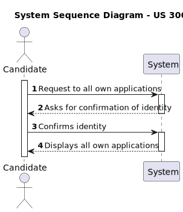
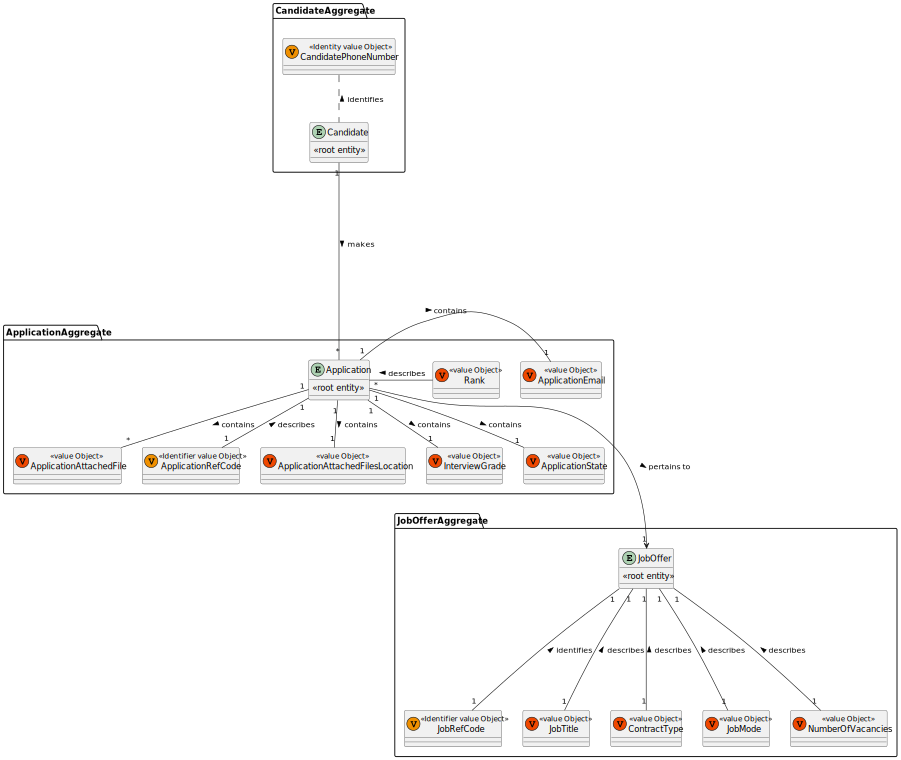
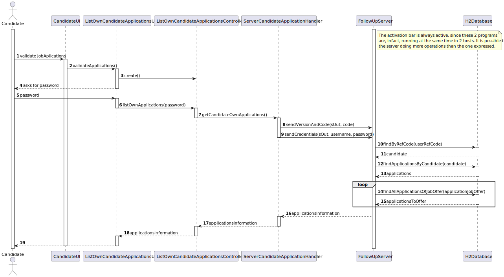
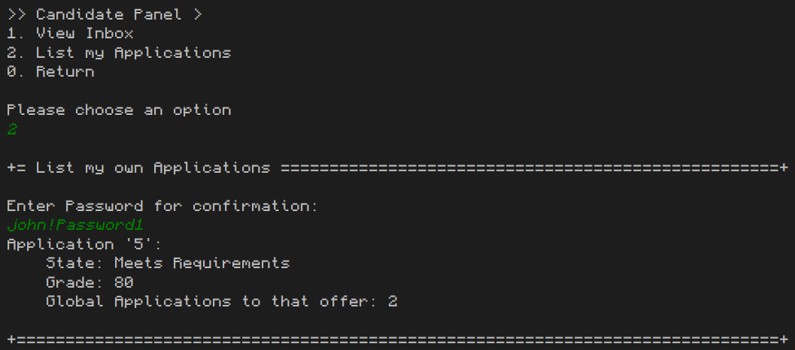

# US 3000 - As Candidate, I want to list all my applications and their state (including the number of applicants).

## 1. Context

This is the first time this US is tasked to us. It targets an update to previously created implementations to add new functionalities.

## 2. Requirements

"**US 3000 -** As Candidate, I want to list all my applications and their state (including the number of applicants)."

**Client Specifications - Q&A:**

> **Q176 -** Na US3000 pede que, para alem de listar as aplicações e o estado das mesmas de um candidato, que liste o numero de candidatos. Este numero de candidatos é um somatório da quantidade de candidatos que fizeram uma aplicação para as mesmas Job Openings deste primeiro candidato (que esta a executar o caso de uso)?
> 
>> **A176 -** Devem ser listadas todas as “applications” (candidaturas) do candidato, o estado delas, assim como o número de candidaturas que cada job opening teve (assim o candidato tem uma noção da “concorrência” que teve para cada uma das suas candidaturas).

**Acceptance Criteria:**

- **US 3000.1** The connection to the repository has to be made through the follow-up server.
- **US 3000.2** The system should always show the number of applications for that application's JobOffer.

**Dependencies/References:**

- This implementation requires the creation and connection of the follow-up server to the application.

## 3. Analysis

This functionality is pretty simple to implement, since it's a simple repository search. The main take-way from this US is the connection to the follow-up server. 

After that is done, the execution is pretty simple:
- The controller evokes the server handler to activate the function in the server.
  - The server itself will check who is the loggedUser and search through all the jobApplications for the ones who have the correct candidate associated to it.
  - If it finds it, it will display the application ID, the state and the grade. 
    - Since we occupy the grade with -1 while the application isn't graded, the server should check if the value isn't equal to the default.
    If it is, then it shouldn't show it.
  - After displaying the application information, the system should search how many applications have the same "jobOfferRefCode" to see how many applications exist for that job offer. Then, it shows that number to the candidate.
    - This search will be done by finding all the applications of the jobOffer, and seeing the size of the result.


### System Sequence Diagram



### Relevant DM Excerpts



## 4. Design

### 4.1. Realization



| Interaction ID |                   Which Class is Responsible for...                   |                 Answer                 | Justification (With Patterns) |
|:--------------:|:---------------------------------------------------------------------:|:--------------------------------------:|:-----------------------------:|
|       3        |                     instantiating the controller                      |     ListOwnCandidateApplicationsUI     |       Pure Fabrication        |
|       -        |                                   -                                   |                   -                    |               -               |
|       6        |          requesting the list of the candidate's applications          |     ListOwnCandidateApplicationsUI     |     Pure Fabrication, MVC     |
|       7        | asking the handler to return the list of the candidate's applications | ListOwnCandidateApplicationsController |              MVC              |
|       8        |              sending the version and code to the server               |   ServerCandidateApplicationHandler    |            Handler            |
|       9        |              sending the login information to the server              |   ServerCandidateApplicationHandler    |            Handler            |
|       10       |               getting the candidate by the userRefCode                |             FollowUpServer             |            Server             |
|       11       |                         having the candidates                         |          CandidateRepository           |          Repository           |
|       12       |              getting all the applications of a candidate              |             FollowUpServer             |            Server             |
|       13       |                        having the applications                        |        JobApplicationRepository        |          Repository           |
|       14       |              getting all the applications of a jobOffer               |             FollowUpServer             |            Server             |
|       15       |                        having the applications                        |        JobApplicationRepository        |          Repository           |
|       -        |                                   -                                   |                   -                    |               -               |

### 4.2. Class Diagram


### 4.3. Applied Patterns

- Aggregate
- Entity
- Value Object
- MVC
- Layered Architecture

### 4.4. Tests

Since this task only uses persistence gathering and search, it's not possible to test it.

### 4.5 Design Commits:
> **8/06/2024 22:40 [3000]** Documentation Started:
>
>- Requirements and Analysis done.
>- Design done: SD, SSD, CD, Rationale, Tests.
>
>This documentation is pretty simple. The main problem is the connection to the server. Since that is done, the implementation is pretty fast.

## 5. Implementation

**ListOwnCandidateApplicationsController:**
````
public class ListOwnCandidateApplicationsController {

    public Iterable<MessageDTO> listOwnApplications(String password) {
        ServerCandidateApplicationHandler handler = new ServerCandidateApplicationHandler(password);
        return handler.getCandidateOwnApplications();
    }
}
````

**ServerCandidateApplicationHandler:**
````
public class ServerCandidateApplicationHandler {
    private final AuthorizationService authz = AuthzRegistry.authorizationService();

    private static final int ASS_PORT_NUMBER = 6912;
    private static InetAddress serverIP;
    private static Socket sock;
    private String password;
    private String serverIp = "10.8.67.152";

    public ServerCandidateApplicationHandler(String password) {
        this.password = password;
    }


    public Iterable<MessageDTO> getCandidateOwnApplications() {
        try {
            serverIP = InetAddress.getByName(serverIp);
        } catch (UnknownHostException ex) {
            System.out.println("Invalid server specified: " + serverIp);
            System.exit(1);
        }

        try {
            sock = new Socket(serverIP, ASS_PORT_NUMBER);
        } catch (IOException ex) {
            System.out.println("Failed to establish TCP connection");
            System.exit(1);
        }

        try (ObjectOutputStream sOut = new ObjectOutputStream(sock.getOutputStream());
             ObjectInputStream sIn = new ObjectInputStream(sock.getInputStream());
        ) {

            SystemUser user = authz.loggedinUserWithPermissions(BaseRoles.CANDIDATE).get();

            sendVersionAndCode(sOut, 4);
            sendCredentials(sOut, user.username().toString(), password);

            byte responseCode = 0;
            responseCode = sIn.readByte();

            if (responseCode != 3 && responseCode != 0) {
                sOut.writeByte(1);

                sOut.writeByte(11);

                sOut.flush();

                sIn.readByte();
                sIn.readByte();

                Iterable<MessageDTO> notifs = (Iterable<MessageDTO>) sIn.readObject();

                sOut.writeByte(1);
                sOut.writeByte(1);
                sOut.flush();

                closeSocket();
                return notifs;
            }


        } catch (IOException e) {
            System.out.println("IOException: " + e.getMessage());
        } catch (ClassNotFoundException e) {
            System.out.println("ClassNotFound Exception: " + e.getMessage());
        }

        closeSocket();
        return null;
    }

    private static void sendVersionAndCode(ObjectOutputStream sOut, int code) throws IOException {
        byte version = 1;
        sOut.writeByte(version);
        sOut.writeByte(code);
        sOut.flush();
    }

    private static void sendCredentials(ObjectOutputStream sOut, String username, String password) throws IOException {
        byte[] usernameData = username.getBytes();
        int usernameLen = usernameData.length;
        sOut.writeByte(usernameLen & 0xFF);
        sOut.writeByte((usernameLen >> 8) & 0xFF);
        sOut.write(usernameData);

        byte[] passwordData = password.getBytes();
        int passwordLen = passwordData.length;
        sOut.writeByte(passwordLen & 0xFF);
        sOut.writeByte((passwordLen >> 8) & 0xFF);
        sOut.write(passwordData);

        sOut.flush();
    }

    private static void closeSocket() {
        try {
            if (sock != null && !sock.isClosed()) {
                sock.close();
            }
        } catch (IOException e) {
            System.out.println("Failed to close socket: " + e.getMessage());
        }
    }
}
````

**Jobs4uServer:**
````
public class Jobs4uServer {
    private void getAllCandidateApplications() throws IOException, ClassNotFoundException{
        Optional<SystemUser> user = usersRepo.ofIdentity(Username.valueOf(threadUser));
        if(user.isPresent()) {
            Optional<Candidate> candidate = candidateRepository.findByRefCode(user.get());

            if(candidate.isPresent()) {
                Iterable<JobApplication> applications = jobApplicationRepository.findApplicationsByCandidate(candidate.get().associatedUser());

                ArrayList<MessageDTO> appMessages = new ArrayList<>();

                for (JobApplication app : applications) {

                    String candidateApplication = "Application '" + app.identity()
                            + "':\n\tState: " + app.getState() +"\n";

                    if (app.getGrade()!=-1){
                        candidateApplication += "\tGrade: " + app.getGrade()+ "\n";
                    }

                    List<JobApplication> applicationsToOffer = (ArrayList) jobApplicationRepository.findAllApplicationsOfJobOffer(app.getJoboffer().identity());

                    candidateApplication += "\tGlobal Applications to that offer: " + applicationsToOffer.size() + "\n";

                    byte[] appData = candidateApplication.getBytes();
                    int appDataLen = appData.length;
                    int l = appDataLen & 0xFF;
                    int m = (appDataLen >> 8) & 0xFF;

                    appMessages.add(new MessageDTO(candidateApplication, l, m));
                }

                socketOut.writeObject(appMessages);
                socketOut.flush();
            }
        }
}
````

### Main Commits:
> **08/06/2024 23:25 [3000]** Implementation Done and tested:
>
>- Domain Classes created;
>- Update to previous repositories to add new queries;
>- UI and Controller created.

## 6. Integration/Demonstration



## 7. Observations

No observations.