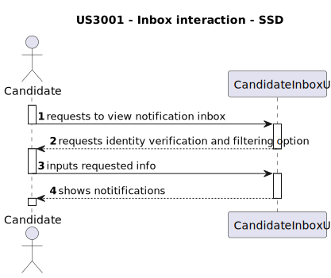
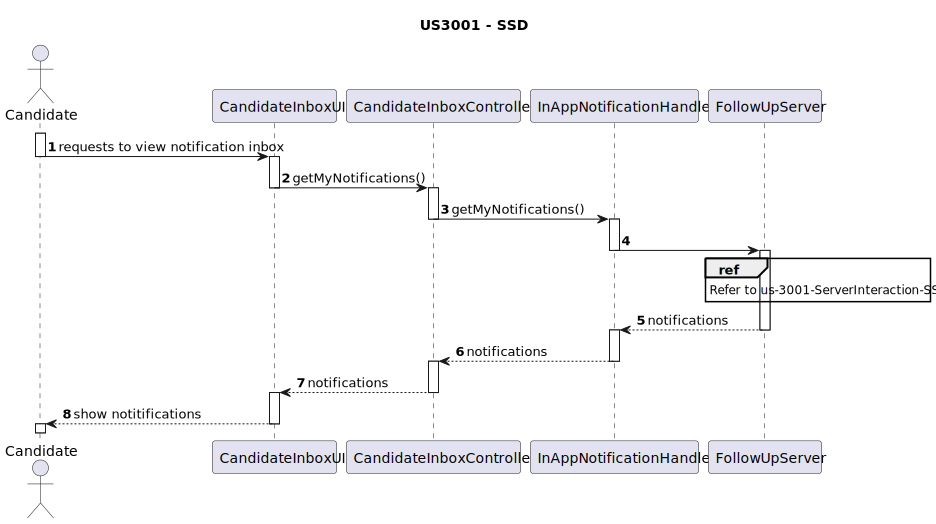
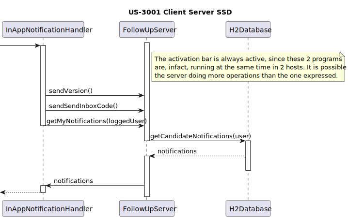
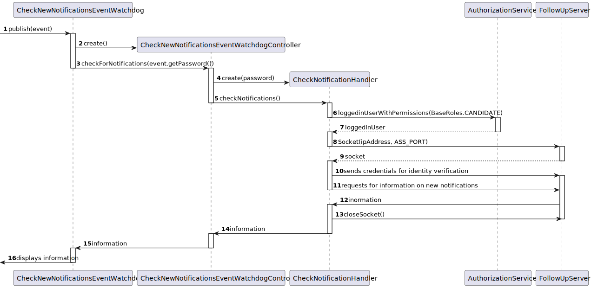
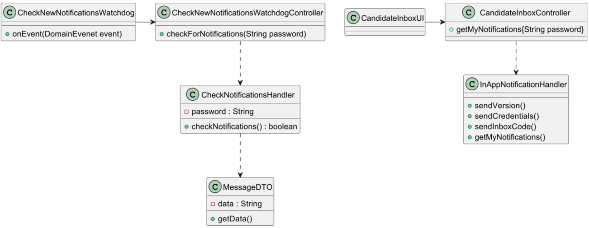
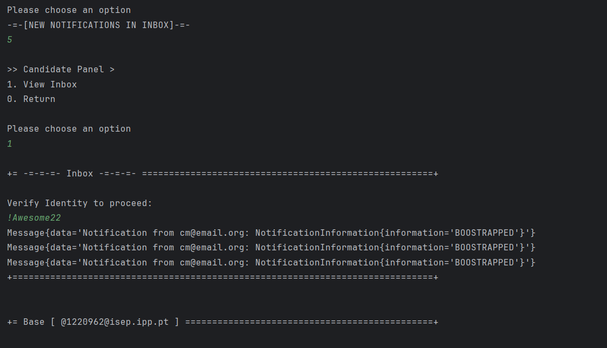

# 3001 As Candidate, I want to be notified in my application when the state of one of my applications changes


## 1. Context

The client has requested for a functionality capable of notifying candidates of changes in the state of their sent in applications.


## 2. Requirements

### Client Q&A Records

>**Q174** US3001 - Na US 3001 pretende que o candidato seja notificado na sua aplicação quando o estado de uma aplicação mudar. De que forma pretende que o candidato seja notificado? E caso o candidato não esteja a correr a aplicação, essa notificação é perdida?
>
>>**A174** O candidato deve ser notificado quando a sua “app” está em execução. Relativamente a notificações que “acontecem” quando não está a correr a aplicação, seria interessante que as recebesse da próxima vez que executasse a aplicação.

>**Q175** US3001 - Questão âmbito notificações - O candidato será notificado, quando a sua candidatura mudar de estado. O que se entende por notificado, é receber um email, quando entra na aplicação tem uma fila de 'inbox' ? Quando a aplicação está ligada recebo email? É o candidato que faz o pedido(cliente) (Pop) inicia assim a comunicação, e recebe a resposta/notificação (servidor). E como encaixo o cenário de notificação(push)?
>
>>**A175** Ver Q174. Neste caso as notificações são na aplicação do candidato, não são por email.

>**Q189** US3001 – Application State – I'd like some clarifications regarding the state that US3001 mentions. Is it the "accepted/not accepted" state, or a state regarding the phases of the recruitment process of which the application is associated to?
>
>>**A189** This US is focused on the Candidate perspective. He/she may not be aware of the internal phases of the recruitment process. But he/she is interested in knowing the “external” state of his/her applications. For instance, as a candidate I would like to know if my application was received. Then I would like to know if my application was accepted or not and, finally, if I was selected or not

>**Q229** Jose Afonso – US 3001 - Segundo a nossa perspetiva sobre esta funcionalidade, achámos melhor o utilizador ter na sua aplicação uma espécie de inbox de notificações. Quando o utilizador está na funcionalidade das notificações este recebe as notificações que tinha e que não foram enviadas porque não estava na aplicação e depois fica á espera de novas notificações que apareçam entretanto, até o utilizador pedir para sair da funcionalidade. Esta abordagem está alinhada com suas expectativas?
>
>>**A229** Pode ser. Mas não seria possível receber as notificação mesmo não estando nessa “opção de menu”? Sendo uma aplicação “console” limita um pouco a UI, mas não seria possível receber as notificações desde que tenha a aplicação em execução mas só mostrar essas notificações quando o utilizador seleciona a opção? Em termos de UI a diferença é mínima, em termos de implementação pode ser significativa. Talvez esta seja até mais uma questão para RCOMP.

> Note: This Client Q&A session has opened up multiple possible approaches for this functionality, as so the following acceptance criteria have been derived to fully encompass the functionality as completely as possible.

**Acceptance Criteria:**

- **US3001.1.** The system should maintain updated knowledge on the notifications of the logged user.
- **US3001.2.** The system should provide the candidate with a localized interface where the candidate can view all their notifications without disrupting execution flow

**Dependencies/References:**

- Found functional dependencies only refer to follow-up server implementation which the team is responsible for (see US7004 documentation for more details about follow-up server execution flow)

## 3. Analysis

#### Candidate - System Interactions (Inbox access)


##### Candidate - System Interactions (Notification on Login)


## 4. Design


### 4.1. Realization

#### Inbox Access Execution Flow


| Interaction ID |           Which Class is Responsible for...            |          Answer          | Justification (With Patterns) |
|:--------------:|:------------------------------------------------------:|:------------------------:|:-----------------------------:|
|       3        |              instantiating the controller              |     CandidateInboxUI     |       Pure Fabrication        |
|       6        |          requesting the list of notifcations           |     CandidateInboxUI     |     Pure Fabrication, MVC     |
|       7        | asking the handler to return the list of notifications | CandidateInboxController |              MVC              |
|       8        |       sending the version and code to the server       | CheckNotificationHandler |            Handler            |
|       9        |      sending the login information to the server       | CheckNotificationHandler |            Handler            |
|       10       |               getting the notifications                |      FollowUpServer      |            Server             |
|       11       |                having the notifcations                 |  NotificationRepository  |          Repository           |
|       12       |             getting all the notifications              |      FollowUpServer      |            Server             |

#### Server Interaction Execution Flow


#### Login Notification Event


### 4.2. Class Diagram



### 4.3. Applied Patterns

- Layered Architecture
- MVC
- DTO
- TCP
- Entity
- ValueObject
- Aggregate
- DDD


### 4.4. Tests

```
    @Test
    void assertCandidateNotNull() {
        final SystemUserBuilder userBuilder = UserBuilderHelper.builder();
        userBuilder.withUsername("johndoe@email.org").withPassword("John!Password6").withName("John", "Doe")
                .withEmail("johndoe@email.com").withRoles(BaseRoles.CUSTOMER_MANAGER);

        SystemUser customerManager = userBuilder.build();
        NotificationTypes notifType = NotificationTypes.EMAIL;

        NotificationFactory factory = new NotificationFactory();

        // Act & Assert
        IllegalArgumentException thrown = assertThrows(IllegalArgumentException.class, () -> {
            factory.newNotification(null, customerManager,"text", notifType);
        });
    }

    @Test
    void assertCustomerManagerNotNull() {
        final SystemUserBuilder userBuilder = UserBuilderHelper.builder();
        userBuilder.withUsername("johndoe@email.org").withPassword("John!Password6").withName("John", "Doe")
                .withEmail("johndoe@email.com").withRoles(BaseRoles.CANDIDATE);

        SystemUser candidate = userBuilder.build();
        NotificationTypes notifType = NotificationTypes.EMAIL;

        NotificationFactory factory = new NotificationFactory();

        // Act & Assert
        IllegalArgumentException thrown = assertThrows(IllegalArgumentException.class, () -> {
            factory.newNotification(candidate, null,"text", notifType);
        });
    }

    @Test
    void assertNotificationTypeNotNull() {
        final SystemUserBuilder userBuilder = UserBuilderHelper.builder();
        userBuilder.withUsername("johndoe@email.org").withPassword("John!Password6").withName("John", "Doe")
                .withEmail("johndoe@email.com").withRoles(BaseRoles.CUSTOMER_MANAGER);

        SystemUser customerManager = userBuilder.build();

        userBuilder.withUsername("johndoe@email.org").withPassword("John!Password6").withName("John", "Doe")
                .withEmail("johndoe@email.com").withRoles(BaseRoles.CANDIDATE);

        SystemUser candidate = userBuilder.build();


        NotificationFactory factory = new NotificationFactory();

        // Act & Assert
        IllegalArgumentException thrown = assertThrows(IllegalArgumentException.class, () -> {
            factory.newNotification(candidate, customerManager,"text", null);
        });
    }

    @Test
    void assertBuildWithoutSettingAttributesThrows() {
        // Arrange
        NotificationFactory factory = new NotificationFactory();

        // Act & Assert
        IllegalStateException thrown = assertThrows(IllegalStateException.class, factory::build);
        assertEquals("Candidate is not set", thrown.getMessage());
    }
````

### 4.5 Design Commits:

> **[US3001] -** Analysis + Design 1st Iteration (subject to change due to team meeting) 29/05/2024 13:02

> **[US3001] -** Design and Implementation Update due to new AC 04/06/2024 13:34

## 5. Implementation

[CheckNotificationHandler](../../../jobs4u.core/src/main/java/jobs4u/base/notificationmanagement/CheckNotificationHandler.java)

[EmailNotificationHandler](../../../jobs4u.core/src/main/java/jobs4u/base/notificationmanagement/EmailNotificationHandler.java)

[InAppNotificationHandler](../../../jobs4u.core/src/main/java/jobs4u/base/notificationmanagement/InAppNotificationHandler.java)

[CheckNewNotificationsEventWatchdogController](../../../jobs4u.core/src/main/java/jobs4u/base/notificationmanagement/application/CheckNewNotificationsEventWatchdogController.java)

[CandidateInboxController](../../../jobs4u.core/src/main/java/jobs4u/base/notificationmanagement/application/CandidateInboxController.java)

[CandidateNotificationController](../../../jobs4u.core/src/main/java/jobs4u/base/notificationmanagement/application/CandidateNotificationController.java)

[JobApplicationNotificationWatchdogController](../../../jobs4u.core/src/main/java/jobs4u/base/notificationmanagement/application/JobApplicationNotificationWatchdogController.java)

[CheckNewNotificationsEvent](../../../jobs4u.core/src/main/java/jobs4u/base/notificationmanagement/domain/CheckNewNotificationsEvent.java)

[CheckNewNotificationsEventWatchdog](../../../jobs4u.core/src/main/java/jobs4u/base/notificationmanagement/domain/CheckNewNotificationsEventWatchdog.java)

[CreationDate](../../../jobs4u.core/src/main/java/jobs4u/base/notificationmanagement/domain/CreationDate.java)

[JobApplicationNotificationEvent](../../../jobs4u.core/src/main/java/jobs4u/base/notificationmanagement/domain/JobApplicationNotificationEvent.java)

[JobApplicationNotificationEventWatchdog](../../../jobs4u.core/src/main/java/jobs4u/base/notificationmanagement/domain/JobApplicationNotificationEventWatchdog.java)

[MessageDTO](../../../jobs4u.core/src/main/java/jobs4u/base/notificationmanagement/domain/MessageDTO.java)

[Notification](../../../jobs4u.core/src/main/java/jobs4u/base/notificationmanagement/domain/Notification.java)

[NotificationFactory](../../../jobs4u.core/src/main/java/jobs4u/base/notificationmanagement/domain/NotificationFactory.java)

[NotificationInformation](../../../jobs4u.core/src/main/java/jobs4u/base/notificationmanagement/domain/NotificationInformation.java)

[NotificationState](../../../jobs4u.core/src/main/java/jobs4u/base/notificationmanagement/domain/NotificationState.java)

[NotificationTypes](../../../jobs4u.core/src/main/java/jobs4u/base/notificationmanagement/domain/NotificationTypes.java)

[NotificationRepository](../../../jobs4u.core/src/main/java/jobs4u/base/notificationmanagement/repositories/NotificationRepository.java)

### Main Commits:

> **[US3001] -** Tests + Implementation 30/05/2024 14:29

> **[US3001] -** Implementation Final Iteration + Documentation Update 01/06/2024 13:58

## 6. Integration/Demonstration




## 7. Observations

Considering this user story's nature of interacting with the server it was impossible to apply a complete TDD pattern when developing in.