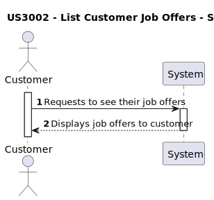
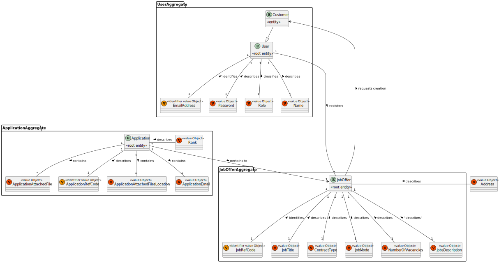
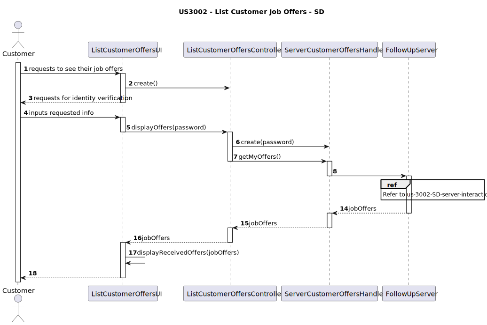
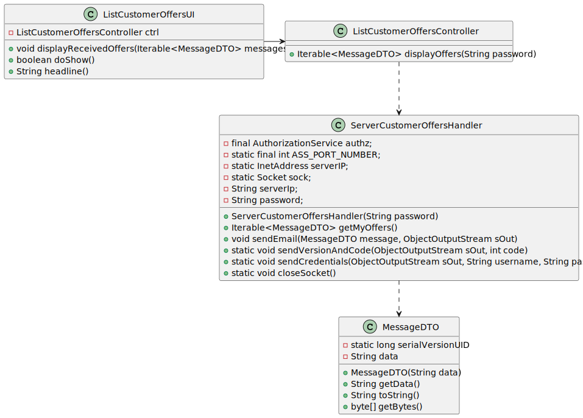
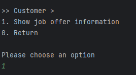
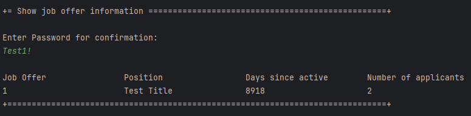

# US 3002 - As Customer, I want to list all my job offers, including job reference, position, active since, number of applicants.

## 1. Context

Customers can check all the job offers that they've published, along with their info and number of applicants. This is a newly assigned task during Sprint C and is to be completed in said sprint.

## 2. Requirements

"**US 3002 -** As Customer, I want to list all my job offers, including job reference, position, active since, number of applicants."

**Questions answered by the client:**

>**Q34.** US3002, One of the parameters while listing job offers is "position". What does it reference?
>>**A34.** In this US, "position" has the same meaning as "title or function" in section 2.2.2.

>**Q172.** US3002, It's stated that one of the parameters to show in the job offers is "active since". It's been clarified that an active job offer is one where its recruitment process is still on-going. Are the job offers listed only the ones with an on-going recruitment?
>>**A172.** In the context of this US, “active since” means the date from the start of the process, the “application” phase (since that date, candidates can apply). This functionality should include all the “active” job offers.

**Acceptance Criteria:**

- **US3002.1.** The system shows all "active" job offers.
- **US3002.2.** The job offers listed are job offers related to the customer.
- **US3002.3.** The number of applicants is tied directly to those who applied to a specific job offer.

**Dependencies/References:**

No dependencies were found between this user story and the other ones of the current sprint.

## 3. Analysis

The team has arrived to the following conclusions:
- There will be a User Interface accessed by users with the role Customer, to be able to list the job offers.

#### System Sequence Diagram


### Relevant DM Excerpt



## 4. Design

Since the User Story only has one distinct functionality, only one SD will be presented.

### 4.1. Realization

**Functionality:** To list job offers related to a customer

#### 4.1.2 Sequence Diagram


| Interaction ID |   Which Class is Responsible for...    |            Answer            | Justification (With Patterns) |
|:--------------:|:--------------------------------------:|:----------------------------:|:-----------------------------:|
|       2        |      instantiating the controller      |     ListCustomerOffersUI     |       Pure Fabrication        |
|       3        |    requesting information from user    |     ListCustomerOffersUI     |       Pure Fabrication        |
|       4        |                   -                    |              -               |               -               |
|       5        | requesting information from controller |     ListCustomerOffersUI     |       Pure Fabrication        |
|       6        |    instantiating the server handler    | ListCustomerOffersController |       Pure Fabrication        |
|       8        |   requesting information from server   | ServerCustomerOffersHandler  |       Pure Fabrication        |
|       17       |   displaying information to the user   |     ListCustomerOffersUI     |       Pure Fabrication        |


### 4.2. Class Diagram



### 4.3. Applied Patterns

- Aggregate
- Entity
- Value Object
- MVC
- Layered Architecture

### 4.4. Tests

Since this task only uses persistence gathering and search, it's not possible to test it.

### 4.5. Relevant Commits

> **24/05/2024 [US3002] 15:44** Documentation Update

## 5. Implementation

**ListCustomersOffersUI**
```
public class ListCustomerOffersUI extends AbstractUI{

    public ListCustomerOffersController theController = new ListCustomerOffersController();

    private void displayReceivedOffers(Iterable<MessageDTO> messages){
        System.out.printf("%n%-25s%-25s%-25s%-25s%n", "Job Offer", "Position", "Days since active", "Number of applicants");
        for(MessageDTO offer : messages){
            String[] offerInfo = offer.getData().split("/");
            System.out.printf("%-25s%-25s%-25s%-25s%n", offerInfo[0], offerInfo[1], offerInfo[2], offerInfo[3]);
        }
    }

    @Override
    protected boolean doShow() {
        String password = Console.readLine("Enter Password for confirmation:");
        try{
            displayReceivedOffers(theController.displayOffers(password));
        }catch(Exception e){
            System.out.println(e);
        }
        return true;
    }

    @Override
    public String headline() {
        return "List applicants by order of grades";
    }
}
```

**ListCustomerOffersController**
```
public class ListCustomerOffersController {
    public Iterable<MessageDTO> displayOffers(String password){
        ServerCustomerOffersHandler handler = new ServerCustomerOffersHandler(password);

        return handler.getMyOffers();
    }
}
```

### Main Commits

> **06/06/2024 [US3002] 22:43** Server changes and new method in customer repository.

> **06/06/2024 [US3002] 22:48** Bootstrap update to allow verification of the user story's functionality

> **06/06/2024 [US3002] 22:58** Added customer UI menu and the respective classes to connect the user story's UI with the server.

## 6. Integration/Demonstration

This user story required the listing of all job offers related to a customer. As such, the following was implemented:
- A new menu for the Customer;
- A method that fetches all the job offers related to a certain customer, through the server;

### Customer Job Offer Listing





## 7. Observations

There were no relevant observations to be mentioned.