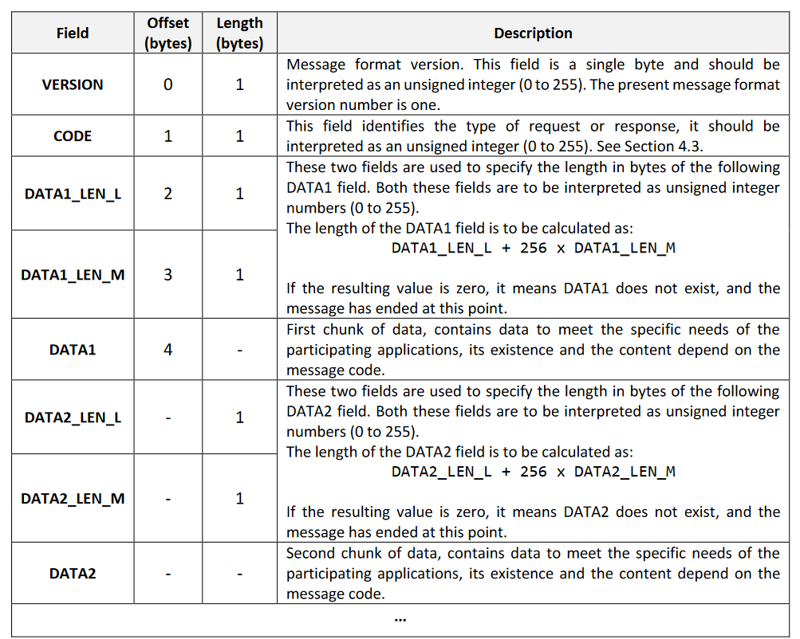
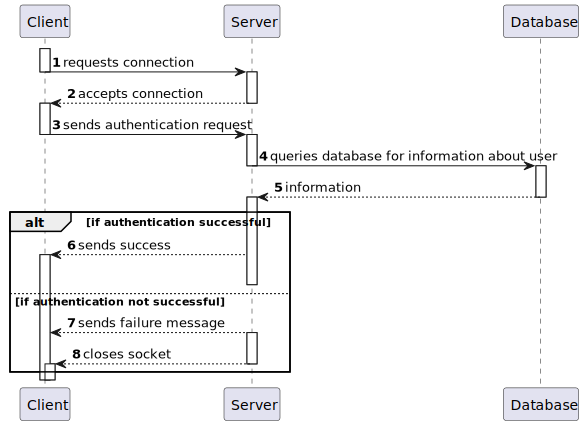

# 7004 - Follow-Up Server Implementation

## 1. Context

This user story was added in addition to the requested user stories by the client because we felt the need as a group to document the design process of the follow-up servver.

## 2. Requirements

**Acceptance Criteria:**

- **US7004.1.** The server should follow a TCP client-server based protocol

- **US7004.2.** For the purpose of sending emails the SMTP server "frodo.dei.isep.ipp.pt." should be used

- **US7004.3.** All the messages passed back and forth between client and server are to be sent according to the following specific format

## 3. Analysis

## 4. Design

### 4.1 Execution Flow

The Server will internally adhere to the presented execution flow:

- Upon the acceptance of a TCP connection, the server will perform an authentication check.
- The Client app must now provide its username (email) and password.
- After receiving the Client's data the follow-up server will perform a query on the database and assess the result
- The Server will now send a message to the client and in case of a failed authentication will close the socket.
- After this procedure the server is ready to perform the required execution flow depending on received code

**Notes:**
- The server is designed to be a multiport TCP server, for each client connected to it all there will be a new thread created assigned to operations regarding said client
- The version of every message sent is "1" this is hard coded due to client request

| Code |   Type   |                                                                                                                                  Functionality                                                                                                                                   |
|:----:|:--------:|:--------------------------------------------------------------------------------------------------------------------------------------------------------------------------------------------------------------------------------------------------------------------------------:|
|  0   | Request  |                                                               COMMTEST – Communications test request with no other effect on the serverapplication than the response with an ACK message. This request has no data                                                               |
|  1   | Request  |                                                                                                     DISCONN – End of session request. Should be replied with an ACK message.                                                                                                     |
|  2   | Response |                                                                                                            ACK – Generic acknowledgment and success response message.                                                                                                            |
|  3   | Response |                                                                                           ERR – Error response message. Used in response to unsuccessful requests thatcaused an error.                                                                                           |
|  4   | Request  | AUTH – User authentication request carrying the username in DATA1 and the user’spassword in DATA2, both are strings of ASICII codes and are not required to be null terminated. If the authentication is successful, the server application response is ACK, otherwise it’s ERR. |
|  5   | Request  |                                                                                                      US1016. Requests the sending of an email notification via SMTP server                                                                                                       |
|  7   | Request  |                                                                                                                        US3001. Creation of Notifications                                                                                                                         |
|  8   | Request  |                                                                                                                      US3001. Retrieval of ALL Notifications                                                                                                                      |
|  9   | Request  |                                                                                                                   US3001. Retrieval for pending Notifications                                                                                                                    |
|  10  | Request  |                                                                                             US1020. Requests SMTP server to email participants and retrieves job offers associated.                                                                                              |
|  11  | Request  |                                                                                                                     US3000. Retrieve application information                                                                                                                     |
|  12  | Request  |                                                                                                                    US3002. Retrieve job offers of a customer                                                                                                                     |
|  13  | Request  |                                                                                                                      US3001. Retrieve UNSEEN Notifications                                                                                                                       |

### 4.3. Applied Patterns

- DTO
- Event
- TCP

## 5. Implementation

Implementation proof is provided in the User Stories related to server functionality. These include:

- US1016
- US1020
- US3000
- US3001
- US3002

