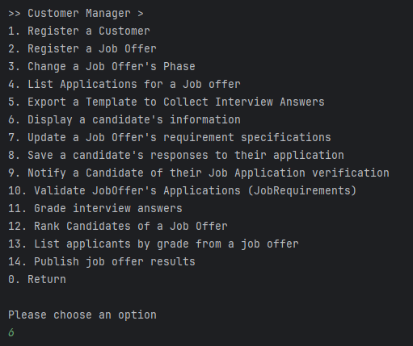
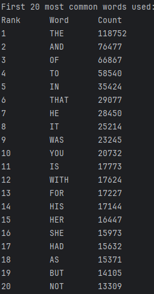

# US 4000 - As a Customer Manager, when displaying the candidate data, I expect the system to present a top 20 list of the most frequently referenced words from files uploaded by a candidate. Additionally, I require a comprehensive list of the files in which these words appear.

## 1. Context

The Client has tasked the team with the development of an additional functionality for displaying candidate related information. When displaying candidate data the top 20 most frequent words in their files should be shown.

## 2. Requirements

>**Q170** US4000 - Gostaria de saber se na US4000, relativa há criação da lista de palavras mais comuns, presentes nos ficheiros carregados pelo candidato, pretende escolher uma candidatura desse mesmo candidato e criar a respetiva lista, ou se pretende que esta lista seja criada, tendo em conta todas as candidaturas associadas a esse candidato.
>
>>**A170** A170 A lista de palavras é relativa a uma candidatura em particular.

>**Q185** US4000- The order of the list is important? Does it need to be ordered by the number of occurrences of the words?
>
>>**A185** Yes, the order is important. The system must present a top 20 list, from most referenced words to less referenced words

>**Q186**  US4000- For the word count, should all types of words be counted, or are there words that don't make sense to count, such as conjunctions?
>
>>**A186**  For the moment there are no restrictions like the one you mention since they depend on the language used in the text (the solution could/would be complex).


### Acceptance Criteria

 - **US4000.1.** The analysis is made in a per-application basis
 - **US4000.2.** The list of words should be displayed in order of most to the least used words
 - **US4000.3.** All words should be taken into account even 1 syllable words like prepositions

## 3. Analysis

This task appears to be simple, but it will use the knowledge of threads to make this process faster and more efficient. 
This functionality will also just be added to a previous one (present candidate information).

This implementation will:
- Create a HashMap that stores another HashMap associated with each file. 
  - Each file's HashMap will store each word from the file and the number of times that it appears.
  - This work will be divided by threats with a specific word threshold that will vary with the user computer.
- After this, there will be a method that checks what are the most repeated words in the file and displays it.


## 4. Design

### 4.1. Realization

#### GLOBAL SD


#### Thread Distribution


### 4.2. Class Diagram


### 4.3. Applied Patterns

 - MVC
 - Layered Architecture
 - DTO
 - TDD
 - DDD
 - Repository
 - Service

### 4.4. Tests

**Test 1:** Ensures that the single-threaded word count is accurate.

```
public void ensureSingleThreadCountAccurate() throws IOException, InterruptedException {
    String content = "The quick brown fox jumps over the lazy dog. The fox is quick.";
    Path tempFile = Files.createTempFile("testSingleThreadWordCount", ".txt");
    Files.writeString(tempFile, content);

    Set<String> filePaths = new HashSet<>();
    filePaths.add(tempFile.toString());

    WordAnalysis wordAnalysis = new WordAnalysis();
    wordAnalysis.countWords(filePaths);

    List<WordAnalysis.WordInfo> result = wordAnalysis.countWords(filePaths);
    assertEquals(3, result.stream().filter(w -> w.getWord().equals("THE")).findFirst().orElseThrow().getCount());

    Files.delete(tempFile);
}
```

**Test 2:** Ensures that the multi-threaded word count is accurate.

```
public void ensureMultiThreadedWordCountAccurate() throws IOException, InterruptedException {
    String f1 = "src/test/java/jobs4u/base/applicationmanagement/domain/files/1-big-file-1.txt";
    //jobs4u/base/applicationmanagement/domain/WordAnalysisTest.java
    Set<String> files = new HashSet<>();
    files.add(f1);

    WordAnalysis analysis = new WordAnalysis();
    List<WordAnalysis.WordInfo> result = analysis.countWords(files);

    Random random = new Random();

    // Generate a random number between 1 and 2000000
    int randomNumber;

    for (int i = 0; i < 10; i++) {
        randomNumber = random.nextInt(2000000) + 1;
        analysis.setByteThreshold(randomNumber);

        result = analysis.countWords(files);
        assertEquals(((ArrayList<WordAnalysis.WordInfo>) result).get(0).getCount(), 67914);
        assertEquals(((ArrayList<WordAnalysis.WordInfo>) result).get(1).getCount(), 53382);
    }
}
```

**Test 3:** Ensures that multiple files are processed correctly.

```
public void ensureMultipleFilesWork() throws IOException, InterruptedException {
    String content = "The quick brown fox jumps over the lazy dog. The fox is quick.";
    Path tempFile = Files.createTempFile("testSingleThreadWordCount", ".txt");
    Files.writeString(tempFile, content);
    String f1 = "src/test/java/jobs4u/base/applicationmanagement/domain/files/1-big-file-1.txt";

    Set<String> filePaths = new HashSet<>();
    filePaths.add(tempFile.toString());
    filePaths.add(f1);

    WordAnalysis wordAnalysis = new WordAnalysis();
    wordAnalysis.countWords(filePaths);

    WordAnalysis analysis = new WordAnalysis();
    List<WordAnalysis.WordInfo> result = analysis.countWords(filePaths);

    assertEquals(67917, result.stream().filter(w -> w.getWord().equals("THE")).findFirst().orElseThrow().getCount());

    Files.delete(tempFile);
}
```

**Test 4:** Ensures that empty files return no word counts.

```
public void ensureEmptyFilesReturnsNothing() throws IOException, InterruptedException {
    String content = "";
    Path tempFile = Files.createTempFile("testMultiThreadWordCount", ".txt");
    Files.writeString(tempFile, content);

    Set<String> filePaths = new HashSet<>();
    filePaths.add(tempFile.toString());

    WordAnalysis wordAnalysis = new WordAnalysis();
    wordAnalysis.countWords(filePaths);

    Set<WordAnalysis.WordInfo> result = wordAnalysis.getMostUsedWords();
    assertTrue(result.isEmpty());

    Files.delete(tempFile);
}
```

**Test 5:** Ensures word count is accurate with different delimiters.

```
public void testWordCountWithDelimiters() throws IOException, InterruptedException {
    String content = "The quick brown,fox;jumps:over@the lazy-dog!The fox is (quick).";
    Path tempFile = Files.createTempFile("testWordCountWithDelimiters", ".txt");
    Files.writeString(tempFile, content);

    Set<String> filePaths = new HashSet<>();
    filePaths.add(tempFile.toString());

    WordAnalysis wordAnalysis = new WordAnalysis();
    wordAnalysis.countWords(filePaths);

    Set<WordAnalysis.WordInfo> result = wordAnalysis.getMostUsedWords();
    assertEquals(3, result.stream().filter(w -> w.getWord().equals("THE")).findFirst().orElseThrow().getCount());

    Files.delete(tempFile);
}
```

**Test 6:** Tests the `isNotNumber` method.

```
public void ensureIsNotNumber() {
    WordCountThread thread = new WordCountThread("dummyPath", 0, 0, new HashMap<>());
    assertTrue(thread.isNotNumber("Hello"));
    assertFalse(thread.isNotNumber("123"));
    assertTrue(thread.isNotNumber("123abc"));
    assertTrue(thread.isNotNumber("abc123"));
}
```

**Test 7:** Through iterative assertion testing, tries to calculate an aproximate of the most optimal byte threshold for execution (this test was done in order to help facilitate balancing of cpu/IO intensive operations)

````
@Test
    public void assertMostOptimalNumberOfBytes() throws IOException, InterruptedException {
        String f1 = "src/test/java/jobs4u/base/applicationmanagement/domain/files/1-big-file-1.txt";
        String f2 = "src/test/java/jobs4u/base/applicationmanagement/domain/files/3-big-file1.txt";
        String f3 = "src/test/java/jobs4u/base/applicationmanagement/domain/files/4-big-file-1.txt";


        Set<String> files = new HashSet<>();
        files.add(f1);
        files.add(f2);
        files.add(f3);

        WordAnalysis analysis = new WordAnalysis();


        int THRESHOLD = 1000000;
        int chop = THRESHOLD /10;

        analysis.setByteThreshold(THRESHOLD);

        boolean flag = true;

        Long time1 = System.currentTimeMillis();
        analysis.countWords(files);
        Long time2 = System.currentTimeMillis();
        Long previousTime = time2 - time1;
        THRESHOLD -= chop;


        while(flag) {
            analysis = new WordAnalysis();
            analysis.setByteThreshold(THRESHOLD);

            time1 = System.currentTimeMillis();
            analysis.countWords(files);
            time2 = System.currentTimeMillis();

            if((time2-time1) > previousTime){

                THRESHOLD += chop;
                chop /= 10;
            }else{
                previousTime = (time2 - time1);
            }


            if(chop <= 10000 || previousTime - (time2- time1) < 50){
                flag = false;
            }else{
                THRESHOLD -= chop;
            }


        }

        System.out.println("The desired byte threshold for this machine is: " + THRESHOLD);
    }
````

### 4.5 Design Commits

> **04/06/2024 [US4000] 17:37** Design Documentation

## 5. Implementation

### Relevant Implementation

**DisplayCandidateController**
```
public List<ApplicationDTO> getCandidateApplications(PhoneNumber candidateNumber){
    Candidate candidate = candidateService.getOfIdentity(candidateNumber).get();
    return appService.applicationsOfCandidate(candidate.associatedUser());
}

public List<WordAnalysis.WordInfo> getWordCount(Set<String> files) throws InterruptedException, IOException {
    return wordAnalysis.countWords(files);
}
```
**GetCandidateService**
```
public Optional<Candidate> getCandidateByPhoneNumber(PhoneNumber phoneNumber){
    return repo.ofIdentity(phoneNumber);
}
```
**JobApplicationManagementService**
```
public List<ApplicationDTO> applicationsOfCandidate(SystemUser user){
    Iterable<JobApplication> jobApps = repo.findApplicationsByCandidate(user);
    List<ApplicationDTO> appDTO = new ArrayList<>();
    for(JobApplication app : jobApps){
        appDTO.add(app.toDTO());
    }
    return appDTO;
}
```

### Main Commits

> **06/06/2024 [US4000] 17:11** Implementation of Analysis Class

> **08/06/2024 [US4000] 21:58** Implementation, UI and Controller
 
> **09/06/2024 [US4000] 11:35** Test Documentation

## 6. Integration/Demonstration





## 7. Observations

The command `grep -o -w '\bWORD\b' FILE.txt | wc -l` was used to be able to test the functionality of the US through UNIX